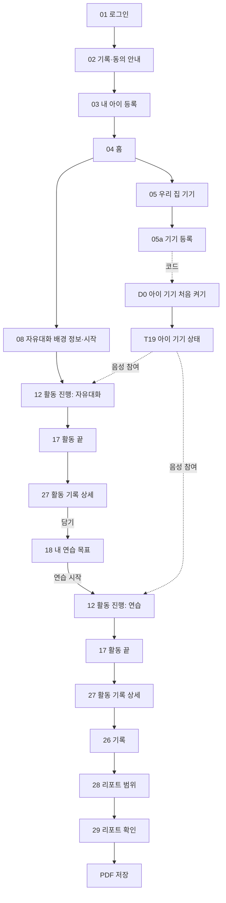

# 사용자 흐름 — 무중 MVP

## 기준

- 의도 정리서(`ideation/intent-capture/intent-statement.md`)의 성공 기준인 전체 흐름을, 범위 문서(`ideation/scope-definition/scope-document.md`)의 가치 흐름과 의도 백로그(`ideation/scope-definition/intent-backlog.md`)의 묶음에 맞춰 화면 번호로 적는다.
- 화면 번호와 분기는 화면 설계 v1.6을 따른다(rough-mockups Q1). 화면 목록은 `wireframes.md`에 있다.
- 시연은 노트북 두 화면(보호자 앱 창, 아이 기기 창)으로 한다(rough-mockups Q2).

## 핵심 흐름 (성공 기준 경로)


<!-- Text fallback: 01 → 02 → 03 → 04 → 05 → 05a(아이 기기 D0에 뜬 코드 입력) → 아이 기기 T19 준비. 04 → 08 → 12(자유대화) → 17 → 27 → 「담기」 → 18 → 「연습 시작」 → 12(연습) → 17 → 27 → 26 → 28 → 29 → PDF 저장. 아이는 T19에서 음성으로 참여한다. -->

## 흐름별 정리

```
Flow: 보호자 준비 (P4)
Persona: 보호자
Trigger: 보호자가 처음 서비스에 들어온다
Steps:
  1. 01 -> 「구글로 시작」 -> 계정 생성, 02로 이동
  2. 02 -> 동의 4항목 모두 동의 -> 03으로 이동
  3. 03 -> 아이 이름·나이·관심사 입력 -> 04로 이동
  4. 04 -> 「기기 상태 보기」 -> 05 -> 05a
  5. 아이 기기 D0에 뜬 코드를 05a에 입력 -> 기기 등록, T19 표시
Success outcome: 04에서 기기 연결·필수 동의가 갖춰져 자유대화·연습 탭이 열린다
Error paths:
  - 구글 로그인 취소·실패 -> 01에 남음 -> 다시 시도
  - 02에서 동의 전 나가기 -> P5
  - 기기 연결이 안 됨 -> 탭 잠김, 이유 토스트 -> 05
```

```
Flow: 자유대화와 기록 (P1·P2·P5)
Persona: 보호자(진행 확인), 아동(음성 참여)
Trigger: 보호자가 08에서 시작
Steps:
  1. 08 -> 배경 정보(선택) 입력 -> 「시작」 -> 12 "시작 요청됨"
  2. T19 -> 시작 안내 -> 아이 참여 응답 -> 12 대화 중, 실시간 대화 글
  3. 정상 마무리·아이 종료 표현·보호자 「끝내기」(P1) -> 12 "끝내는 중" -> 17
  4. 17 -> 「오늘 기록 보기」 -> 27 대화 기록·생활 팁·목표 후보
  5. 27 -> 목표 후보 「담기」 -> 18에 담김
Success outcome: 27에 기록과 목표 후보가 나오고, 하나 이상 담긴다
Error paths:
  - 아이 거부·무응답 -> P3 -> 04 (기록 없음)
  - 음성 연결 장애 -> 12 '잠깐 끊김' -> 복구 또는 P2 -> 17
  - 기록 생성 실패 -> 27 생성 실패 표시 -> 다시 만들기
```

```
Flow: 연습과 기록 (P0·P3·P5)
Persona: 보호자(목표 선택·진행 확인), 아동(장면 대화)
Trigger: 보호자가 18에서 목표를 골라 「연습 시작」
Steps:
  1. 18 -> 목표 선택 -> 「연습 시작」 -> 12 "상황 준비 중"
  2. 장면 준비 끝 -> 12 "시작 요청됨" -> T19 연습 안내 -> 아이 참여
  3. 장면 대화 -> 첫 반응 -> (되묻기·도움·변형 장면) -> 다음 목표 -> 마무리
  4. 12 "끝내는 중" -> 17 -> 27 장면 결과·생활 팁
Success outcome: 27에 목표별 장면 결과가 나온다
Error paths:
  - 장면 준비 실패·취소 -> 18 (실패면 이유 표시)
  - 연습 중 장애 -> 12 '잠깐 끊김' -> 복구 또는 P2 -> 17 (부분 종료 안내)
```

```
Flow: 리포트 PDF (P6)
Persona: 보호자
Trigger: 보호자가 26에서 「상담용 리포트 다운」
Steps:
  1. 26 -> 28 -> 기간 선택 -> 리포트 생성
  2. 29 -> 10개 항목 확인 -> PDF 저장 확인 시트 -> PDF 저장
Success outcome: 보호자가 PDF를 저장한다
Error paths:
  - 동의 철회 상태 -> 28에 안내 -> 「동의 확인」 -> 02 관리
```

## 성공 기준과의 관계

위 핵심 흐름을 오류 화면·기술 문제 종료(P2) 없이, 개발자의 수동 개입 없이 한 번 이상 끝까지 지나가면 성공이다(scope-definition Q4·Q5). P2·P3 같은 오류 경로는 범위에 들지만 성공 시연 경로에는 나오지 않아야 한다.
