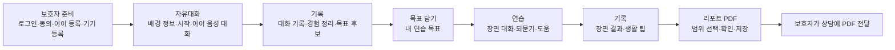

# 범위 문서 — 무중 MVP

## 입력

- 의도 정리서 `ideation/intent-capture/intent-statement.md`: 문제 3가지, 보호자 중심 고객, 성공 기준, MVP 범위 확정(intent Q9), 화면 설계 v1.6 적용(intent Q10), 5인 병렬 개발(intent Q11)
- 타당성 평가서 `ideation/feasibility/feasibility-assessment.md`: 조건부 가능, PoC 10/13, 대체 경로 결정 10/19~10/23
- 제약 목록 `ideation/feasibility/constraint-register.md`: C-T01~06, C-O01~06, C-E01~03, C-R01~04
- 범위 정의 질문 `scope-definition-questions.md`의 Q1~Q8 답변

## 범위 한 줄 요약

11/5 교육 과정 시연에서, 노트북 아이 기기와 보호자 앱으로 **보호자 준비 → 자유대화 → 기록 → 목표 담기 → 연습 → 기록 → 리포트 PDF** 흐름을 오류·기술 종료와 수동 개입 없이 한 번 이상 완주한다.

## 성공 판단 기준

| 기준 | 내용 | 근거 |
|---|---|---|
| 성공 | 위 전체 흐름을 1회 이상 완주한다 | intent Q4, scope Q4 |
| 끊김 없음 | 오류 화면·기술 문제 종료(P2)가 없고, 진행 중 개발자가 서버·DB를 손으로 고치거나 다시 시작하지 않는다. 재시도 횟수는 기준에 넣지 않는다 | scope Q5 |
| Must 완료 기준 | 수용 테스트 기준으로 쓴다. 11/5에 통과하지 못한 항목은 실패로 보지 않고 시연 뒤 보완 목록으로 넘긴다 | scope Q4, 요청 진행 방식 2 |

## 범위 안 (In)

| 구분 | 건수 | 처리 | 근거 |
|---|---|---|---|
| Must | 55 | 모두 포함. 줄이지 않는다 | intent Q9 |
| Should | 12 | 지금은 모두 포함. 10/23 PoC 결과를 본 뒤 팀 합의로 연기 항목을 정한다(단순화 허용) | scope Q1 |
| Could | 3 (FR-B11, FR-D04, NFR-11) | 포함하되 가장 낮은 순서 | scope Q3 |
| 화면 | 화면 설계 v1.6의 30장. v1.6에서 다시 들어온 아이 삭제(P4), 동의 철회·기록 삭제(02 관리, P8·P9), 29 리포트 확인(10개 항목), 기기 상태 4가지, 종료 표현 개수 제한 없음 포함 | intent Q10 |
| 운영 | 시연 서버(EC2 1대) 하나를 기준으로 배포 파이프라인·환경 준비·배포·관측·장애 대응·성능 검증·피드백 | scope Q6, 운영 단계 추가 지시 |
| 데이터 | 합성 데이터와 성인 역할극 | 타당성 Q4 |

## 범위 밖 (Out)

| 항목 | 이유 |
|---|---|
| 각 요구사항 카드의 '하지 않는 것' 전부 | 구현 금지 사항(요청 진행 방식 2) |
| 실제 아동 참여·실제 아동 자료 | 타당성 Q4, C-R01 |
| 스테이징 등 시연 서버 외 운영 환경 | scope Q6 |
| 화면 설계 v1.6에 없는 화면 번호(예: 21 연습 진행, 23 연습 끝 — 각각 12·17로 통합) | 화면 설계 v1.6 0장 |
| 서비스 안 리포트 전송·전문가 계정 | 보호자가 PDF를 직접 건넴(입력 문서 1.1), 화면 설계 v1.6 "앱 안 공유 삭제" |
| 진단·점수·치료 효과·결함 단정 표현 | NFR-01, C-R03 |
| 아이 기기의 진행 조작 버튼·대화 글 표시 | FR-E16 '하지 않는 것', 00_문서_안내 6장 중 v1.6과 충돌하지 않는 줄 |
| 생활 대화 녹음(FR-B04) | 기능명세서 CR-RECORDING: MVP 제외 |
| 00_문서_안내 4·6장 중 v1.6과 충돌하는 줄(아이 삭제·동의 철회 금지 등) | intent Q10 — 적용하지 않음 |

## 가치 흐름 지도

<!-- Text fallback: 보호자 준비 → 자유대화 → 기록 → 목표 담기 → 연습 → 기록 → 리포트 PDF → 보호자가 상담에 PDF 전달 -->

| 흐름 단계 | 보호자가 얻는 가치(문제 정의와 연결) | 주요 요구사항 |
|---|---|---|
| 보호자 준비 | 안심하고 시작할 수 있는 동의·기기 준비 | FR-A01~A07, A11 |
| 자유대화 | 아이가 일상 대화를 연습할 기회(문제 1) | FR-B01~B08, E01~E05, F03·F04 |
| 기록 | 아이의 대화 경험을 파악(문제 2) | FR-D01·D02, F05·F06·F10·F12 |
| 목표 담기 | 다음 연습으로 이어 갈 목표 | FR-C01~C03, F19 |
| 연습 | 장면 속 사회적 의사소통 연습(문제 1) | FR-C05~C07, E06~E10, F07·F09·F20 |
| 리포트 PDF | 상담에 가져갈 정리된 기록(문제 3) | FR-D05·D06, F12 |

## 순서 원칙

위험 먼저(scope Q7). GPT-Live·제브 PoC와 아동 서비스 핵심(세션 상태·연결·판정 턴)을 먼저 하고, PoC에 의존하지 않는 보호자 앱·기록·리포트는 5명이 병렬로 진행한다(intent Q11). 기능별 마감은 없고 일정은 11/5 마감, PoC 10/13, 대체 경로 결정 10/19~10/23뿐이다(scope Q8, 타당성 Q3·Q9).

## 범위와 일정 위험

- Must 55 + Should 12 + Could 3을 약 4주 안에 넣는데, 팀에 실시간 음성·AI 연동 경험이 없다(타당성 Q6). 10/23 재검토가 실질적인 범위 조정 시점이다.
- 대체 경로(Realtime API 교체·대체 판정)를 고르면 요구사항 변경이 생긴다(C-T03·C-T04). 이 경우 범위 문서를 다시 검토한다.
