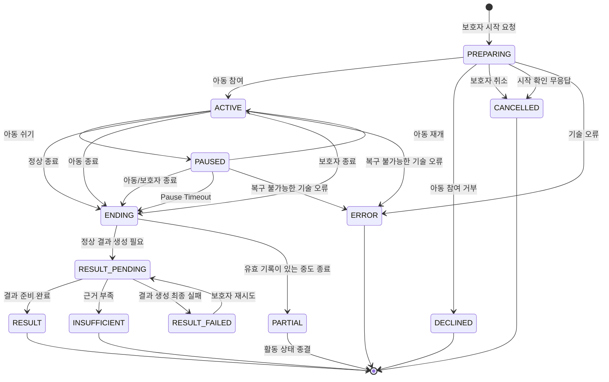

① 개정: A1.5 논리 ENDED+UNCONFIRMED·기기 중단 관측 분리와 판정 중 게이트 출력 보류/무응답·Cue 예산을 연결했다.
② 대체: 종료 미확인 복합 상태·공급자 자동 응답 보류는 현행 계약으로 사용하지 않는다. 이전 제안은 이력이고 기존 상태/사유·UNCERTAIN 비종료·AI 역할은 유지한다.
③ 남은 TBD: 종료 논리/기존 저장 표현 매핑·확인 기한/기기 재사용·판정 후 교정/재생성·게이트 한도/지연과 기존 POC/실연동.

# ADR-005 세션 이벤트·종료·타임아웃

- 상태: **Proposed — 아동 종료 A안·앱별 복구·유효 기록의 PARTIAL 방향은 확정, 구현·시간 성능은 미검증**
- 부분 합의: **2026-10-02 진행 중 무응답은 유효한 질문/안내의 실제 재생 완료 → 10초 → 재안내 1회**. 이후 대기·미실시/종료 조건은 TBD(§5.2). Cue 5초는 합의한 초기값이며 미측정(§10.2).
- 확정 조건: 남은 상세 계약과 기존 제안 시간값을 정리하고 First Bolt / 통합 시험으로 구현·시간 성능을 검증한 뒤 ADR Accepted 여부 결정
- 관련:
  - ADR-002 기술 기본값
  - ADR-003 아동용 웹 음성 UI 구조
  - ADR-004 통신·음성 연결 구조
  - ADR-008 인증·접근 제어
  - GPT-Live 상세 명세 D-03·D-06

---

# 1. Context

실시간 음성 활동에서는 다음 이벤트가 거의 동시에 발생할 수 있다.

- 보호자 종료
- 아동 음성 제어
- GPT-Live 이벤트
- 아동 응답 전사
- 판정 결과
- Cue 준비 완료
- WebSocket 연결 장애
- 결과 생성 완료
- 서버 재시작

이벤트 순서와 상태 변경 규칙을 명확히 하지 않으면 다음 문제가 발생할 수 있다.

```text
종료했는데 늦은 Cue가 다시 재생됨

종료 이후 AI 결과가 상태를 ACTIVE로 되돌림

기기 연결 끊김을 정상 종료로 잘못 기록

무응답을 아동의 행동 실패로 기록

결과 생성 실패를 활동 자체 실패와 혼동

서버 재시작 후 실제로는 끝난 세션이 ACTIVE로 남음
```

따라서 다음을 결정한다.

1. 세션 상태와 기기 연결 상태를 분리한다.
2. 상태 변경 이벤트는 세션 단위로 순차 처리한다.
3. 종료는 일반 이벤트보다 우선한다.
4. 실제 음성 재생 완료를 기준으로 필요한 Timer를 시작한다.
5. 무응답·연결 장애·결과 실패의 의미를 구분한다.
6. Core와 Realtime이 각자 소유한 상태·작업만 복구한다. 복구할 수 없는 실시간 음성 활동을 자동 재개하지 않는다.

---

# 2. Decision

## 2.1 상태 축 분리

다음 상태를 하나의 Enum으로 섞지 않는다.

### VoiceClient 연결 상태

```text
ONLINE
OFFLINE
```

용도:

- 보호자 홈의 `연결됨 / 연결 안 됨`
- 활동 시작 가능 여부 판단

---

### ActivitySession 상태

```text
PREPARING
ACTIVE
PAUSED
ENDING

RESULT_PENDING

RESULT
PARTIAL
INSUFFICIENT
RESULT_FAILED

DECLINED
CANCELLED
ERROR
```

---

### 종료 사유

ActivitySession 상태와 별도로 관리한다.

예:

```text
normal
guardian_stop
child_stop
no_response
paused_timeout
technical_error
server_restart
```

---

### 부족·미실시 사유

종료 사유 또는 평가 결과와 별도로 관리한다.

예:

```text
experience_not_confirmed
not_performed
transcript_uncertain
```

즉:

```text
세션 상태
≠
종료 사유
≠
결과 상태
≠
미실시 사유
```

로 관리한다.

---

# 2.2 세션 상태 전이 기본 구조



무응답 재안내 이후의 미실시/종료 조건은 [§5.2](#no-response-wait)의 TBD이므로 이 상태도에서 자동 종료 전이로 고정하지 않는다.

`ENDING`은 서버 내부 상태로 사용하며 보호자 화면에 별도 화면으로 노출하지 않는다.

`PARTIAL`은 중도 종료된 **활동의 상태**다. 유효 기록의 부분 결과 생성·준비 상태는 별도 Core 결과 흐름으로 관리한다. 이 상태도의 `PARTIAL --> [*]`는 부분 결과가 이미 준비됐다는 뜻이 아니다. 결과 준비를 표시하기 위해 ActivitySession DB Enum을 자동으로 늘리지 않는다.

연습 내부 단계의:

```text
CLOSING
```

과 세션 상태:

```text
ENDING
```

은 서로 다른 개념이다.

---

# 2.3 세션 이벤트 순차 처리

ActivitySession의 상태 변경은 세션별 논리적 이벤트 줄에서 순차 처리한다.

기본 구조:

```text
Event
  ↓
SessionEventQueue
  ↓
SessionEventProcessor
  ↓
SessionStateMachine
  ↓
State Change
```

외부 이벤트가 ActivitySession 상태를 직접 수정하지 않는다.

예:

```text
GPT-Live Event
VoiceClient Event
AI Result
Result Worker
보호자 요청
```

모두 상태 변경이 필요한 경우 Session Event 경로를 사용한다.

---

## 2.4 비동기 결과 최신성

비동기 작업에는 목적에 맞는 식별자를 둔다. 아래 이름은 논리 계약이며 실제 필드명·컬럼명 확정이 아니다.

예:

```text
activityOpId: 현재 상황·판정·Cue의 최신성
jobRunId: 사후 결과 작업의 현재 실행
eventId / requestId: 앱 간 전달·요청의 중복 판별
```

현재 활동 작업과 맞지 않는 늦은 Cue·판정 결과는:

```text
폐기
+
로그
```

한다.

예:

```text
세션 종료
↓
이전에 시작한 Cue 생성 완료
↓
기존 activityOpId
↓
폐기
```

종료된 세션을 늦은 비동기 결과가 다시 진행 상태로 바꾸지 못한다.

사후 `ResultReady`는 활동 작업과 다른 수명을 갖는다. 종료 때 `activityOpId`가 바뀌었다는 이유만으로 유효한 결과를 버리지 않는다. Realtime은 기대한 결과 실행(`jobRunId`), 입력 버전, 결과 대상, 현재 자료 이용 권한을 확인해 현재 run만 연결한다. 늦은 이전 run이 새 재시도 결과를 덮거나 `PARTIAL`/종료 활동을 `ACTIVE`로 되살리지 못한다.

---

# 3. 종료 우선순위

## 3.1 기본 원칙

STOP / 종료는 일반 대화 이벤트보다 높은 우선순위를 가진다.

종료 또는 쉬기로 현재 출력 권한이 사라지면 Realtime은 일반 GPT-Live 출력을 차단하고, 승인 대기 중인 서버 메모리 버퍼와 기기 대기열을 취소한다. 늦은 전사·검사 승인·Cue 완료는 현재 상태·권한·작업 최신성을 다시 확인하고 무효화한다. 공급자 응답이나 교정 지시 수락 ACK만으로 기기 재생 권한을 되살리지 않는다.

다음과 같은 늦은 이벤트가 종료 이후 다시 출력되면 안 된다.

- Cue
- GPT-Live 응답
- 판정 결과
- 상황 생성 결과
- 추천 결과

---

## 3.2 보호자 종료

보호자의 유효한 종료 요청은 즉시 출력 중단을 우선한다.

개념적으로:

```text
보호자 STOP
↓
StopRequested Event 우선 처리 → ENDING 기록·일반 출력 승인 무효화
↓
버퍼·기기 대기열 취소, 플레이어 중단 요청과 공급자 주 연결 정리 병행
↓
실제 출력 중단·연결 정리 여부 별도 확인
```

`ENDING` 기록, 실제 플레이어 출력 중단 확인, GPT-Live 주 연결 종료 확인은 서로 다른 사건이다. 실제 출력 중단을 늦추지 않되, 기기 WSS와 공급자 주 WebSocket의 정리 순서·ACK·Timeout은 ADR-004와 Sequence/Protocol 문서에서 구체화한다.

### 종료 미확인 — A1.5

종료 미확인의 논리 계약은 **`ENDED` + 사유 `UNCONFIRMED`**다. `ENDED_UNCONFIRMED`를 새 상태값/DB Enum으로 만들지 않는다. 서버 논리 종료는 기기 재생 중단의 증거가 아니며 최초 종료를 유발한 사유와 기기 중단을 확인하지 못한 사실을 구분해 보존한다. 기존 `status`·`end_reason`·`end_detail`과 중단 관측 표현에 어떻게 매핑할지는 TBD이며 새 Enum·컬럼을 확정하지 않는다. `ENDING`의 정리 과정, 논리 `ENDED`, 기존 `PARTIAL`/결과 준비·정리 상태는 하나의 완료가 아니다.

`UNCONFIRMED` 뒤에도 이전 활동의 출력·늦은 승인·지연 명령은 무효다. 늦은 중단 보고는 검증된 과거 관측일 뿐 활동/출력 승인 부활의 근거가 아니다. 다음 시작 전 연결·기기 준비·점유·현재 권한/원자 할당을 다시 확인하고 미확인을 재생 중단 성공으로 채우지 않는다. 확인 기한·최종화/늦은 보고의 저장 매핑·기기 재사용 조건 상세는 TBD다.

---

## 3.3 아동 종료

아동의 유효한 종료 표현을 서버가 확인한 경우 **즉시 `ENDING`으로 전환·기록**한다. 유효 표현의 호출어·명령어·판정 기준은 GPT-Live 상세 명세가 관리한다. 단순 끼어들기나 임의 발화를 종료 명령으로 넓히지 않는다.

```text
유효 종료 표현 확인
↓
ENDING 전환·기록; 현재 활동 작업 무효화
↓
일반 질문·연습 진행·일반 GPT-Live 출력 차단
↓
승인 대기 서버 버퍼와 기기 대기열 폐기; 늦은 승인 무효
↓
현재 활동에 고정된 승인 마지막 인사 1회만 예외 허용
↓
실제 재생·출력/연결 정리 확인
```

마지막 인사의 재생 완료는 `ENDING` 전환의 선행 조건이 아니다. 인사를 제공하지 못하더라도 일반 출력을 다시 열거나 활동을 계속하도록 설득하지 않는다. 승인 인사의 콘텐츠와 제공 실패 시 처리는 별도 계약에서 확정한다. STOP/쉬기와 다르게 끼어들기는 대화 말차례 변경일 수 있으며 자동 `ENDING`이 아니다.

구체적인:

- 호출어
- 명령어
- 승인 종료 문구

는 GPT-Live 상세 명세에서 관리한다.

---

## 3.4 출력 취소 사유와 늦은 승인

| 사유 | 현재 활동과 출력 처리 |
|---|---|
| 끼어들기 | 현재 음성의 서버 버퍼·기기 대기열을 취소한다. 실제 재생 중단 범위가 보고되면 검증하고, 보고가 없으면 미확인으로 남긴다. 아동의 발화 시작이나 `playbackMark`만으로 `ENDING` 전환하지 않는다. |
| 쉬기 | `PAUSED` 전이와 함께 일반 출력 승인 효력·대기 버퍼·기기 대기열·현재 무응답/Cue 타이머를 무효화한다. 재개 때 이전 출력을 자동 재생하지 않는다. |
| 보호자/아동 종료 | 유효한 종료 요청에 따라 `ENDING`을 우선 기록하고 일반 출력을 막는다. 아동 종료의 승인 마지막 인사 1회 예외만 §3.3 순서를 따른다. |
| 동의 철회 | 새 처리·출력 승인·자료 저장 전에 현재 이용 가능성을 확인한다. 확인 불가 또는 철회 효력 발생 뒤 새 이용을 보류·차단하고 기존 출력/대기열을 정리한다. 최종 상태·자료 처리는 별도 철회 계약을 따른다. |

취소된 구간의 늦은 전사·검사 승인·기기 재생 보고는 현재 활동·권한·작업과 대조한다. 늦은 승인으로 취소된 음성을 다시 보내지 않고, 늦은 관측만으로 재생 완료나 Timer 시작을 확정하지 않는다. 공급자 맥락 교정 지시의 수락도 새 재생 승인이 아니다.

---

# 4. Timer 시작 기준

## 4.1 실제 재생 완료 기준

무응답 Timer는 모델이 응답 생성을 완료했거나 게이트가 승인한 시점이 아니라:

> 기기가 유효한 질문/안내 범위의 실제 음성 재생 완료를 보고하고 Realtime이 현재 활동·작업에 맞는 보고임을 확인한 시점

부터 시작하는 것을 기본 원칙으로 한다.

```text
AI Response Generated
≠
아동에게 실제 재생 완료
```

따라서:

```text
기기 관측 재생 완료 보고
↓
No-response Timer Start
```

를 기본 흐름으로 한다.

`playbackMark`는 기기 플레이어가 관측한 실제 재생 진행·중단·완료 범위를 Realtime에 보고하는 목적의 계약이다. 생성·승인·송신 범위나 아동의 청취·이해를 대신하지 않는다. 보고가 없거나 불확실하면 미확인 범위를 완료로 채우지 않는다. 끼어들기 시 재생 범위를 보고하더라도 정상 완료나 활동 종료로 간주하지 않는다. 단위·송신 시점·중복/늦은 보고 처리는 TBD이며, 재생 완료 통신 상세는 ADR-004 및 `protocol.md`에서 관리한다.

GPT-Live 출력 조각이 잠깐 멈추거나 기기 대기열이 순간 비었다는 이유만으로 질문/안내 전체 완료를 확정하지 않는다. Realtime이 완료로 볼 질문/안내 범위와 출력 구간·전사의 대응 기준은 TBD다. 전사 대응·검사·버퍼 대기·송신·기기 재생 대기 동안 아동 무응답 시간을 누적하지 않는다.

---

# 5. 무응답 처리

## 5.1 시작 확인

`PREPARING` 상태에서 아동 참여 확인 응답이 없으면:

초기 제안값:

```text
60초
```

후:

```text
PREPARING
↓
CANCELLED
```

처리:

- 준비 취소
- 활동 미참여
- 아동 행동 실패로 기록하지 않음
- 일반 활동 결과 생성 대상이 아님

---

<a id="no-response-wait"></a>

## 5.2 진행 중 무응답 — 10초 후 재안내 1회

**2026-10-02 사용자 변경 반영.** 출처: 무중 기능명세서 최종본(별도 문서). CR-TIME-01·SYS-WAIT-001에 맞춰 다음 흐름을 적용한다. **10초는 적용할 초기값이며 미측정**, 같은 대기 구간의 재안내는 **1회**다.

```text
유효한 질문/안내의 실제 기기 재생 완료
↓
반응 없이 10초 대기
↓
재안내 1회
↓
이후 대기 시간·미실시/활동 종료 조건: TBD (Q-TIME-01)
```

- 현재 활동·재생 건이 유효하고 아동의 반응을 기다리는 단계에서만 적용한다. 모델 생성·전사 대응·게이트 승인·송신 시각을 기준으로 Timer를 시작하지 않는다. 앱이 정한 질문/안내 범위의 실제 재생 완료를 확인해야 한다.
- 반응을 받으면 대기를 해제한다. 종료·쉬기·연결 단절·불완전 재생 때는 기존 Timer로 다음 질문이나 실패를 발생시키지 않는다. 중복·늦은 재생 완료 보고로 Timer 또는 재안내 횟수를 초기화하지 않는다.
- 첫 반응 전 재안내에는 목표 Cue·정답·시범을 추가하지 않는다. 도움 후 아동 반응 대기도 이 규칙을 따르며, Cue 요청부터 재생 시작까지의 5초(§10.2)와 구분한다.
- 재안내 후 추가 대기 시간, 미실시 전환·활동 종료 조건 및 시작 참여 확인에 같은 시간을 적용할지는 **TBD**다. 과거의 추가 재확인·15초 대기·자동 `PARTIAL` 종료를 기본 동작으로 사용하지 않는다. §5.1의 시작 확인 초기안은 별도이며 이 변경으로 확정하지 않는다.
- 무응답을 능력 부족·행동 실패·거부로 자동 해석하지 않는다. 미실시 판정과 실제 활동 종료 여부는 분리한다.
- 출력 구간 분할·전사 대응·검사·버퍼·기기 재생 대기 또는 불완전/미확인 재생은 아동의 무응답 10초에 넣지 않는다. 완료 범위와 기기 보고의 신뢰 조건은 First Bolt에서 검증한다.

---

## 5.3 연습 first_response 무응답

연습 첫 반응 단계에서 유효한 반응을 확보하지 못한 경우:

```text
EvaluationLabel.NONE
```

으로 기록하지 않는다.

대신:

```text
AttemptStatus.NOT_PERFORMED
```

와 같은 미실시 상태로 구분한다.

의미:

```text
행동이 관찰되지 않았다
≠
유효 반응 자체가 없었다
```

반응은 있었지만 판정할 수 없는 경우:

```text
EvaluationLabel.UNCERTAIN
```

을 사용한다.

---

## 5.4 쉬는 중

쉬기 요청이 유효하면 현재 일반 출력의 게이트 승인 효력과 무응답/Cue 타이머를 무효화하고, 승인 대기 버퍼·기기 대기열을 취소한다. 재개 뒤 쉬기 이전의 음성이나 늦은 승인을 자동 재생하지 않는다. 실제 재생 중단과 마지막 신뢰 `playbackMark`는 별도로 관측한다.

`PAUSED` 상태에서 재개되지 않으면:

초기 제안값:

```text
10분
```

후:

```text
PAUSED
↓
ENDING
↓
PARTIAL (유효한 활동 기록이 있는 경우)
```

세부 사유:

```text
paused_timeout
```

유효 기록이 없는 경우의 결과/미참여 분류는 기존 사유와 자료 규칙에 따르며 이 초기 시간값만으로 `PARTIAL` 근거를 만들어내지 않는다.

---

# 6. 연결 장애

## 6.1 VoiceClient 상태

평상시 `/device` 연결 상태 판단:

```text
heartbeat = 약 5초 간격
```

마지막 유효 메시지 이후:

```text
약 15초
```

동안 아무 메시지도 없으면:

```text
VoiceClient = OFFLINE
```

으로 처리한다.

이 값은 주로:

- 홈 화면 연결 상태
- 새 활동 시작 가능 여부

판단에 사용한다.

---

## 6.2 진행 중 WebSocket 장애

활동 중 기기↔Realtime WSS 음성·제어 연결이 끊어진 경우:

```text
WS Disconnect
↓
기기 재연결 시도·실제 플레이어 출력 안전 정리
```

원본 직접 연결 구조에서 제시한 기기 자체 종료 시간의 초기 후보:

```text
약 5초
```

이다.

이 5초를 B안의 플레이어 중단 시간으로 자동 확정하지 않는다. 기기 재연결이 허용 시간 안에 복구되지 않으면 플레이어 출력을 중단하고 대기열을 폐기한다. 실제 허용 시간과 중단 확인은 TBD다. 공급자 주 연결과 세션 정리는 Realtime의 책임이다. 기기가 공급자 세션을 직접 종료하는 경로를 현행으로 사용하지 않는다.

MVP에서는 종료된 GPT-Live 실시간 세션을 새 연결로 자동 이어받지 않는다.

```text
출력·공급자 연결 안전 정리
↓
no resume
```

기존 30초 재개 유예는 사용하지 않는다.

---

## 6.3 서버 측 ERROR 확정

Realtime은 다음 중 하나가 발생해 실시간 음성 활동을 복구할 수 없으면 해당 ActivitySession을 `ERROR`로 종료한다. 실제 플레이어 중단 확인과 서비스 상태 변경은 별도로 기록한다.

### 조건 A

기기 WSS가 끊어진 뒤 설정된 Realtime Grace Period 안에 재연결되지 않음.

Realtime Grace Period는 기기의 자체 출력 안전 정리와 상태 확인 기회를 고려한다.

원본 시간 후보(새 WSS 릴레이 경로 적용 여부 TBD):

```text
기기 쪽 안전 종료 후보 ≈ 5초

Realtime grace period ≈ 6~7초
```

단:

> 이 값들은 직접 연결 구조에서 나온 초기 후보이다. B안의 기기 플레이어·Realtime 공급자 연결 정리 계약에 그대로 적용되는지는 D-03/D-06 및 통합 시험으로 확인한다.

---

### 조건 B

재연결은 되었지만 기기의 재생 상태나 Realtime의 GPT-Live 주 연결 상태를 대조한 결과 기존 실시간 음성 활동을 안전하게 계속할 수 없음.

이 경우:

```text
ActivitySession → ERROR
```

로 처리하며 실시간 세션을 새로 생성해 이어서 진행하지 않는다. 복구 가능성 판정에 필요한 기기·공급자 관측과 확인 시간은 TBD다. 재연결 보고만으로 미확인 재생 범위를 정상 완료로 채우지 않는다.

---

## 6.4 Realtime이 살아 있는 경우

Realtime 자체가 정상 동작하고 공급자 주 연결에 접근 가능한 경우, 기술 오류 종료 과정에서 가능한 범위 내 GPT-Live 세션과 버퍼·기기 출력 정리를 수행한다. 기기 플레이어 중단 확인과 공급자 세션 정리 확인은 별개의 사실이다.

구체적인 GPT-Live 종료 이벤트·응답, 주 WebSocket 닫기 순서와 실패 시 처리는 Adapter 실연동·ADR-004·Sequence 문서에서 확인한다. 확인되지 않은 공급자 이벤트 이름을 현행 API 보장으로 쓰지 않는다.

---

# 7. 앱별 재시작·복구

## 7.1 전제

MVP는 상시 실행하는 Spring 앱을 두 개로 나눈다.

```text
Core API Spring
Realtime Activity Spring
```

Result Worker와 Outbox/Inbox 작업은 각 소유 앱의 내부 작업이며 세 번째 상시 Spring 앱이 아니다. ActivitySession은 Realtime이, ResultJob은 Core가 소유한다. 앱 간 영속 전달은 각자의 Outbox/Inbox와 내부 HTTP 계약을 따른다.

세션 이벤트 줄과 승인 대기 출력 음성 버퍼는 Realtime 메모리에서 처리한다.

따라서 Realtime 프로세스가 종료되면 그 소유자의 진행 중 이벤트 줄·미전달 음성 버퍼는 사라진다. 재시작 뒤 버퍼가 복원됐다고 간주하지 않고, 기기 보고가 없는 재생 범위를 성공으로 메우지 않는다.

---

## 7.2 Realtime 재시작: 소유한 진행 중 ActivitySession

Realtime은 재시작 전에 자신이 소유했던 진행 중 실시간 음성 활동을 확인한다. 다음 상태가 남아 있더라도 상태 이름만으로 타 앱 또는 다른 정상 Realtime 소유자의 활동을 일괄 변경하지 않는다.

```text
PREPARING
ACTIVE
PAUSED
ENDING
```

MVP에서는 재시작으로 잃은 기존 실시간 GPT-Live 음성 세션과 메모리 버퍼를 자동 재개하지 않는다. **재시작한 Realtime이 소유하던 진행 중 음성 활동**에는 원본 오류 정리 정책을 적용해 다음으로 전환한다. 다른 정상 Realtime 소유자의 활동은 건드리지 않는다.

```text
ERROR
```

세부 사유:

```text
server_restart
```

이미 종료·정리돼 결과를 기다리는 활동, `PARTIAL`의 결과 참조, 영속 Inbox를 재시작했다는 이유만으로 `ERROR`로 바꾸지 않는다. Realtime 복제본의 소유권·epoch·경합 처리 계약은 확장 시 상세 설계가 필요하다.

---

## 7.3 Core 재시작: 소유한 ResultJob·전달 작업

Core는 자신의 미완료 ResultJob과 Outbox/Inbox 전달 작업을 PostgreSQL의 영속 상태로 복구한다. Core 재시작만으로 정상 Realtime ActivitySession을 `ERROR`로 바꾸지 않는다. Realtime도 자신이 소유한 영속 Outbox/Inbox의 미처리 항목만 복구한다.

복구 대상은 Core 자신이 소유했거나 작업 lease가 만료된 미완료 작업으로 제한한다. Core 복제본이 기동할 때마다 모든 `RUNNING` Job을 `PENDING`으로 되돌리지 않는다. 재선점 시 generation/fencing으로 오래된 Worker의 DB 반영을 차단하고 현재 결과 run과 입력 버전·권한을 확인한다. 구체 lease·generation 구현은 결과 파이프라인에서 정한다.

```text
소유 또는 lease 만료가 확인된 미완료 ResultJob
↓
체크포인트·현재 run 확인 후 재처리
```

이미 저장된 단계 정보가 있다면 가능한 경우 해당 단계 이후부터 다시 수행한다.

예:

```text
EXTRACTED
RECOMMENDED
RESULT_GENERATED
```

Result Pipeline 상세는 [`architecture/result-pipeline.md`](architecture/result-pipeline.md)에서 관리한다. 외부 AI 호출의 정확히 한 번 실행을 보장하지 않으므로 중복 호출·비용·늦은 완료를 검증한다.

## 7.4 대체된 이전 선택 — 단일 Spring 일괄 복구

원본은 단일 Spring 서버 시작 시 `PREPARING`/`ACTIVE`/`PAUSED`/`ENDING`을 일괄 `ERROR(server_restart)`로 바꾸고 모든 `RUNNING` ResultJob을 `PENDING`으로 초기화했다. 두 앱의 상태·작업 소유권과 복제본 경합을 반영해 이 일괄 규칙을 대체했다. §7.2와 §7.3만 현행 복구 규칙이다.

---

# 8. 결과 상태

## 8.1 활동 오류와 결과 생성 오류 분리

다음을 구분한다.

### ERROR

```text
Activity 자체의 기술 실패
```

예:

- 연결 장애
- 서버 장애
- 음성 Session 복구 불가

---

### RESULT_FAILED

```text
Activity 기록은 정상적으로 확보되었으나
사후 결과 생성이 최종 실패
```

즉:

```text
ERROR
≠
RESULT_FAILED
```

이다.

---

## 8.2 Result 생성 흐름

정상 결과 생성 조건을 충족한 활동의 기본 흐름:

```text
ENDING
↓
RESULT_PENDING
↓
RESULT
```

근거 부족:

```text
RESULT_PENDING
↓
INSUFFICIENT
```

결과 생성 최종 실패:

```text
RESULT_PENDING
↓
RESULT_FAILED
```

유효한 기록이 있는 중도 종료는 `PARTIAL` 활동 상태를 유지하며 §9의 별도 부분 결과 준비 흐름을 따른다. Core 결과 작업의 준비·실패와 Realtime의 활동 종료 사유를 같은 상태로 섞지 않는다. 결과 준비 상태를 표시하기 위한 새 ActivitySession Enum·필드·API 이름은 여기서 확정하지 않는다.

---

## 8.3 결과 재시도

`RESULT_FAILED` 상태에서 보호자가 결과 생성을 다시 시도할 수 있다.

```text
RESULT_FAILED
↓
재시도
↓
RESULT_PENDING
```

동일한 Result Job을 재사용하는 세부 구현은 `result-pipeline.md`에서 관리한다.

---

# 9. PARTIAL

유효한 활동 기록이 있는 중도 종료에서는 부분 결과를 제공한다. Realtime은 `PARTIAL`, 종료 사유와 확인된 제공/반응 사실, 기대하는 결과 실행과 결과 참조를 소유한다. Core는 ResultJob·부분 결과 산출물·준비/실패 상태를 소유한다. 세부 식별자/필드명은 TBD다.

활동 상태 전이는:

```text
ENDING
↓
PARTIAL
```

으로 확정한다. 이때 `PARTIAL`은 결과 산출물이 이미 준비됐다는 표시가 아니다. 부분 결과가 준비 중인 동안의 표시·결과 실패·재시도는 Core의 결과 준비 상태와 Realtime의 결과 참조를 구분해 나타낸다. 유효한 `Partial ResultReady`는 기대한 현재 run·입력 버전·자료 권한을 검증해 참조를 연결하되, 활동을 `RESULT`나 `ACTIVE`로 바꾸지 않는다.

부분 결과를 위한 세부 요약 생성 방식, 결과 준비 표시의 데이터·API 표현과 재시도 계약은 TBD다. 유효 기록이 없는 시작 전 미참여는 `CANCELLED` 등 기존 경로로 처리하고, 근거 부족·철회는 각각의 사유/자료 규칙에 따른다. 부분 결과 기능 자체를 첫 구현에서 미구현했다는 과거 범위 설명으로 제품 전체에서 제외하지 않는다.

---

# 10. 판정 작업과 Cue Timeout

## 10.1 반응 판정 엔진(JudgmentEngine)

반응 판정은 Realtime `evaluation`이 소유하는 `JudgmentEngine` Port를 통해 호출하며 **LlmJudgmentEngine(기존 LLM 경로)을 MVP 개발 기본 엔진**으로 사용한다. 이 경로의 개발을 Jev 비교 POC 완료에 종속시키지 않는다. **Jev는 활동 중 반응 판정·출력 게이트 두 용도의 비교 후보(Proposed / POC pending)**이며 이 절은 반응 판정 용도만 다룬다. Jev 전환은 해당 용도 POC 결과와 승인에 따르며 반응 판정 통과를 게이트 승인으로 확대하지 않는다.

LLM 기본값은 기능·품질 시험 완료를 뜻하지 않는다. 현재 모델·질문·출력 계약·구현 상태를 확인하고 대표·경계·불확실·실패 사례를 시험한다. 모델·질문·기준·호출 경로가 바뀌면 영향 범위에 맞게 재검증한다. Jev가 기준을 충족하지 못하면 비교 검증된 LLM 경로를 유지하고, 검증되지 않은 결과를 확정 판정으로 채우지 않는다. 초기 연결용 MockJudgmentEngine과 POC pending Jev의 실험 호출은 품질 검증·운영 승인과 구분한다. 역할·결과 계약은 [ADR-011](ADR-011-judgment-engine.md)을 따른다.

반응 판정 구현들에 공통으로 적용할 초기 제안값:

```text
5초 Timeout
↓
Retry 1회
↓
판정 호출 실패·시간초과
↓
미결정 기록(실패/시간초과 사유 구분), 전체 세션은 이 사유만으로 종료하지 않음
```

이 `5초 + Retry 1회`는 **반응 판정 용도에 한정한 미측정 초기 제안**이며 실제 용도별 POC로 조정한다. 게이트의 경량 의미 검사·Cue 최초 요청~재생 시작 총 5초·사후 Result Worker에 같은 Timeout/Retry를 자동 적용하지 않는다. 이 판정 호출의 Retry를 Cue 재발행 규칙으로 재사용하지 않는다.

### 판정 중 게이트 출력 보류

판정 턴은 **판정이 끝날 때까지 게이트에서 출력을 보류**한다. GPT-Live 자동 응답 자체를 중지하는 API가 있다고 가정하지 않는다. 판정 완료 후에도 버퍼 음성이 현재 단계·판정 결과·작업에 유효한지 재확인하며, 맞지 않으면 폐기하고 필요한 교정 지시 후 새 출력을 생성한다(재생성 조건·한도/상세 TBD). 교정에는 기존 `session.instructions.append` 회복 계약을 연결하되 교정 ACK는 전달 승인이 아니다. 새 출력도 구간 분할·전사 대응·검사와 나머지 전달 조건을 모두 거친다.

판정 timeout/실패/미판정 때 보류 버퍼를 방출하지 않으며 미판정 기록·승인 대체 안내/회복 정책에 연결한다. 판정 실패만으로 세션을 종료하지 않는 원칙은 유지한다. 판정·구간/전사·게이트 대기를 아동 무응답으로 세지 않고 유효 질문/안내 전체 실제 재생 완료 뒤 10초 타이머를 적용한다. ADR-005 §10.1 반응 판정 호출의 초기 5초+Retry 1회와 ADR-005 §10.2 Cue 최초 요청→실제 재생 전체 5초는 별개이며 Cue 시각을 보류/재생성 때 초기화하지 않는다. 동작 가능 여부는 반응 판정 POC 확인 항목이며 구현/실측 완료가 아니다.

- 유효한 `NOT_OBSERVED`는 관측되지 않았다는 **정상 판정 결과**이며 호출 실패·시간초과나 결과 없음과 다르다. `OBSERVED / NOT_OBSERVED / UNCERTAIN`은 제한된 판정 선택지 예시이며 최종 질문·선택지 및 기존 도메인 Label과의 매핑은 TBD다. 첫 반응·도움 후 반응·새 상황, 전사 신뢰도와 판정 근거를 함께 보관한다.
- 낮은 신뢰도·근거 부족·호출 실패·시간초과는 논리적 `UNDECIDED`의 서로 다른 사유로 기록한다. 기존 `EvaluationLabel` 등 저장 표현의 이름과 `EvaluationLabel.UNCERTAIN` 처리, 판정 실패만으로 세션을 종료하지 않는 원칙은 유지한다. 미결정을 `NOT_OBSERVED`, 유효 성공, 실제 반응이 없었던 `NOT_PERFORMED`로 바꾸지 않는다. 논리적 결과와 현행 저장 표현의 구체 매핑은 TBD다.
- 판정 엔진의 결과는 업무 판단의 입력이다. Realtime `evaluation`이 단계·도움·입력/기준 최신성·전사 신뢰도를 함께 확인해 기록하고 세션 이벤트 경로로 전이를 요청한다. Jev 등 판정 엔진이 활동 상태를 직접 변경하지 않는다. 취소·종료된 작업의 늦은 결과로 활동을 되살리지 않는다.
- 불확실한 판정이나 판정 작업 실패만으로 전체 ActivitySession을 종료하지 않는다. 별도 종료·철회·연결 장애 규칙은 계속 적용한다. 2차 LLM 검토는 필요성·정확도·지연·비용·실패 처리를 별도로 평가할 **선택 기능이며 MVP 비활성**이다. 낮은 신뢰도를 자동 2차 검토나 `ESCALATED`로 처리하지 않고, `ESCALATED`는 실제 2차 검토 요청이 발생한 경우에만 사용한다.

**대체된 이전 선택:** 단일 ‘반응 판정 LLM’ 호출 표현을 JudgmentEngine Port로 구체화한 10단계의 경계는 유지한다. 당시 A1.1의 Jev 첫 구현 후보·Jev 미달 시 LLM 대체안 순서는 A1.4의 LLM MVP 개발 기본·Jev 두 용도 비교 후보로 대체했다. 기존 `5초 + Retry 1회` 초기 제안과 `UNCERTAIN` 비종료 원칙, Text LLM 생성 역할은 유지한다.

<a id="cue-timeout"></a>

## 10.2 실시간 Cue의 대기·재요청·실패 처리

**2026-10-02 구현 기본안. 5초는 초기 잠정값이며 아직 측정하지 않았다.** 이 절은 도움 생성·음성 제공 작업에만 적용한다. §10.1의 반응 판정 엔진(JudgmentEngine) `5초 + Retry 1회`, 도움 이후 아동의 반응 1회, 사후 Result Worker의 재시도 정책과 각각 다른 횟수·시간이다.

- 대기 한도는 **최초 Cue 요청부터 기기에서 도움 음성 재생이 시작될 때까지 총 5초**다. GPT-Live 출력 구간 분할, 대응 전사 대기, 버퍼 검사·승인, 기기 송신·재생 시작까지 모두 이 총 예산에 포함한다. 재요청·재생성에도 최초 시작 시각과 총 한도를 유지한다. 도움을 끝까지 재생하는 시간이나 아동 응답 대기 시간을 5초 안에 넣지 않는다. 이 값은 미측정 초기 예산이며 B안 게이트를 거쳐 달성 가능한지는 POC에서 확인한다. 재생 시작·완료를 확인하는 메시지 지연과 시각 판정은 [Cue 계약](architecture/protocol.md#cue-contract)에서 검증한다.
- 총 한도가 남고 **기존 요청이 명확히 미수락되었으며, 일시 오류이고, 도움을 전혀 제공하지 않았음이 확인되는 경우에만 추가 1회** 요청한다. 동일 도움의 논리 작업과 시도 관계를 추적하고 중복 재생을 막는다.
- ACK/수락 여부가 불명확하거나 일부라도 재생되었거나 한도가 지났으면 재발행하지 않는다. 응답 없음·Timeout을 미수락의 증거로 사용하지 않는다. 늦은 출력/전사/검사 승인/완료 이벤트는 현재 활동 작업 최신성과 실제 제공 이력을 대조하며 종료된 작업을 되살리지 않는다.
- 실패 시 이전 요청과 승인 대기 서버 버퍼·기기 대기열을 취소·차단하고 실제 플레이어 중단/제공 범위를 확인한다. **기존 출력 정리가 확인되고 연결이 정상인 경우에만** 해당 도움 후 반응을 기술적 미실시로 기록하고 추가 도움 없는 새 상황으로 진행한다. 도움 거절은 거절 사유로 구분하여 새 상황으로 진행한다.
- 정리 여부가 확인되지 않거나 연결 문제가 있으면 활동을 기술 문제 종료 경로로 보낸다. 기술적 미실시를 아동 반응의 `NONE`/실패로 평가하지 않는다.
- STOP·쉬기·유효한 아동 종료 표현·동의 철회는 Cue의 대기·재요청·새 상황 진행보다 우선한다. 종료 요청이 확정되면 마무리 재생을 기다리지 않고 해당 Cue 작업과 승인 효력을 무효화한다. 쉬는 동안에도 재요청·새 상황을 시작하지 않고, 재개 뒤 이전 Cue를 자동 재생하지 않는다. 철회 뒤 신규 처리·지연 자료 저장·재생 승인 전 권한을 다시 확인하며 확인 불가이면 새 이용을 보류한다.
- 부적절 발화 감지 시 실제 플레이어 출력과 승인 대기 서버 버퍼·기기 대기열을 중단·정리한다. 대화를 계속하는 회복 분기에는 앱이 작성한 `session.instructions.append` 교정 지시를 연결한다. 지시 수락은 이미 재생된 범위의 변경이나 새 음성 승인으로 취급하지 않고, 새 출력도 다시 검사한다. 해당 도움과 그 영향 아래 받은 이후 반응을 정상 판정 근거에서 제외한다. 저장할 사실·불확실 범위는 [Cue 데이터 모델](architecture/data-model.md#cue-delivery-model)을 따른다.

다음 단계 선택은 세션 이벤트 경로를 통해서만 수행한다. 상태별 전이·중단 경합은 [Cue 생명주기](architecture/session-state.md#cue-lifecycle), 실제 시퀀스는 [Cue 시퀀스](architecture/sequences.md#cue-sequence)에서 구체화한다. 출력 시작·완료 추적, 명확한 미수락을 확인할 수 있는 공급자 오류 종류, 재생/정리 확인 시간과 판정 유효 범위는 구현 검증 대상이다.

---

# 11. Alternatives

## Alternative A. 모든 이벤트를 동시에 직접 처리

채택하지 않는다.

이유:

- Race Condition 가능성
- STOP 이후 늦은 응답 적용 가능
- 상태 재현 어려움

---

## Alternative B. 연결 장애 후 30초 동안 기존 Session 재개 대기

채택하지 않는다.

이유:

- 공급자 주 연결은 Realtime이 소유하며, 정리된 세션을 기기 재연결만으로 이어받을 수 없음
- MVP에는 실시간 음성 Session 재개 기능이 없음
- Realtime의 서비스 상태·공급자 연결 상태·기기 재생 상태가 어긋날 가능성이 큼

대신:

```text
짧은 재연결 시도
↓
실패
↓
Session 포기
↓
ERROR
```

를 사용한다.

---

## Alternative C. 시작 단계 무응답을 일반 PARTIAL로 저장

채택하지 않는다.

이유:

- 아직 아동이 활동에 참여하지 않음
- 미참여와 활동 중 중단을 구분해야 함

따라서:

```text
CANCELLED
```

를 사용한다.

---

## Alternative D. first_response 무응답을 NONE으로 평가

채택하지 않는다.

이유:

```text
유효한 반응이 없음
```

과

```text
목표 행동이 나타나지 않음
```

은 다른 사실이다.

따라서 미실시 상태와 평가 결과를 분리한다.

---

## 대체된 이전 선택. 아동 인사 재생 완료 뒤 ENDING

**대체된 이전 제안 — A1.4 §12:** 화면의 `ENDED_UNCONFIRMED` 복합 상태와 “GPT-Live 자동 응답 보류”는 채택하지 않았던 제안이다. A1.5는 논리 ENDED+UNCONFIRMED와 앱 게이트 출력 보류로 구체화한다. 기존 ActivitySession Enum 확장이나 공급자 자동 응답 중지 기능의 채택 근거가 아니다.

원본 §3.3은 아동 종료 명령 이후 일반 출력을 막고 승인 마무리 인사를 끝까지 재생한 뒤 `ENDING`으로 바꿨다. 최신 아동 종료 A안은 유효한 종료 표현 확인 즉시 `ENDING`을 기록하고 일반 출력을 차단한 뒤, 승인 마지막 인사 1회만 예외로 둔다. 과거 순서는 현행 상태 전이 조건이 아니다.

## 대체된 이전 선택. 기기의 공급자 세션 직접 종료

원본 연결 장애 흐름은 기기가 GPT-Live 음성 세션을 직접 종료하고 서버에 그 상태를 보고한다는 직접 연결 구조에 기대었다. 현재 기기는 Realtime과 WSS로 통신하고, Realtime이 공급자 주 WebSocket을 소유한다. 기기는 플레이어 출력·대기열을 안전 정리하고 Realtime이 공급자 연결·버퍼를 정리한다.

---

# 12. Consequences

## 장점

- 세션 상태 의미가 명확함
- 기기 연결과 활동 상태 혼동 방지
- STOP 이후 늦은 이벤트 적용 방지
- 시작 전 미참여와 활동 중 중단 구분
- 행동 미관찰과 단계 미실시 구분
- 실시간 활동 실패와 결과 생성 실패 구분
- 각 앱의 소유권을 지키며 복구해 정상 Realtime 활동을 Core 재시작으로 훼손하지 않음
- 미확인 재생 범위와 승인 대기 음성을 성공/복원으로 꾸미지 않음
- 유효 기록의 부분 결과와 결과 준비 상태를 분리

## 단점

- Event Queue / Processor 관리 필요
- 연결 장애 Timer가 클라이언트와 서버 양쪽에 존재
- 여러 종류의 상태·사유를 구분해서 저장해야 함
- 상태 전이 테스트가 필요함
- Realtime의 음성 버퍼·기기 대기열·플레이어 정리를 맞추고 늦은 승인과 재생 보고를 판별해야 함
- Core 결과 run·lease와 Realtime 활동 최신성의 수명이 달라 앱별 복구·중복 처리가 필요함
- 버퍼 게이트가 Cue 5초 초기 예산을 잠식하므로 실측과 실패 경로 검증이 필요함

---

# 13. Pending

아래 항목은 아직 팀 또는 POC 확인이 필요하다.

- [ ] 시작 확인 `60초`
- [ ] 합의한 무응답 초기값 `10초 → 재안내 1회` 구현·측정, 재안내 이후 대기 시간·미실시/종료 조건·시작 참여 확인 적용 여부 결정(Q-TIME-01)
- [ ] Pause `10분`
- [ ] 직접 연결 구조의 기기 약 5초·서버 Grace 약 6~7초 후보를 B안 기기 플레이어 안전 정리·Realtime Grace에 적용할지와 실제 시간값
- [ ] VoiceClient Offline `약 15초`
- [ ] 반응 판정 LlmJudgmentEngine MVP 기본 경로의 기능·품질 시험, Jev 반응 판정 비교 후보(Proposed / POC pending) POC·승인, 공통 미측정 `5초 + Retry 1회` 초기값과 질문/선택지·신뢰도·기존 EvaluationLabel/저장 표현 매핑 TBD
- [ ] Cue 최초 요청~실제 재생 시작 총 5초 잠정값의 구간 분할·전사 대응·검사·송신 포함 실측, 미수락·미제공이 확인된 일시 오류만 추가 1회, 정리 확인 후 새 상황/기술 종료 (§10.2)
- [ ] 세션 최대 길이
- [ ] 유효 기록의 PARTIAL 부분 결과 생성 방식, 준비/실패 표시와 재시도·결과 참조의 상세 표현
- [ ] first_response 미실시 이후 다음 단계 진행 방식
- [ ] 아동 종료 뒤 승인 마무리 문구·제공 실패 처리와 실제 플레이어/공급자 연결 정리 확인
- [ ] 출력 음성 구간·전사 대응·질문/안내 완료 범위, 불완전/미확인 재생 뒤 무응답 타이머 처리
- [ ] `playbackMark`의 위치 단위·송신 시점·중복/늦은 보고·신뢰 범위와 공급자 맥락 반영 여부
- [ ] 끼어들기·쉬기·종료·철회별 서버 버퍼/기기 대기열 취소와 늦은 승인 무효화, 대체 안내 조건·한도
- [ ] Core ResultJob lease/generation 재선점과 Realtime 소유 활동 복구·Outbox/Inbox 중복 처리
- [ ] GPT-Live 주 연결의 실제 종료 이벤트·응답/Java SDK 지원과 기기 WSS·타이머·게이트 통합 시험

시간값과 일부 분기 정책은 GPT-Live 상세 명세의 D-03·D-06과 함께 확인한다.

공통 팀 판단 목록은 [`decision-log.md`](decision-log.md)에서 관리한다.

---

# 14. Source of Truth

## ADR-005

관리:

```text
ActivitySession 상태 의미
VoiceClient 상태와 Session 상태 분리
세션 이벤트 순차 처리
STOP 우선순위
무응답 Timer
연결 장애 정책
Timeout 기본값
Core/Realtime 앱별 재시작·상태/작업 복구
ERROR / RESULT_FAILED 구분
유효 기록의 PARTIAL 활동과 결과 준비 구분
```

---

## ADR-004

관리:

```text
보호자 REST / Polling
기기↔Realtime WSS 음성·제어·재생 관측
Realtime↔GPT-Live 주 WebSocket과 출력 버퍼 게이트
GPT-Live 이벤트·연결·교정 경계
생성·승인·송신·실제 재생 구분
```

---

## GPT-Live 상세 명세

관리:

```text
호출어·명령어
키워드 인식
Cue
승인 음성
대화 정책
아동 종료 문구
판정 방식
```

---

## Architecture 문서

상세 State Diagram: [`architecture/session-state.md`](architecture/session-state.md)

상세 Sequence: [`architecture/sequences.md`](architecture/sequences.md)

Result 처리: [`architecture/result-pipeline.md`](architecture/result-pipeline.md)

Protocol: [`architecture/protocol.md`](architecture/protocol.md)

---

# 15. Decision Summary

```text
VoiceClient:
    ONLINE / OFFLINE

ActivitySession:
    PREPARING
    ACTIVE
    PAUSED
    ENDING
    RESULT_PENDING
    RESULT
    PARTIAL
    INSUFFICIENT
    RESULT_FAILED
    DECLINED
    CANCELLED
    ERROR

상태 변경:
    Session Event Queue
    → Processor
    → StateMachine

종료:
    일반 이벤트보다 우선
    유효한 아동 종료 표현 확인 즉시 ENDING 기록
    일반 출력 차단·버퍼/기기 대기열 취소
    승인 마지막 인사 1회만 예외

버퍼 취소:
    끼어들기·쉬기·종료·철회별 권한/진행 규칙
    늦은 검사 승인으로 재생 재개 금지

playbackMark:
    기기 관측 실제 재생 진행·중단·완료 범위
    끼어들기 자체는 ENDING이나 정상 완료가 아님
    미확인 범위를 재생 성공으로 채우지 않음

무응답 Timer:
    유효한 질문/안내 범위의 실제 기기 재생 완료 이후 시작
    구간 분할·전사 대응·검사·버퍼·재생 대기는 무응답이 아님

시작 확인 무응답:
    CANCELLED
    미참여 실패로 기록하지 않음

진행 중 무응답:
    실제 재생 완료 → 10초 → 재안내 1회
    10초는 합의한 초기값·미측정
    이후 대기·미실시/종료 조건은 TBD

Pause Timeout:
    유효 기록이 있으면 PARTIAL
    detail = paused_timeout

first_response 무응답:
    미실시 확정 시 NOT_PERFORMED
    재안내 이후 미실시 전환 조건은 TBD
    NONE으로 판정하지 않음

진행 중 연결 장애:
    기기 WSS 짧은 재연결 시도
    → 기기 플레이어/대기열 안전 정리, Realtime의 공급자 주 연결 정리
    → 실시간 음성 활동 복구 불가 시 ERROR
    → 기존 Session 재개 없음

Realtime 재시작:
    자신이 소유하던 진행 중 음성 활동 → ERROR(server_restart)
    메모리 버퍼 복원·미확인 재생 성공 간주 금지
    결과 대기·PARTIAL 참조·영속 Inbox 보존

Core 재시작:
    소유한 ResultJob·Outbox/Inbox만 복구
    정상 Realtime 활동 일괄 ERROR 금지
    Job 소유/lease 만료 확인, 오래된 Worker 반영 차단

PARTIAL:
    유효 기록의 부분 결과 제공
    활동 상태와 Core 결과 준비 상태 분리
    현재 ResultReady만 참조 연결, 활동 부활 금지

Result 생성 실패:
    RESULT_FAILED
    Activity ERROR와 구분

시간값:
    무응답 10초→재안내 1회와 Cue 총 5초는 합의한 초기값·미측정
    그 외 기존 시간 후보는 D-03 / D-06 + POC에서 최종 확인

Cue:
    최초 요청부터 실제 기기 재생 시작까지 5초 초기 예산
    구간 분할·전사 대응·검사·송신 대기 포함; 달성 POC 검증
```
