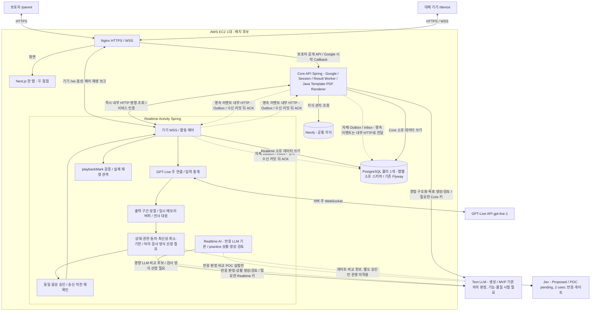

① 개정: A1.5 코드 등록/기기 자격·아이 입력 지정 저장소와 메타데이터·푸시/전사 배포 영향·시험을 반영했다.
② 대체: 고정 ID 사전 시드·원음 영속 미저장·화면 충돌 미채택은 이전 선택이다. EC2/DB 볼륨/백업·DB 비공개·단일 Next.js·AI 역할은 유지한다.
③ 남은 TBD: 원음 저장소/비밀/접근/삭제/백업·코드/자격·푸시 제공/구독/실패·전사 경로·게이트/종료 매핑·실배포/부하/POC.

# ADR-006 시연 서버·배포 구조

- 상태: **Proposed**
- 확정 반영: MVP 시연 구성에 **Neo4j 포함** (2026-10-01, ADR-002).
- 현행 방향: Core API Spring + Realtime Activity Spring 두 실행 앱, Realtime의 GPT-Live API(`gpt-live-1`) 주 WebSocket 릴레이 B안·출력 버퍼 게이트. 방향의 적용과 배포·부하 실검증은 구분한다.
- 확정 조건:
  - 기존 10/1 팀 배포 방식 확인 항목과 남은 배포 상세 결정
  - 첫 통합 배포 후 두 앱·DB·음성 릴레이/버퍼의 합산 자원 사용량 측정
  - 최종 시연 네트워크에서 기기 WSS·서버 공급자 주 연결·실제 재생 확인
- 개정 기준: `ref/mujung-architecture-update-audit-v1.1.md` §2·§3·§5·§7~§9. 사용자 확정 > v0.2 수정 > 기존 비충돌 정책 보존. 보조 v0.2/교차검토의 실행·복구 경계를 적용하며 최신 릴레이·Google 결정이 우선한다.

- 추가 기준: [A1.4](../ref/audit-addendum-ai-roles.md)와 [ADR-011](ADR-011-judgment-engine.md)의 역할·MVP 엔진/검증·두 용도 Jev 후보·보고서·관계 조항을 적용한다. 나머지 audit/배포 원칙과 기존 Proposed 상태는 유지한다.
- 관련:
  - ADR-002 기술 기본값
  - ADR-004 통신·음성 연결 구조
  - ADR-005 세션 이벤트·종료·타임아웃
  - [ADR-008 인증·접근 제어](ADR-008-auth-access-control.md)
  - [ADR-009 실행 경계](ADR-009-execution-boundary.md)
  - [ADR-010 앱 간 영속 전달](ADR-010-durable-delivery.md)

---

# 1. Context

이 프로젝트는 24시간 운영하는 상용 서비스가 아니라 다음 목적이 중심이다.

- 개발 중 통합 시험
- 멘토링·중간 점검
- 최종 시연
- 팀원이 동일한 배포 환경에서 기능 확인

따라서 다음 요구가 있다.

1. 배포 구조가 단순해야 한다.
2. 서버를 필요할 때만 켤 수 있어야 한다.
3. 프론트엔드·백엔드·DB를 한 환경에서 재현할 수 있어야 한다.
4. 브라우저 마이크·서비스 로그인과 기기 음성/제어 WSS 사용을 위한 HTTPS를 고려해야 한다.
5. DB 데이터는 EC2를 Stop/Start해도 유지되어야 한다.
6. 최종 시연 장소의 네트워크 제약에 대비해야 한다.
7. Kubernetes, 관리형 DB 등 MVP에 불필요한 운영 복잡도는 피한다.
8. 두 Spring 앱의 실행·쓰기·키·복구 소유권과 앱 간 전달을 배포에서도 유지한다.
9. 음성 중계·버퍼·검사·Worker·DB 풀이 같은 호스트 자원을 경쟁하므로 지원 부하를 실측한다.

---

# 2. Decision

## 2.1 시연 서버

AWS EC2 한 대를 사용한다.

기본:

```text
AWS EC2
Region: Seoul
Instance: 1
```

현재 MVP에서는 다음과 같은 다중 서버 구성을 사용하지 않는다.

```text
Frontend Server
Backend Server
DB Server
AI Server
```

을 각각 별도 EC2로 분리하지 않는다.

---

## 2.2 Docker Compose와 두 실행 앱

시연 서버의 애플리케이션 구성요소는 Docker Compose로 실행한다. 기존 Next.js 한 앱·두 접점(`/parent`, `/device`)과 PostgreSQL·Neo4j 배치를 유지할 때의 **상시 컨테이너 후보는 6개**다. 실제 서비스명·이미지·Compose 파일은 미작성/TBD이며 아래는 배치 개념이다.

```text
EC2
├─ Nginx
├─ Next.js: /parent + /device
├─ Core API Spring: 보호자 API/Google/Session, Result Worker, 자체 Sender/Inbox
├─ Realtime Activity Spring: 기기 WSS/활동/음성 게이트, 자체 Sender/Inbox
├─ PostgreSQL: 물리 1개, Core/Realtime 소유 스키마
└─ Neo4j: Core 공통 지식
```

각 구성요소는 별도 컨테이너다. PostgreSQL과 Neo4j를 Spring 내부에서 실행하지 않는다. 두 Spring 앱은 별도 빌드·이미지/실행 단위이며 component/entity/repository scan·scheduler 활성 범위를 분리한다. 실제 Gradle 프로젝트/디렉터리 이름·scan 설정은 [ADR-001](ADR-001-repository-git.md)·[ADR-007](ADR-007-module-boundaries.md)에 연결한다.

Result Worker는 Core 내부 작업이고 Sender/Inbox Processor는 각 앱 내부 작업이다. 세 번째 상시 Spring이나 초기 Broker를 추가하지 않는다. 일회성 Flyway 적용 단계는 상시 애플리케이션 수와 구분한다.



도표의 앱 간 점선은 앱별 영속 기록과 내부 HTTP 이벤트 전달을 표시한다. 이벤트 전송은 앱 간 내부 HTTP Sender를 거치며 DB가 상대 앱의 Repository를 직접 호출하는 구조가 아니다. 앱 간 영속 전달 계약은 [ADR-010](ADR-010-durable-delivery.md)을 따른다. 인증·상태 소유권·미확인 분기·각 앱 내부 상세는 [system-architecture.md](architecture/system-architecture.md)와 담당 문서가 관리한다.

추가된 외부 AI 점선은 Jev 두 용도 비교 실험과 게이트 검사 후보를 표시하며 운영 사용 승인이 아니다. Text LLM은 경험/목표/상황 생성과 표에 정한 MVP 기본 의미 판정이고, 게이트 방식은 별도 선정 필요다. LLM 개발 기본값도 기능·품질 시험이 필요하며 반응 개발을 Jev POC 완료에 종속시키지 않는다. 목표 검토는 Core result, 상황 검토는 Realtime practice 소유다. Core의 기존 경험 구조화는 생성 역할로 유지한다. 요청별 LLM 2차 검토·리포트 LLM 서술은 MVP 비활성이다.

## 2.3 외부 진입점·공급자·내부 전달

외부 서비스 요청의 기본 진입점은 Nginx다. 공개 경로를 허용 목록으로 분리하고 포괄 `/api` 또는 루트 전달이 내부 Endpoint를 노출하지 않도록 차단한다. 아래 표는 **라우팅 계약**이며 실제 설정 파일/내부 경로·포트 확정은 아니다.

| 요청 | 목적지·계약 | 상태 |
|---|---|---|
| `/`, `/parent`, `/device` 화면 | Next.js 한 앱 | 기존 접점 유지 |
| 보호자 공개 `/api/*` 중 허용 경로 | Core API Spring | 정확한 허용 목록·Matcher·내부 경로 예외 TBD |
| `/oauth2/authorization/google`, `/login/oauth2/code/google` | Core Google 시작·Callback | 기존 Spring 기본 구현 후보, 실제 Redirect/설정 검증 필요 |
| `/ws` | Realtime 기기 WSS 음성·제어·상태/실제 재생 보고 | 정확한 path matcher·Upgrade·인증/Origin·Timeout TBD |
| 기기용 HTTP가 필요한 경우 | Realtime의 해당 공개 계약으로 우선 분기 | 필요성·Endpoint/포트 TBD, 포괄 Core 프록시에 넣지 않음 |
| 앱 간 즉시 명령·조회 | Core↔Realtime 내부 HTTP | STOP·시작 접수·원격 목표 등록 등, 수신 서비스 인증 |
| 앱 간 영속 요청·완료·정책 변경 | 발신 업무+Outbox 커밋→내부 HTTP→수신 업무+중복 기록 함께 커밋 또는 Inbox 영속 수신 커밋→ACK | 각 앱 내부 Sender/Processor, 중복 효과 방지·미처리 복구, Broker 없음 |
| 내부 전용 Endpoint | 공개 Nginx 진입 차단, 수신 앱에서도 서비스 인증 | 실제 목록·차단/응답 규칙 TBD |

기기 `/ws` 대기 WSS와 유료 GPT-Live 연결 수명을 분리한다. MVP는 **보호자 계정1:아이1:기기1**, 코드 등록으로 그 아이에 기기를 데모 연결하고 기기 자격 검증 뒤 WSS에 대기한다. 보호자 상태 카드는 계정의 아이에 연결된 기기를 보여주고 아이/기기 선택 단계는 없다. 미연결이면 “연결된 기기 없음”으로 표시하고 시작을 차단한다. 계정당 진행 세션은 1개다. 상태 보고→Core 관계/현재 동의 확인→Realtime의 해당 기기 허용/현재 연결/점유/원자 할당→시작 push를 연결한다. 시작 접수·미디어 준비·아동 참여는 별도 사실이다. 데모 연결은 운영 페어링·물리 소유권 인증이 아니며 1:1 제약/할당의 구현은 TBD다.

Inbox를 저장한 수신 ACK는 영속 수신/처리 책임을 수락한 사실이며 미처리 업무가 완료됐다는 뜻이 아니다. 후처리는 업무 변경과 Inbox 처리완료를 같은 로컬 트랜잭션 또는 동등한 원자성 계약으로 반영하고 소유 앱이 미처리 Inbox를 복구한다. 접수·영속 수신 ACK·업무 완료·외부 AI 성공·기기 실제 재생은 별도 사실이다.

음성 경로는 **기기↔Nginx↔Realtime WSS + Realtime↔GPT-Live 주 WebSocket**이다. Nginx는 기기 음성/제어 WSS를 프록시하고 Realtime이 공급자 입력/출력 음성을 중계·통제한다. 서버 공급자 연결은 `wss://api.openai.com/v1/live/sessions` 접속→`session.start`→`session.started` 확인이며 모델/설정은 시작 메시지에 둔다. 공급자 모델 표기는 `gpt-live-1`이고 운영 버전·Java SDK·종료/취소/교정 계약은 실연동 확인 대상이다. 공급자 이벤트와 기기 메시지의 세부는 [ADR-004](ADR-004-communication-voice.md)·[protocol.md](architecture/protocol.md)를 따른다.

Realtime은 출력 구간 분할→전사 대응→상태·권한·작업 최신성/필요 경량 의미 검사→동일 음성 승인→송신 직전 재확인→기기 전달을 수행한다. 전사 누락/대응 불명확·검사 실패·시간초과·포화는 폐기+대체 안내 경로이며 미검사 음성을 통과시키지 않는다. 구간·버퍼·검사·대체 안내 한도는 TBD다. 무거운 교육 판정·KG 조회를 동기 게이트에서 분리하는 것은 **우리 설계 권고**이며 안전 검사 생략을 뜻하지 않는다.

의미 검사 방식은 선정 필요다. Jev(Proposed / POC pending)는 반응·게이트 두 용도에 한정된 후보이고 경량 LLM 등과 비교한다. 의미 PASS 외 대응 음성/전사·현재 활동·권한/동의·최신성·취소·기한을 모두 충족해야 전달한다. UNCERTAIN·저신뢰·근거 부족·호출 실패·timeout은 미출력이며 새 대체 AI 음성도 재검사한다. 텍스트 모델 비교에 더해 버퍼/전사/승인 전달/취소/기기 재생 경로를 확인한다.

끼어들기·쉬기·종료·철회는 서버 버퍼/기기 대기열과 승인 효력을 취소하고 늦은 승인으로 재생을 되살리지 않는다. 폐기 음성의 모델 맥락 잔존과 `session.instructions.append` 교정·수락/재생 승인 구분은 ADR-004를 따른다. 현재 권한 확인 불가이면 새 이용을 보류·차단하며 안전 정리는 수행한다. Core 장애 중 보호자 새 제어 의존(G-02)과 철회/송신·저장 경합(G-03)은 남는다.

## 2.4 개발 환경과 시연 환경 분리

개발 환경에서는 Nginx를 필수로 두지 않는다. 개발에서도 두 앱의 빌드·기동·쓰기/scan/scheduler 경계를 유지한다. 원본 Next.js `3000`은 개발 포트 예시로 유지한다. Core/Realtime 포트·서비스명은 TBD이며 서로 충돌하지 않게 실제 구성에서 정한다. 원본 단일 Spring `8080` 예시는 §17의 이전 선택에 보존했다.

```text
Local Development 개념
Next.js: 3000 (기존 예시)
Core API Spring: 포트 TBD
Realtime Activity Spring: 포트 TBD
PostgreSQL container 1개 + 앱별 스키마
Neo4j container
```

기존 `compose.dev.yml`, `compose.demo.yml`은 환경별 Compose 파일의 후보 이름이다. 이 문서 개정으로 파일을 생성하거나 실행하지 않는다. 시연 후보 서비스는 Nginx·frontend(Next.js)·Core·Realtime·postgres·neo4j이며 실제 서비스명/이미지/변수명은 TBD다. `.env` 및 배포 환경변수로 환경을 구분하고 비밀값은 Git에 저장하지 않는다. 단일 프론트·두 접점을 유지하며 프론트 분리·새 빌드/호스팅 선택을 이 개정으로 확정하지 않는다.

---

# 3. HTTPS

## 3.1 HTTPS 필요성

localhost를 제외한 원격 브라우저 환경에서는 `/device` 마이크와 서비스의 HTTPS/WSS 사용을 위해 Secure Context를 제공한다.

따라서 원격 시연 환경은 HTTPS를 기본 전제로 한다.

```text
https://...
wss://...
```

을 사용한다.

원격:

```text
http://EC2-PUBLIC-IP
```

방식은 `/device` 마이크를 사용하는 최종 시연 방식으로 채택하지 않는다.

---

## 3.2 HTTPS 방식

아직 최종 확정하지 않는다.

후보:

### A. IP 기반 인증서

```text
Elastic IP
+
IP 인증서
```

장점:

- 도메인 구매 불필요

주의:

- 사용 인증서 방식에 따라 유효기간과 자동 갱신 여부 확인 필요
- 최종 시연 직전 인증서 상태 확인 필요

---

### B. 무료 또는 임시 Subdomain + TLS

```text
subdomain
+
TLS certificate
```

---

### C. localhost 중심 시연

최종 시연 환경에서 원격 EC2 `/device` 대신 로컬 Browser를 활용하는 방식.

단:

- 실제 배포 환경과 차이가 커질 수 있음
- 보호자 앱/서버/아동 음성 클라이언트의 실제 네트워크 분리 시연에 제약이 있을 수 있음

---

## 3.3 인증서 운영

단기 또는 자동 갱신이 필요한 인증서를 사용할 경우:

```text
서버 실행
↓
인증서 상태 확인
↓
필요하면 갱신
↓
Nginx 확인
```

절차를 시연 체크리스트에 포함한다.

> HTTPS를 구성했다는 사실과 최종 시연 당일 인증서가 유효하다는 사실을 동일하게 취급하지 않는다.

---

# 4. IP

## 4.1 Elastic IP

🟡 Elastic IP 사용을 기본 후보로 둔다.

이유:

EC2를 Stop/Start하면서 Public IP가 변경되는 환경에서는:

- HTTPS 설정
- 프론트엔드 API URL
- WebSocket URL
- 시연 URL

등을 반복 변경해야 할 수 있다.

Elastic IP를 사용하면 시연 서버의 외부 주소를 고정하기 쉽다.

최종 채택 여부는 HTTPS 방식과 함께 결정한다.

---

# 5. 데이터 저장

## 5.1 RDS

✅ RDS를 사용하지 않는다.

PostgreSQL은 EC2 내부 Docker Container로 실행한다.

이유:

- 시연 중심 프로젝트
- 상시 운영하지 않음
- 관리형 DB 운영 복잡도와 비용을 줄임
- 현재 한 대의 시연 서버를 기본 배치로 유지한다. 지원 부하는 실측으로 정하며 충분한 처리량을 검증한 것은 아니다.

---

## 5.2 Neo4j

Neo4j는 지식 그래프 저장소로 채택 확정했다(2026-10-01, ADR-002).

시연 구성에는 EC2 내부 Docker Container로 포함하고 Core가 공통 지식 관리/조회 경계를 소유한다. PostgreSQL 물리 1개라는 결정으로 Neo4j를 삭제하지 않는다.

```text
PostgreSQL container
Neo4j container
```

는 서로 독립된 서비스다.

---

## 5.3 Volume

DB 데이터는 Container 내부의 일회성 파일시스템에만 두지 않는다.

EBS 기반 Volume에 저장한다.

개념:

```text
EC2
 └─ EBS
     ├─ PostgreSQL Volume
     └─ Neo4j Volume
```

Container를 재시작해도 DB 데이터가 유지되어야 한다.

---

# 6. EC2 운영

## 6.1 Stop / Terminate

일상적인 서버 중지는:

```text
Stop
```

을 사용한다.

일반적인 서버 종료 목적으로:

```text
Terminate
```

를 사용하지 않는다.

이유:

- 실수로 인스턴스와 관련 데이터를 제거할 위험을 줄임
- 서버를 다시 켜서 동일 시연 환경을 사용하는 것이 목적

백업은 별도로 유지한다.

---

## 6.2 Container 자동 시작

Docker Compose 서비스는 가능한 경우:

```yaml
restart: unless-stopped
```

를 사용한다.

목표:

```text
EC2 Start
↓
Docker 시작
↓
필요한 Container 자동 실행
↓
서비스 사용 가능
```

즉 최종 시연에서 매번 모든 Container를 수동으로 실행하지 않는 것을 목표로 한다.

단:

> `restart: unless-stopped`만으로 애플리케이션 전체가 정상 복구되었다고 판단하지 않는다.

시작 후:

- Nginx
- Next.js
- Core API Spring
- Realtime Activity Spring
- PostgreSQL
- Neo4j

의 정상 상태를 확인한다.

---

## 6.3 앱별 재시작·복구

실시간 ActivitySession 상태는 [ADR-005](ADR-005-session-events-timeouts.md), 영속 전달/Job 복구는 [ADR-010](ADR-010-durable-delivery.md)·[result-pipeline.md](architecture/result-pipeline.md)를 따른다. EC2 전체 재시작도 각 앱의 소유권 규칙을 적용한다.

| 재시작 대상 | 현행 복구 계약 |
|---|---|
| Core | 자신이 소유했거나 lease가 만료된 미완료 ResultJob, 자체 Outbox/Inbox만 재선점·복구한다. 정상 Realtime 활동을 일괄 ERROR로 바꾸지 않는다. |
| Realtime | 자신이 소유하던 진행 중 음성 활동에 ADR-005의 오류 정리 정책을 적용한다. 기존 음성 활동을 자동 재개하지 않는다. 이미 종료된 결과 대기/`PARTIAL` 참조·영속 Inbox는 보존한다. |
| 릴레이 버퍼·기기 관측 | 메모리 버퍼는 재시작 후 복원하지 않고 미확인 재생을 성공으로 채우지 않는다. 생성·승인·송신·ACK와 실제 플레이어 관측을 구분한다. |
| Sender/Inbox Processor/Worker | 각 앱의 영속 미처리 기록·성공 체크포인트·현재 run/권한으로 복구한다. 재전송은 새 LLM 생성 시도가 아니다. |

Core 복제본 기동마다 모든 `RUNNING` Job을 초기화하지 않는다. lease/generation/fencing 또는 동등한 이전 실행 차단으로 오래된 Worker의 DB 반영을 막는다. 구체 필드·만료·선점·재전송 한도는 TBD다. 외부 AI 정확히 한 번 호출은 보장하지 않으며 비용/늦은 완료를 관측한다.

두 앱은 별도 컨테이너라도 같은 EC2/PostgreSQL 장애와 자원 경쟁을 공유한다. Core 장애 시 현재 권한·승인 자료 확인과 보호자 제어 의존을 숨기지 않는다. 권한 확인 불가에는 새 이용을 보류하고 안전 정리를 수행한다. Realtime 복제/확장에는 활동·기기 연결 소유자/epoch와 내부 명령 라우팅 계약이 필요하며 보호자와 기기의 일반 Sticky Cookie만으로 동일 소유자 라우팅을 보장하지 않는다. 복제 구성은 이번 기본 배치로 채택하지 않는다.

---

# 7. 서버 사양·음성 중계 부하·관측

## 7.1 초기 후보

초기 통합 배포에서는 **RAM 약 8GB급** EC2를 우선 후보로 검토한다. 원본의 초기 추정이며 확정 요구량·성능 보장이 아니다. Nginx·Next.js·Core·Realtime·PostgreSQL·Neo4j·Docker 자체 overhead가 같은 호스트에서 실행된다.

Core REST/Worker/Sender/Inbox와 Realtime WSS 수신·송신/활동 상태 처리/타이머/외부 AI 대기는 각 실행 경로의 동시 한도를 구분한다. 두 앱의 DB pool·스레드·메모리·외부 모델 호출 예산을 합산한다. 대기 Job을 무제한 메모리 작업으로 옮기지 않고 긴 HTTP/LLM 대기는 짧은 DB 선점·조회·저장 트랜잭션 밖에서 수행한다. 실행기 포화가 CallerRuns 등으로 WS·활동 상태 처리에 긴 작업을 떠넘기지 않도록 설계한다. pool·queue·동시 활동·재전송 한도는 TBD다.

## 7.2 첫 통합 배포 실측

`docker stats` 등으로 다음을 측정하고 목표 부하·병목에 따라 EC2 사양과 앱별 예산을 결정한다. 관측 항목은 설계 책임이며 실제 metric 이름·수집 도구·대시보드·임계값은 TBD다.

| 관측 범위 | 기록할 사실 |
|---|---|
| 호스트·컨테이너 | Memory/CPU/Swap 발생 여부, Idle/음성 활동/결과 Worker/동시 전달 시 사용량 |
| 음성 입력·출력 | Realtime의 입력/출력 중계량·동시 연결·연결 수명, 기기 대기와 공급자 유료 연결의 구분 |
| 출력 버퍼·게이트 | 대기 시간/크기·분할/전사 대응 지연·검사 작업·승인·폐기/누락/시간초과/포화 사유 |
| 실제 제공 | 생성·승인·송신 범위와 검증된 `playbackMark` 관측 범위, 미보고/늦은 보고·확인 불가 |
| 실행·DB·AI | 두 앱의 pool/실행기·Job/Sender/Inbox 적체·선점/재시도·외부 AI 요청 수/비용, 현재 run/오래된 실행 차단 |
| 지연·중단 | 입력/구간/전사 확보→검사→송신→기기 첫 재생과 중단 확인, 대체 안내/유용 답변을 구분한 지연 |

허용된 활동에서 기기로 들어온 **아이 입력 음성 원본만 지정 원음 저장소에 보관**한다. AI 출력 음성은 저장 대상이 아니며 게이트 출력 버퍼는 메모리 전용으로 사용·폐기한다. 원음 보관은 필수 동의 항목이고 계정 삭제까지 보관하며, 기존 계정 삭제 요청 경로가 기록·전사와 함께 원음 저장소 및 DB 메타데이터도 삭제하도록 연결한다. DB에는 저장 위치·구간·세션 참조 등 메타데이터만 두고 원음 바이트·Outbox/Inbox·일반 로그·임시 디스크로 우회 저장하지 않는다. 기존 승인 안내 음성 파일은 별도 콘텐츠다.

대기 WSS의 주변 음성을 상시 저장하지 않는다. 참여 확인 전 입력은 기존 미참여 원문 미저장·수집 허용 정책과 대조해야 하며 포함 여부는 **TBD**다. Realtime 수신에서 저장 경로를 연결하되 저장 담당 앱·메타데이터 쓰기 소유자·저장 완료 기준·부분 저장/실패·삭제 중 늦은 저장 차단의 원자성은 **TBD**다. 저장소 종류·형식·구간 단위·암호화·접근 권한·백업 삭제 상세도 TBD이며 다른 앱 Repository를 직접 수정하지 않는다. 저장 실패를 임시 디스크 우회나 무제한 메모리 적재로 보완하지 않는다.

관측은 최소 식별/버전·시간·오류/근거 참조만 사용하며 원음/전사·Secret을 일반 로그에 복제하지 않는다.

무응답 10초는 앱이 정한 유효 질문/안내 전체의 실제 재생 완료 뒤부터 세고 분할·전사·게이트 대기는 넣지 않는다. Cue 5초 초기 예산은 최초 요청부터 실제 재생 시작까지 분할/전사/검사/송신 대기를 모두 포함하며 재시도로 최초 시각을 초기화하지 않는다. p50/p95 등 실제 지연은 합성·성인 역할극 POC에서 측정하고 숫자 달성을 보장하지 않는다. 8GB 후보의 적합성과 지원 동시 부하는 측정 전 TBD다.

---

# 8. 이미지 Build 및 배포

이미지 Build 위치는 아직 결정하지 않는다.

후보:

### A. EC2에서 Build

```text
Git Pull
↓
docker compose build
↓
docker compose up
```

장점:

- 구조 단순
- 별도 Registry 불필요

단점:

- EC2 Build 자원 필요
- 배포 시간이 길어질 수 있음

---

### B. Local 또는 CI에서 Build

```text
Local / GitHub Actions
↓
Docker Image
↓
Registry
↓
EC2 Pull
↓
docker compose up
```

장점:

- EC2 Build 부담 감소
- 동일 Image 사용 가능

단점:

- Registry 및 Build Pipeline 추가

현재 상태:

```text
⬜ 이미지 Build 위치 미정
```

MVP 일정과 팀의 Docker 경험을 기준으로 결정한다.

---

# 9. 수동 배포·비밀 주입

자동 CD는 MVP 필수 범위에 넣지 않는다. GitHub Actions CI와 `deploy.sh` 기반 수동 배포를 유지한다. 정확한 Script·실행 순서/조건은 배포 구현 시 확정하며 아래는 절차 후보다.

```text
두 앱/프론트 코드·이미지 갱신 및 계약·스키마 호환성 확인
→ 환경별 비밀·설정·내부 경로/포트 확인
→ Backup/복구 준비와 단일 Flyway 적용 단계
→ Core/Realtime 각자 호환 스키마 validate·기동
→ Nginx 공개/내부 경계와 각 컨테이너 상태·Health Check
→ Google/Session/CSRF, 대기 WSS/시작 push, 게이트/실제 재생 확인
```

Google OAuth Client ID/Secret·Redirect URI는 환경별로 관리하고 Secret은 Core에 주입한다. GPT-Live 주 연결/키는 Realtime이 소유한다. Text LLM의 Core 경험 구조화·목표 생성/검토와 Realtime 반응 판정·상황 생성/검토에는 각 앱에 필요한 키 범위만 주입한다. Jev 키도 필요한 범위로만 주입하며 현재 비교 두 용도는 Realtime 소유다. Core의 목표 검토나 경험 구조화에 Jev 키/운영 호출을 필수로 추가하지 않는다. Jev POC 실험 호출과 운영 승인을 구분한다. 내부 인증·DB 쓰기 계정·Session 비밀도 소유 앱에 제한한다. 실제 변수명·접근 API/게이트웨이·SDK·보관/회전/자격 분리 상세는 TBD다.

Client Bundle·브라우저 응답/저장·Git·이미지·일반 로그·배포 예시에 실제 서버 비밀을 넣지 않는다. 공유 라이브러리에 운영 비밀·보호자 Cookie·기기 설정을 하드코딩하지 않는다. 등록 Device 식별자는 기기 자격이 아니며 코드 등록 데모는 운영 인증 완료가 아니다. 기기 자격 브라우저 저장만 ADR-008의 데모 예외를 따르고 서버 비밀은 예외 대상이 아니다. 브라우저 공급자 키/직접 연결 권한 경로를 현행 배포에 만들지 않는다.

Core 내부 Report Renderer는 **Java Template + PDF**를 기본으로 하며 새 실행 앱/컨테이너를 추가하지 않는다. 저장 사실·전사 원문/근거 발화 ID로 조립하고 특정 판정 공급자에 의존하지 않는다. LLM 요약/재작성은 원문으로 표시하지 않으며 미판정·미실시를 정상으로 채우지 않는다. 기간 PDF는 아이 정보+기간 대화 원문·AI 요약/평가 없음이며 활동별 결과 정리와 구분한다. 템플릿 엔진/PDF 라이브러리·기간/원문 조회·상세/구현은 TBD다.

### A1.5 원음 저장소·알림/전사 배포 경계

아이 입력의 지정 저장소는 종류/배치 TBD이며 기존 DB EBS/백업을 그대로 원음 저장소로 채택하지 않는다. 접근 권한·암호화·필요 비밀의 서버 주입 범위·백업/복구 후 삭제 자료 복원 방지·저장 완료/부분 실패·용량/수명·계정 삭제와 늦은 저장 경합을 결정/시험한다. AI 출력 버퍼는 볼륨/백업으로 복원하지 않고 저장 장애를 임시 디스크/무제한 메모리로 우회하지 않는다. 별도 상시 Spring/프론트 앱은 추가하지 않는다.

**Core→보호자 알림 / Core→Realtime→기기 WSS 명령 / 서버→보호자 실시간 전사**는 세 통로다. MVP 알림은 Core가 발송하며 Realtime 활동 상태 변화는 기존 Outbox/Inbox 영속 전달로 Core에 도달한다. 이 알림은 기기 START나 실시간 전사를 대신하지 않는다. 활동 알림 페이로드는 **sessionId·상태만**이며 대화 내용·전사·아이 정보는 담지 않는다. sessionId를 아는 것만으로 기록 조회 권한을 주지 않는다.

푸시는 최신 상태 재조회 힌트이며 상태 원본이 아니다. 앱 진입·복귀·재연결·알림 클릭 때 권한 확인 후 서버 최신 상태를 다시 조회한다. 알림 지연/유실에도 같은 조회 계약을 사용하고 조회 실패 시 마지막 확인 시각과 미확인을 표시한다(구체 필드/표현 TBD). MVP 지원은 **PC Chrome·Edge**이며 모바일·Safari는 후속이다. 제공 방식(Web Push 등)·구독 저장·발송 실패 처리/재시도는 TBD다. 계정·기록 삭제 완료도 알림 용도에 포함되지만 세션 없는 알림의 식별/페이로드와 로그아웃·삭제 뒤 구독 처리는 다음 연결 지점이며 임의 sessionId나 새 필드를 만들지 않는다.

실시간 전사 제공 경로/전송 방식과 공개/내부 라우팅·인가·재연결/누락은 protocol TBD다. 코드 발급/등록·자격 전달·데모 저장/무효화와 등록 교체의 실제 경로/비밀/라우팅도 TBD다. 원음 저장·코드 등록·푸시 포함은 확정이며 제공 기술/구현·실측은 확정하지 않는다.

# 10. DB Migration·쓰기 권한

**Flyway는 ADR-002의 기존 채택**이다. PostgreSQL 물리 1개에 Core/Realtime의 소유 스키마·쓰기 역할을 나눈다. 각 앱이 자신의 Outbox/Inbox와 업무 테이블을 변경하며 상대 Repository/테이블을 직접 수정하지 않는다. 상대 조회/원격 목표 등록은 인증된 공개 계약을 사용한다. 읽기 전용 View 등 예외의 필드/권한·결합은 별도 설계 대상이다.

Core는 Guardian/아동/동의·Spring Session JDBC·콘텐츠/지식 관리·Job/결과/리포트, Realtime은 기기/활동·전사/실제 제공 참조·목표 등록/연습/판정을 소유한다. Neo4j는 Core 공통 지식 경계로 유지한다. 정확한 스키마명·쓰기 계정·권한·물리 관계는 [data-model.md](architecture/data-model.md)의 TBD다.

```text
소유 앱별 Migration 작성·검토 + 앱 간 스키마/계약 호환성 확인
→ 배포의 단일 Migration 단계/실행 주체가 Flyway 적용
→ Core·Realtime 각각 사용하는 호환 스키마 validate
→ 정상 기동·계약·복구 확인
```

두 앱의 자동 시작이 같은 변경을 경쟁 적용하게 두지 않는다. JPA `ddl-auto=validate`를 유지하고 Migration 또는 validate 실패를 정상 배포로 간주하지 않는다. 일회성 Migration은 세 번째 상시 Spring이 아니다. Migration 파일 위치·이력 설정·적용 순서·전용 자격·실행 방식·실패 복구/호환 배포 절차는 TBD이며 임의 SQL/필드를 이 문서에서 만들지 않는다.

---

# 11. Backup

## 11.1 PostgreSQL

최소 백업 수단:

```text
pg_dump
```

사용.

---

## 11.2 Seed

다음은 Git에서 관리 가능한 재구성 자료로 둔다.

```text
seed/
Flyway Migration
Neo4j Cypher Seed
```

Git 관리 Seed는 재구성 가능한 승인 자료로 제한한다. 보호자/아동 개인 운영 자료·실제 비밀·DB 백업은 Git에 넣지 않고 접근·보존·삭제 정책에 맞게 별도 관리한다.

---

## 11.3 외부 백업

중요 백업을 EC2 내부에만 두지 않는다.

가능하면:

```text
EC2 외부
```

에 별도 보관한다.

목적:

- EC2 장애
- 잘못된 Terminate
- Volume 손상
- 시연 전 복구

대비.

---

# 12. Network / Security Group

## 12.1 외부 공개

후보:

```text
80
443
```

---

## 12.2 SSH

```text
22
```

는 팀 허용 IP로 제한한다.

---

## 12.3 DB Port

외부 공개하지 않는다.

예:

```text
PostgreSQL 5432
Neo4j HTTP/Bolt
```

는 Public Internet에서 직접 접근하지 못하도록 한다.

Core·Realtime과 DB는 Docker 내부 네트워크에서 통신한다. 앱의 내부 포트도 Public Internet에 직접 노출하지 않고 Nginx의 공개 허용 경로로 진입한다. 내부 전용 HTTP 경로는 공개 프록시에서 차단하고 수신 앱에서도 서비스 인증·허용 주체/대상/행위를 검사한다. 내부망 자체를 인증 근거로 보지 않는다.

---

# 13. Nginx·Google Callback·내부 경계

Nginx는 외부 Reverse Proxy로 §2.3 라우팅 계약을 적용한다. Realtime 포트·실제 내부 Endpoint가 미정이므로 현행 복사 실행용 Nginx/Compose 설정은 여기서 만들지 않는다. 다음을 배포 구현에서 검증한다.

- Next.js 화면, Core 보호자 공개 API, Google 시작/Callback, Realtime `/ws`를 분리한다.
- 내부 Endpoint는 공개 진입에서 먼저 차단한다. 포괄 `/api`와 루트 프록시·경로 재작성·새 경로 추가로 차단을 우회하지 못하게 한다. 기기 HTTP가 필요하면 해당 Realtime 계약을 포괄 Core 분기보다 우선 분기한다.
- 수신 앱은 내부 서비스 인증과 작업별 사용자 인가·현재 동의를 검사한다. 브라우저 주체 Header를 내부 신뢰로 승격하지 않는다. 내부 HTTP/영속 이벤트 모두 같은 원칙을 적용한다.
- WSS Upgrade·Header·연결/읽기 Timeout·TLS·Origin/CORS와 실제 Proxy 동작을 검증한다. 값은 TBD이며 과거 `3600s`를 새 타이머/현재 권한 보장으로 해석하지 않는다.
- Google 시작/Callback은 Core로 전달한다. 실제 공개 HTTPS scheme/host와 Spring Redirect URI, 환경별 앱 등록 문자열이 일치해야 한다. Forwarded Header 신뢰 범위를 정하고 임의 외부 Header로 Redirect가 바뀌지 않는지 확인한다.
- Spring Security OAuth2 Client·Spring Session JDBC, Cookie·로그아웃·REST CSRF·OAuth state/OIDC 검증을 유지한다. OAuth GET Callback에 일반 REST CSRF Header를 요구하는 흐름과 혼동하지 않는다.

Google만 현재 로그인 범위다. Google 앱 등록·Scope/속성·동의항목·공개 조건과 시험 계정, 로그인/취소/실패·Session 유지/만료/직렬화/Token 최소 보관은 [ADR-008 §3.2](ADR-008-auth-access-control.md#guardian-social-login)·[auth.md](architecture/auth.md)의 구현 검증 대상이다. 테스트 사용자 로그인 성공과 일반 사용자 공개 조건 충족을 구분한다. 공급자 토큰은 서비스 세션 인증과 구분한다. Auth0/Keycloak은 현재 배포에 추가하지 않는다.

# 14. WSS 음성·시연 네트워크

최종 시연 전 실제 장소에서 **기기↔Realtime WSS와 Realtime↔GPT-Live 주 WebSocket을 각각** 시험한다. 학교·교육기관·행사장 Wi-Fi의 Firewall/Proxy/TLS·연결 수명·네트워크 품질과 서버의 외부 공급자 연결 제약을 확인한다. 마이크·입력/출력 오디오, 게이트 대기/실패, 기기 실제 재생·중단 보고까지 검증한다.

```text
최종 시연 장소 Wi-Fi 테스트
+ 휴대폰 Hotspot 예비망
```

특정 네트워크 성공을 모든 장소 동작 보장으로 사용하지 않는다. 기기 링크·서버 공급자 링크의 장애와 실제 중단 미확인을 별도로 남긴다. 기술 POC의 실통신 목표와 제품 시연 실제/Mock 범위(G-01)는 구분하며 후자는 TBD다. 합성·성인 역할극부터 시험하고 실제 아동 데이터 검증을 완료한 것으로 표현하지 않는다.

# 15. 시연 전 체크·First Bolt/장애 시험

아래는 **미실시 시험 계획**이다. 빈 Boot 두 개 기동, HTTPS 접속 또는 문서 개정만으로 통합 검증 완료를 선언하지 않는다. 작은 활동 접수→기기 준비→참여→종료→상태 조회부터 [first-bolt.md](architecture/first-bolt.md)의 후속 시험에 연결한다.

```text
[ ] EC2 / Public IP·Elastic IP 후보 / HTTPS 인증서 유효
[ ] Nginx / Next.js / Core / Realtime / PostgreSQL / Neo4j 정상
[ ] 두 앱 별도 build·scan/scheduler·실행기와 키 주입 범위
[ ] 단일 Flyway 적용 / 각 앱 validate / DB 쓰기 권한·상대 쓰기 차단
[ ] /parent·/device 한 프론트 접점, Google 로그인·재로그인·취소/실패
[ ] Core OAuth 시작·Callback 공개 Redirect/Forwarded Header 일치
[ ] Client Secret·공급자/내부 키 비노출, Session·CSRF·Logout
[ ] 내부 Endpoint 공개 차단 / 수신 서비스 인증 / 현재 주체·대상·동의 검사
[ ] 코드 등록/기기 자격/등록 교체 / 기기 대기 WSS·heartbeat·상태 카드 / 현재 연결·점유·원자 할당
[ ] 보호자 시작 push / 시작 접수·미디어 준비·아동 참여 구분 / 마이크·음성 중계
[ ] Realtime 서버 주 연결 session.start → session.started / GPT-Live 실제 이벤트
[ ] 출력 분할·전사 대응·경량 검사·동일 음성 승인·송신 직전 재확인
[ ] 전사 누락·오대응·검사 실패·시간초과·버퍼 포화의 폐기+대체 안내
[ ] 취소/끼어들기/쉬기/종료/철회·늦은 승인 무효 / 교정 ACK와 새 출력 게이트
[ ] playbackMark 실제 관측 / 생성·승인·송신·ACK·미보고/늦은 보고 구분
[ ] 아동 유효 종료 즉시 ENDING → 일반 출력/버퍼 취소 → 승인 마지막 인사 1회
[ ] 실제 재생 완료 뒤 무응답 10초, Cue 최초 요청~재생 시작 총 5초 미측정 예산
[ ] 각 앱 Outbox/Inbox 커밋·ACK 유실/중복/역전·미처리 복구, Broker 없음
[ ] Core 내부 Result Worker / 원격 목표 등록 응답 유실·현재 run·체크포인트
[ ] Core·Realtime 개별 재시작·lease/fencing / 실시간 자동 재개·버퍼 복원 없음
[ ] 유효 부분 결과와 결과 준비 구분 / 늦은 결과로 활동 부활 없음
[ ] Core 장애 제어 의존(G-02) / 권한 확인 불가 보류·안전 정리 / 철회 경합(G-03)
[ ] 원음 우회 저장·Secret/원문 로그 없음, DB Backup·Volume 재시작/복구
[ ] Idle·활동·Worker·전달 동시 부하, CPU/메모리/버퍼/DB pool·호출 비용 실측
[ ] 실제 시연 네트워크·두 WSS 링크 장애·Hotspot 예비망
```

시험 환경·브라우저/네트워크·API/SDK·사용한 설정/버전, Mock/실연동 구분·지연/포화·실패/미확인·발견된 문제와 복구를 기록한다. 필드·한도·Endpoint·수치를 근거 없이 확정하지 않는다. 첫 구현의 결과/부분 결과 미구현을 전체 제품 기능 제외로 바꾸지 않는다.

---

# 16. Cost

서버는 상시 실행하지 않는다.

주 사용 시점:

- 팀 통합 시험
- 멘토링
- 중간 점검
- 리허설
- 최종 시연

AWS Budget/비용 알림 사용을 권장한다.

다음처럼 서버를 껐을 때도 유지될 수 있는 리소스의 비용 여부를 사전에 확인한다.

- 고정 IP
- Storage
- Snapshot
- 기타 AWS 리소스

정확한 비용은 실제 선택 사양 기준으로 확인한다.

---

# 17. Alternatives

## Alternative A. RDS 사용

현재 채택하지 않는다.

장점:

- DB 관리 편의
- 관리형 백업·운영 기능

현재 제외 이유:

- 시연 프로젝트
- 24시간 서비스 아님
- 비용·관리 항목 증가
- PostgreSQL Container로 MVP 요구 충족 가능

제품화 시 다시 검토 가능.

---

## Alternative B. Frontend / Backend / DB 각각 별도 EC2

현재 채택하지 않는다.

이유:

- MVP 규모 대비 과도한 배포 복잡도
- 서버 관리 증가
- 비용 증가

---

## Alternative C. Kubernetes

채택하지 않는다.

현재 `EC2 1대 + Docker Compose`를 시연 기본 배치로 유지한다. 실제 처리 용량은 실측 대상이다.

---

## Alternative D. 자동 CD 구축

현재 필수 범위로 채택하지 않는다.

이유:

- 프로젝트 기간이 짧음
- 서버를 상시 운영하지 않음
- 배포 빈도가 매우 높지 않음

대신:

```text
GitHub Actions CI
+
deploy.sh
```

를 기본으로 사용한다.

---

## 대체된 이전 선택 — 단일 Spring·직접 음성·3개 로그인

**대체된 이전 선택 — A1.5:** 원음 미저장·고정 ID 사전 시드와 §12 미채택 연결은 지정 원음 저장·코드 등록/자격·MVP 알림/전사·게이트 보류·종료 미확인으로 대체됐다.

아래는 원본 배치/설정/시험의 비교 이력이며 현행 배포 지시가 아니다. 원본의 5개 상시 컨테이너는 다음과 같았다. Neo4j 채택을 제외한 것이 아니라 단일 backend를 Core/Realtime으로 대체하여 현행 후보 수가 바뀌었다.

```text
EC2
├─ nginx container
├─ frontend container
├─ backend container (단일 Spring)
├─ postgres container
└─ neo4j container

Local 원본 예시: Next.js :3000 / Spring Boot :8080
Migration 원본 순서: Application 시작 → Flyway Migration → JPA validate
```

원본은 기기 WebSocket을 서비스 제어에 두고 주 음성이 서버를 우회하는 브라우저 직접 WebRTC·SDP/브라우저 Data Channel·Sideband를 기본으로 삼았다. 당시 Nginx는 서비스 HTTP/WSS만 받고 공급자 음성 중계를 하지 않는다고 설명했다. 최종 시연 조건의 WebRTC/ICE·Sideband 시험·부하 근거와 ADR-004 책임표도 이 연결을 전제로 했다. 현행은 Realtime 주 WebSocket 릴레이·메모리 버퍼/게이트·실제 재생 관측이며 이 구형 연결 시험을 필수로 요구하지 않는다.

다음은 원본 Nginx 예시를 보존한 것이다. 단일 `backend:8080`, 포괄 경로와 `3600s`는 당시 예시 값이며 **현재 실행 설정으로 복사하지 않는다**. 실제 Core/Realtime 경로·포트/Timeout과 내부 공개 차단을 §2.3·§13에서 검증한다.

```nginx
location / {
    proxy_pass http://frontend:3000;
}

location /api/ {
    proxy_pass http://backend:8080;
}

location /oauth2/authorization/ {
    proxy_pass http://backend:8080;
}

location /login/oauth2/code/ {
    proxy_pass http://backend:8080;
}

location /ws/ {
    proxy_pass http://backend:8080;

    proxy_http_version 1.1;
    proxy_set_header Upgrade $http_upgrade;
    proxy_set_header Connection "upgrade";

    proxy_read_timeout 3600s;
}
```

원본의 카카오·구글·네이버 3개 로그인(2026-10-01), 각 Client ID/Secret·Callback/Redirect/공개 조건·테스트 사용자, 네이버 검수와 3개 로그인 리허설은 Google만 결정으로 대체됐다. Guardian·Spring Security OAuth2 Client·Spring Session JDBC·CSRF·Logout·서버 Secret·Forwarded Header/Redirect 검증은 유지한다. 브라우저 임시 키·Ephemeral 및 `/device` 단기 인증 Cookie·운영자 일회용 발급 코드 후보도 현행 기기 흐름이 아니다. 당시 고정 ID 사전 시드·대기 WSS·상태 카드/시작 push가 대체했다. A1.5는 코드 등록/기기 자격으로 사전 시드를 다시 대체하며 현재 허용/연결/점유/할당 검사는 유지한다.

원본의 단일 Application 시작 후 Migration과 단일 Spring 재시작 설명은 배포의 단일 Migration 단계/실행 주체 및 각 앱 validate·소유 범위 복구로 대체했다. 기존 EC2·HTTPS 후보·볼륨·백업·보안 그룹·수동 배포의 비충돌 내용과 Alternative A~D는 보존한다.

---

# 18. Consequences

## 장점

- EC2 한 대·Compose·한 Next.js 두 접점으로 팀이 동일 환경을 재현하고 필요할 때 서버를 실행한다.
- 별도 RDS 운영을 추가하지 않고 PostgreSQL/Neo4j·EBS·백업의 기존 선택을 유지한다.
- 일반 업무/사후 Worker와 실시간 활동/음성 실행·쓰기·복구 책임을 나눌 수 있다.
- Realtime의 출력 버퍼/게이트로 검사 전 음성을 전달하지 않고 동일 승인 음성·실제 기기 관측을 구분한다.
- 앱별 키·DB 쓰기·라우팅·내부 인증과 Outbox/Inbox 복구의 검증 지점이 분명하다.
- 아이 입력 지정 저장/메타데이터의 부하와 AI 출력 메모리 버퍼·게이트/지연·중단/미확인 관측을 구분한다.

## 단점

- EC2/PostgreSQL 한 곳의 장애와 호스트 자원 경쟁이 남아 두 앱만으로 독립 가용성이 보장되지 않는다.
- PostgreSQL·Neo4j·인증서·볼륨/백업·현장 네트워크를 팀이 운영·검증해야 한다.
- 두 앱 build/설정·경로·scan/scheduler·스키마/쓰기 계정·단일 Migration을 관리해야 한다.
- 입력/출력 릴레이·메모리 버퍼·분할/전사 대응·검사 비용과 Cue 지연이 추가된다.
- Outbox/Inbox·ACK·멱등·lease/현재 run·보존과 내부 인증/현재 인가를 직접 구현한다.
- Core 장애 제어 의존과 철회·송신/저장 경합은 남으며 코드 등록 데모가 운영 기기 인증을 대신하지 않는다.
- 자동 CD 없이 수동 배포 절차·복구/실측 증거를 팀이 관리해야 한다.

# 19. Risks

## 서버 자원·버퍼·지연 부족

8GB급은 초기 후보다. 첫 통합 배포에서 `docker stats`·앱별 관측으로 두 앱/DB/릴레이·Worker/Sender 동시 부하를 합산한다. 포화/전사 누락·검사 실패를 미검사 음성 통과로 해결하지 않는다. 버퍼/실행기/DB pool·동시 활동 한도와 대체 안내는 TBD다. Cue 5초 달성을 선언하지 않고 측정한다.

## HTTPS 인증서·IP·현장 Network

시연 전 인증서 유효/필요 갱신, Elastic IP 후보와 HTTPS 방식의 일치, 실제 장소의 기기 WSS/서버 공급자 연결을 확인한다. 예비 접근 방식·Hotspot 예비망을 준비한다. 원본 인증서/IP 후보를 임의로 확정하지 않는다.

## DB 데이터 손실·Migration 실패

EBS Volume·Stop 사용·`pg_dump`·Seed·외부 백업과 복구 시험을 유지한다. 단일 Flyway 실행/각 앱 validate·스키마/계약 호환성 실패를 배포 성공으로 기록하지 않는다. 백업도 개인정보 동의·보존·삭제 정책과 접근 제한을 따른다.

## 내부 경로·키·인가 오류

공개 프록시 차단과 수신 서비스 인증을 함께 시험한다. Google Callback·Forwarded Header 신뢰·Cookie/CSRF·현재 동의·비밀 주입 범위를 검증하고 브라우저 Header/Device ID만을 권한 증거로 승격하지 않는다. 철회 경합(G-03)과 Core 장애 중 보호자 제어(G-02)는 별도 설계/실연동이 필요하다.

## 재시작·ACK·관측을 완료로 오해

컨테이너 자동 시작이 활동/Job 복구 성공은 아니다. 앱별 소유/lease·Outbox/Inbox·이전 run을 검사하고 메모리 버퍼·미확인 재생을 성공으로 채우지 않는다. 영속 수신 ACK는 업무 완료/기기 재생이 아니며 외부 AI 중복 호출 가능성은 남는다.

## 수동 배포 실수

`deploy.sh`·배포 절차·시연 체크리스트를 준비한다. 두 앱의 키/스키마/라우팅·단일 Migration·상태/복구 확인을 포함하되 실제 Script가 존재/실행됐다고 표현하지 않는다.

# 20. Pending

아래 값·구현·시험은 TBD/미검증이다. 두 앱·릴레이/게이트·Google 방향 자체는 다시 미정으로 두지 않는다.

- [ ] HTTPS 방식: IP 인증서 / 무료·임시 Subdomain / localhost 중심 시연과 인증서 발급·갱신
- [ ] Elastic IP 최종 채택, EC2 사양: 8GB급 초기 후보·첫 배포 후 실측
- [ ] Neo4j Container·Volume·Seed·재시작 검증, PostgreSQL/Neo4j Backup 실제 외부 위치·복구 시험
- [ ] Docker Image Build: EC2 / Local·CI+Registry, 두 앱 build/image·실제 디렉터리/서비스명/포트·기동/scan/scheduler 설정
- [ ] `compose.dev.yml`/`compose.demo.yml`·`deploy.sh` 실제 작성·순서·Health/복구 확인과 수동 배포 상세
- [ ] Core/Realtime 스키마명·쓰기 계정/권한, 기존 Flyway 위치/이력·단일 적용 주체/실행/순서·호환 배포·실패 복구
- [ ] Nginx 공개 허용·내부 차단 경로/Matcher·기기 HTTP 필요성, Header/Upgrade·TLS·CORS/Origin·Timeout
- [ ] Google 환경 등록/공개 Redirect·Forwarded Header·Callback/Scope·Session/Token 최소 보관·CSRF/Logout 시험
- [ ] 앱별 공급자/DB/내부 인증 자격 주입·최소 권한·보관/회전과 공개 내부 경로 거부
- [ ] 코드 등록/기기 자격·허용 Origin·중복/연결 교체·원자 할당·상태 카드/시작 push·운영용 기기 인증·실제/Mock 제품 시연 범위
- [ ] GPT-Live Java SDK/운영 모델·시작/이벤트/종료/취소/교정과 저장 미사용 설정·공급자 처리 조건
- [ ] 출력 분할/전체 완료·전사 대응·검사 모델/기준·버퍼 크기/시간/포화·대체 안내/재생성 한도
- [ ] playbackMark 대상/필드명·위치 단위·보고 시점·늦은/불가 보고와 실제 중단 확인
- [ ] 두 앱의 실행기/메모리/DB pool·AI 호출·Worker/Sender/Inbox 합산 한도, lease/fencing·재전송/보존과 현재 run
- [ ] Core 장애 제어(G-02), 철회 효력 시각·확인/송신/저장 경합(G-03)과 안전 정리 실연동
- [ ] 무응답 10초·Cue 5초 초기 예산·지연/품질·버퍼/적체·목표 동시 부하·최종 장소 네트워크 실제 측정

- [ ] MVP 기본 LLM의 실제 모델·질문·출력 계약·구현과 대표/경계/불확실/실패 기능·품질 시험. 비교 POC 제외가 검증 면제는 아님
- [ ] Jev 반응/게이트 두 용도 POC와 개별 승인, 게이트 모델 비교·출력 경로 연동·방식 선정. Mock은 연결/실패 시험이며 실제 AI 음성의 게이트 작동 시연은 검사 방식/차단 경로 확인이 선행
- [ ] 필요한 범위의 LLM/Jev 키·POC/운영 사용 구분, Core Java Template/PDF·전사/발화 ID·화면 최종안 정합 및 1:1:1/계정당 진행1개 구현 검증
- [ ] A1.5 저장/메타데이터·필수 동의·계정 삭제/늦은 저장 차단·등록 성공 전 기존 관계 유지/성공 후 구 자격 차단·알림 유실/재조회·전사 비노출/재연결·논리 종료 미확인과 보류 출력의 실제 시험. 정책 확정과 실측 통과를 구분한다.

공통 팀 판단은 [decision-log.md](decision-log.md)와 [현행 문서 목록](README.md)에 연결한다. delegation은 확인 항목이며 새 채택 기술로 추가하지 않는다. 프론트 2앱·Vite·CloudFront/새 호스팅 조합·QR claim·전체 UI 표시 상태는 별도 확정 없이 도입하지 않는다.

---

# 21. Source of Truth·다음 연결 지점

| 문서 | 책임·연결 |
|---|---|
| ADR-006 | EC2/Compose·두 앱 배포·라우팅/키 주입·단일 Migration·HTTPS/IP·볼륨/백업·네트워크·합산 자원/시연 시험 |
| [ADR-001](ADR-001-repository-git.md) + [ADR-007](ADR-007-module-boundaries.md) + [ADR-009](ADR-009-execution-boundary.md) | 두 실행/빌드·공유 코드/scan/scheduler·도메인/쓰기 소유권과 내부 작업 배치 |
| [ADR-002](ADR-002-technology-defaults.md) | Java/Spring/Gradle 후보 상태, Next.js·PostgreSQL·Neo4j·Session JDBC·기존 Flyway/테스트 기본값 |
| [ADR-004](ADR-004-communication-voice.md) + [protocol](architecture/protocol.md) | 기기 WSS·GPT-Live 주 연결/이벤트·릴레이/구간·전사/게이트/교정·실제 재생 계약 |
| [ADR-005](ADR-005-session-events-timeouts.md) + [session-state](architecture/session-state.md) | 즉시 아동 ENDING·취소/타이머·상태/사유·앱별 복구·미확인·부분 결과 구분 |
| [ADR-008](ADR-008-auth-access-control.md) + [auth](architecture/auth.md) | Google/Guardian/Session·CSRF·기기/내부 인증·현재 동의·서버 Secret·G-02/G-03 |
| [ADR-010](ADR-010-durable-delivery.md) + [data-model](architecture/data-model.md) + [result-pipeline](architecture/result-pipeline.md) | Outbox/Inbox·커밋 후 ACK/멱등·앱별 스키마/쓰기/Flyway·Core Worker/원격 등록·run/lease·보존/삭제 |
| [system-architecture](architecture/system-architecture.md) | 현행 전체 논리/배포 도표·HTTP/영속 경로·AI 역할/관계·신뢰 경계 |
| [first-bolt](architecture/first-bolt.md) | 작은 수직 실연동·Fake/Live·두 앱 개별 장애/복구·게이트/실제 재생·부하의 시험 계획 반영 완료. 실제 시험·측정과 증거 수집은 미실시 |
| [decision-log](decision-log.md) + [README](README.md) | ADR-011을 포함한 현행 목록·A1.4 결정/대체 관계·TBD와 시험 상태 요약 반영 |

앞 단계에 남은 물리 스키마·Endpoint/DTO·playbackMark·내부 인증·철회 원자성 TBD는 후속 실제 설계/구현에서 함께 확정한다. 이 문서는 배포 방향과 미실시 시험을 기록하며 원격/프로그램 실행·성능을 승인하지 않는다. 이번 단계 대상 밖 문서는 수정하지 않는다.

---

# 22. Decision Summary

```text
Cloud: AWS EC2 1대, Seoul Region
Deployment: Docker Compose, 기존 Next.js 한 앱·/parent + /device
Containers: Nginx / Next.js / Core / Realtime / PostgreSQL / Neo4j (6개 상시 후보)
Apps: 두 Spring 별도 build·실행, scan/scheduler 격리
Workers: Core 내부 Result Worker, 각 앱 내부 Sender/Inbox Processor, 세 번째 Spring 없음
Routing: Core 보호자 공개 API·Google Callback / Realtime 기기 /ws 음성·제어·재생 보고
Internal: 공개 경로 차단 + 수신 서비스 인증 + 사용자 인가·현재 동의
Immediate: 내부 HTTP 명령·조회·원격 목표 등록, STOP 우선
Durable: Outbox + 내부 HTTP + 영속 수신/Inbox → 커밋 뒤 ACK, 멱등·복구, Broker 없음
Voice: Realtime 서버 키 → GPT-Live gpt-live-1 주 WebSocket

AI: Text LLM 생성·MVP 기본 판정(기능/품질 시험 필요); Jev 반응/게이트 두 후보 Proposed / POC pending
Gate model: 방식 선정 필요, 모델 비교+출력 경로 연동; PASS 외 전체 전달 조건
Report: Core 내부 Java Template/PDF·저장 사실/전사/발화 ID, 라이브러리·화면 정합 TBD
Device relation: 계정1:아이1:기기1 코드 등록/기기 자격·진행1개, 데모 연결 ≠ 운영 페어링
Start: wss://api.openai.com/v1/live/sessions → session.start → session.started
Output: 임시 버퍼/구간 분할 → 전사 대응 → 검사 → 동일 음성 승인 → 송신 직전 재확인
Cancel/Failure: 미검사·무효 음성 폐기 + 대체 안내, 늦은 승인 재생 금지
Playback: 기기 playbackMark 관측, 생성/승인/송신/ACK와 구분, 미확인 성공 보정 없음
DB: PostgreSQL 물리 1개·앱별 소유 스키마/쓰기 역할, RDS 없음
Migration: 기존 Flyway, 단일 배포 적용 단계/주체 + 각 앱 ddl-auto=validate
Knowledge: Neo4j 유지, Core 공통 지식
Persistence: 기존 DB EBS/영속 볼륨·백업 유지; 아이 입력 지정 원음 저장소 종류/암호화/백업/삭제 TBD, AI 출력 버퍼 메모리 전용
Recovery: EC2 Stop, restart: unless-stopped 후보 + 앱별 소유/lease·미처리 복구
Realtime recovery: 기존 음성 자동 재개·메모리 버퍼 복원 없음
HTTPS/IP: 원격 마이크/HTTPS/WSS, HTTPS 방식 Pending / Elastic IP 후보
Sizing: 8GB급 초기 후보, 두 앱/DB/릴레이·버퍼·검사·AI·Worker 합산 실측
Build/CD: Image Build 위치 Pending, GitHub Actions CI + deploy.sh 수동 배포
Backup: pg_dump / seed·Flyway·Neo4j Cypher Seed / 외부 백업 권장·복구 시험
DB/Apps: 내부 네트워크, DB/내부 앱 포트 Public Internet 직접 공개 금지
Demo: 실제 장소의 기기 WSS·서버 공급자 연결·실제 재생 시험, Hotspot 예비망
Open: 실제 포트/설정·스키마/Flyway·인증·SDK/게이트/관측/한도·G-02/G-03·POC TBD
Status: 방향 반영, 실행·장애·성능 검증 미수행
```
