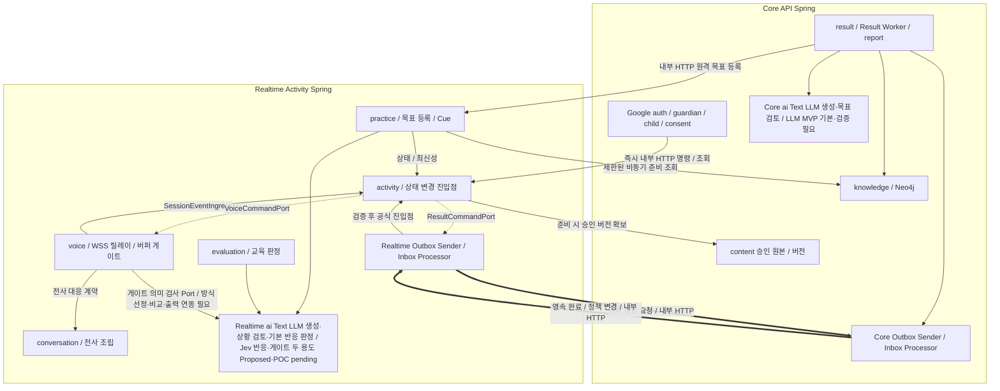

① 개정: A1.5 코드 등록/기기 자격·아이 입력 저장/메타데이터·알림/전사·판정 게이트 보류의 관련 모듈 경계를 최소 정합했다.
② 대체: 고정 ID 사전 시드·원음 미저장/화면 충돌 미채택은 이전 선택이다. 기존 업무/Port/쓰기 소유권·AI 역할·2-Spring·1:1:1은 유지한다.
③ 남은 TBD: 원음 저장 담당/메타데이터 소유·교체/등록/자격·전사/푸시 계약·종료 매핑·게이트 연동과 기존 패키지/API/품질/실측.

# ADR-007 Spring 모듈 경계

- 상태: **Proposed**. Core/Realtime 두 실행 앱·Realtime 릴레이 B안의 방향은 audit 기준으로 적용하며 실제 패키지·계약·구현·성능은 미검증이다.
- 확정 반영: `knowledge` 저장소는 **Neo4j** (2026-10-01, ADR-002).
- 2026-10-02 목표·Cue 동기화: 최신 요구사항의 근거 기반 동적 목표·4요소 구성 조건·실시간 Cue를 반영한다. **Cue는 GPT-Live 실시간 생성 구현 기본안을 사용자 채택했으며 실제 검증 전**이다. 목표 생성의 상세 계약·모듈 연결은 아래 §8.1의 Proposed 구현안이다. ADR 전체 상태는 Proposed를 유지한다.
- 확정 조건:
  - 팀 모듈 경계 합의
  - 초기 패키지 구조 적용
  - ArchUnit 규칙 CI 적용
- 관련:
  - ADR-002 기술 기본값
  - ADR-004 통신·음성 연결 구조
  - ADR-005 세션 이벤트·종료·타임아웃
  - [ADR-008 인증·접근 제어](ADR-008-auth-access-control.md)
  - [ADR-009 실행 경계](ADR-009-execution-boundary.md)
  - [ADR-010 앱 간 영속 전달](ADR-010-durable-delivery.md)
  - [ADR-011 판정 엔진](ADR-011-judgment-engine.md) — LLM MVP 개발 기본·Jev 두 용도 Proposed / POC pending
- 개정 기준: `ref/mujung-architecture-update-audit-v1.1.md` §§2·3·5·7~9와 AI 역할·MVP 범위·관계 추가 기준 `ref/audit-addendum-ai-roles.md` **A1.4**. A1.4가 해당 조항을 대체·구체화하며 A1.1의 확대 계획은 이전 이력으로 남긴다. v0.2 보조 근거와 9단계까지의 비충돌 모듈/업무·쓰기·Port 책임은 보존한다.

---

# 1. Context

MVP는 Core API Spring과 Realtime Activity Spring의 **두 상시 실행·빌드 앱**을 사용한다. 분리 기준은 실행 특성·상태 소유권이다. 보호자/아동 또는 AI/비AI를 앱 경계로 삼지 않는다.

```text
Core API Spring
= 일반 보호자 업무·동의·콘텐츠/지식·사후 결과/리포트

Realtime Activity Spring
= 활동 상태·기기 연결·음성 릴레이/게이트·연습/판정
```

현재 규모에서는 MSA를 사용하지 않는다.

각 앱 안의 모듈과 앱 사이의 계약을 구분하지 않고 모든 기능이 서로 직접 접근하게 두면 다음 문제가 생길 수 있다.

- Activity 상태를 여러 Service가 직접 변경
- 다른 모듈의 Repository 직접 접근
- GPT-Live 연동 코드가 도메인 전체에 퍼짐
- 평가와 결과 생성이 같은 AI Client 구현에 강하게 결합
- Result와 Activity가 서로 호출하여 순환 의존 발생
- AI-DLC 또는 여러 팀원의 코드 생성 과정에서 패키지 경계 붕괴
- 향후 일부 기능을 분리하고 싶어도 의존 관계를 풀기 어려움

두 실행 앱 안에서 도메인 책임과 의존 방향을 명시적으로 나누고, 앱 사이에는 내부 HTTP와 Outbox/Inbox 계약을 둔다. Result Worker·Outbox Sender·Inbox Processor는 해당 앱 내부 작업이며 세 번째 Spring이나 Broker를 추가하지 않는다.

목표:

```text
Core/Realtime 실행 경계
+ 각 앱 내부의 도메인 모듈 경계
+ 원격 계약·각 앱 로컬 트랜잭션
```

---

# 2. Decision

## 2.1 기본 모듈

현재 후보:

```text
auth
guardian
child
consent

activity
voice
conversation
practice
evaluation
result
report

ai
content
knowledge

common
```

이는 논리적 모듈 후보다. 두 실행 앱의 배치는 아래 표를 따르고 실제 디렉터리·Gradle 프로젝트·클래스명은 구현 설계에서 정한다.

| 책임 | Core API Spring | Realtime Activity Spring |
| --- | --- | --- |
| auth | Google OAuth·내부 Guardian Principal·Spring Session JDBC·CSRF·보호자 요청 검증 | 등록 기기 자격/현재 연결 검증·내부 요청 검증 |
| guardian / child / consent | 계정·프로필·관계·현재 동의·철회의 수정 소유자 | 필요한 최소 주체/대상·현재 권한을 계약으로 확인 |
| activity / voice / conversation | 보호자 API에서 허용 명령·조회 위임 | 활동·기기 할당·GPT-Live 주 연결·릴레이/버퍼/게이트·전사/재생 관측 소유 |
| practice / evaluation | Core result의 목표 후보 생성/검토·허용 자료 조회·원격 목표 등록 요청 | 목표 정의/버전 등록·목록/선택·연습 상황 생성/검토·Cue는 practice, 활동 반응 판정은 evaluation 소유 |
| result / report | ResultJob·Core 내부 Worker·추천 산출물/근거·결과·Java Template/PDF 리포트 | 영속 결과 요청·기대 run/결과 참조·활동 상태 반영 |
| ai | Text LLM 생성 Adapter + 목표 후보 검토의 LlmJudgmentEngine/판정 Port. Jev 목표 검토는 MVP 미적용/후속 | Text LLM 연습 상황 생성/검토·LLM MVP 기본 반응 판정. Jev는 반응/게이트 두 용도만 Proposed / POC pending; 게이트 방식 선정 필요. GPT-Live 음성은 voice 경로 |
| content | 승인 원본·버전의 수정 책임 | 준비 단계에 확보한 승인 버전/자료를 활동에 고정해 사용 |
| knowledge | Neo4j 공통 지식 관리·조회 | 준비된 지식 참조/버전 사용, 추가 조회는 제한된 비동기 준비 경로 |
| common | 최소 공통 타입·시간·오류·계약 라이브러리 | Entity·Repository·도메인 Service·Boot 전체 설정 공유 금지 |

각 Boot의 component/entity/repository scan과 scheduler 활성 범위를 분리한다. Core에서 Realtime의 활동 스케줄러·Repository를 스캔하거나 Realtime에서 Core Worker를 자동 실행하지 않는다. 각 앱의 Outbox Sender/Inbox Processor는 자기 스키마·자격·실행 범위만 처리한다. 공통 코드 사용이 같은 업무를 양쪽에서 실행한다는 뜻이 아니다.

PostgreSQL은 물리 1개·앱별 스키마/쓰기 역할을 유지한다. 마이그레이션은 기존 Flyway 채택을 보완해 단일 배포 단계/실행 주체가 적용하고 각 앱은 필요한 호환 스키마를 `validate`한다. 스키마명·권한·Migration 위치/이력/순서는 [data-model.md](architecture/data-model.md)와 [ADR-006](ADR-006-demo-deployment.md)의 TBD다.

---

# 2.2 모듈 책임

## auth

담당:

- Core의 Google만 Spring Security OAuth2 Client 로그인·공급자 검증
- 내부 보호자 ID를 기준으로 하는 인증 Principal
- Spring Session JDBC 기반 로그인 상태와 Security 설정

**Google만 보호자 가입·로그인 공급자로 활성화한다.** 기존 Spring Security OAuth2 Client·Spring Session JDBC 채택은 유지하며 기준은 [ADR-008 §3.2](ADR-008-auth-access-control.md#guardian-social-login)다. 자체 아이디·비밀번호 가입은 제공하지 않는다. 내부 보호자 조회·생성·소셜 계정 연결은 Core `guardian`의 공개 API·Port를 통해 처리하고 다른 모듈의 Repository에 직접 접근하지 않는다. Port 이름·세부 계약은 구현 설계에서 정한다. 공급자 토큰과 서비스 Session을 구분하며 로그아웃·CSRF·현재 관계/동의 검사를 유지한다. 보호자 로그인과 `/device` 인증 Context는 분리한다.

두 앱의 내부 서비스 인증도 사용자 인가를 대신하지 않는다. 수신 앱은 서비스 자격과 Core가 검증한 주체·허용 행위·대상·기한을 현재 활동/기기/권한과 대조한다. 내부망이나 브라우저 입력 Header를 인증 근거로 승격하지 않는다. 인증 방식·비밀 주입/회전·DTO는 TBD다.

---

## guardian

담당:

- 보호자 도메인
- 보호자 정보
- 보호자 기준 조회
- 소셜 계정 식별자와 내부 보호자 계정의 연결 데이터

소셜 제공자·제공자 식별자를 내부 `Guardian`에 연결하는 논리 모델은 [data-model.md](architecture/data-model.md)에 둔다. **Google 단일 로그인은 확정**이다. **복수 제공자 계정 연결은 미채택 이전 대안**으로 보존하며 현행 Pending에 포함하지 않는다. Google 계정 연결·교체·해제와 재인증의 세부 정책은 ADR-008·data-model의 TBD로 유지하며 이메일 일치만으로 계정을 합치지 않는다.

---

## child

담당:

- 아동 프로필
- 보호자-아동 관계: MVP는 보호자 계정 1 : 아이 1 : 기기 1. 기존 GuardianChild를 1:1로 제한하며 제약 구현은 TBD다. 아이 추가·삭제·선택/공동 보호자 기능은 두지 않고 아이 변경은 계정 삭제 후 새 가입으로 처리한다. 여러 아이·공동 보호자·형제 기기 공유는 후속이다.

---

## consent

담당:

- 동의 상태
- 동의 버전
- 철회
- 활동 시작 전 필수 동의 확인

---

## activity

Realtime 서비스 활동 흐름의 중심 모듈이며 ActivitySession의 유일한 수정 소유자다.

담당:

- ActivitySession
- ActivitySession 상태
- Session Event
- Event Queue
- Event Processor
- StateMachine
- 종료 사유
- 비동기 작업 최신성
- `opId`
- 상태 변경 진입점

다른 모듈이 ActivitySession 상태를 직접 변경하지 않는다.

Core의 보호자 시작/제어는 인증된 내부 HTTP 계약을 사용한다. 대상은 계정의 아이와 코드 등록으로 데모 연결된 기기이며 보호자가 아이/기기를 선택하지 않는다. 계정당 진행 세션은 1개다. Realtime은 현재 상태·허용 기기·현재 연결·점유·원자 할당을 검사하고 `PREPARING`·접수 기록을 짧은 트랜잭션으로 커밋한 뒤 접수 응답을 반환한다. 기기/공급자 준비와 아동 참여는 별도이며 준비만으로 `ACTIVE`를 확정하지 않는다. STOP은 사후 Worker 대기열 뒤에 넣지 않는다.

유효한 아동 종료 표현의 서버 확인 즉시 `ENDING` → 일반 출력 승인/진행 차단 → 버퍼·기기 대기열 취소/늦은 승인 무효 → 고정 승인 마지막 인사 1회 예외 → 실제 정리 확인을 연결한다. 보호자 종료·쉬기·철회·끼어들기는 각각 [ADR-005](ADR-005-session-events-timeouts.md)의 규칙을 따르며 끼어들기만으로 자동 `ENDING`을 만들지 않는다.

---

## voice

담당:

- `/device` 연결
- VoiceClient
- Realtime의 `/ws` WSS 음성·제어·재생 보고
- GPT-Live 연동 Adapter
- GPT-Live API(`gpt-live-1`) 주 WebSocket의 입력/출력 음성 릴레이
- 출력 구간 분할·임시 버퍼·전사 대응·검사/승인·송신
- 공급자 Session 연결
- 음성 출력 제어 명령 전달

통신 구조 자체는 ADR-004에서 관리한다.

코드 등록 Device는 계정의 아이와 1:1로 데모 연결한다. 등록 코드·Device 식별·기기 자격, 현재 연결/heartbeat·준비·활동 점유/할당을 구분한다. Core는 보호자 인가/아이 관계를, Realtime은 기존 기기/현재 연결·할당을 소유하고 공개 등록 계약으로 연결한다. 자격 검증 후 WSS에 대기하고 상태 카드→현재 조건 재검사/원자 할당→START를 유지한다. 성공한 새 등록 후 구 관계 해제·자격 차단/열린 WSS·늦은 보고/활동 중 교체·브라우저 저장 데모 예외 상세는 ADR-008/protocol TBD다. 데모 연결 ≠ 운영 페어링/물리 소유권 인증이다.

출력은 **앱 구간 분할 → 출력 전사 대응 → 상태·권한·작업 최신성 및 필요한 경량 의미 검사 → 동일 음성 승인 → 전달 직전 재확인 → 기기 송신** 순서다. `voice`의 미디어 Adapter가 분할·버퍼·매핑/전달을 조정하고 `conversation`의 전사 조립, `activity`의 상태/최신성, 현재 권한 계약과 필요한 검사 Capability를 사용한다. 독립 도메인의 Repository나 공급자 SDK 타입을 게이트에 노출하지 않는다.

분할 알고리즘/VAD·라이브러리·구간/전체 완료 기준·버퍼 한도·검사 모델/기준은 TBD다. 전사 누락·대응 불명확·검사 실패·시간초과·포화는 미검사 음성 폐기와 대체 안내 경로로 처리한다. 대체 안내·재생성 조건/한도는 TBD이며 같은 말을 다시 생성해도 이전 승인 효력을 재사용하지 않는다. 검사 수행은 전달 조건이며 모든 위험 발견의 보장은 아니다.

끼어들기·쉬기·종료·철회는 승인 효력과 서버 버퍼·기기 대기열을 취소하고 늦은 승인으로 재생을 다시 열지 않는다. 폐기한 음성도 GPT-Live 맥락에는 남는다. 차단 후 대화 회복은 앱이 작성한 `session.instructions.append` 교정 지시와 연결하되 수락 ACK는 맥락 삭제·실제 교정 완료·재생 승인이 아니다. 새 출력도 다시 검사하며 미승인 원문을 시스템 지시로 복사하지 않는다.

**우리 설계 권고:** 동기 게이트에는 상태·권한·최신성과 필요한 경량 의미 검사를 두고 무거운 교육 판정·KG/GraphRAG 조회는 분리한다. 필수 안전 검사를 사후로 미루거나 게이트에서 모든 LLM 검사를 금지한다는 뜻은 아니다. 필요한 근거가 없으면 전달을 보류하며 delegation은 확인 항목·미채택이다.

아이 입력 원음만 지정 저장소에 계정 삭제까지 보관하고 DB 메타데이터만 둔다. AI 출력 버퍼는 메모리 전용이다. 저장 담당 앱/메타데이터 소유·완료/부분 실패·삭제 중 늦은 저장은 data-model TBD이며 상대 Repository 직접 수정/DB 바이트/Outbox/Inbox·로그·임시 디스크 우회를 금지한다. 대기 주변 음성을 저장 범위에 추가하지 않는다.

---

## conversation

담당:

- 전사 데이터
- 발화 단위
- Turn
- 대화 기록 연결

MVP 전사 공급원은 **GPT-Live만 사용**하며 별도 STT는 일정 부족으로 보류했다(2026-10-01 팀 회의, [ADR-004 §2.14](ADR-004-communication-voice.md#mvp-transcription)). Realtime `voice`가 공급자 연결·이벤트를 담당하고 `conversation`이 전사 조립·발화·Turn 기록과 출력 구간 대응에 필요한 전사 계약을 담당한다. 입력 전사와 출력 전사의 출처·누락/불확실을 구분한다. 이벤트 형식·조립·음성/전사 대응·저장 정책은 상세 음성/데이터 명세에서 구체화하며 공급자 시간 정보를 기기 재생 위치로 곧바로 쓰지 않는다.

---

## practice

담당:

- 아동별 목표 정의·버전의 검증·등록·선택과 사용
- 연습 상황
- 연습 단계
- 첫 반응
- 도움
- 도움 후 반응
- 새 상황
- Cue 제공 흐름

`practice`는 도움 동의·제공 조건·허용 정보로 구성한 `CueBrief`·실제 도움 제공 기록을 담당한다. Cue 본문은 GPT-Live가 현재 상황에 맞춰 실시간 생성하는 구현 기본안을 사용하며 `content`의 고정 승인 문구를 선택하는 방식으로 제한하지 않는다. 상태·작업 최신성·중단 우선권은 `activity`, 공급자 전달·전사·재생 관측은 `voice`가 담당한다. 상세 책임은 [§8.1](#goal-and-cue-ownership)을 따른다. `CueBrief`는 논리 계약 이름이며 Java 클래스나 Wire Field 확정이 아니다.

---

## evaluation

담당:

- 아동 반응 평가
- 평가 결과
- 평가 근거
- 판정 보류

`evaluation`은 저장된 목표 정의·판정 기준과 상황 조건으로 제한된 판정 입력을 구성하고, Realtime이 소유하는 `JudgmentEngine` 모델 호출 Port를 사용한다. 기존 LLM 경로는 **MVP 개발 기본값·기능/품질 시험 필요**이며 개발을 Jev POC 완료에 종속시키지 않는다. Jev는 반응 판정의 **비교 후보, Proposed / POC pending**으로 해당 용도 통과·승인 후에만 적용한다. 세부 판정 기준은 AI/평가 명세에서 관리한다. 판정값·평가 이유·판정 기준을 GPT-Live 대화 역할이나 Cue 생성 입력으로 그대로 넘기지 않는다. 도움 제공 여부는 `practice`·`activity`의 Spring 규칙으로 판단하고 대화 역할에는 허용한 Cue 요청만 전달한다.

유효한 `NOT_OBSERVED`는 정상 판정 결과이고, 저신뢰·근거 부족·호출 실패·timeout은 사유를 구분한 미판정이다. 판정 작업 실패만으로 활동을 종료하지 않으며 기존 종료 요청·동의 철회·연결 장애 정책은 유지한다. 판정 결과의 사용·저장·현재 단계/도움 여부/전사 신뢰 대조는 호출 업무의 책임이고 Jev를 포함한 판정 엔진/Adapter가 ActivitySession을 직접 변경하지 않는다.

---

## result

담당:

- 결과 생성 작업
- ResultJob
- 비동기 Worker
- 경험 구조화
- 근거 기반 목표 정의·4요소·추천 생성 흐름의 조정
- 결과 생성
- result_failed 재시도

ActivitySession 상태를 직접 수정하지 않는다.

Core 내부 `result` Worker는 생성용 `ai` Port/Text LLM으로 경험 구조화 데이터·근거 기반 목표 4요소 후보를 만들고, 후보 의미 검토에는 Core 소유 `JudgmentEngine`의 기존 LLM 경로를 유지한다. 목표 검토의 Jev 비교는 이번 POC에서 제외하며 **MVP 미적용/후속**이다. 기존 LLM의 기능/품질·형식/참조/근거 검사와 미판정 후보 보류는 계속 필요하고 검증되지 않은 후보를 공개/등록하지 않는다. Realtime `practice`의 공개 원격 등록 계약에 내부 HTTP로 요청하며 Core 소유 요청 Port의 원격 Adapter가 이를 연결한다. 생성/검사 성공 체크포인트를 Core에 보존하고 등록 성공 뒤 응답 유실이면 같은 후보·입력 버전·등록 요청으로 같은 목표·버전/근거를 재확인한다. 완료된 AI 단계를 다시 생성하지 않는다. `result`가 `practice`나 `knowledge`의 Repository를 직접 수정하지 않는다. 실제 Port/Endpoint/DTO·등록 원자성은 TBD다.

Core 추천 산출물/근거와 Realtime 목표 목록/등록 참조의 물리 분해·FK·중복 방지 정보는 data-model의 TBD를 따른다. 같은 Entity/Repository를 양 앱이 공동 수정하는 방식으로 해결하지 않는다.

결과 요청과 완료는 각 앱의 업무 변경/기대 결과 run·Outbox를 같은 로컬 트랜잭션으로 기록하고 내부 HTTP·영속 Inbox로 전달한다. 수신 업무/Inbox 커밋 뒤 ACK, 후처리 업무 효과/Inbox 완료의 원자 반영과 미처리 복구를 따른다. Core 완료 Adapter는 Realtime의 공식 진입점에 전달하며 Core가 ActivitySession을 직접 수정하지 않는다. 일반 Spring 이벤트만으로 다른 JVM에 전달하지 않는다.

실시간 `opId`와 사후 결과 run의 수명을 분리한다. Realtime이 기대한 run·입력 버전·대상/현재 권한을 검사하며 종료로 실시간 작업이 무효화됐다는 이유만으로 허용된 사후 결과를 모두 폐기하지 않는다. 이전 run은 새 수동 재시도를 덮거나 종료 활동을 부활시키지 못한다. 유효 기록의 부분 결과는 기능 요구이며 활동 `PARTIAL`과 Core 결과 준비/실패를 분리한다. 전달·LLM 기술·내용 수정·보호자 수동 재시도도 별도다. 생성·등록·복구 상세는 [결과 파이프라인](architecture/result-pipeline.md#goal-generation-contract)·[ADR-010](ADR-010-durable-delivery.md)이 소유한다.

---

## report

담당:

- 상담용 리포트 생성
- 저장
- 보호자 조회
- 전달 이력

전문가 전용 앱은 MVP 범위가 아니다. A1.4 §6의 기본 경로는 **Core 내부 Java Template + PDF**이며 특정 판정 공급자에 의존하지 않는 저장 사실 기반 조립이다. Report Renderer도 Core 내부다. 대화 원문은 저장된 전사와 근거 발화 ID에 연결하고 LLM 요약/재작성 문장을 원문으로 표시하지 않는다. 미판정·미실시를 정상 판정으로 채우지 않으며 판정값/사용 엔진을 보고서 필수 노출 항목이나 판정 발화만의 발췌 조건으로 강제하지 않는다. A1.4가 참고한 현재 화면 설계 v1.5는 아이 정보·기간 내 날짜별 대화 원문, AI 요약/평가 없음이다. 엔진/PDF 라이브러리·구체 항목/화면 최종안 정합·원문/발화 ID 연결·Renderer 실제 구현은 TBD이며 상세 화면/필드를 여기서 확정하지 않는다. Text LLM 일부 리포트 서술은 **옵션, MVP 비활성**으로 유지하고 저장 사실·허용 인용·근거 발화 ID만 사용한다. 별도 실행 앱이나 report 업무 소유권 변경이 아니다.

---

## ai

각 실행 앱 안의 **Text LLM 생성·MVP 기본 의미 판정과 판정 엔진의 Integration 경계**다. 기존 생성/경험 구조화 LLM은 유지하고 Jev 비교는 Realtime 반응 판정·출력 게이트 두 용도로 한정한다. 두 앱에 필요하다는 이유로 공통 AI 서버·업무 상태를 소유하는 공통 Service·운영 Python 실행 앱을 만들지 않는다.

| 역할 | 계약/경로 | 모듈 책임·상태 |
| --- | --- | --- |
| 실시간 대화·Cue 생성 | GPT-Live, Realtime voice 공급자 Adapter | 기존 확정 경로 유지 |
| 동적 목표·연습 상황·경험 구조화 등 생성 | 생성용 Port/ai Adapter, 기존 후보 이름 LlmClient/LlmAdapter | Text LLM 유지. Core result는 목표/경험 구조화 생성, Realtime practice는 연습 상황 생성 |
| 제한된 자연어 의미 판정 | 각 앱 소유 JudgmentEngine Port/ai Adapter | 기존 LLM 경로는 MVP 개발 기본·기능/품질 시험 필요. Jev는 반응/게이트 두 용도만 비교 후보, Proposed / POC pending. 게이트 검사 방식은 선정 필요 |
| 상태·권한·동의·단계·횟수·타임아웃·전사 누락 | 소유 업무의 Spring 코드 | 모델에 위임하지 않는 확정 규칙 |
| 결과·리포트/PDF 조립 | Core 내부 report/Java Template | 저장 사실/전사 원문 기반 기본 경로. 엔진/PDF 라이브러리·구체 항목/화면 최종안 정합·발화 ID 연결은 TBD |

`JudgmentEngine`은 **모델 호출을 추상화하는 Port**이며 별도 서버나 업무 상태를 소유하는 공통 서비스가 아니다. 각 앱의 호출 업무가 필요한 Port를 소유하고 판정 입력을 구성한다. Adapter는 SDK/API를 변환하고, 결과의 사용·저장·상태 반영은 호출 업무가 맡는다. 실제 Port 패키지·메서드·DTO와 접근 경로(직접 API/게이트웨이)는 TBD다.

| 구현체 후보 이름 | 용도·선택 경계 |
| --- | --- |
| LlmJudgmentEngine — MVP 기본 판정 | 아래 표의 기존 LLM 경로는 **MVP 개발 기본값·기능/품질 시험 필요**. 게이트 모델은 별도 선정 필요. Jev가 해당 용도 POC 기준을 충족하지 못하면 비교 검증된 LLM 경로를 유지하며 검증 미완료를 자동 PASS로 채우지 않음 |
| JevJudgmentEngine | 반응 판정·게이트 **두 용도만 비교 후보, Proposed / POC pending**. POC 실험 호출은 허용하고 해당 용도 통과·승인 후에만 운영 사용. 한 용도의 합격을 다른 용도에 전파하지 않음 |
| LlmJudgmentEngine — 개별 요청 2차 검토 | 주 엔진의 LLM 기본 경로/용도별 엔진 전환과 별개의 **옵션, MVP 비활성**. 필요성·정확도/지연/비용/실패 처리를 검토하고 별도 승인한 경우에만 활성화 |
| MockJudgmentEngine | 개발 초기 연결/계약·실패 흐름 시험용. 합성/성인 Mock 결과는 실제 모델 품질·운영 승인 근거가 아님. 실AI 음성 시연의 게이트 검증을 대신하지 않음 |

| 판정 용도 | 호출 업무·결과 사용 책임 | MVP 기본 경로 / Jev 범위·실패 처리 |
| --- | --- | --- |
| 활동 중 첫/도움 후/새 상황 반응 | Realtime evaluation | 기존 LLM 경로·기능/품질 시험 필요. Jev는 **Proposed / POC pending**인 비교 후보. 저신뢰·근거 부족·호출 실패·timeout은 미판정/사유 구분; 판정 실패만으로 세션 종료하지 않음 |
| 출력 게이트 의미 검사 | Realtime 게이트 소유 경로 | **검사 방식 선정 필요**. Jev·경량 LLM 등 후보 비교와 출력 경로 연동 검증; Jev는 **적용 후보, Proposed / POC pending**. PASS는 전달 조건 중 하나, FAIL·UNCERTAIN/저신뢰·근거 부족·호출 실패·timeout은 미출력/폐기·기존 대체 안내/회복 |
| 생성된 목표 후보의 조건 검토 | Core result 후보 검사 경로 | 기존 LLM 경로·기능/품질 시험 유지. Jev 비교 POC 제외·**MVP 미적용/후속**. 조건 충족 시 다음 검증, 부적합 후보 제외, 판정 미확보는 후보 보류/공개·등록 금지 |
| 생성된 연습 상황의 조건 검토 | Realtime practice 소유 경로 | 기존 LLM 경로·기능/품질 시험 유지. Jev 비교 POC 제외·**MVP 미적용/후속**. 조건 충족 시 다음 검증, 부적합 후보 제외, 판정 미확보는 후보 보류. Core로 업무를 이동하지 않음 |

Core의 사후 경험 구조화는 기존 Text LLM 생성 역할이다. 별도 사후 화용 범주 분류를 현행 기능으로 추가하지 않는다. A1.1의 확대 계획은 아래 Alternative F에 이전 이력으로 남긴다. Jev POC 제외는 목표/상황 검토의 기능·품질 검증 면제가 아니며 실제 모델·질문·출력 계약·구현을 확인하고 대표/경계/불확실/실패 사례를 시험한다. 모델·질문·기준·접근 경로 변경 시 영향 범위에 맞게 재검증하고 요청마다 Jev와 LLM을 연달아 호출하지 않는다.

결과는 제한된 질문/선택지·버전으로 요청하며 선택지 순서는 질문별로 고정한다. 논리 결과 예시 `OBSERVED/NOT_OBSERVED/UNCERTAIN`·확신도 임계값·질문 목록/문구·최종 DTO는 TBD다. 기존 `EvaluationLabel` 등 저장 표현 이름은 유지하고 논리 label/status와의 매핑은 TBD다. 결과 참조 후보는 `label`, `confidence`, `status`, `engine`, 판정 질문 ID/버전·대상 발화/입력 버전·목표/기준 버전·미판정/처리 실패 사유다. 물리 필드·DB Enum을 여기서 확정하지 않으며 엔진 정보를 보고서 필수 노출로 바꾸지 않는다. 논리 `CONFIRMED`는 업무 규칙상 사용 결정이며 사람 검증/절대 정답이 아니다. `ESCALATED`는 실제 승인된 2차 검토를 요청했을 때만 쓰고 MVP 저신뢰를 자동으로 올리지 않는다. `UNDECIDED`는 미판정이며 사유를 별도로 남긴다.

게이트는 의미 검사 PASS 외에도 대응 음성/전사·현재 상태/권한/동의·작업 최신성·취소·처리 기한과 송신 직전 유효성을 확인한 **동일 음성만** 전달한다. 늦은 PASS로 취소 음성을 다시 열지 않는다. 사용할 수 있는 검증된 검사 경로가 없으면 미승인 음성을 전달하지 않는다. 2차 검토 결과만으로 즉시 출력하지 않으며 승인 안내/회복 정책을 따른다. 새 대체 AI 음성도 다시 구간/전사 대응·검사·승인한다. 검사 수행이 모든 위험 발견의 보장은 아니다.

ADR-005 §10.1의 **5초 Timeout + Retry 1회는 반응 판정 구현체 사이의 공통 초기 제안값**으로만 둔다. MVP 기본 LLM/해당 용도 승인 후 Jev에 같은 범위를 적용하며 이 재시도 규칙을 출력 게이트·목표/상황 검토나 Cue에 전파하지 않는다. Cue §10.2는 최초 요청부터 실제 재생 시작까지 전체 5초 초기 예산과 기존 조건부 추가 요청 계약을 따른다. 용도별 합격 수치/라벨/실제 지연·비용과 API/SDK 지원은 POC/TBD다.

Realtime evaluation/practice와 Core result는 공급자 SDK를 직접 호출하지 않고 소유 앱의 **생성 Port 또는 JudgmentEngine/ai Adapter**를 사용한다. Jev/LLM 키는 각 앱에 필요한 범위로만 주입하며 현재 Jev 비교 두 용도는 Realtime 소유다. 이 원칙이 Core에 Jev 새 업무·필수 키 주입을 추가하는 결정은 아니다. 실제 자격 주입/회전·API/SDK는 TBD다. GPT-Live 실시간 Cue는 voice 경로를 유지하고 별도 비실시간 Cue 생성/TTS를 기본으로 추가하지 않는다. 보고서의 저장 사실/전사 원문·발화 ID/템플릿 경계는 현행 결과/데이터/그림 문서에 연결했다. 실제 기술·화면 정합·구현/시험은 TBD다.

### PromptLoader

Prompt 원본은 가능한 경우:

```text
ai/prompts/
```

에서 관리한다.

`PromptLoader`가 해당 원본을 읽어 운영 코드에 제공한다.

목적:

- Spring과 Python POC의 Prompt 원본 불일치 감소
- Prompt Version 관리 용이
- Java 코드 내부에 긴 Prompt 직접 작성 방지

Prompt의 실제 내용과 평가 기준은 ADR-007의 결정 대상이 아니다.

---

## content

사용자에게 실제 제공되는 **승인 콘텐츠**의 경계.

담당:

- 시작 안내
- 고지
- 승인된 기회 트리거
- 마무리 문구
- 일상 지원 문구
- 승인 음성
- 콘텐츠 버전

Core가 승인 원본·버전 수정을 소유하고 Realtime은 활동 준비 전에 허용된 승인 버전/자료를 확보해 활동에 고정한다. 확보 실패는 시작 거부/준비 실패로 드러내며 임의 인사를 생성하지 않는다. STOP·마무리가 Core의 즉석 조회를 기다리지 않도록 한다. 새 원본 배포가 진행 중 활동의 승인 버전을 바꾸지 않는다. 독립 모듈/Adapter의 구체 분해와 확보 계약은 TBD다.

구분:

```text
content
= 실제 보여주거나 들려주는 승인 표현

practice
= 목표 정의·연습 흐름·도움 동의·Cue 요청과 실제 제공 기록
```

예:

```text
content
→ 이번 세션의 시작 안내·기회 트리거·마무리 승인 버전 제공

practice
→ 도움 동의 확인·현재 상황의 허용 정보로 CueBrief 구성

activity / voice
→ 상태·권한·최신성 확인 후 GPT-Live에 Cue 요청
→ 출력 구간·전사 대응·검사·동일 음성 승인·직전 재확인
→ 기기 송신·playbackMark 검증

practice
→ 실제 제공된 Cue 내용·동의·순서·시각 기록
```

---

## knowledge

화용 관련 지식 구조를 담당한다.

예:

- PragmaticBehavior
- SituationType
- Relationship
- SocialCue
- SupportMethod
- 개념 관계

구분:

```text
knowledge
= 화용 행동의 의미와 관계

content
= 해당 의미를 사용자에게 표현하는 승인 문구
```

`knowledge`의 공통 화용 지식 그래프·온톨로지 저장소는 **Neo4j**로 확정했다(2026-10-01, ADR-002). 아동별로 생성한 목표 정의·4요소·근거·버전은 운영 데이터인 PostgreSQL에 저장하는 상세 설계안을 사용한다. 공통 지식 그래프의 기존 행동 목록만 목표로 허용하지 않으며, 생성한 아동별 정의를 자동으로 공용 Neo4j 지식으로 승격하지 않는다. 그래프 모델과 Adapter 구현 상세는 [데이터 설계](architecture/data-model.md#goal-definition-model)에서 정한다.

Core가 공통 지식 관리·조회 계약을 소유한다. Realtime은 준비된 지식 참조·버전을 사용하며 추가 조회는 제한된 비동기 준비 경로로 둔다. STOP·heartbeat·기기 재생 보고가 Neo4j 동기 조회를 기다리지 않는다. 판정 기준·보호자 원문을 GPT-Live 대화 역할에 전달하지 않는다.

---

## common

전 모듈에서 공통으로 필요한 최소 기술 요소만 둔다.

예:

```text
공통 Error
공통 ID/Time Utility
최소 공통 타입·계약
```

금지:

```text
common에 도메인 Service를 몰아넣는 것
Entity·Repository·도메인 Service 공유
Boot 전체 Configuration·자동 스캔/스케줄러 설정 공유
```

`common`이 사실상의 거대한 공유 모듈이 되지 않게 한다.

---

# 3. 의존 방향

## 3.1 기본 원칙

> 기능을 사용하는 모듈이 외부 Capability가 필요하면 자신의 Port를 정의하고, 실제 Adapter가 이를 구현한다.

다른 모듈의:

```text
Repository
내부 Service
Entity 내부 구현
```

에 직접 의존하지 않는다.

---

# 3.2 Activity 중심 상태 변경

ActivitySession 상태는 `activity`의 공식 진입점으로만 변경한다.

기본 흐름:

```text
외부 요청 / 외부 모듈
        ↓
Session Event Ingress
        ↓
SessionEventQueue
        ↓
SessionEventProcessor
        ↓
SessionStateMachine
        ↓
ActivitySession 상태 변경
```

즉:

```text
ResultWorker
→ ActivitySessionRepository 직접 수정
```

금지.

```text
VoiceService
→ ActivitySession.status = ERROR
```

금지.

대신:

```text
ResultWorker
→ ResultReady Event
→ Core 완료 Outbox / 내부 HTTP Sender
→ Realtime Inbox 영속 수신·커밋 ACK
→ 현재 run·입력·권한 검사 / 공식 Session Event Ingress
```

```text
Voice
→ VoiceDisconnected Event
→ Session Event Ingress
```

처럼 처리한다.

---

# 3.3 StateMachine 호출 방향

상태 머신의 호출 관계:

```text
ActivityService
      ↓
SessionEventQueue
      ↓
SessionEventProcessor
      ↓
SessionStateMachine
```

StateMachine이 Queue를 호출하지 않는다.

StateMachine은 가능한 한:

```text
Current State
+
Event
↓
Next State / Action
```

을 계산하는 순수 전이 규칙에 가깝게 유지한다.

---

# 3.4 Inbound / Outbound Port

## Inbound

다른 모듈이 Activity에 이벤트를 전달할 때 사용하는 공개 진입점.

예:

```text
SessionEventIngress
```

후보:

```java
public interface SessionEventIngress {
    void publish(SessionEvent event);
}
```

사용:

```text
voice
→ SessionEventIngress

result
→ 완료 Outbox / 내부 HTTP / Realtime Inbox
→ SessionEventIngress
```

컴파일 의존 방향:

```text
voice  → activity API
Core result → Core 소유 완료 전달 Port / Adapter
Realtime Inbox Adapter → activity API
```

activity는 voice/result의 내부 구현을 알지 않는다. 위 Java Inbound 인터페이스는 원본 후보이며 Realtime 내부 진입점이다. Core가 이를 같은 JVM 객체로 직접 호출하는 계약은 아니다. HTTP/영속 이벤트 DTO는 최소 계약으로 별도 설계하고 같은 도메인 Entity·Service·Repository를 공유하지 않는다.

---

## Outbound

activity가 다른 Capability를 필요로 할 때 activity 쪽에서 Port를 정의한다.

예:

```text
VoiceCommandPort
ResultCommandPort
ContentQueryPort
```

### VoiceCommandPort

Activity가 실제 `/device` 출력 중단 등 Voice 기능을 요청해야 하는 경우:

```text
activity
→ VoiceCommandPort
```

실제 구현:

```text
voice module
```

즉:

```text
activity가 인터페이스 소유
voice가 구현
```

---

### ResultCommandPort

활동 종료 후 결과 작업 생성을 요청해야 하는 경우:

```text
activity
→ ResultCommandPort
```

실제 구현:

```text
Realtime의 결과 요청 Outbox Adapter
→ 내부 HTTP Sender
→ Core Inbox / result module
```

Result가 완료되면 다시:

```text
result
→ Core 완료 Outbox / Sender
→ Realtime Inbox Adapter
→ SessionEventIngress
→ ResultReady
```

로 Activity에 알린다.

이 구조로 다음과 같은 직접 순환 의존을 피한다.

```text
activity Service
⇄
result Service
```

---

# 4. 모듈 의존 개념



점선 Port 관계는 런타임 의존성을 표현한 개념이며,
Java 패키지의 단순 양방향 직접 참조를 허용한다는 의미가 아니다.

실제 컴파일 의존성은 Port/API 패키지를 통해 한 방향으로 유지한다.

그림의 앱 간 선은 원격 계약이며 상대 구현 패키지에 대한 Java 참조가 아니다. 영속 경로는 Outbox 업무/의도 원자 저장 → 내부 HTTP → Inbox 커밋 ACK → 업무/처리완료 원자 반영이다. 즉시 명령 접수, 영속 수신 ACK, 업무 완료, 실제 재생은 구분한다. Broker와 세 번째 Spring은 없다. 미디어 내부 구간/전사/검사/동일 음성 전달 경계는 §2.2 voice·§7·§8.2와 ADR-004를 따른다.

---

# 5. Repository 접근 규칙

## 기본 원칙

각 Repository는 해당 도메인 모듈이 소유한다.

예:

```text
ChildRepository
→ child

ActivitySessionRepository
→ activity

ResultJobRepository
→ result
```

다른 모듈이 Repository를 직접 호출하지 않는다.

금지:

```text
ResultService
→ ActivitySessionRepository
```

대신:

```text
ResultService
→ Core 소유 Port / 원격 Adapter / 완료 Outbox
→ Realtime Inbox / activity public API / SessionEventIngress
```

사용.

상대 앱의 Repository·업무 테이블 직접 쓰기를 허용하지 않는다. 같은 물리 PostgreSQL은 앱별 쓰기 소유권을 합치지 않는다. 교차 조회는 공개 Query 계약이 기본이며 읽기 전용 View 등 예외의 허용 필드/권한/결합은 별도 TBD다.

---

# 6. AI 의존 규칙

다음 모듈은 특정 OpenAI/Text LLM 공급자 SDK나 Jev API/SDK 클라이언트를 직접 사용하지 않는다. 실제 모델/SDK 지원은 TBD이고 기존 LLM 경로의 기능/품질 검증도 필요하다. Jev는 Realtime 반응 판정·게이트 **두 용도만 Proposed / POC pending**이며 목표/상황 검토에는 MVP 미적용/후속이다.

```text
evaluation
practice
result
```

금지:

```text
evaluation
→ OpenAIClient

result
→ OpenAIClient
```

대신:

```text
evaluation
   ↓
해당 앱 소유 JudgmentEngine → Realtime ai 판정 Adapter

practice
   ↓
생성용 Port(Text LLM) / 상황 검토 JudgmentEngine → Realtime ai Adapter

result
   ↓
생성용 Port(Text LLM) / 목표 후보 검토 JudgmentEngine(기존 LLM) → Core ai Adapter
```

실제 공급자 Adapter는 각 소유 앱의 `ai`에서 필요한 범위로 관리한다. 현재 Jev 비교 두 용도는 Realtime 소유이며 Core의 생성/목표 검토는 기존 LLM 경로다. `openai-java`나 검증할 Jev 클라이언트를 사용하더라도 호출/공급자 DTO는 소유 Adapter에 머물며, 도메인은 생성용 Port 또는 `JudgmentEngine` 계약만 사용한다. 도메인에는 공급자 SDK 타입을 노출하지 않는다. `JudgmentEngine`은 모델 호출 계약이고 입력 구성·판정 사용/저장·공식 상태 전이는 호출 업무가 책임진다. 같은 Adapter 코드를 재사용할 필요는 최소 기술 라이브러리로 검토하되 도메인 Service·Entity·Boot 설정까지 공유하지 않는다. 운영 모델/SDK 버전·Jev 접근/키·GPT-Live Java 지원은 실제 검증 전 TBD다.

---

# 7. Voice 공급자 의존

GPT-Live API(`gpt-live-1`) 관련 구현은 Realtime `voice` 모듈의 공급자 Adapter 영역에 격리한다. 서버 키로 주 WebSocket `wss://api.openai.com/v1/live/sessions` 접속 → 모델/설정이 포함된 `session.start` → `session.started` 확인을 연결한다. `openai-java` 직접 사용의 지원 범위·운영 버전은 미검증이며 필요하면 같은 Adapter 경계 안의 Java WebSocket 전송 구현을 검토한다. 공급자 이벤트를 기기 WSS wire 메시지와 구분하며 브라우저에 공급자 권한을 제공하지 않는다.

예:

```text
voice/
├─ application/
├─ domain/
├─ websocket/
└─ provider/
    └─ openai/
```

핵심 Activity 도메인이:

```text
GPT-Live Event 이름
OpenAI SDK Type
Provider Session DTO
```

를 직접 알지 않도록 한다.

통신 관련 결정은 ADR-004를 따른다.

공급자 입력 `session.input_audio.append`, 출력 `session.output_audio.delta`, 입력/출력 전사 `session.input_transcript.delta`·`session.output_transcript.delta`, 교정 `session.instructions.append`는 audit와 [protocol.md](architecture/protocol.md)의 GPT-Live 기준으로 Adapter에서 매핑한다. 실제 SDK 필드·오류·종료/취소·수락 보장은 TBD다. GPT-Live가 발화 시점을 관리하므로 다른 공급자 API의 수동 오디오 commit·음성 턴 생성 절차를 가져오지 않는다. 주 출력 오디오의 재생 시각이나 발화별 완료 이벤트를 만들어 사용하지 않는다.

---

# 8. Content / Practice 분리

`content`는 시작 안내·고지·기회 트리거·마무리와 승인된 일상 지원 표현의 버전을 관리한다. `practice`는 아동별 목표 정의와 연습 진행·도움 동의·Cue 요청·실제 제공 이력을 관리한다. **승인 콘텐츠가 필요한 구간과 실시간 Cue 구간은 서로 다른 출력 정책**이다.

```text
content
ApprovedContent
- code / version / text 또는 audio
- 시작 안내·기회 트리거·마무리 등 승인 표현

practice
CueDelivery
- 어떤 Attempt에서 도움 동의를 받았는지
- 실제 어떤 도움이 제공됐는지
- 제공 순서·시각·재생/중단 관측
- 생성·요청 사실과 실제 제공 사실 구분
```

Cue 기록을 `ApprovedContentVersion` 참조만으로 표현하지 않는다. 실제 생성·제공 내용을 전사 및 재생 근거에 연결하는 상세 모델은 [data-model.md의 Cue 기록](architecture/data-model.md#cue-delivery-model)을 따른다. 서버 로그에 아동 발화·Cue 내용을 무조건 복제하지 않으며 현재 동의·보존 정책을 적용한다.

<a id="goal-and-cue-ownership"></a>

## 8.1 목표 생성·실시간 Cue의 모듈 책임 — 2026-10-02

### 기준과 상태

원본의 2026-10-02 보완은 `무중_기능명세서_최종.md`의 `SYS-RECO-001`, `PRAC-T12-002`, `SYS-PRAC-001`, `PRAC-CUE-001`, `SYS-EVAL-001`과 `요구사항 명세서 v1.0.xlsx`의 FR-C02·F06·F07·F10·E08·F02를 참조했다. 이번에는 audit §7·8에 따라 그 비충돌 정책을 보존한다. 기존의 동적 목표 생성·근거 부족 시 제외·4요소 완비·실시간 도움 원칙을 다시 미결정으로 돌리지 않으며 이 원본 파일명들을 새 개정 기준이나 실제 확인 완료의 증거로 추가하지 않는다.

**Cue의 GPT-Live 실시간 생성 경로는 사용자 채택 구현 기본안(검증 전)**이다. 목표 생성의 DTO·검증 표현·등록 계약과 아래 모듈 연결은 **Proposed 상세 구현안**이며 새로운 고정 목표 목록·사람 승인 단계를 추가하지 않는다.

| 작업 | 소유 책임 | 경계 |
| --- | --- | --- |
| 목표 후보·추천 생성 | Core `result` Worker가 `ai`의 비실시간 텍스트 호출을 조정 | 허용된 현재/과거 기록의 출처와 추천 근거, 행동 정의·기회 조건·상황 생성 조건·판정 기준을 함께 생성 |
| 생성된 목표 후보의 조건 검토 | Core `result`가 입력/결과 사용 책임을 유지 | Spring 구조/근거 검사와 Core 소유 JudgmentEngine의 기존 LLM 의미 검토를 구분. Jev 비교 제외/MVP 미적용·후속이며 LLM 기능/품질 시험은 필요. 판정 미확보는 후보 보류/공개·등록 금지 |
| 공통 화용 지식 조회 | Core `knowledge` | Neo4j는 공통 개념·관계 저장소. 개인 기록·생성 목표의 자동 공용 등록 저장소가 아님 |
| 목표 정의 검증·등록·선택 | Realtime `practice`의 공개 원격 API·Port | 검증을 통과한 아동별 정의·버전을 소유 스키마에 등록. 근거 부족·4요소 누락 후보를 선택 가능 목록에 넣지 않음 |
| 연습 상황 생성·조건 검토 | Realtime `practice` | Text LLM 생성과 JudgmentEngine의 기존 LLM 검토를 구분. Jev 비교 제외/MVP 미적용·후속이며 LLM 기능/품질 시험은 필요. 판정 미확보는 후보 보류. 상황 업무를 Core로 옮기지 않음 |
| 연습 반응 판정 | Realtime `evaluation` | 저장된 정의/기준·현재 상황으로 JudgmentEngine 호출·결과 사용. 기존 LLM은 MVP 개발 기본·검증 필요, Jev는 해당 용도의 Proposed / POC pending 비교 후보. 유효 NOT_OBSERVED와 미판정/호출 실패를 구분하며 기준·결과를 대화 역할에 전달하지 않음 |
| 도움 진입·동의·입력 구성·제공 기록 | Realtime `practice` | 현재 상황·상대 발화 등 허용 정보로 CueBrief 구성. 정답 문장·채점 기준·기존 평가·보호자 원문을 입력으로 확장하지 않음 |
| 상태·진행 권한·비동기 최신성 | Realtime `activity` | 허용 단계·현재 동의/권한·현재 작업을 검사하고 Stop을 우선 처리. 늦은 Cue가 종료·쉬기 뒤 재생되지 않게 함 |
| 실시간 Cue 요청·전사·재생 관측 | Realtime `voice` 및 `conversation` | 공급자 전송·출력 구간/전사 대응·검사/승인·같은 음성 송신과 검증된 기기 관측을 연결. 생성 완료를 실제 제공 완료로 처리하지 않음 |
| 승인 콘텐츠 제공 | Core `content`와 Realtime의 버전 확보/사용 계약 | 시작 안내·기회 트리거·마무리에 적용. 실시간 Cue 본문을 고정 승인 목록으로 대체하지 않음 |

호출 흐름의 구현안은 다음과 같다. 화살표는 호출 순서이며 패키지 직접 참조 방향이 아니다.

```text
허용된 전사·현재/과거 기록
→ Core result Worker → ai 텍스트 생성
→ Spring 목표 4요소/근거 규칙 + JudgmentEngine 기존 LLM 후보 의미 검토(기능/품질 시험 필요)
→ Core 성공 체크포인트 → 내부 HTTP 원격 등록
→ Realtime practice 공개 계약으로 정의·버전 등록
→ 보호자 목표 선택 → 연습 시작 전 사용 가능성 재검사

evaluation의 JudgmentEngine 결과 사용 + Spring 규칙 → practice 도움 동의·CueBrief 구성
→ activity의 상태·opId·중단 우선 규칙
→ voice → GPT-Live 실시간 Cue
→ 출력 구간 분할·전사 대응·Spring 상태/권한/최신성 + 경량 의미 검사(방식 선정 필요, Jev는 Proposed / POC pending 비교 후보)
→ 동일 음성 승인·송신 직전 재확인·기기 전달
→ playbackMark 수신/검증 → practice의 실제 제공 기록
```

모듈 간 Capability를 호출하는 쪽이 필요한 Port를 소유한다는 §3 원칙을 유지한다. Core `result`가 목표 등록 기능을 필요로 하면 Core 소유 Port와 원격 Adapter를 사용하고, Realtime `practice`가 자신의 Repository와 등록 규칙을 관리한다. 등록 성공 뒤 응답 유실이면 같은 후보/입력 버전·요청으로 등록 결과를 재확인하며 생성/검사 성공 체크포인트를 다시 실행하지 않는다. `activity`의 기존 Voice Port와 공개 이벤트 진입점도 유지한다. 새 Port·클래스 이름과 Adapter 위치는 실제 설계에서 정하며 도메인 Entity나 공급자 SDK 타입을 외부 계약으로 노출하지 않는다.

### 선택 이유·대안·영향

- 근거가 있고 4요소를 구성할 수 있는 목표를 동적으로 정의해야 하므로 **고정된 승인 목표 목록만 조회하는 방식은 현재 요구의 기본안으로 사용하지 않는다**. 생성 결과의 형식·출처·사용 가능성 검증은 유지한다.
- 상황에 맞는 실시간 도움이 필요하므로 기존 **승인 Cue 문구 선택 방식은 대체**한다. 비실시간 텍스트 Cue 생성 후 별도 TTS로 제공하는 경로는 현재 기본안이 아니며, 도입하려면 지연·정답 노출 방지·제공 기록을 포함해 별도 검토한다.
- 모듈 역할을 유지하면서 아동별 목표 정의·버전과 실제 생성 Cue를 추적할 수 있다. 대신 근거 검증, 정의 버전 고정, Cue 허용 입력, 생성/재생/중단 기록의 연결을 구현·시험해야 한다.
- 이번 결정은 추천 품질·의미 타당성 또는 GPT-Live의 출력 안전성이 검증됐다는 선언이 아니다. 구체 프롬프트·판정 내용·지식 모델은 동료 AI 명세에서 관리하고, 정답 문장·금지 정보 노출 및 늦은 출력은 시험으로 확인한다.

세부 계약의 Source of Truth는 [목표 생성 흐름](architecture/result-pipeline.md#goal-generation-contract), [목표 정의 모델](architecture/data-model.md#goal-definition-model), [Cue 기록 모델](architecture/data-model.md#cue-delivery-model), [Cue 통신 계약](architecture/protocol.md#cue-contract), [Cue 수명주기](architecture/session-state.md#cue-lifecycle)다. 이 절은 모듈 소유권과 의존 경계만 관리한다.

## 8.2 실제 제공·재생 보고·타이머의 책임

`playbackMark`는 기기 실제 플레이어가 관측한 재생 범위를 Realtime `voice`가 수신·검증하는 앱 계약이다. 관측 주체·활동/현재 연결/승인 음성 대상·위치 단위·진행/중단/완료 송신 시점·늦은 보고·보고 불가·활용의 상세 필드와 단위는 TBD다. 생성·승인·송신·ACK·실제 재생과 실제 청취/이해는 서로 다르다. 전사 시간 정보를 기기 재생 위치로 그대로 복사하거나 미보고 범위를 완전 재생으로 채우지 않는다.

`practice`는 검증된 실제 Cue 내용/범위·동의·순서·시각을 첫 반응·도움 후 반응·새 상황과 연결하며 첫 반응을 덮어쓰지 않는다. 부분 제공·불확실·부적절 도움 뒤 반응은 정상 도움 효과로 확정하지 않는다. `result`는 Realtime의 허용 Query 계약으로 확인된 실제 제공 근거를 사용하며 생성 전사 전체를 제공 인용문으로 쓰지 않는다. 공급자 맥락 보정은 로컬 플레이어 관측과 별개다.

`activity`는 앱이 정의한 유효 질문/안내 전체의 실제 재생 완료 뒤 **무응답 10초·재안내 1회**를 유지한다. 구간 분할·전사 대응·검사·재생 대기를 아동 무응답으로 세지 않는다. 잠깐의 쉼이나 큐 공백은 전체 완료가 아니다. **Cue 최초 요청부터 실제 재생 시작까지 5초** 초기 예산에는 게이트 대기를 포함하며 재요청/재생성으로 최초 시각을 초기화하지 않는다. 달성 여부와 전체 완료 기준은 POC/TBD다. 조건부 추가 요청 1회는 일시 오류·명확한 미수락·무재생이 확인된 때 남은 전체 기한 안에서만 적용하며 수락/재생 불명확은 자동 재요청하지 않는다([protocol.md](architecture/protocol.md#cue-contract)).

끼어들기·쉬기·종료·철회는 승인/타이머 효력을 무효화한다. 유효한 늦은 재생 관측은 과거 제공 사실만 보완하고 새 작업 완료나 활동 재개에 적용하지 않는다. 정확한 위치/내용 대응·기록/타이머 반영은 ADR-005·protocol·data-model의 계약을 따른다.

---

# 9. Knowledge / Content 분리

다음도 구분한다.

```text
공통 PragmaticBehavior 개념·관계
= knowledge / Neo4j

아동별 생성 목표 정의·4요소·버전
= practice / PostgreSQL

"상대가 그만해 달라고 하면 멈추고 확인해요"
= 사용자 표시/승인 표현 → content
```

Knowledge에 화면 문구를 직접 박지 않는다.

Content가 화용 행동 의미 자체의 Source of Truth가 되지 않는다. 아동별로 생성한 정의도 공통 지식과 구분하며, 승인 콘텐츠에 정의가 없다는 이유만으로 생성 목표를 일괄 제외하지 않는다. 목표 등록 조건은 [§8.1](#goal-and-cue-ownership)과 목표 생성 상세 계약을 따른다.

---

# 10. 패키지 구조 후보

```text
backend/
├─ Core 실행·빌드 단위 (실제 경로명 TBD)
│  └─ src/main/java/com/team/project/
│     ├─ auth/ guardian/ child/ consent/
│     ├─ result/
│     │  ├─ application/ (Core 소유 Port·원격 등록 Adapter)
│     │  ├─ worker/ (Core 내부)
│     │  ├─ domain/
│     │  └─ infrastructure/
│     ├─ report/ content/ knowledge/
│     ├─ ai/
│     │  ├─ api/LlmClient.java (생성용 기존 후보)
│     │  ├─ JudgmentEngine Port·기존 LLM/Mock 목표 검토 Adapter (실제 경로 TBD, Jev MVP 미적용/후속)
│     │  ├─ application/PromptLoader.java
│     │  ├─ dto/
│     │  └─ provider/
│     └─ Outbox Sender·Inbox Processor (실제 패키지 TBD)
├─ Realtime 실행·빌드 단위 (실제 경로명 TBD)
│  └─ src/main/java/com/team/project/
│     ├─ activity/
│     │  ├─ api/SessionEventIngress.java / dto/
│     │  ├─ application/
│     │  │  ├─ ActivityService.java
│     │  │  ├─ SessionEventProcessor.java
│     │  │  └─ port/
│     │  │     ├─ VoiceCommandPort.java
│     │  │     ├─ ResultCommandPort.java
│     │  │     └─ ContentQueryPort.java
│     │  ├─ domain/
│     │  │  ├─ ActivitySession.java
│     │  │  ├─ SessionEvent.java
│     │  │  ├─ SessionStatus.java
│     │  │  └─ SessionStateMachine.java
│     │  └─ infrastructure/ActivitySessionRepository.java
│     ├─ voice/
│     │  ├─ application/ (분할·버퍼·게이트·재생 관측 조정)
│     │  ├─ domain/
│     │  ├─ websocket/
│     │  └─ provider/openai/
│     ├─ conversation/ practice/ evaluation/
│     ├─ ai/ (생성 Port·JudgmentEngine·기존 LLM/Mock, Jev 반응/게이트 두 용도만 Proposed / POC pending)
│     └─ Outbox Sender·Inbox Processor (실제 패키지 TBD)
└─ 최소 공통 타입·시간·오류·계약 라이브러리 (실제 경로명 TBD)
```

이 구조는 초기 후보이며 실제 클래스 수에 따라 불필요한 하위 패키지는 만들지 않는다.

원본 클래스명·패키지 예시를 보존한 책임 배치안이며 확정 프로젝트/클래스 목록이 아니다. 각 앱의 Spring Boot 진입점·scan·scheduler·Migration 실행·환경설정은 실행 단위별로 분리한다. 하나의 Next.js 앱의 `/parent`·`/device` 두 접점을 유지하며 프론트 분리·새 호스팅 결정을 이 패키지 예시에서 추가하지 않는다.

---

# 11. ArchUnit

CI에 ArchUnit 테스트를 추가한다.

최소 규칙:

## 11.1 순환 의존 금지

```text
도메인 모듈 간 Cycle 금지
```

예:

```text
activity → result → activity
```

같은 직접 순환을 허용하지 않는다.

---

## 11.2 Repository 직접 접근 금지

다른 도메인 모듈의 Repository를 직접 참조하지 않는다.

```text
result
-X→ ActivitySessionRepository
```

---

## 11.3 Controller → Repository 금지

Controller는 Repository를 직접 호출하지 않는다.

```text
Controller
↓
Application Service
↓
Repository
```

경로를 사용한다.

---

## 11.4 Activity 상태 변경 경로 제한

`ActivitySession` 상태 변경은 지정된 Activity 내부 경로에서만 수행한다.

기본:

```text
SessionEventIngress
↓
SessionEventQueue
↓
SessionEventProcessor
↓
SessionStateMachine
```

다른 모듈이 ActivitySession Entity Setter 또는 Repository를 사용해 상태를 바꾸지 못하도록 한다.

---

## 11.5 공급자 SDK 격리

가능한 경우 다음 규칙을 검사한다.

```text
OpenAI/Text LLM SDK 또는 Jev 클라이언트 타입 (실제 지원 TBD)
→ ai/provider 또는 voice/provider 에서만 참조 가능
```

예:

```text
practice
evaluation
result
activity
```

에서 공급자 SDK Type 직접 사용 금지. GPT-Live는 voice/provider, Text LLM/판정 엔진은 각 앱의 ai 공급자 Adapter로 격리하고, `JudgmentEngine` 결과가 Entity Setter/Repository로 상태를 직접 바꾸지 않는 경계도 확인한다.

## 11.6 두 실행 앱과 공통 코드 경계

- Core에서 Realtime의 Entity·Repository·도메인 Service·Boot 전체 설정을 직접 참조하지 않으며 역방향도 같다.
- 공통 계약은 최소 DTO/타입·시간·오류만 담고 공급자 DTO나 도메인 Entity를 노출하지 않는다.
- 각 앱의 component/entity/repository scan·scheduler 활성 범위를 확인한다. Core Result Worker가 Realtime에서 실행되거나 상대 Outbox/Inbox를 처리하지 않는다.
- 원격 Adapter가 자기 앱 Port와 외부 wire 계약을 변환하고 Realtime의 목표 등록/Activity 변경은 공식 진입점을 사용한다.

ArchUnit은 컴파일/패키지 경계를 검사한다. 실제 DB 권한·원자 커밋·ACK 시점·재시작/중복·게이트·철회 경합은 통합/장애 시험으로 확인해야 하며 정적 규칙만으로 증명하지 않는다. 구체 테스트 규칙·실제 패키지 이름은 TBD다.

---

# 12. 모듈 간 데이터 전달

다른 모듈의 Entity를 그대로 외부 계약으로 사용하지 않는다.

예:

```text
ActivitySession Entity
```

를 result가 직접 조작하지 않는다.

대신 필요한 데이터만:

```text
Command
Query Result
Event
DTO
```

로 전달한다.

목적:

- Entity 수정 범위 제한
- 모듈 간 결합 감소
- DB 모델 변경 영향 감소

---

# 13. Transaction 경계

기본적으로 모듈 내부 Application Service가 자신의 Transaction을 관리한다.

모든 모듈의 Repository를 한 Service에서 한 번에 호출하는 거대한 Transaction을 만들지 않는다.

예:

```text
ActivityService
→ ActivityRepository
→ ResultRepository
→ ContentRepository
→ KnowledgeRepository
```

와 같은 구조는 피한다.

필요한 모듈 간 작업은:

```text
Port
Event
Application API
```

를 이용한다.

단, 실제 MVP 구현에서 원자적 Transaction이 반드시 필요한 사례는 상세 설계에서 예외를 검토할 수 있다.

이 예외는 **같은 앱 소유 범위 안의 로컬 업무**에 한정한다. 상대 스키마 직접 쓰기나 앱 간 하나의 트랜잭션을 허용하는 조항이 아니다. 발신 업무 변경과 Outbox, 수신 업무 효과와 Inbox 처리완료는 각 앱 안에서 원자 반영한다. 수신 커밋 전에 ACK를 보내지 않으며 미처리 Inbox를 복구한다. DB 선점/조회/저장 트랜잭션을 HTTP·LLM 대기 동안 유지하지 않는다.

즉시 명령/조회·원격 목표 등록과 영속 결과 요청/완료를 구분한다. 각각의 requestId/eventId·결과 run·입력/정책 버전은 논리 계약이며 Wire Field/물리 컬럼·선점/lease/fencing 상세는 TBD다. 응답/ACK 유실·중복에 같은 업무 효과를 반복하지 않고 전달 재시도를 새 AI 생성 시도로 세지 않는다. 구체 계약은 ADR-010·protocol·result-pipeline을 따른다.

---

# 14. MSA와의 관계

이 ADR은 MSA 도입 결정이 아니다.

현재 실행 구조:

```text
Core API Spring
Realtime Activity Spring
각각의 실행·빌드·배포 단위
```

를 유지한다.

실행 특성·상태 소유권 기준의 두 앱 경계와 각 앱 내부 도메인 책임/의존 방향을 유지한다. 모든 기능을 개별 Microservice로 분할하지 않는다. Core·Realtime의 한 호스트 배포 여부와 자원·DB 공유는 배포 문서가 관리하며 앱 두 개만으로 독립 가용성·처리량이 입증되지는 않는다.

향후 필요해졌을 때 모듈 단위 분리가 가능한 구조를 만드는 것은 부수적인 장점이다.

---

# 15. Alternatives

## Alternative A. Controller / Service / Repository만 전역 계층으로 분리

예:

```text
controller/
service/
repository/
entity/
```

프로젝트 전체를 이런 계층 기준으로만 구성하는 방식은 채택하지 않는다.

이유:

- 서로 다른 도메인 기능이 한 패키지에 섞임
- 모듈 소유권이 불명확
- Service 간 직접 호출이 증가하기 쉬움
- AI 코드 생성 시 경계를 유지하기 어려움

도메인/기능 우선 패키지 구조를 기본으로 한다.

---

## Alternative B. 각 기능을 Microservice로 분리

채택하지 않는다.

이유:

- 현재 5명 팀·MVP 규모에 과도함
- 네트워크 통신·배포·인증·관측 복잡도 증가
- 일정상 이득보다 비용이 큼

---

## Alternative C. 모든 모듈이 서로 Service를 직접 호출

채택하지 않는다.

이유:

- 순환 의존 발생
- 내부 구현 노출
- 기능 변경 영향 확산
- 테스트 어려움

공식 API/Port/Event 경계를 사용한다.

---

## Alternative D. AI 호출을 각 도메인에 직접 작성

예:

```text
EvaluationService → OpenAI SDK
ResultService → OpenAI SDK
PracticeService → OpenAI SDK
```

채택하지 않는다.

이유:

- 공급자 코드 중복
- Prompt 관리 분산
- Fake/POC 교체 어려움
- 공급자 변경 영향 확산

각 소유 앱의 `ai` Port/Adapter 경계를 사용한다. 두 앱에서 공통 도메인 AI Service를 직접 호출하는 계약은 아니다.

## Alternative E. 단일 Spring·직접 음성 연결 — 대체된 이전 선택

원본은 `MVP는 Spring Boot 서버 하나`·`하나의 Spring Boot Application`·단일 배포 Modular Monolith를 기본으로 두고 result→practice 등록·result→SessionEventIngress 완료를 같은 프로세스 호출로 표현했다. 현재는 Core/Realtime 두 실행 앱, 원격 등록·Core 체크포인트, 결과 요청/완료 Outbox/Inbox로 대체했다. 도메인 소유권·공식 Port/진입점·순환 의존 금지의 목적은 계속 유지한다.

원본 voice의 SDP Relay·Sideband와 `openai-java`의 Live 세션 생성/SDP 교환·Sideband 연동 검증은 브라우저↔GPT-Live 직접 WebRTC의 이전 선택이다. 현재는 서버 주 WebSocket 릴레이와 버퍼 게이트로 대체했으며 이 문단을 구현 지시로 사용하지 않는다.

원본 auth의 카카오·구글·네이버 소셜 로그인 3개는 Google만 활성화하는 최신 선택으로 대체했다. 자체 ID/PW 제외·Guardian·Spring Security OAuth2 Client·Spring Session JDBC·로그아웃·CSRF·동의 검사는 유지한다.

원본 common의 `공통 Configuration` 예시는 최소 기술 요소를 염두에 둔 과거 후보로 남긴다. 현재 두 앱의 Boot 전체 설정·스캔/스케줄러·도메인 구현 공유를 허용하지 않는다.

## Alternative F. 생성·판정을 LlmClient에 함께 표현 — 대체된 이전 역할 분업

이전 ai 예시는 `LlmClient`의 `extractExperience()`·`evaluateResponse()`·`generateScenario()`·`generateRecommendation()`·`generateResult()`로 생성과 판정을 함께 표현하고, evaluation/practice/result가 같은 LlmClient 경계를 사용했다. 당시 후보 메서드/역할의 이력이며 새로 확인한 운영 도구 채택이 아니다. Text LLM의 경험 구조화/목표/상황 생성과 각 앱 소유 JudgmentEngine의 모델 호출 분리는 현행에도 유지한다.

**대체된 A1.1 확대 계획:** 10단계는 Jev 우선 후보·POC 실패 시 비교 검증된 LLM 대안과 반응/게이트/사후 화용 분류/목표 후보/상황 후보 다섯 용도 POC를 제안했다. A1.4는 기존 LLM을 MVP 개발 기본으로 두고 Jev 비교를 반응/게이트 두 용도로 한정한다. 목표/상황 검토의 Jev는 MVP 미적용/후속이며 별도 사후 화용 분류는 기준본에 없는 기능으로 현행에 추가하지 않는다. 개별 요청 2차 LLM 검토는 별개 옵션/MVP 비활성이다. 이전 A1.1 보고서의 DB 판정/엔진/서버 계산값 조립·원문 발췌 방향도 저장 사실/전사 원문·발화 ID 기반으로 대체하며 필수 표시 항목으로 쓰지 않는다. 이전 LLM 결과 설명·불일치 시 템플릿 대체는 Core Java Template/PDF 기본으로 이미 대체됐고 LLM 리포트 서술은 옵션/MVP 비활성으로 남긴다. 결과/리포트의 문서 경계는 현행 담당 문서에 연결했으며 실제 상세 구현·검증은 TBD다.

---

# 16. Consequences

## 장점

- Core/Realtime 두 실행 앱과 각 앱의 도메인 경계 명확화
- 기능별 책임 명확
- 모듈 간 순환 감소
- ActivitySession 상태 변경 경로 통제
- 외부 AI/GPT 공급자 코드 격리
- AI-DLC 병렬 개발 시 구조 붕괴 방지
- 테스트 Fake 작성 용이
- 향후 일부 영역 분리 가능성 확보

## 단점

- 단순 Layered Architecture보다 초기 구조 설계가 필요함
- Port/API/Event 클래스가 추가됨
- 작은 기능까지 지나치게 추상화할 위험
- 팀원이 모듈 규칙을 이해해야 함
- 원격 계약·서비스 인증·버전·Outbox/Inbox·체크포인트/복구의 구현 비용이 추가됨
- 릴레이·버퍼·검사·재생 관측의 메모리/지연/부하와 두 앱 합산 실행기·DB pool을 측정해야 함
- 공유 DB/호스트·현재 권한·콘텐츠 의존과 Core 장애 중 보호자 제어 제한은 남음

따라서:

> 모든 클래스에 Interface를 만드는 방식으로 과설계하지 않는다.

외부 capability 또는 모듈 경계를 넘는 지점에만 Port를 사용한다.

---

# 17. Risks

## 과도한 추상화

대응:

- 모듈 내부 단순 Service에는 무조건 Interface를 만들지 않음
- 모듈 경계나 외부 공급자 경계에서만 Adapter/Port 사용

---

## common 비대화

대응:

`common`에는 실제 공통 기술 요소만 둔다.

도메인 모델과 Business Service를 `common`으로 이동하지 않는다.

Boot 전체 설정·scan·scheduler와 공급자 DTO를 공유해 앱 경계를 우회하지 않는다. 공통 기술 코드와 최소 wire 계약의 실제 배치는 ADR-001·ADR-009와 대조한다.

---

## Event 구조 복잡화

모든 단순 조회까지 Event로 만들지 않는다.

```text
상태 변경·비동기 완료
→ 소유 앱의 공식 Event 진입점
→ 앱 간 유실되면 안 되는 사실은 Outbox/Inbox

단순 조회
→ Query/Application API (앱 간이면 내부 HTTP)
```

로 구분한다.

---

## AI-DLC가 경계를 위반하는 코드 생성

대응:

- `AGENTS.md`에 모듈 규칙 작성
- ArchUnit CI
- PR Review

## 실행기 포화·원격 대기·복구

Core REST·Worker·Sender/Inbox 처리, Realtime WSS 입출력·세션별 짧은 상태 처리·타이머·외부 검사/판정 대기의 실행 한도를 구분한다. 무거운 외부 호출을 상태 이벤트 처리기 안에서 기다리지 않는다. Worker/Sender 포화가 CallerRuns 등의 방식으로 WS/상태 스레드에 긴 작업을 떠넘기지 않도록 한다. 실제 pool·queue·timeout·중계/버퍼/검사·외부 호출 예산은 TBD이며 두 앱의 자원을 합산해 측정한다.

Core 재시작은 자기 Job·Outbox/Inbox만 복구하며 정상 Realtime 활동을 일괄 변경하지 않는다. Job은 자신이 소유했거나 lease 만료가 확인된 실행만 현재 run·checkpoint·권한과 함께 재선점하고 오래된 Worker 반영을 fencing 등으로 차단한다. Realtime은 자기 활동/연결·Outbox/Inbox를 복구하며 실시간 음성 활동 자동 재개·메모리 버퍼 복원을 가정하지 않는다. 미확인 재생을 성공으로 채우지 않고 종료/결과 대기/부분 결과 참조를 보존한다.

내부 HTTP/Outbox 전달·영속 ACK·업무 처리·LLM 실행·기기 재생을 하나의 완료로 합치지 않는다. 원격 등록 응답 유실·중복·ACK 유실·수신 뒤 크래시·현재 run/lease 경합은 실제 장애 시험이 필요하다. 외부 AI 정확히 한 번 호출이나 영구 장애 자동 성공을 보장하지 않는다.

## 현재 권한·철회와 Core 의존

Core `consent`의 변경·철회 Outbox는 같은 로컬 트랜잭션에 기록해 우선 전달한다. 이 알림만으로 즉시 반영을 보장하지 않는다. Realtime·Core Worker는 새 입력/처리·외부 요청·출력 승인/송신·저장·결과 반영 전에 현재 동의/자료 허용·대상·정책을 확인하며 확인 불가이면 새 이용을 보류·차단한다. STOP/안전 정리를 권한 재확인 실패 때문에 막지 않는다. 철회 효력·검사-저장/송신 경합·진행 중 외부 작업 처리는 G-03의 TBD다.

Core 장애 때 보호자→Core→Realtime의 새 제어 경로 제한과 현재 권한/승인 콘텐츠 의존은 남는다. 기기 연결이 살아 있다는 사실만으로 활동 지속을 허용하지 않는다. 승인 버전을 사전에 확보해 STOP/마무리가 즉석 조회를 기다리지 않게 하되 보호자 직접 Realtime 종료(G-02)는 미채택·후속 판단이다. delegation으로 이 의존이 해결됐다고 쓰지 않는다.

전사 스냅샷·Cue/근거·게이트 참조·Outbox/Inbox·checkpoint도 보존/삭제 정책 대상이다. 원문을 메시지/일반 로그에 무조건 복제하거나 삭제 뒤 재전달로 자료를 복원하지 않는다. 중복 방지 기록과 메시지 보존/정리의 실제 순서·기간은 TBD다.

---

# 18. Pending

**대체된 이전 선택 — A1.5:** 고정 ID 사전 시드·원음 미저장/§12 미채택은 코드 등록·아이 입력 지정 저장·MVP 알림/전사·게이트 보류·종료 미확인으로 대체됐다. 판정 턴 보류/교정·재생성은 evaluation→게이트의 현재 작업 계약이며 공급자 자동 응답 중지 기능이 아니다. Core 알림은 영속 활동 변경 수신을 사용하고 기기 START·보호자 전사와 구분한다. 원음 저장의 담당/메타데이터 소유는 TBD로 남기며 AI 분업 때문에 업무를 재배치하지 않는다.

- [ ] 최종 모듈 목록 확정
- [ ] `content` 독립 모듈 최종 채택
- [ ] 확정된 Neo4j 저장소에 대한 `knowledge` Adapter 상세 설계·구현 검증
- [ ] Activity Port 이름 및 범위
- [ ] Session Event Queue의 구체적 구현
- [ ] 각 앱 내부 모듈 Event를 Spring Application Event로 구현할지 자체 Queue로 구현할지. 앱 간 영속 전달은 Outbox/Inbox이며 이를 같은 선택지로 다시 미정화하지 않음
- [ ] `ai/prompts/` 실제 경로 및 Prompt Version 방식
- [ ] ArchUnit 규칙 상세
- [ ] `openai-java` 등 외부 SDK의 허용 Package 범위와 ArchUnit 검사
- [ ] Transaction 예외 사례
- [ ] 목표 정의·근거·4요소 검증 및 `Core result → 원격 Adapter → Realtime practice` 등록 계약·버전 고정 구현
- [ ] CueBrief 허용 필드·GPT-Live 생성/전사/실제 재생의 연결, 정답·평가 정보 유출 및 중단 경합 시험
- [ ] 두 실행/빌드 단위의 실제 패키지·Port/Adapter·공통 계약 경로와 scan/scheduler·설정/비밀 범위. Core/Realtime 방향 자체는 적용함
- [ ] 앱별 스키마/쓰기 역할·기존 Flyway 단일 적용 단계/실행 주체·각 앱 validate와 교차 조회 예외
- [ ] 내부 Endpoint/DTO·서비스 인증·권한/대상/기한 전달, 즉시 명령 중복/응답 유실 재확인
- [ ] 결과 요청/완료 Outbox·Inbox 커밋 ACK·업무/완료 원자성·선점/lease/fencing·run/입력 버전·보존/재처리와 원격 목표 등록 체크포인트
- [ ] 출력 분할/전체 질문·안내 완료·전사 대응·게이트 검사 모델/기준·buffer 한도·대체 안내/재생성·차단 후 교정/취소 실연동
- [ ] playbackMark 대상/단위/주기·늦은/불가 보고·전사 구간 대응·실제 제공/판정 사용 제한
- [ ] Core 장애 중 보호자 제어(G-02), 철회 효력/송신·저장 경합(G-03), 실제/모의 제품 시연 범위와 합산 자원·지연 POC
- [ ] 동료 GPT-Live/AI 상세 명세 파일·버전. delegation/KG·GraphRAG 위임은 확인 항목이며 미채택
- [ ] 각 앱 소유 JudgmentEngine Port/생성 Port의 실제 패키지·메서드·논리 결과/근거·질문/대상/기준 버전·실패 사유 DTO와 SDK/API 격리. 기존 업무/쓰기 소유권 유지
- [ ] Jev **Proposed / POC pending 두 용도**: Realtime 반응 판정·게이트 의미 검사의 질문/라벨/선택지 순서·확신도/합격 수치·지연/비용·접근/키 범위. 목표/상황 검토의 Jev는 이번 POC 제외·MVP 미적용/후속
- [ ] MVP 기본 LlmJudgmentEngine의 실제 모델·질문·출력/구현과 대표/경계/불확실/실패 기능·품질 시험. 게이트 방식 선정/출력 연동은 별도이고 미판정·후보 보류·미출력/회복을 유지. 개별 요청 2차 검토 옵션/MVP 비활성과 실제 2차 요청만 ESCALATED 기록을 구분
- [ ] 반응 판정 §10.1의 5초 Timeout/Retry1회 구현체 공통 초기 제안값 검증. 게이트/Cue 및 다른 판정 용도에 자동 전파하지 않음
- [ ] 결과/데이터/그림에 반영한 Core 내부 Java Template/PDF 기본·저장 사실/전사 원문·발화 ID·LLM 서술 옵션/MVP 비활성의 실제 구현/검증과 화면 최종안 항목 정합. 판정/엔진 노출을 강제하지 않으며 엔진/PDF 라이브러리는 TBD

공통 팀 판단:

```text
decision-log.md
```

에서 관리한다.

## First Bolt / 후속 확인

현재 모두 미검증이며 문서 개정을 실제 시험 통과로 취급하지 않는다.

- [ ] 두 앱 별도 빌드/기동·scan/scheduler·스키마 쓰기 권한을 검증하고 공통 코드에 Entity/Repository/Service/Boot 설정이 없음.
- [ ] ArchUnit으로 원본 순환·Repository·Controller·Activity Setter·SDK 격리 규칙과 두 앱 참조 경계를 검사함.
- [ ] Google 서비스 Session·CSRF·현재 관계/동의·내부 서비스 인증을 구분하고 MVP 1:1:1 데모 관계/계정의 아이에 연결된 기기·선택 단계 없음·미연결 시작 차단/계정당 진행 세션1개와 코드 등록/유효 자격 대기 WSS·원자 할당·상태 카드/시작 push·준비/참여를 대조함. 운영 페어링 증명으로 표시하지 않음.
- [ ] 공급자 주 연결·구간 분할/쉼·전사 누락/늦음·동일 음성 검사/승인/직전 재확인·실제 재생·보고 불가·차단 후 맥락/교정 ACK를 확인함. 아이 입력은 지정 저장소에만 보관·계정 삭제하며 AI 출력 버퍼/DB 바이트/Outbox/Inbox·로그·임시 디스크 우회 저장은 없음.
- [ ] 끼어들기·쉬기·종료·철회와 늦은 승인/보고를 구분하고 무응답 10초/Cue 게이트 포함 5초의 실제 시간을 측정함.
- [ ] 결과 구현 시 요청/완료 커밋·ACK 유실/중복/역전·Inbox 후처리 크래시·원격 등록 응답 유실·run/lease/체크포인트를 검증하며 이전 실행이 현재 run을 덮지 않음.
- [ ] 유효 PARTIAL과 결과 준비를 구분하고 목표 4요소·고정 버전·근거·첫/도움 후/새 상황·실제 Cue 제공 범위를 보존함. 첫 볼트 미구현을 제품 기능 제외로 확대하지 않음.
- [ ] Core/Realtime 개별 재시작·버퍼 비복원·미확인 재생, 실행기 포화·DB/외부 호출 합산 부하와 G-02/G-03를 각각 확인함.
- [ ] MockJudgmentEngine으로 초기 연결/입력 구성·결과 소비·실패 흐름을 확인하고 실제 의미 품질과 구분함. Jev **Proposed / POC pending** 비교는 반응 판정(초기 약30~50개 사람 라벨 자료)·게이트 모델(초기 약20~30개 정상/금지/경계 자료) 두 용도 계획이며 아직 미실시다. 정확도/확신도별 정확도·부적절 통과/과잉 차단·미결정/지연/비용을 각각 기록하고 통과·승인한 용도만 적용함. 표본 수는 탐색용이며 전체 품질/안전 입증이 아님. 10/17 전 초기 결과는 목표이며 소요 기간/합격 보장이 아님. 기존 LLM 반응/목표/상황 검토의 기능·품질 시험도 수행함.
- [ ] 활동 반응의 정상 NOT_OBSERVED와 미판정 실패/timeout을 구분하고 반응 판정 실패만으로 세션을 종료하지 않음. Jev를 포함한 판정 엔진/Adapter가 ActivitySession을 직접 변경하지 않으며 호출 업무가 현재 단계/도움/전사 신뢰와 결과 사용을 결정함.
- [ ] 게이트 모델 비교와 출력 경로 연동을 구분해 정상 PASS의 동일 음성만 전달, 전사 누락/불명확·FAIL/UNCERTAIN/저신뢰/실패/timeout 미출력·승인 대체 안내, 검사 중 끼어들기/쉬기/ENDING/철회 취소·늦은PASS 차단·재생 관측을 확인함. PASS 외 대응 음성/전사·상태/권한/최신성/취소/기한·송신 직전 조건을 모두 확인하고 새 대체AI음성도 재검사함. 실AI음성을 쓰는 통합 시연에서 "게이트가 작동한다"고 하려면 실제 검사기·차단 경로를 먼저 검증하며 Mock이나 텍스트 비교만으로 완료라 표시하지 않음. 2차 검토 MVP 비활성·실제 요청만 ESCALATED, 반응판정5초/Retry1회와 Cue 전체5초를 구분함.

작은 합성·성인 수직 흐름부터 시작하고 실공급자/장애/결과 구현 시험 범위를 구분한다. 실제 아동 자료 처리 승인은 별도다. 시험 상세는 [ADR-011](ADR-011-judgment-engine.md)과 [first-bolt.md](architecture/first-bolt.md)의 11단계 시험 계획에 연결하며 외부 문서/실행 시험이 이 개정으로 완료되지는 않는다.

---

# 19. Source of Truth

## ADR-007

관리:

```text
Core/Realtime 배치와 각 Spring 내부 모듈 경계
모듈 책임
Port / Adapter 원칙
Activity 상태 변경 진입점
Repository 접근 규칙
AI Integration 경계
출력 분할·전사 대응·게이트·실제 재생 관측의 책임
원격 계약·공통 코드·스캔/스케줄러 경계
Content / Practice 분리
목표 생성·등록·실시간 Cue의 모듈 소유권
Knowledge / Content 분리
ArchUnit Architecture Rule
```

---

## ADR-002

관리:

```text
Java / Spring Boot
PostgreSQL
Neo4j (지식 그래프 저장소 · 채택 확정)
Flyway
ArchUnit 사용 여부 등 기술 기본값
```

---

## ADR-004

관리:

```text
기기 WSS 음성·제어·재생 보고
GPT-Live 주 WebSocket·릴레이 B안
출력 버퍼 게이트·취소·차단 후 회복
```

---

## ADR-005

관리:

```text
ActivitySession 상태
Event 처리 순서
종료 우선
Timeout
장애 처리
```

ADR-007은 **이 규칙을 코드 모듈 구조에서 어떻게 지킬지**를 담당한다.

## ADR-009 / ADR-010 / 상세 architecture

- [ADR-009](ADR-009-execution-boundary.md)는 두 앱 실행 특성·상태 소유권·남는 의존을 관리한다.
- [ADR-010](ADR-010-durable-delivery.md)은 Broker 없는 영속 전달·멱등·커밋 ACK·복구를 관리한다.
- [protocol.md](architecture/protocol.md)는 실제 메시지/원격 계약, [data-model.md](architecture/data-model.md)는 스키마/논리 참조, [result-pipeline.md](architecture/result-pipeline.md)는 run·체크포인트·목표 등록/부분 결과를 상세화한다.
- [ADR-006](ADR-006-demo-deployment.md)·[system-architecture.md](architecture/system-architecture.md)는 라우팅·키·Migration·부하·전체 신뢰 그림을 맞춘다. [ADR-001](ADR-001-repository-git.md)은 저장소/빌드 영향 조항만 이번 6단계에서 연결한다.
- 7단계 [first-bolt.md](architecture/first-bolt.md), 8단계 [decision-log.md](decision-log.md)·[README.md](README.md)는 시험·목록/요약을 후속 동기화한다. 이번 파일 밖의 이전 단계 문구를 직접 수정하지 않는다.

## ADR-011 / AI 역할·MVP 범위·관계 추가 기준 A1.4

[ADR-011](ADR-011-judgment-engine.md)은 각 앱 소유 JudgmentEngine·LLM MVP 개발 기본/기능·품질 검증·Jev **반응/게이트 두 용도 Proposed / POC pending**·개별 2차 검토 옵션/MVP 비활성·판정/미판정·용도별 승인 상태를 관리한다. A1.4의 생성/판정/규칙/저장 사실 기반 보고서와 1:1:1 데모 관계를 적용하며 기존 업무 소유권은 유지한다. 반응 판정 Timeout은 ADR-005 §10.1, 게이트 선정/다조건 전달은 ADR-004를 따른다. Core 내부 Java Template/PDF·전사 원문/발화 ID의 경계는 현행 결과/데이터/그림에, 두 용도 POC/출력 연동 계획은 first-bolt·ADR-011에 연결했다. 화면 최종안 정합·실제 구현/시험은 미완료다. A1.5의 지정 원음 저장·코드 등록/자격·푸시/전사·게이트 보류·논리 종료 미확인은 관련 계약에 연결했다. 저장/등록/전사·알림·종료 매핑의 실제 구현은 TBD다. 17개 대상 문서의 연결 완료와 실제 구현/시험 완료를 구분한다. 범위 밖 문서의 관계 표현 구체화는 진행 기록의 연결 지점으로 남긴다.

---

## GPT-Live / AI 상세 명세

관리:

```text
Prompt 내용
Cue 내용
키워드
판정 기준
대화 정책
모델 선택
```

ADR-007은 이 내용 자체를 결정하지 않는다.

---

# 20. Decision Summary

```text
Architecture:
    Core API Spring + Realtime Activity Spring
    실행 특성·상태 소유권 기준 + 각 앱 내부 도메인 경계

Deployment:
    두 실행·빌드·배포 단위
    Result Worker / Sender / Inbox Processor = 소유 앱 내부
    Broker 없음
    Microservice 아님

Activity:
    Realtime 서비스 상태의 중심·유일한 수정 소유자

상태 변경:
    SessionEventIngress
    → Queue
    → Processor
    → StateMachine

다른 모듈:
    ActivitySession 직접 수정 금지

Port:
    Capability를 필요로 하는 모듈이 정의
    Adapter가 구현

Voice:
    Realtime GPT-Live API(gpt-live-1) 주 WebSocket Provider 격리
    기기 WSS 음성·제어·playbackMark / 공급자 이벤트 구분
    구간 분할 → 전사 대응 → 상태/권한/최신성·경량 검사
    → 동일 음성 승인 → 전달 직전 재확인 → 송신
    미검사·실패·누락·취소·늦은 승인 = 폐기·대체 안내
    교정 ACK ≠ 재생 승인, 무거운 교육/KG 분리 = 우리 권고

AI:
    각 앱 소유 생성 Port / JudgmentEngine 모델 호출 Port / ai Adapter
    GPT-Live=대화·Cue / Text LLM=경험 구조화·목표·상황 생성과 MVP 기본 의미 판정
    JevJudgmentEngine=반응/게이트 두 용도만 비교 후보, Proposed / POC pending
    LlmJudgmentEngine=기존 LLM MVP 개발 기본·기능/품질 시험 필요, 게이트 방식은 선정 필요
    개별 요청 2차 검토=별개 옵션 / MVP 비활성, Mock=초기 연결
    Spring=상태/권한/동의/단계/횟수/타임아웃 규칙
    결과 사용/저장·공식 상태 전이=호출 업무, Jev를 포함한 판정 엔진의 직접 상태 변경 금지
    논리 결과/엔진/질문·대상·기준 버전/실패 사유, 실제 필드 TBD
    NOT_OBSERVED 정상 결과 ≠ 미판정/호출 실패/timeout
    의미 PASS는 게이트 조건 중 하나, 실패/불확실/늦은PASS 미출력
    반응 판정5초 Timeout+Retry1회=그 용도 공통 초기 제안, 게이트/Cue 전파 금지
    PromptLoader

Report:
    Core 내부 Java Template/PDF 기본, 저장 사실/전사 원문·근거 발화 ID 연결
    판정/엔진 필수 노출 강제 없음, 엔진/PDF/구체 항목·화면 최종안 정합 TBD
    Text LLM 서술=옵션 / MVP 비활성, LLM 기본 판정과 별개

Content:
    Core 승인 원본 / Realtime 사전 확보·활동 버전 고정
    시작·기회 트리거·마무리 등 승인 표현·음성

Practice:
    Realtime 아동별 목표 정의·버전 검증/등록
    연습 과정·도움 동의·CueBrief·실제 Cue 제공 기록

Result / AI:
    Core 내부 Worker / 근거 기반 동적 목표 4요소·추천 생성
    내부 HTTP 원격 등록 / 성공 체크포인트·같은 후보 재확인
    결과 요청/완료 Outbox/Inbox / 커밋 ACK / 기대 run 검증
    유효 PARTIAL과 결과 준비 분리 / 전달·LLM·수동 재시도 구분

Voice / Activity:
    GPT-Live 실시간 Cue 게이트·동일 음성 전달
    기기 관측 실제 재생 범위 ≠ 청취/이해
    상태·현재 권한·최신성·중단 우선 / 실제 재생 완료 기준 타이머

Knowledge:
    Core Neo4j 공통 화용 개념·관계
    아동별 생성 정의는 PostgreSQL, 공용 지식 자동 승격 없음

Repository:
    소유 모듈 외 직접 접근 금지
    PG 물리 1개·앱별 스키마/쓰기 역할·기존 Flyway 보완

Common / Authentication:
    최소 타입·시간·오류·계약 / Entity·Repository·Service·Boot 설정 금지
    각 앱 scan/scheduler 격리
    Core Google·Guardian·Session·CSRF / Realtime 코드 등록 기기/자격 데모
    내부 서비스 인증 ≠ 사용자 인가 / 현재 동의·철회 검사

Recovery / Data:
    앱별 소유 범위 복구·버퍼 비복원·미확인 재생 보존
    아이 입력 지정 저장/DB 메타데이터 / AI 출력 버퍼 메모리 전용·우회 저장 금지
    Core 의존/G-02·철회 경합/G-03·성능은 미해결/미검증

Architecture Enforcement:
    ArchUnit + AGENTS.md + PR Review

Overengineering 방지:
    모든 내부 Service에 Interface를 만들지 않음
    모듈/외부 경계에서만 Port 사용
```
