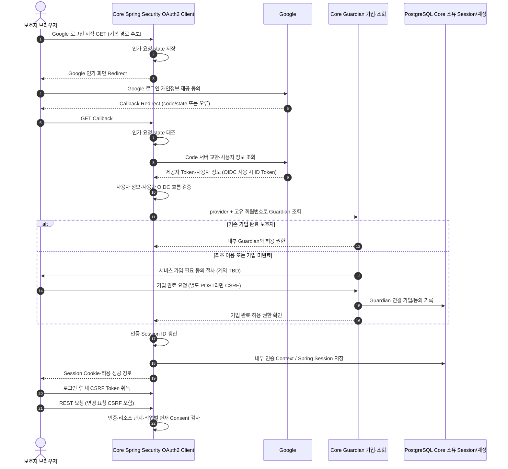
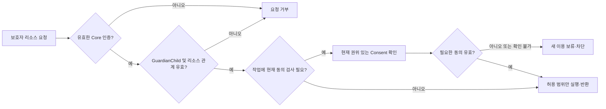
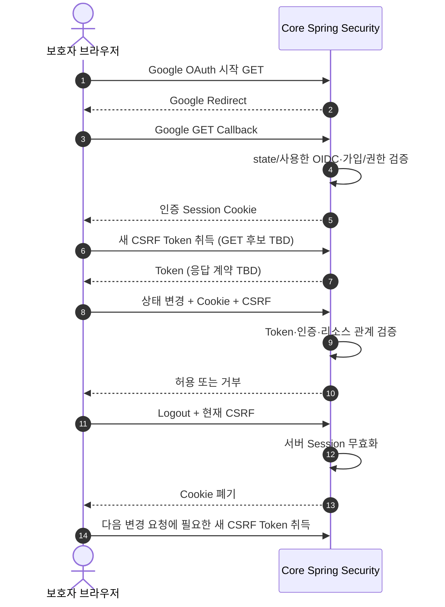
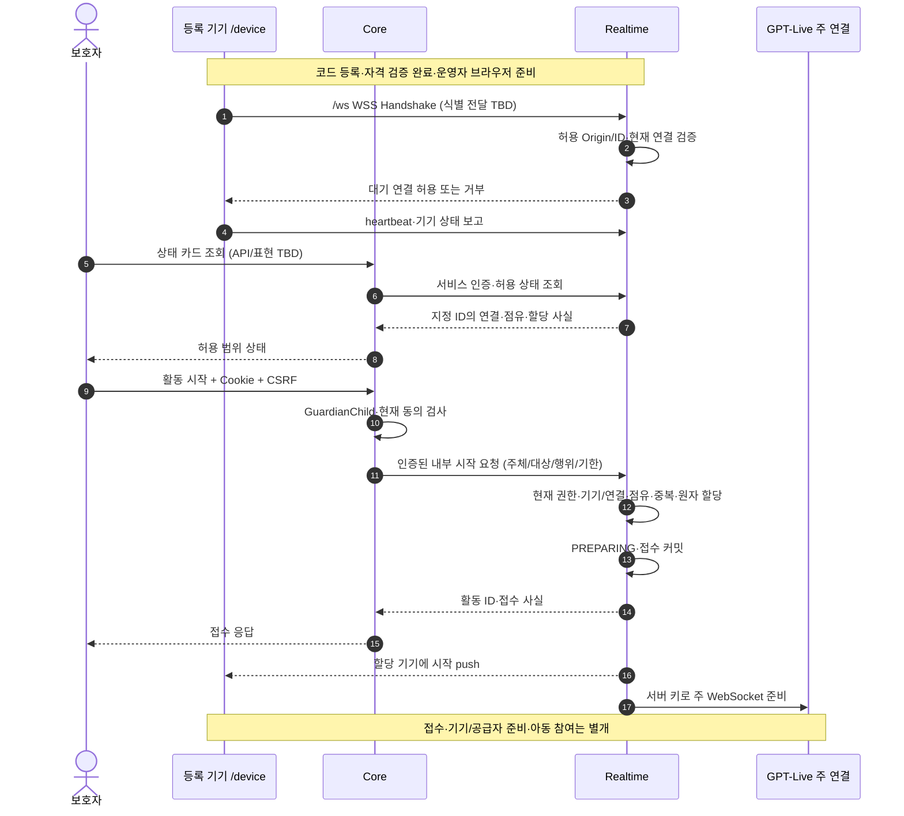

① 개정: A1.5 코드 등록/기기 자격·브라우저 저장 데모 예외·아이 입력 지정 저장과 보호자/기기 통로의 인가 경계를 최소 정합했다.
② 대체: 고정 ID 사전 시드·원음 미저장·브라우저 기기 자격 기본 제외는 이전 선택이다. Google/Session·CSRF·내부 인증·1:1:1과 활동 인가는 유지한다.
③ 남은 TBD: 코드/자격 전달·등록 교체/수명/무효화·원음 담당/삭제·푸시/전사 인가/구독 및 기존 인증/철회 실연동.

# 인증·접근 제어

- 상태: **Proposed 상세 설계**. Google만, 코드 등록/기기 자격 데모, Core/Realtime 두 앱과 릴레이 방향은 최신 사용자 확정이다. Spring Security OAuth2 Client + Spring Session JDBC와 자체 ID/Password 제외는 기존 2026-10-01 Accepted 선택을 유지한다. Endpoint·Scope·필드·시간·상태/사유·운영용 기기 인증의 TBD를 임의 확정하지 않는다.
- 개정 기준: `ref/mujung-architecture-update-audit-v1.1.md` §2·§4.5·§4.6·§5~§8. v0.2 개요·교차검토는 보조 근거이며 사용자 확정 > v0.2 수정 > 기존 비충돌 정책 보존 순서로 적용한다.
- Source of Truth: [ADR-008](../ADR-008-auth-access-control.md#guardian-social-login)은 인증/인가·Session·CSRF·리소스·Origin·데모 한계, [ADR-004](../ADR-004-communication-voice.md)은 WSS/주 연결·게이트·할당, [ADR-005](../ADR-005-session-events-timeouts.md)은 상태/Timeout/종료·복구를 소유한다. auth/consent 모듈 경계와 두 앱 배치는 [ADR-007](../ADR-007-module-boundaries.md)에 반영했다. 실제 패키지·원격 계약·인증 구현은 TBD다.
- 기존 요구사항 FR-A01·A03·A08·B05·B07, D-03·D-08과 첫 볼트의 작은 검증 범위는 비충돌 정책으로 보존한다. 이 문서는 새 제품 UI·DB Enum·API·보안 방식을 확정하는 문서가 아니다.

## 첫 볼트 적용 범위와 문서 연결

| 범위 | 이 문서에서 다룰 내용 |
| --- | --- |
| 이번 구현 방향 | Core Google 가입·서비스 Logout·CSRF, 시험용 아동/관계/현재 동의 검사, 코드 등록/기기 자격·대기 /ws WSS·상태 카드·보호자 시작 push, 활동/현재 연결과 음성·재생 보고 결합, 종료/최소 상태 조회 권한, 내부 호출 인증 |
| 계약 합의·실연동 후 검증 | Google 앱 등록·가입 미완료/완료·Cookie/CSRF·운영용 기기 인증/연결 교체·내부 서비스 방식·진행 중 철회/저장·송신 경합 |
| 후속 | 동의 획득/변경/삭제 전체 UI, 과거 전사·결과·리포트 전체 권한, 실제 기기 등록·영구 페어링·분실 대응 |

요청/응답·WSS 계약은 [protocol.md](protocol.md), 상태 전이는 [session-state.md](session-state.md), 순서는 [sequences.md](sequences.md), Guardian/Session·기기·동의·이벤트 저장은 [data-model.md](data-model.md)로 연결한다. 각 문서에 현행 인증·두 앱 경계를 반영했으며 실제 API·물리 모델·실연동의 TBD는 유지한다.

## 현행 결정과 이전 선택의 관계

Google 로그인은 외부 신원 확인, Core의 Spring Session은 서비스 로그인 유지다. 내부 Guardian 생성·연결과 서비스 가입 완료는 필요하다. 자체 ID/Password 가입·로그인은 계속 제공하지 않는다. JWT + HttpOnly Cookie는 원본 v10의 미채택 대안으로 남긴다. 현재 Google·Session·코드 등록 선택의 확정과 설정/구현 검증은 구분한다. 대체된 3개 로그인·발급·직접 권한의 구체 후보는 아래 이력 절에 보존한다.

## 서로 다른 Context와 앱 소유권

| 대상 | 목적·소유 앱 | 권한 한계 |
| --- | --- | --- |
| 보호자 `/parent` | Core에서 Google·내부 Guardian·서비스 Session | 인증만으로 모든 아동·활동·결과·리포트를 조회하지 못함 |
| 웹 음성 기기 `/device` | Realtime에서 코드 등록 기기/유효 기기 자격·현재 WSS·활동 할당 | 코드·Device 식별·자격은 별개. 데모 연결 ≠ 운영 페어링/물리 소유권 인증. 보호자 API 권한 없음 |
| Core ↔ Realtime | 수신 앱에서 내부 서비스 자격·허용 요청/이벤트 검증 | 서비스 인증은 사용자 인가/현재 동의를 대체하지 않음 |
| GPT-Live 공급자 연결 | Realtime이 서버 키로 주 WebSocket 소유 | 기기에는 공급자 키·세션 생성/제어 권한을 제공하지 않음 |

보호자 Session을 기기 인증으로 승격·복사하지 않는다. 같은 Origin에서 Cookie가 함께 전송돼도 해당 경로의 Context만 사용한다. 데모 허용 대상·연결·Available·Assigned는 별개다. 기기 자격 검증과 활동 인가는 별개이고 Device 식별자 지식만으로 인증을 충족하지 않는다. 데모가 운영 인증 완료인 것은 아니다. Realtime이 ActivitySession을 쓰고 Core는 공개 계약으로 위임/조회한다.

## Google 가입·로그인·로그아웃 설계

그림은 구현안이며 가입 API·미완료 Principal/제한 권한·성공/실패 응답은 TBD다. Google 신원 확인이 서비스 가입이나 활동 동의를 자동 완료하지 않는다. 미완료 Context로 아동/활동 API에 접근하지 못하게 한다.

### Spring 기본 Endpoint 구현 후보

| 용도 | 기존 경로 후보 | 현행 범위 |
| --- | --- | --- |
| 로그인 시작 | `GET /oauth2/authorization/{registrationId}` | `registrationId=google`만. 앱 등록·배포 URI 검증 필요 |
| Callback | `GET /login/oauth2/code/{registrationId}` | Google만, `state`/code·사용한 OIDC 검증 |
| 서비스 계정 조회 | `GET /api/auth/me` | 내부 Guardian 기준, 응답 TBD |
| 서비스 로그아웃 | `POST /api/auth/logout` | CSRF·Session 무효화·Cookie 폐기, 계약 TBD |
| 최초 가입 완료 | 경로·요청/응답 TBD | 외부 신원·내부 가입 연결, 변경 REST CSRF |

자체 자격증명을 받던 `POST /api/auth/login` 후보는 미채택이다. 기본 경로는 원본의 Spring OAuth2 Login 구현 제안을 유지한 것이며 API 확정이 아니다. Callback과 Google 앱의 Redirect URI를 일치시키고 성공/실패 이동은 서버 허용 경로만 사용한다. 임의 외부 URL로 이동시키지 않는다.

### Google 설정과 내부 Guardian

- Google의 Spring 기본 제공자 설정을 활용하는 기존 후보를 유지한다. OAuth/OIDC·Scope·고유 식별자·속성 매핑·Client 인증·공개 조건은 실제 등록/연동으로 확인한다.
- `provider + 제공자 고유 회원번호`는 기존 계정 연결 기준이다. 사용한 OIDC의 검증된 `sub` 등 또는 제공자 사용자 정보 ID를 매핑한다. 물리 필드·제약·필수 프로필은 TBD이며 data-model과 맞춘다.
- 이메일은 없거나 변경될 수 있다. 이메일 일치로 다른 계정을 자동 병합하지 않는다. 추가 계정 연결/해제·탈퇴/재가입·외부 계정 삭제 처리는 TBD다. 이 미결정이 Google 외 로그인 채택을 의미하지 않는다.
- 제공자 개인정보 제공 동의와 서비스 필수/선택 동의는 따로 검사한다. 제공자 Access/Refresh/ID Token을 보호자 API 인증 Cookie/Bearer Token으로 발급하지 않는다.
- Scope를 최소로 정하고 취소·동의 거부·프로필 누락을 처리한다. 자체 비밀번호·Password Hash·재설정 기능을 추가하지 않는다.

### Core Spring Session과 Logout

Spring Session JDBC는 기존 Accepted다. PostgreSQL 물리 1개·앱별 스키마에서 Session·계정은 Core 소유다. **Flyway는 신규 도입이 아니라 기존 채택의 보완**이며 Core Session Migration과 두 앱/스키마의 실행 책임을 맞춘다. 스키마명·DB 역할·권한·Migration 실행 주체/단계는 TBD다. 앱은 호환 스키마를 validate하는 기존 원칙을 유지한다.

보호자 Cookie는 HttpOnly, HTTPS에서 Secure를 적용하고 SameSite=Lax 기본 후보를 유지한다. 이름·Path·Domain·TTL·동시 로그인·만료는 TBD다. Spring Boot의 기존 버전 결정 상태를 유지하고 이 문서에서 마이너/패치를 새로 확정하지 않는다.

우리 로그아웃은 서버 Session 무효화와 Cookie 폐기다. Google 자체 로그아웃·계정 연결 해제·서비스 탈퇴와 구분한다. 재시작/재배포 후 로그인 유지는 DB·Cookie와 OAuth Principal/SecurityContext 직렬화 호환성 검증에 따른다. SecurityContext의 제공자 속성/ID Token 포함과 Authorized Client의 Access/Refresh Token 실제 저장 위치를 확인한다. 내부 Guardian ID·필요 권한 중심의 최소 Principal과 불필요 Token 정리·최소 보관/폐기를 검토한다. 기본 설정만으로 Token이 저장되지 않는다고 보장하지 않는다. 장기 Token 보관·Refresh Token 요구를 자동 확정하지 않는다.

로그아웃·인증 만료·앱 닫힘과 ActivitySession 종료는 별개다. 소멸된 로그인으로 진행 활동을 어떻게 처리할지는 D-03/ADR-005 TBD다. 종료 요청은 유효한 인증/소유권을 검증하며 만료 시 재로그인 후 상태 확인·종료를 한다. 재로그인만으로 종료 활동을 재개하지 않는다.

## 보호자 리소스 접근과 Consent

아동·활동·리포트 ID를 아는 것만으로 접근하지 못한다. `guardian_id`, `child_id`는 원본 관계 저장 후보이며 실제 필드는 TBD다. 동등한 서버 조회 경로로 관계를 확인할 수 있어야 한다. 다른 보호자의 활동 조회/종료/결과 재시도를 거부한다. Core는 공개 보호자 요청을 검증·Realtime에 위임하고 활동 테이블을 직접 UPDATE하지 않는다.

활동 시작·새 처리에는 Cookie/Token의 오래된 동의 주장 대신 현재 DB Consent를 확인한다. **필수 동의가 철회됐어도 인증·소유권이 유효한 종료·동의 상태 확인·최소 종료 상태 조회를 막지 않는 기존 구현안**을 유지한다. 변경 요청 CSRF도 유지한다. 철회 뒤 전사·과거 기록 열람 범위와 기존 로그인 무효화 여부는 D-08/ADR-008 TBD다.

### 철회와 진행 중 활동·비동기 자료

철회 후 이후 수집/이용 중단, 필수 미동의 새 활동 금지, 철회 후 신규·지연 자료 새 저장 금지 원칙을 유지한다. 종료와 기존 기록 삭제는 별개다.

| 구분 | 연결과 남은 결정 |
| --- | --- |
| 새 활동·처리 | 현재 권한/동의 검사, 시작 접수·원자 할당·공급자 준비·철회 경합 시험. 구체 동시성/버전·권한 fence는 TBD |
| 진행 중 철회 | Core가 변경과 Outbox 사실을 로컬 트랜잭션으로 저장·우선 전달. Realtime이 활동 이벤트 경로에서 신규 처리/출력 승인 차단·버퍼/기기 대기열·입출력/공급자 정리. consent/auth가 활동 상태를 직접 바꾸지 않음 |
| 전달 지연 | Outbox 알림만으로 즉시 적용 보장 없음. Realtime·Core Worker가 새 처리/외부 요청/저장/결과 반영 전 현재 이용 가능성을 검사. 확인 불가면 새 이용 보류·차단, 안전 정리는 동의 재확인 실패로 막지 않음 |
| 늦은 전사·완료·저장 | 철회 후 신규/지연 저장 금지. 기존 자료 보존과 새 분석/열람 권한 구분. 효력 기준·저장/송신 경합·취소 효과·파생 결과 처리 G-03/D-08 TBD |
| 로그인·조회·삭제 | Session 무효화·철회 후 열람·연쇄 삭제 TBD. 철회를 특정 최종 상태나 `guardian_stop`으로 임의 매핑하지 않음 |

단순 조회 후 INSERT로 경합 해결을 선언하지 않는다. 동일 DB 권한 fence 또는 동등한 원자성 계약과 효력 시각을 정해야 한다. 기존 자료·스냅샷·Outbox/Inbox 삭제/재전송도 정책 대상이다. 첫 볼트 전체 동의 UI는 후속이며 합의한 시험 데이터의 변경·현재 상태 재검사를 검증한다.

## CSRF와 Google Callback

브라우저 Cookie 변경 REST(`POST/PUT/PATCH/DELETE`)는 CSRF 보호를 적용한다. 서비스 Logout·가입 완료·활동 시작/종료·결과 재시도·아동 수정·동의 변경/삭제를 포함한다. SameSite=Lax만으로 보호 완료를 선언하거나 개발 편의를 위해 전체 CSRF를 끄지 않는다.

Google 인가 시작·GET Callback에는 일반 REST CSRF Header를 요구하지 않는다. 인가 요청/state의 누락·변조·재사용·만료를 검증하고 OIDC 사용 시 ID Token 서명·issuer·audience·만료·사용한 nonce 일치를 검증한다. OAuth 시작 전에 REST CSRF Token을 반드시 취득한다고 가정하지 않는다.

**기존 보호자 구현 제안:** Session 기반 CSRF 저장소, 접근 가능한 GET의 응답 본문 Token, 변경 요청 Header 전달. 경로·필드·Header·가입 미완료 Context와 예외는 TBD다. Token 취득은 인증/발급/활동 권한을 부여하지 않으며 인증 Cookie는 HttpOnly다.

인증/로그아웃 뒤 이전 CSRF Token이 정리되는 Spring Security 흐름과 새 Token 취득을 선택한 버전에서 시험한다. SPA 저장·노출·검증, FilterChain/Matcher와 예외는 TBD다. 오류 후 변경 요청을 무조건 자동 재전송하지 않고 현재 상태/멱등성을 확인한다. WSS Handshake에 REST Header를 그대로 적용하지 않으며 운영 기기 인증·추가 Token/전달·만료/폐기는 별도 TBD다. 보호자 소셜 로그인은 기기 대기 연결의 선행 조건이 아니다.

## 코드 등록 `/device`와 Realtime `/ws` WSS

서버 코드 발급→테스트 기기 웹 표시→보호자 Session/CSRF·현재 계정 아이 인가/코드 확인→아이–기기 연결→기기 자격 발급→대기 WSS로 준비한다. 등록 코드/Device 식별/자격·대기 등록 연결 대응/수신 주체는 ADR-008/protocol의 TBD다. 아동에게 코드 입력을 요구하지 않고 보호자가 입력한다. 코드 화면은 테스트 웹 한정이며 QR claim은 미채택이다.

새 등록 성공 후 이전 관계를 해제하고 구 자격을 차단한다. 실패/타 계정 코드로 기존 정상 기기를 먼저 해제하거나 서버가 브라우저 데이터 삭제를 감지한다고 가정하지 않는다. 열린 WSS·늦은 보고·활동 중 교체·원자성/복구·운영 인증은 TBD다. 데모 연결은 운영 페어링/물리 소유권 인증이 아니다.

상태 조회는 예약이 아니다. 계정 아이에 등록된 기기의 허용/유효 자격·현재 유효 WSS/heartbeat·점유·이번 활동의 할당 가능성을 시작 시 다시 확인한다. 전체 Available 수를 전역 규칙으로 삼지 않는다. 같은 ID 중복 연결·연결 교체·동시 시작 경합·해제 처리는 TBD다. 기기 대기 WSS와 유료 공급자 연결 수명은 별개다.

### 연결 후 음성·제어·재생 보고의 결합

Realtime은 음성 입력·ACK·기기 상태·실제 재생 보고를 해당 등록 기기/자격·현재 연결·ActivitySession 할당·최신 작업 및 현재 권한과 대조한다. 기기는 공급자 이벤트/명령을 직접 소유하지 않으며 참여·발화 의미/종료의 최종 판정은 서버가 한다. 구 연결의 준비나 재연결·늦은 ACK로 종료 활동을 ACTIVE로 되돌리지 않는다.

| 경계 | 검증 계약 |
| --- | --- |
| 입력 음성 | 현재 연결·활동 할당·상태/동의·허용 사용 확인 후 Realtime이 GPT-Live 입력에 전달 |
| 출력 승인/송신 | 앱 구간 분할·전사 대응·상태/권한/최신성 및 필요한 경량 의미 검사→동일 음성 승인→송신 직전 현재 조건 재확인. 실패/누락/시간초과 폐기·대체 안내 |
| 취소/철회 | 끼어들기·쉬기·종료·철회 구분, 서버 버퍼·기기 대기열 정리와 늦은 승인 무효. 끼어들기 자체는 자동 ENDING 아님 |
| playbackMark | 기기 플레이어가 관측한 실제 재생 범위를 활동·현재 연결·승인 음성/재생 묶음과 결합. 생성·승인·송신·수신 ACK는 재생 증거 아님 |
| 지연/중복/보고 불가 | 중복·역전·구 연결·작업 변경을 검증. 늦은 보고로 취소 출력/종료 활동 부활 금지. 마지막 신뢰 관측과 미확인 범위 보존, 완전 재생 성공으로 채우지 않음 |

playbackMark 필드명·위치 단위·주기·중단/완료 송신·늦은 보고와 신뢰 범위는 protocol 계약의 TBD다. 보고는 아동 청취/이해를 증명하지 않고 공급자 맥락 삭제도 아니다. 차단/미전달 음성은 모델 맥락에 남으며 앱 교정·ACK와 재생 승인은 ADR-004의 별도 경계다.

### 권한 상실·연결 정리

운영 인증/연결 권한 만료·폐기가 감지되면 새 작업/승인을 막고 기기 가용 후보에서 제외하며 활동 이벤트 경로로 안전 정리한다. 서버가 현재 이용 가능성을 확인할 수 없으면 새 이용을 보류·차단한다. 감지·전파·갱신·재연결·정리 보고 수신 순서·WS 종료 코드·Timeout/최종 사유는 TBD다.

WSS를 닫았다는 사실은 기기 입력/출력 실제 정지와 공급자 종료를 증명하지 않는다. 서버 최종 상태·기기 정리·공급자 정리를 각각 확인하며 미확인을 성공으로 채우지 않는다. 인증/소유권이 유효한 보호자의 최소 상태 재조회 계약을 유지한다. auth가 ActivitySession을 직접 변경하거나 ADR-005 시간값을 새 숫자로 바꾸지 않는다.

## Core ↔ Realtime 내부 서비스 신뢰

내부 즉시 명령/조회는 HTTP, 영속 작업 요청/완료·정책 변경 사실은 Transactional Outbox + 내부 HTTP Sender + 수신 멱등성/Inbox다. Broker는 추가하지 않는다. 즉시 STOP을 일반 Core Worker 대기열에 넣지 않는다. Endpoint·DTO·인증 방식·키 주입/회전·한도/기한은 TBD다.

1. 수신 앱은 내부 서비스 자격·허용 호출·대상·요청 크기/범위를 검증한다. 내부 네트워크/Docker DNS만으로 신뢰하지 않는다. 내부 경로는 공개 진입에서 차단하고 수신 앱도 검증한다.
2. Core가 검증한 주체·행위·대상·기한을 전달하며 Realtime은 활동/기기/주체 결합·현재 권한을 대조한다. 브라우저 `X-Guardian-Id` 등을 검증 없이 내부 주체로 승격하지 않는다.
3. 발신자의 업무+Outbox 로컬 커밋, 수신 업무 또는 Inbox 영속 커밋 뒤 ACK와 처리완료 원자 반영을 지킨다. 수신 ACK는 업무 완료가 아니다.
4. 논리 requestId/eventId·상태/stream 버전·활동 작업/결과 run·정책 버전은 목적별로 구분한다. 중복·역전·오래된 권한/실행을 검증하고 실제 wire/물리 필드는 TBD다. 서비스 인증이나 eventId 지식이 사용자 인가를 대신하지 않는다.
5. 각 앱은 자신의 스키마·업무/Outbox/Inbox를 쓰며 상대 Repository를 직접 수정하지 않는다. 결과 run의 현재 권한과 입력을 검증하고 결과 완료로 종료 활동을 부활시키지 않는다.

Core 장애 시 보호자의 새 종료 요청은 기존 Core 경유 경로로 전달되지 않는다. 승인 콘텐츠/현재 권한을 확인할 수 없으면 새 진행을 멈추는 원칙을 유지한다. 안전 정리와 영속 종료 사실은 별개다. 보호자 직접 Realtime 종료는 별도 인가 설계·수용 결정이 필요한 **G-02 미채택 대안**이다. 이를 위해 Realtime이 보호자 Cookie를 자동 수용하거나 새 Endpoint를 만들지 않는다.

## 첫 볼트 API·채널 접근표 — 후보 계약

경로는 protocol의 기존 후보다. 확정 API/WS 계약으로 해석하지 않는다. 표의 기기는 통제 데모 허용 대상/현재 연결이며 운영용 인증 완료를 뜻하지 않는다.

| 요청 후보/채널 | Context·앱 | 검증 |
| --- | --- | --- |
| CSRF 취득 GET, 경로 TBD | Core 보호자·가입 미완료 필요 범위 | Token 취득 자체 인증/업무 권한 없음. Context·응답 TBD |
| `GET /oauth2/authorization/{registrationId}` | Core, 로그인 전 | google만·인가 요청/state 보관; 일반 REST CSRF Header 불필요 |
| `GET /login/oauth2/code/{registrationId}` | Core, Google Callback | state·사용한 OIDC·code 교환·가입/권한 확인. 오류/취소를 인증 성공으로 처리 안 함 |
| 가입 완료 POST, 경로 TBD | Core 검증된 미완료 Context | CSRF·가입 완료 조건·권한 제한 |
| `POST /api/auth/logout` | Core 보호자 | CSRF·서버 Session 무효화/Cookie 폐기; 만료 정리 응답 TBD |
| `GET /api/auth/me` | Core 보호자 | 내부 Guardian만, 미인증 표현 TBD |
| 아동·현재 동의 GET 후보 | Core 보호자 | 소유/관계, 미동의 자체로 동의 확인 차단 안 함 |
| 기기 상태 카드 조회, 경로 TBD | Core 보호자→Realtime 내부 조회 | 허용 범위·서비스 인증·지정 ID 현재 연결/점유/할당, 조회는 예약 아님 |
| `POST /api/children/{childId}/free-talk/sessions` | Core 보호자→Realtime 내부 명령 | CSRF·관계/현재 동의·주체/대상·중복·지정 기기 원자 할당 |
| `GET /api/sessions/{sessionId}` | Core 보호자→Realtime 허용 조회 | 소유권·최소 상태/종료 사실/사유·정리 확인, 전사 열람 후속 |
| `POST /api/sessions/{sessionId}/cancel`, `/stop` | Core 보호자→Realtime 즉시 명령 | CSRF·소유권·허용 상태·중복. 필수 철회 자체로 종료 거부 안 함 |
| 기기 `/ws` WSS Handshake | Realtime | 허용 Origin·등록 기기/유효 자격·현재 연결, 자격 전달/검증/만료·오류 TBD |
| 기기 음성·상태/재생 보고 | Realtime 현재 할당 기기 | 연결/활동/최신 작업·현재 권한, 중복/늦은 보고·승인과 실제 재생 구분 |
| 내부 HTTP 명령/조회·Outbox 이벤트 | 수신 Core/Realtime 서비스 | 서비스 자격·허용 호출·주체/대상/행위·현재 권한·기한·중복/버전, 공개 진입 차단 |

WSS에 REST의 CSRF Header 방식을 그대로 가정하지 않는다. 추가 Token 필요성·전달 방식은 TBD이며 URL에 Credential을 싣는 기본안을 추가하지 않는다. 시작 전 준비 화면 취소는 로컬 동작, 접수 후 PREPARING cancel과 별개다. 동의/삭제·결과/리포트 전체 권한은 후속이며 이 표로 전체 보호 완료를 선언하지 않는다.

## SecurityFilterChain·Cookie·오류 설정표

| 구현 항목 | 현재 상태 |
| --- | --- |
| Core 보호자 가입/Login·Session | Google만 최신 확정, OAuth2 Client + Session JDBC 기존 Accepted, 자체 ID/Password 제외 |
| Google 등록/Scope/식별자/Callback | 기본 경로 후보, 앱 등록·OIDC·매핑·URI·성공/실패 응답 TBD |
| Guardian·가입/탈퇴 | provider+고유 ID 기존 기준, 필드·가입 완료·추가 연결·탈퇴/재가입 TBD |
| Principal·Authorized Client/Token | 직렬화·실제 보관 위치·최소 보관/폐기·재배포 호환성 검증 |
| 보호자 Cookie/Session | 이름·범위·TTL·동시 로그인 TBD, HttpOnly/HTTPS Secure·SameSite=Lax 기존 후보 |
| Session Migration | 기존 Flyway 보완, Core 소유 스키마·실행 책임/권한·만료/Logout 시험 TBD |
| CSRF | Session 저장/GET 응답/Header 기존 제안, Token 갱신·미완료 Context·예외/실패 TBD |
| 코드 등록 기기 | 등록 코드·Device 식별/기기 자격·WSS/등록 연결 대응·자격 수신·교체/만료/폐기·Origin/중복 연결·원자 할당은 TBD. 운영 페어링 인증 아님 |
| 운영 기기 인증/권한 상실 | 실제 인증·저장/전달·감지/폐기/갱신·안전 정리/보고 순서 TBD |
| 내부 서비스 인증 | 수신 앱 자격·허용 호출·공개 차단은 원칙, 방식·키/회전·DTO/기한 TBD |
| 철회·현재 이용 | 새 이용/신규·지연 저장 차단, 효력/경합 G-03·D-08 및 상태/사유 TBD |
| FilterChain/Matcher | Core 보호자·Realtime 기기·각 앱 내부 경로 분리/검증, 상세 TBD |
| REST/WS 오류 | 기존 ProblemDetail + 서비스 Code 후보, Code Registry·WS/내부 응답 TBD |

기존 REST 실패 후보는 인증 없음/만료 `401`, 권한·CSRF 거부 `403`, 존재 은닉 `404`다. 보호자 REST를 HTML 로그인 화면으로 리다이렉트하지 않는 기존 안을 검증한다. 동의·할당·상태 충돌의 HTTP Status/서비스 Code·WS 거부/종료는 TBD다. 오류는 비밀·다른 계정 리소스 내용을 노출하지 않는다. 내부 실패/미확인을 자동 업무 성공으로 응답하지 않는다.

## Secret·브라우저 저장·로그·원음

보호자 알림은 sessionId·상태만인 재조회 힌트이고 기기 START·전사와 별개다. 앱 진입/복귀/재연결/클릭 때 현재 Session·계정 관계/리소스 권한을 확인해 최신 상태를 조회한다. 조회 실패는 마지막 확인 시각/미확인으로 표시하며 ID만으로 인가하지 않는다. 전사는 아이 입력 및 게이트 통과/기기 전달 AI 출력만 현재 허용 보호자에게 제공한다. 경로/구독·세션 없는 삭제 알림/로그아웃·삭제 뒤 구독은 protocol 연결/TBD다.

Realtime의 GPT-Live API(`gpt-live-1`) 서버 주 WebSocket 키와 Core의 Google Client Secret·DB Password·Session/내부 서비스 Secret은 브라우저 Bundle·JavaScript 상수·Git·일반 로그에 두지 않는다. 서버 Secret 관리/환경 주입의 구체 구현은 TBD다. 기기는 공급자 연결/명령 자격을 받지 않는다. 제공자 Token과 서비스 Session은 구분한다.

보호자 Session Cookie는 HttpOnly를 유지한다. 기기 자격 브라우저 저장은 ADR-008의 테스트 웹 데모 예외이며 서버 Secret/보호자·공급자 토큰에는 적용하지 않는다. 보관 정보·수명·새 등록/폐기·로그아웃/계정 삭제 때 무효화/정리는 TBD이고 운영 제품 보안으로 인정하지 않는다. 공개 Device 식별자는 자격이 아니다.

로그는 필요한 식별자·성공/실패·시간·Origin만 최소로 남긴다. Password, Cookie·JWT/ID Token·Session ID 전체, OAuth Code·state·nonce·Client Secret·Access/Refresh Token·API Key·내부 자격을 출력하지 않는다. 실제 아동 발화 원문도 일반 로그에 출력하지 않는다.

허용된 아이 입력만 지정 원음 저장소에 필수 동의로 계정 삭제까지 보관하고 DB 메타데이터만 둔다. AI 출력 버퍼는 메모리 전용이며 DB 바이트·Outbox/Inbox·일반 로그·임시 디스크 우회를 금지한다. 계정 삭제는 원음/메타데이터를 포함하고 저장 소유/완료/부분 실패·삭제 중 늦은 저장·참여 전 포함은 data-model TBD다. 대기 주변 음성의 상시 수집을 추가하지 않는다.

## 대체된 이전 선택·미채택 대안 — 현행 지시 아님

**대체된 이전 선택 — A1.5:** 고정 ID 사전 시드·원음 미저장은 코드 등록/기기 자격·아이 입력 지정 저장으로 대체됐고 기기 자격 브라우저 저장은 데모 예외다. Device ID는 유지하되 인증 자격으로 쓰지 않는다.

- **3개 로그인 이력:** 2026-10-01 원본은 카카오·구글·네이버를 선택했다. `google/kakao/naver` registration 값·기본 인가/콜백 경로, 카카오·네이버 제공자 등록/사용자 속성 매핑·Client 인증·Scope·Redirect, 네이버 공개 검수와 세 제공자의 성공/취소/오류·계정·시험 순서/공개 검수를 준비했다. 최신 Google만 결정이 Google 외 설정·콜백·매핑·검수/시험 범위를 대체한다. 내부 Guardian·Session·CSRF·Logout·동의는 유지한다.
- **기기 발급 이력:** `/device` 단기 인증 Cookie·운영자 일회용 발급 코드는 코드 유효/만료/미사용과 환경/Origin/CSRF 검증, 원자 소모·Credential 발급, Handshake 검증을 제안했다. 코드/비밀을 Bundle·URL·로그에 두지 않고 보호자 Cookie를 승격하지 않는 원칙이 있었다. 발급/갱신 POST·Cookie 이름/TTL/Path/Domain·코드 전달/보관·실패 제한·폐기/재인증은 미정이었다. 당시 고정 ID 시드·대기 WSS가 발급 흐름을 대체했다. A1.5 현행 코드 등록은 별도 계약이며 구형 Cookie/운영자 발급을 재채택하지 않는다.
- **전역 가용성 이력:** Available 0개 차단·1개 사용·2개 이상 차단은 지정 ID의 허용·연결·점유·원자 할당 검사로 대체됐다. 전역 다중 사용자 정책이 아니다.
- **공급자 직접 권한 이력:** 기기의 직접 WebRTC·SDP Relay·브라우저 Data Channel·서버 Sideband, `/api/device/sessions/{sessionId}/rtc` HTTP 후보와 Cookie/CSRF 검증·기기 공급자 준비/종료 보고는 Realtime 소유 주 WebSocket·기기 WSS로 대체됐다. 브라우저 임시 키·Ephemeral은 현행 권한 경로로 추가하지 않는다.
- **JWT·인증 제품:** v10의 JWT + HttpOnly Cookie, Auth0·Keycloak 등의 서비스 통합, 자체 ID/Password+소셜 병행은 미채택 대안이다. Session과 JWT 병행 또는 별도 인증 서버를 이번 단계에 추가하지 않는다.
- **실제품 페어링 후보:** 운영 인증서·물리 소유권 검증·QR Pairing은 후속 검토 후보이며 현행 코드 등록/기기 자격이 운영 인증/QR claim 채택을 뜻하지 않는다.

원본 참고 링크는 문서 이력으로 보존한다: 2026-10-01 확인으로 기록한 [Spring OAuth2 Login](https://docs.spring.io/spring-security/reference/servlet/oauth2/login/core.html), [기본 인가/Callback 구성](https://docs.spring.io/spring-security/reference/servlet/oauth2/login/advanced.html), [Spring CSRF](https://docs.spring.io/spring-security/reference/servlet/exploits/csrf.html), 장기 연결 재검사 참고 [OWASP WebSocket 지침](https://cheatsheetseries.owasp.org/cheatsheets/WebSocket_Security_Cheat_Sheet.html). 이 링크는 이번 개정의 별도 기준이나 새 실연동 검증으로 사용하지 않았다.

## 첫 볼트 확인 항목

현재 모두 **미검증**이다. 기존 first-bolt의 인증 영역을 현행 방향에 맞추며 기대값 합의가 필요한 계약은 합의 전 통과로 기록하지 않는다.

- [ ] Google 앱 등록·Callback URI·Scope·사용한 OAuth/OIDC 매핑, 성공/취소/오류/동의 거부/프로필 누락·state/nonce·허용 Redirect 검증
- [ ] 기존 Guardian·최초 가입 완료/미완료 접근·provider+고유 ID 중복 방지, 이메일 자동 병합 금지
- [ ] OAuth GET에 REST CSRF Header 요구 안 함, 변경 REST/Logout Token 누락/변조 거부와 인증/Logout 후 갱신·Session 만료/무효화
- [ ] Core Session Flyway·스키마/쓰기 권한·Migration 실행 책임·재시작·Principal 직렬화·Authorized Client 실제 보관·Token 폐기
- [ ] 두 보호자 아동/활동/결과 권한 격리, 기기/내부 Context로 보호자 권한 취득 차단·해당 경로 Cookie 사용
- [ ] 필수 미동의/철회 시작 차단, 유효 종료·현재 동의·최소 상태 확인 허용, 시작/철회 경합
- [ ] 코드 등록/기기 자격·허용 Origin/현재 연결·heartbeat·점유·원자 할당·중복 연결/교체·상태 카드/시작 push
- [ ] 미할당/타 활동/종료 활동·구 연결 음성/보고 차단, ACK·준비·실제 재생 구분과 playbackMark 중복/역전/늦은/보고 불가
- [ ] 게이트 상태/권한/최신성·동일 음성 승인/송신 직전 재검사·취소 뒤 늦은 승인 폐기, 실제 중단 확인과 활동 부활 금지
- [ ] 운영용 인증 방식·권한 상실·만료/폐기·재연결/갱신·정리 보고 순서의 상세 합의 후 시험
- [ ] 내부 경로 공개 차단·각 앱 서비스 인증·검증된 주체/행위/대상/기한·현재 권한, request/event 중복·영속 Inbox ACK 시험
- [ ] G-03/D-08 철회 효력·신규/지연 저장·송신 경합·중간 자료/삭제·재전송, 전체 동의 UI 완료와 구분
- [ ] 브라우저/로그 비밀 미노출, 아이 입력 지정 저장/삭제·AI 출력 버퍼 비영속·우회 저장 금지와 인증 오류/최소 상태 재확인
- [ ] Core 장애 제어 G-02의 의존 확인; 직접 Realtime 보호자 종료는 미채택·미확정

## Pending

- [x] Google만 최신 사용자 확정; 기존 OAuth2 Client + Spring Session JDBC·자체 ID/Password 제외 유지
- [x] 코드 등록/기기 자격·대기 WSS·상태 카드·보호자 시작 push, Realtime 서버 키·주 연결 방향
- [ ] Google 앱 등록/Scope/OIDC·매핑/Redirect·공개 조건·시험 계정과 로그인/가입 응답
- [ ] Guardian 필드·가입 미완료/완료·계정 연결/해제·탈퇴/재가입
- [ ] Principal/Authorized Client·Token 최소 보관/폐기, Core Session Flyway/스키마·만료/재시작·Logout
- [ ] Cookie/CSRF 취득·필드/Header/저장·갱신·FilterChain/Matcher·실패 응답
- [ ] 코드/Device 식별/기기 자격·등록 연결 대응/수신 전달·Origin·현재 연결/중복/교체·점유/할당·상태 카드 조회 계약
- [ ] 기기 운영 인증·비밀/권한 만료/폐기/갱신·재연결·안전 정리·Timeout/최종 사유
- [ ] playbackMark 대상/필드/위치 단위/주기·늦은/미보고·신뢰 범위
- [ ] 앱 간 서비스 인증/키 주입·회전·주체/대상·Endpoint/DTO/기한·영속 전달/중복
- [ ] Consent 철회 때 서비스 Session 처리, 효력/저장·송신 경합 G-03·D-08·이전 자료 분석/열람/삭제
- [ ] 보호자 로그아웃/만료 진행 활동 D-03, Core 장애 제어 G-02(직접 경로 미채택)
- [ ] 실제 운영 기기 등록/페어링·Credential 회전/폐기·분실 대응

## 문서 연결 상태와 남은 구현

- **data-model·result-pipeline:** Core Session/Guardian/Consent와 Realtime 기기/활동·전사/재생 참조의 스키마/쓰기 소유권·Flyway, Outbox/Inbox·결과 run·현재 권한/철회·삭제/재전송의 논리 계약을 반영했다. 실제 물리 필드·원자성·보존 상세와 구현/검증은 TBD다.
- **ADR-007·system-architecture:** Core 보호자 인증, Realtime 기기/활동, 수신 앱 내부 검증·Repository 경계·아이 입력 지정 저장/AI 출력 비영속을 실행/모듈 경계에 반영했다. 실제 설정·구현·검증은 TBD다.
- **ADR-006·first-bolt·decision-log/README:** 공개/내부 라우팅·Secret 주입·Migration, Google·대기 기기·게이트/관측·현재 권한·Core 장애/철회의 문서 책임·시험 계획·목록을 반영했다. 구형 로그인·단일 서버·기기 발급/직접 연결 시험은 현행 시험 계획으로 대체했으며, 실제 설정·실연동/측정은 TBD다.
