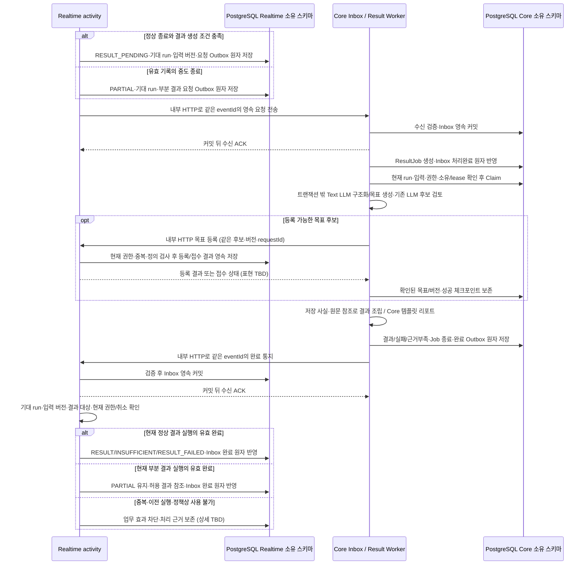

① 개정: A1.5 아이 입력 지정 저장/삭제 전제와 활동별 결과 정리·기간 PDF 생성의 구분을 관련 조항에 최소 정합했다.
② 대체: 원음 영속 미저장·§12 미채택 설명은 이전 선택이다. Core Worker/목표 검토·경험 구조화·부분 결과·Java Template·11단계 AI 역할은 유지한다.
③ 남은 TBD: 원음 담당/메타데이터 소유/완료/삭제 경합·기간/원문/인가·템플릿/PDF 실제 구현과 기존 run/재시도/품질/실측.

# 결과 생성 파이프라인

- 상태: **Proposed — Core 내부 Worker·앱 간 영속 전달·유효 기록의 부분 결과 방향은 반영, 구현·품질·성능은 미검증**. 작업 Claim·lease·단계 저장·자동 재시도 수치는 아래 구현 후보로 구분한다.
- 이번 개정은 [AI 역할 부록 A1.4](../../ref/audit-addendum-ai-roles.md)의 변경 범위를 우선하고 나머지는 [audit v1.1](../../ref/mujung-architecture-update-audit-v1.1.md) §§2·3·7·8을 따른다. v0.2는 결과·전달·복구의 보조 근거다. 원본 비충돌 정책·기능/요구사항 번호는 이력으로 보존하며 외부 명세 검증이나 구현 완료의 증거로 쓰지 않는다.
- Source of Truth: 활동 상태·종료·부분 결과는 [ADR-005](../ADR-005-session-events-timeouts.md)와 [session-state.md](session-state.md), 앱 간 전달은 [ADR-010](../ADR-010-durable-delivery.md)과 [protocol.md](protocol.md), 앱별 스키마·쓰기 소유권과 논리 정보는 [data-model.md](data-model.md), 기술 기본값은 [ADR-002](../ADR-002-technology-defaults.md)를 따른다. [ADR-007](../ADR-007-module-boundaries.md)의 기존 도메인/Port 원칙은 보존하고 두 앱 배치·원격 계약의 문서 경계를 반영했다. 실제 Port·Endpoint/DTO와 구현·검증은 TBD다.
- GPT-Live API(`gpt-live-1`) 실시간 음성·전사·게이트는 Realtime 책임이다. Core의 경험 구조화·목표 생성은 Text LLM 생성, 목표 후보 의미 검토는 기존 LlmJudgmentEngine의 MVP 기본 경로, 리포트는 Core Java Template/PDF 기본 경로로 구분한다([ADR-011](../ADR-011-judgment-engine.md)). 음성 대화 Context와 섞지 않으며 지시문·프롬프트·판정 기준 원문은 동료 명세 파일·버전 TBD다.
- 2026-10-02 목표 생성 보완의 기능 참조: `무중_기능명세서_최종.md`의 SYS-STRUCT-001·SYS-RECO-001·SYS-PRAC-001·SYS-EVAL-001, `요구사항 명세서 v1.0.xlsx`의 FR-C02·F05~F10. 원본에 기록된 파일명/변경이력 차이(v1.0 파일명·v1.1 이력)는 당시 이력으로 보존한다. [목표 생성 계약](#goal-generation-contract)의 동적 행동·근거·4요소·버전 정책은 유지한다.

## 첫 볼트와 후속 구현의 경계

[first-bolt.md](first-bolt.md)의 작은 연결·참여·중도 종료·최소 기록 흐름과, 아래 ResultJob·Text LLM 경험 구조화/목표 생성·의미 검토·저장 사실 결과/리포트의 개발 순서를 구분한다. **유효한 활동 기록이면 부분 결과를 제공하는 제품 요구는 유지한다.** 첫 볼트에서 전체 결과 파이프라인을 아직 구현하지 않는 범위 선택은 기능을 제품 전체에서 제외하거나 미정으로 되돌리는 근거가 아니다. 첫 볼트 문서에 두 앱·릴레이 시험 계획을 반영했으며 실제 시험·측정은 미실시다.

| 범위 | 처리와 보호자 표시 |
| --- | --- |
| 첫 볼트의 좁은 구현 범위: 참여 후 보호자 종료 | `ACTIVE → ENDING → PARTIAL`. 종료 사실·사유와 실제 출력 중단 확인을 구분하여 조회. 합의한 보존 범위의 최소 전사·콘텐츠 버전·상태 근거만 저장하며, 전체 ResultJob/AI 결과 파이프라인은 아직 구현하지 않은 것으로 표시 |
| 시작 전 미참여 | `DECLINED` 또는 `CANCELLED`의 조건은 ADR-005/참여 계약에 따름. 종료 사실·시각만 보존하고 응답 원문·결과·추천을 만들지 않음(FR-F11) |
| 기술 오류 | `ERROR`와 최소 종료 근거를 처리. 중단 전 기록은 허용된 D-08 범위에 따르며 오류를 아동의 평가·결과 실패로 바꾸지 않음 |
| 결과 생성 조건을 충족한 정상 종료 | 정리 확인 뒤 `ENDING → RESULT_PENDING`. Realtime의 기대 결과 실행·요청 Outbox와 Core ResultJob으로 연결 |
| 유효 기록이 있는 중도 종료 | 활동은 `ENDING → PARTIAL`로 종결. 별도 Core 부분 결과의 준비·실패·재시도와 Realtime의 허용 결과 참조를 연결. `PARTIAL` 자체는 산출물 준비 완료가 아님 |
| 후속 연습·리포트 | 첫 반응·도움·도움 후 반응·새 상황 기록을 구분하여 유형별 입력·출력·작업 단계를 구현. 자유대화 단계들을 모든 활동에 그대로 적용하지 않음 |

미구현 산출물을 가짜 `RESULT`/`RESULT_PENDING`이나 생성된 요약으로 반환하지 않는다. 첫 볼트가 조회하는 최소 종료 사실은 AI 결과 산출물이 아니며, 유효 기록의 부분 결과 전체 구현은 미구현으로 드러낸다. Worker·DB의 완료 상태는 실제 음성 중단 증거가 아니다. 실제 제공·중단·미확인은 [session-state.md](session-state.md)·[protocol.md](protocol.md)를 따른다. 표시를 위해 새 ActivitySession DB Enum을 자동 추가하지 않는다.

### 결과 작업 생성 조건 — 방향과 구현 계약

- Realtime `activity`가 현재 상태·종료 종류·활동 종류·유효 기록·자료 이용 허용을 확인하여 필요한 정상 또는 부분 결과를 요청한다. **모든 종료 이벤트에서 같은 작업을 생성하지 않는다.** 미참여·미저장 기록에 없는 전사·추천을 만들어 넣지 않는다.
- 정상 종료는 정리 확인을 거친 `RESULT_PENDING` 변경, 기대 결과 run과 입력 버전, 결과 요청 Outbox를 Realtime의 같은 로컬 트랜잭션으로 저장한다. `ACTIVE → RESULT_PENDING`으로 `ENDING`과 정리를 생략하지 않는다.
- 중도 종료의 유효 기록은 `PARTIAL` 활동 종결과 기대 결과 run·부분 결과 요청 Outbox를 같은 로컬 트랜잭션으로 연결한다. 결과 준비 때문에 `PARTIAL`을 `RESULT_PENDING`·`RESULT`·`ACTIVE`로 바꾸지 않는다. 요청/준비/실패를 조합하는 구체 필드·API는 TBD다.
- Core는 영속 Inbox 수신 또는 접수/Job 업무 변경을 커밋한 뒤 수신 ACK를 보낸다. 후처리이면 ResultJob 생성과 Inbox 처리완료를 같은 트랜잭션으로 반영해 중복 Job을 막는다. 발신 Outbox 재전송은 새로운 결과 run·새 LLM 호출 사유가 아니다.
- 작업 생성·입력 조회·선점·외부 호출·저장·등록·결과 반영 전 현재 동의/권한·삭제/취소·버전을 검사한다. 확인 불가 시 새 이용을 보류·차단한다. 철회 후 신규·지연 자료의 새 저장을 허용하지 않으며, 효력 시각과 검사/저장 경합의 원자성은 G-03의 TBD다.

MVP는 보호자 계정1:아이1:기기1이며 기록·리포트·목표는 그 아이 기준이다. 계정의 아이/연결 기기와 활동에 기록된 child/device를 대조하고 다른 아이를 선택하는 요청으로 범위를 넓히지 않는다. 이 데모 연결은 A1.5 코드 등록/기기 자격을 사용하며 운영 페어링 인증이 아니다. 기존 Core/Realtime 소유권은 유지하고 실제 관계 제약·참조 구현은 [data-model.md](data-model.md)의 TBD다.

## 후속 자유대화 결과 처리 흐름

상시 Spring 앱은 Core와 Realtime 두 개다. **Result Worker·Outbox Sender·Inbox Processor는 각 소유 앱 내부 작업이며, Result Worker를 세 번째 Spring으로 분리하지 않는다.** PostgreSQL은 물리 1개지만 앱별 소유 스키마/쓰기 권한을 따른다. 아래 식별자·이벤트명은 논리 계약이며 물리 컬럼·Endpoint·DTO 확정이 아니다.



Core `result`가 ResultJob·Worker·산출물·결과 준비/실패를 소유하고 Realtime `activity`가 ActivitySession·기대 run·결과 참조를 소유한다. Core는 Realtime ActivitySession이나 `practice` Repository를 직접 변경하지 않는다. 기존 Port 소유/Adapter 원칙은 유지하되, JVM 간 요청/완료는 내부 HTTP와 Outbox/Inbox로 구현한다. 일반 Spring 이벤트만 발행하여 다른 JVM에 전달됐다고 보지 않는다. Broker는 추가하지 않는다.

수신 ACK는 내구성 있는 접수 사실이며 생성·목표 등록·활동 반영·기기 재생의 완료가 아니다. Inbox 후처리의 업무 효과와 처리완료를 같은 로컬 트랜잭션으로 마치며 미처리 Inbox는 수신 앱 재시작 후 재처리한다. ACK 유실·중복·순서 역전을 허용하되 같은 업무 효과를 중복 만들지 않는다. DB 변경과 외부 AI를 정확히 한 번 실행하는 보장은 아니다([ADR-010](../ADR-010-durable-delivery.md)).

`ResultReady`·`ResultFailed`·근거부족 통지명과 `jobRunId`/`runId`는 논리 이름이다. 사후 결과는 종료로 실시간 `activityOpId`/기존 `opId`가 무효화됐다는 이유만으로 전부 버리지 않는다. Realtime은 기대한 현재 결과 run·입력 버전·대상/소유권·현재 자료 허용·취소를 검증한다. 이전 run의 늦은 완료가 새 보호자 재시도를 덮거나 `PARTIAL`/종료 활동을 `ACTIVE`로 되살릴 수 없다. `INSUFFICIENT`는 전체 자료 부족이며 기술 실패 `RESULT_FAILED`와 구분한다. 구체 이벤트 DTO·Inbox 미적용/완료 분류는 TBD다.

연습 결과는 FR-F09의 첫 반응·실제 도움·도움 후 반응·새 상황 반응을 분리한 기록에서 생성한다. 자유대화 경험 추출·추천 순서와 동일하다고 가정하지 않는다. 리포트는 Core Java Template/PDF 기본이며 구체 표시 항목·기술/내보내기 구현과 AI 판정 기준 상세는 후속 TBD다.

## 입력·출력과 역할 경계

원본의 2026-10-01 전사 공급원·전사 수정/검토 보완과 2026-10-02 동적 목표·Cue 연결 정책 중 이번 기준과 충돌하지 않는 내용을 보존한다. 원문에 남은 v0.4.2 등 버전 표기는 과거 출처 이력이며 이번 개정의 별도 기준본이 아니다.

기존 역할 구분과 목표 생성·Cue 기능 정책을 유지한다. 목표 생성의 논리 입력·검사는 [목표 생성 계약](#goal-generation-contract), Cue의 제한된 입력은 [Cue 계약](protocol.md#cue-contract)에 명시한다. 정확한 DTO·조회 Port 이름·필드 형식은 후속 구현 계약으로 구체화하며 원문을 여러 역할·로그에 통째로 복사하지 않는다.

| 대상 | 입력·출력 경계 |
| --- | --- |
| 실시간 대화 역할 — 첫 볼트에서도 검증 | 보호자 입력 원문·판정 기준·이전 판정 결과를 전달하지 않음. 관심사·허용된 일상 대화 재료만 합의한 계약으로 제공하며, 이전 기록을 쓰더라도 금지 정보가 섞이지 않게 역할별 전달 목록을 검증(FR-F03·F15) |
| 경험 구조화 — 후속 | Text LLM 생성 역할. 허용 전사와 필요한 보호자 배경을 출처별로 분리하고 원문 근거를 추적하며 의도·감정을 추론해 저장하지 않음(FR-F05). 새 사후 분류 기능을 추가하지 않음 |
| 추천 — 후속 | Core result의 Text LLM이 근거·4요소를 생성하고 기존 LlmJudgmentEngine 의미 검토와 서버 검사를 거친 후보만 아동별 목록에 원격 등록. 근거 부족이면 추천하지 않고 보호자 배경을 아동 발화로 바꾸지 않음(FR-F06). 고정 행동 목록으로 제한하지 않음 |
| 결과·리포트 — 후속 | Core 내부 Java Template + PDF 기본. 저장 사실·대화 원문/근거 발화 ID를 연결하고 화면 최종안 표시 항목과 정합(상세 TBD). 수치·원인·효과·새 지원을 만들거나 미실시/미판정을 실패 점수·정상 판정으로 채우지 않음. LLM 서술은 옵션/MVP 비활성 |
| 로그·중간 산출물 | 작업 식별자·단계·오류 분류 등 최소 정보만 일반 로그에 기록. 발화·보호자 원문·Credential·API Key를 오류 payload에 복제하지 않음. 중간 산출물도 보존·삭제 정책의 대상 |

2026-10-01 팀 결정으로 현재 MVP 결과의 전사 입력은 **GPT-Live 전사만 사용**하며, 별도 STT·병렬 비교는 일정 부족으로 보류했다([ADR-004 §2.14](../ADR-004-communication-voice.md#mvp-transcription)). 최신 요구사항 v0.7.1의 FR-F04는 전사 저장·불확실 표시를 요구하고 전사 수정 기능을 제외하며 FR-F16의 사람 검토 큐는 Backlog다. 결과는 사용한 발화·콘텐츠 참조와 근거 구간을 추적하고, 누락·판독 불가·불확실 구간만으로 확정 추천이나 목표 행동 미관찰 판정을 만들지 않는다. 단일 전사를 독립 검증된 정답으로 취급하지 않으며 구체 자료 사용·표시 기준은 후속 계약에서 정한다. 정확한 추출·추천·판정·검증 기준 및 대본은 동료 GPT-Live/AI 명세 **파일·버전 TBD**로 참조한다.

### 활동 결과 정리와 기간 PDF 생성

활동별 결과 정리와 기간 PDF 생성은 별개다. Core 내부 Result Worker는 기존 경험 구조화·목표 후보 생성/검토·부분 결과를 유지한다. 기간 PDF는 **아이 정보 + 기간 내 날짜별 대화 원문**으로 구성하며 **AI 요약·평가를 포함하지 않는다**. Core 내부 Java Template/Report Renderer가 저장 전사 원문·근거 발화 ID를 연결한다. 전달된 AI 발화와 실제 재생 관측을 구분하고 `playbackMark`의 부분/미확인 사실을 보존한다. LLM 재작성 문장을 원문으로 쓰거나 미판정·미실시를 정상 판정으로 채우지 않는다. 템플릿 엔진·PDF 라이브러리·기간/원문 조회·표시 항목 상세·산출물 보존/내보내기 구현은 TBD이며 새 API/필드를 확정하지 않는다. 기존 LLM 서술 옵션은 MVP 비활성이고 이 기간 PDF에 추가하지 않는다.

### 실제 제공 범위와 결과 근거


- 생성 전사·음성 참조, 출력 구간/전사 대응, 검사/승인 또는 차단, 전달/취소와 기기 `playbackMark`를 구분한다. Realtime 게이트의 의미 PASS는 조건 중 하나이며 음성/전사 대응·상태·권한/동의·작업 최신성·취소·기한을 모두 만족하고 송신 직전 재확인해야 한다. 게이트 방식은 선정 필요이고 모델 비교와 실제 출력 경로 검증을 함께 수행한다. 사후 결과 처리가 이 검사를 대신하지 않는다.
- `playbackMark`는 기기가 관측한 해당 재생 건의 범위다. 공급자 생성·송신·교정 ACK·수신 ACK·서버 승인·대기열 삽입을 실제 제공으로 바꾸지 않는다. 보고한 위치도 아동이 들었거나 이해했다는 증거가 아니다. 대상/단위/송신 시점/늦은 보고/보고 불가의 필드·신뢰 계약은 [protocol.md](protocol.md)의 TBD를 따른다.
- 결과는 신뢰할 수 있는 관측 재생 범위에 대응하는 실제 질문/상황/Cue 내용만 제공 근거로 사용한다. 취소·차단·미보고·불완전·불확실 범위를 완전 재생으로 채우지 않는다. 늦은 유효 보고는 과거 제공 사실만 보완하며 활동·타이머·Cue를 재개하지 않는다. 전사 시간 정보를 기기 재생 위치로 그대로 환산하지 않는다.
- 실제 Cue 요청·시도·검사·내용·제공/중단 범위와 아동 반응을 연결하고, 첫 반응 전 단서와 도움 후 반응·새 상황을 섞지 않는다. 부적절하거나 제공을 확인하지 못한 도움 뒤 반응을 정상 도움 효과로 확정하지 않는다. 불확실성/사용 제한 표현은 논리 계약이며 세부 판정·표시는 TBD다.
- 폐기 음성도 GPT-Live 모델 맥락에는 남는다. 앱의 교정(`session.instructions.append`) 수락은 맥락 삭제·재생 승인·실제 교정 완료가 아니다. 결과는 공급자 맥락만으로 아동에게 제공된 내용을 추정하지 않는다. 무거운 교육 판정·KG 조회를 동기 출력 게이트와 분리하는 것은 우리 설계 권고이며 사후 Worker가 필수 게이트를 대체하지 않는다.
- 허용 아이 입력 원음만 지정 저장소에 계정 삭제까지 보관하고 DB 메타데이터만 둔다. AI 출력 게이트 버퍼는 메모리 전용이다. 원음 바이트·Outbox/Inbox·일반 로그·임시 디스크 우회를 금지한다. 저장 담당/메타데이터 소유·완료/부분 실패/삭제 중 늦은 저장·참여 전 포함은 data-model TBD이며 저장된 원음 존재만으로 새 AI 분석 입력/재시도 범위를 확대하지 않는다.

<a id="goal-generation-contract"></a>

## 동적 연습 목표 생성·등록 계약 — Proposed

### 기존에 확정된 기능과 이번 구현안

목표 행동을 고정 목록으로 제한하지 않고 대화 근거로 아동별 목록에 추가한다. 실제 근거와 4요소가 없으면 추가하지 않으며, 사람의 개별 승인 단계를 MVP의 필수 조건으로 추가하지 않는다. 보호자가 목표를 선택해도 활동은 자동으로 시작하지 않는다. 같은 행동의 핵심 정의를 연습·판정에서 일관되게 사용한다. 이는 이미 기능명세에 있는 정책이다.

아래 입력·출력 구조, 서버 검사와 AI 의미 검토, 등록·중복·버전·실패 처리는 그 정책을 구현하기 위한 제안이다. 구체 JSON 필드명·물리 테이블·프롬프트·모델명은 구현 명세에서 대조한다. 필드 4개를 채운 사실이나 AI 검토 통과만으로 모든 행동의 연습이 끝까지 정상 동작한다고 보장하지 않는다.

### 1. 생성 담당과 입력

`result` Worker는 Core 내부에서 경험 구조화 이후 목표 생성을 실행하고 자신이 소유한 AI 호출 Port/텍스트 Adapter를 사용한다. 검사를 통과한 등록 요청은 Core 소유 요청 Port의 원격 Adapter가 Realtime `practice`의 내부 HTTP 등록 진입점으로 전달한다. 실제 Port·Endpoint·DTO 이름은 TBD이며 상대 Repository/테이블을 직접 호출하지 않는다([ADR-007](../ADR-007-module-boundaries.md)). 수신 Realtime은 내부 서비스 인증과 검증 주체/허용 대상·기한, 현재 자료 이용 허용·중복·소유권·정의 버전을 최종 검사한다. GPT-Live 실시간 단일 음성/전사 공급원은 유지하고 이 비실시간 작업을 음성 대화 Context에 섞지 않는다.

목표 후보 의미 검토는 Core `result`가 소유한 `JudgmentEngine` Port의 **기존 LlmJudgmentEngine을 MVP 기본**으로 사용한다. 연습 상황 생성/검토는 Realtime `practice`의 기존 LLM 경로이며 Core Worker로 이동하지 않는다. Jev는 반응 판정·출력 게이트 두 용도의 비교 후보(Proposed / POC pending)이고 목표/상황에는 MVP 미적용이다. 목표/상황의 Jev POC 제외는 기존 LLM 기능·품질 시험 면제가 아니다.

| 입력 | 전달 범위와 사용 목적 |
| --- | --- |
| 현재 활동 구조화 기록 | 인물·상황·상대의 말·아동 반응과 설명. 보호자 입력/아동 회상 출처 및 허용된 원문 근거 참조를 유지 |
| 필요한 과거 근거 | 이번 후보를 설명하는 데 관련된 해당 아동의 기록만 조회. 모든 과거 전사를 한 번에 전달하지 않음. 삭제·철회 등으로 사용할 수 없는 기록 제외 |
| 기존 아동별 목표 | 기존 행동 ID·정의 버전·핵심 기능·기회 조건을 전달해 재사용/중복을 비교. 다른 아동의 개인 목표는 입력하지 않음 |
| 관련 공통 지식 | `knowledge` 공개 조회 경로로 화용 행동·관계·상황의 관련 지식을 가져오고 조회한 참조를 기록. 지식 그래프 전체를 요청에 복사하지 않음 |

Neo4j 채택은 유지하되 전체 그래프 구축 완료를 생성 시험의 선행 조건으로 새로 두지 않는다. 필요한 지식과 조회 경로부터 시험할 수 있다. 대표 행동으로 시험하는 범위와 서비스의 동적 목표 목록 정책을 구분한다.

### 2. 생성 출력의 논리 계약

| 구성 | 필요한 정보 |
| --- | --- |
| 행동 정의 | 행동의 이름과 관찰할 핵심 기능. 진단·능력 점수·의도/감정 단정으로 정의하지 않음 |
| 기회 조건 | 어떤 상황·상대 관계·상대 발화/사건에서 그 행동을 관찰할 수 있는지 |
| 상황 생성 조건 | 목표·관계·기회 조건·언어 부담 등 유지할 조건, 바꿀 소재, 제공하면 안 되는 단서. 실제 상황은 별도 생성·검사 |
| 판정 기준 | 목표 기능을 충족한 반응과 불충분·불확실·관찰 불가를 구분할 조건. 정답 문구 일치만으로 판단하지 않음 |
| 추천 이유·근거 | 현재/과거 어느 기록의 어떤 구간이 추천을 뒷받침하는지 참조. 보호자 입력과 아동 전사 출처를 구분 |

행동 ID·버전·대상 아동·공개 상태는 서버가 부여하거나 검증한다. 모델이 반환한 식별자나 `PASS` 자체를 신뢰하여 DB에 바로 등록하지 않는다. 저장 구조는 [목표 정의 모델](data-model.md#goal-definition-model)이 소유한다.

### 3. 목록 공개 전 검사

1. 서버가 구조·타입·필수값·4요소와 근거 참조의 존재를 검사한다. 참조가 실제로 존재하며 같은 아동의 허용된 자료인지, 인용·출처가 맞는지 확인한다. 불확실 구간만으로 확정 후보를 만들지 않는다.
2. Core result가 앱 소유 JudgmentEngine의 기존 LLM 경로로 근거와 행동의 연결, 관찰 가능한 기능, 기회 조건과 상황 생성 조건·판정 기준의 일관성을 의미 검토한다. 생성과 별도 검토 요청이며 MVP 비활성인 “판정 결과의 요청별 2차 LLM 검토”와 다르다. 같은 텍스트 모델을 쓰더라도 독립 정확성 보증은 아니다.
3. 서버 검사와 의미 검토 모두 `PASS`인 후보만 등록 대상으로 보낸다. `FAIL`은 제외하고 `UNCERTAIN`·낮은 신뢰도·근거 부족·호출 실패·시간초과는 사유를 구분해 보류하며 등록/공개하지 않는다. 이는 후보 검토 결과이며 아동의 정상 부정 판정/기존 EvaluationLabel을 대체하는 새 레이블이 아니다.
4. `practice` 등록 시 현재 자료 사용 허용·중복·선택 가능한 정의의 완전성을 다시 검사한다. 동일 이름을 같은 행동으로 단정하지 않고 핵심 기능과 기회 조건이 같은지 비교한다. 동등한 기존 정의는 재사용하고 추천 근거를 연결하며, 동일성 판단이 애매하면 자동 병합·공개를 보류한다.

이 검사는 새로운 고정 행동 목록이나 사람 승인 절차를 만들지 않는다. 구체 판정 프롬프트·검증 예시와 경계 사례는 동료 AI 명세에 연결한다. 실제 연습에서는 Realtime `practice`가 선택한 정의 버전으로 Text LLM 상황 생성·기존 LLM 의미 검토와 서버 검사를 수행하고, 기존 FR-F07의 상황 재생성 1회와 실패 시 미시작 정책을 적용한다. 이는 목표 후보 수정 횟수와 별개다.

### 4. 저장·선택·사용

아동별 행동 정의·버전·선택은 Realtime 소유 PostgreSQL 운영 데이터로 관리한다. Core는 생성 체크포인트·산출물과 등록된 목표/버전·추천 근거 참조를 소유하고, Realtime에 반영되는 목록·정의·추천 연결은 공식 등록 계약으로 처리한다. 추천/근거의 실제 분해와 교차 참조는 [data-model.md](data-model.md)의 논리 계약이며 물리 컬럼은 TBD다. 공통 화용 지식은 Core 관리/조회 경계의 Neo4j에 두며 개인 목표 생성 결과를 공용 그래프 지식으로 자동 승격하지 않는다. 이미 사용한 정의 버전은 덮어쓰지 않고 수정이 필요하면 새 버전으로 관리한다. 선택한 버전을 연습 계획/활동에 고정하여 상황·도움·판정·결과가 같은 정의를 참조하게 한다. 선택만으로 활동을 시작하지 않고, 시작 전에 접근·현재 이용 가능·정의 유효성을 재검사한다.

### 원격 등록의 영속 접수·완료와 응답 유실

Core는 등록할 후보·입력 버전·요청 식별과 검사 성공 체크포인트를 영속 보존한다. Realtime은 동일 `candidateId`+입력 버전/`requestId`의 내용·대상 결합을 확인하여 같은 후보를 다시 등록하거나 근거를 중복 연결하지 않게 한다. 등록/재사용한 정의·버전과 접수/처리 결과를 자신의 짧은 로컬 트랜잭션으로 영속 저장하며, 응답 유실 때 Core는 같은 요청으로 결과를 재확인한다. 새로운 후보·LLM 생성으로 대체하지 않는다.

수신 ACK·단순 접수 상태만으로 등록 성공 체크포인트를 확정하지 않는다. 내부 HTTP의 확인된 등록 완료·같은 목표/버전 참조를 Core에 보존한 뒤 다음 단계로 진행한다. 정확한 Endpoint·DTO·등록 응답/영속 결과 재확인 표현은 TBD다. 목표 등록의 즉시 내부 HTTP와 결과 요청/완료의 Outbox/Inbox를 구분하며 새 목표 등록 완료 이벤트를 추가하지 않는다. 이미 연습 중인 목표 버전은 새 추천·재전달로 덮지 않는다.

### 5. 후보별 실패·복구

| 결과 | 처리 제안 |
| --- | --- |
| 근거 부족 | 정상적인 `추천 없음`으로 마침. 추천 근거 부족만으로 다른 유효 기록 기반 결과까지 `INSUFFICIENT` 또는 기술 실패로 바꾸지 않음 |
| 형식·내용 부적합 | 수정 가능한 생성 오류이면 해당 목표 생성 작업 전체에서 **내용 수정 추가 1회**만 허용하고 서버 검사·의미 검토를 다시 수행. 수정 후에도 불통과면 후보 제외 |
| 의미 불확실·중복 여부 불명확 | 공개·자동 병합하지 않음. 근거를 새로 꾸미거나 사람 승인 대기 큐를 필수 기능으로 추가하지 않음 |
| 기존 목표와 동등 | 기존 정의를 재사용하고 새 추천 근거를 연결. 같은 작업의 재전달로 목록·근거를 중복 생성하지 않음 |
| 후보 일부만 통과 | 통과한 후보만 등록. 불통과 후보를 가짜 정의로 채우지 않음. 정상적인 `추천 없음`과 기술적 추천 생성 실패를 구분 |
| 일시 기술 오류 | 아래 Worker의 기술 재시도 정책 적용. 이미 저장한 구조화·검토·등록 체크포인트를 재사용하며 처음부터 모든 AI 단계를 중복 실행하지 않음 |
| 철회·삭제·최신성 만료 | 신규 실행·등록·반영 차단. 재시도로 금지된 자료를 복원하지 않음 |

추천이 없는 정상 결과, 대화 전체의 자료 부족, 기술적 결과 생성 실패는 별개의 결과다. 기술 오류를 `근거 부족`으로 숨기지 않는다. 일부 후보 등록 후 장애가 나면 성공 후보 ID·버전과 실패 단계를 보존하여 재실행 때 성공 후보를 재생성하지 않는다. API의 단계별 오류 표시와 최종 작업 상태 매핑은 결과 계약에서 구체화한다.

### 검증·문서 연결

- 기존 LLM의 실제 모델·질문·출력 계약·구현 상태와 대표·경계·불확실·실패 사례를 확인한다. 모델/질문/기준/호출 경로 변경 시 영향 범위에 맞게 재검증한다. Jev POC 제외를 시험 완료로 쓰지 않는다.
- 판정 논리 결과의 엔진·질문/입력/기준 버전·미판정 사유를 추적한다. 기존 EvaluationLabel/UNCERTAIN 이름을 유지하며 label/status의 물리 매핑은 TBD다. 유효 NOT_OBSERVED와 미판정/실패를 구분하고 엔진이 상태·등록을 직접 바꾸지 않는다. 요청별 2차 검토가 없는 MVP에 자동 ESCALATED를 만들지 않는다.

- 정상 근거, 누락·불확실 근거, 타 아동/삭제 자료, 4요소 누락·상충, 같은 이름의 다른 행동, 다른 이름의 같은 행동을 각각 시험한다.
- 선택한 정의 버전이 상황→첫 반응→도움→새 상황→판정→결과에서 유지되는지 확인한다. 생성 JSON 검사만으로 이 흐름의 시험을 대체하지 않는다.
- AI 프롬프트·평가 기준 본문은 여기 복제하지 않는다. 동료 AI 상세 명세의 실제 파일·버전과 시험 결과는 아직 제공되지 않았으며, 이 문서에 계약이 적혔다는 사실을 모델 품질 검증 완료로 표시하지 않는다.

### Cue와 결과 생성의 경계

Cue는 Realtime의 진행 중 `practice`·`voice`·출력 게이트 흐름이며 Core 결과 Worker에서 생성·재생하지 않는다. GPT-Live 실시간 생성, 아동 동의, 첫 반응 보호, 도움 후 아동 재시도 1회, 실제 제공 내용·재생 기록과 늦은 Cue 폐기는 기존 기능 정책을 따른다. 2026-10-02 사용자 채택 Cue 기본안의 생성 요청·출력 제어·실패 처리는 [ADR-004](../ADR-004-communication-voice.md#live-cue-responsibility), [ADR-005](../ADR-005-session-events-timeouts.md#cue-timeout), [Cue 상태 처리](session-state.md#cue-lifecycle), [Cue 계약](protocol.md#cue-contract)을 따르며 [Cue 제공 모델](data-model.md#cue-delivery-model)에 기록을 연결한다. Cue의 **최초 요청부터 실제 재생 시작까지 전체 5초**는 잠정·미측정 기본값이다. 일시 오류·명확한 미수락·무재생이 모두 확인된 때만 남은 기한 안에서 추가 1회 요청하며, 수락/재생이 불명확하면 자동 재요청하지 않는다. 반응 판정 5초+Retry 1회 초기 제안 및 결과 Worker의 재시도 정책과 각각 구분한다.

## DB 작업 모델 후보

ResultJob·결과 산출물·결과 요청 수신 Inbox·완료 발신 Outbox는 Core 소유 스키마에 둔다. Realtime은 기대 결과 run·활동 상태/결과 참조·요청 Outbox·완료 Inbox를 소유한다. 물리 PostgreSQL 1개라는 이유로 상대 앱의 업무 테이블을 직접 수정하지 않는다. 기존 Flyway 채택을 앱별 스키마·쓰기 소유권에 맞게 보완하며, 단일 배포 마이그레이션 단계/실행 주체와 각 앱의 호환 스키마 `validate`를 따른다. 실제 스키마명·DB 역할·마이그레이션 위치/이력/순서는 [data-model.md](data-model.md)의 TBD다.

v10의 ResultJob 최소 정보와 이번 run/복구 요구를 **논리 후보**로 연결한다. 원본 `attempts`·`content_repair_count`·`next_attempt_at`·`last_error`·`created_at`/`updated_at` 후보는 각각 실행/수정 이력·다음 실행·최소 오류/시각 정보로 보존한다. 다음 표기는 물리 컬럼·새 상태 Enum 확정이 아니다.

```text
활동 참조 / 논리 Job / 현재 jobRunId(runId) / 입력 버전
status 후보: PENDING | RUNNING | COMPLETED | FAILED
step 후보: 미시작 | EXTRACTED | RECOMMENDED | RESULT_GENERATED
기술 실행 이력 / 내용 수정 누적 / 다음 실행 시각
checkpoint / registered_goal_version_refs
작업 소유자 / lease / generation 또는 동등한 fencing 정보
취소·자료 이용 정책·삭제/폐기 확인 근거
최소 오류 분류·시각 / 생성·갱신 시각
```

같은 영속 요청은 동일 Job/실행을 재확인하고 중복 행·산출물을 만들지 않는다. `requestId`는 같은 상태 변경 요청, `eventId`는 같은 영속 이벤트, 결과 `jobRunId`/`runId`는 실행 묶음, 실시간 `activityOpId`/기존 `opId`는 대화/상황/Cue 최신성이다. 수동 새 결과 실행은 논리적으로 별도 run이며 이전 이력을 보존한다. 한 활동의 논리 Job을 재사용할지 실행 행을 분리할지, UNIQUE 키·논리 ID의 실제 필드명/형식·정책/입력 버전 형식은 TBD다. 원본의 `session_id UNIQUE` 후보는 아래 이전 선택에 보존했다.

| 단계 | 작업의 의미 | 저장 후보 |
| --- | --- | --- |
| `EXTRACTED` | 허용된 활동 기록에서 결과 생성에 필요한 경험을 구조화 | 단계 완료 표시와 출처/입력 버전을 가진 중간 산출물 |
| `RECOMMENDED` | 동적 목표 후보 생성·검사 후 원격 등록 완료 확인 또는 정상적인 추천 없음 | 검사 결과, 등록/재사용한 정의 버전·추천 근거와 후보별 처리 결과 |
| `RESULT_GENERATED` | 보호자용 결과 산출물 준비 | `Result` 및 버전·생성 시점·실제 제공/근거 참조 |

단계명은 복구를 위한 기존 후보이며 AI 로직·판정 기준이 아니다. 완료 산출물·Job 종료·완료 Outbox는 같은 Core 로컬 트랜잭션으로 기록한다. 중간 단계 체크포인트의 실제 반영 단위·물리 구조와 취소 상태·사유는 TBD다. 허용된 체크포인트만 재사용하며 삭제·철회 자료를 캐시/체크포인트가 복원하지 못한다. 중간 산출물·전사 스냅샷·Outbox/Inbox·로그도 보존/삭제 정책 대상이다. 이벤트에는 원문을 무조건 복제하지 않고 최소 ID·버전·허용 참조를 전달한다.

## 작업 선점과 동시성

PostgreSQL `FOR UPDATE SKIP LOCKED`는 기존 작업 Claim의 **구현 후보**로 보존한다. 물리 스키마/테이블명은 미정이며 아래 `result_job`은 원본 예시 이름이다.

```sql
SELECT *
FROM result_job
WHERE status = 'PENDING'
FOR UPDATE SKIP LOCKED
LIMIT 1;
```

짧은 선점 트랜잭션에서 허용 Job의 실행 소유권·lease/세대를 얻고 DB Lock을 풀어야 한다. HTTP·LLM 대기를 트랜잭션 안에서 하지 않는다. 반영 때 현재 소유/lease·generation 또는 동등한 fencing·기대 run·입력 버전·현재 자료 권한·취소를 확인하여 오래된 Worker의 저장을 차단한다. `SKIP LOCKED`만으로 멱등성·lease·복구·외부 호출 중복이 해결되지 않는다. lease 길이/갱신·재선점 조건·트랜잭션/격리 수준·실제 fencing 필드는 TBD다.

Core는 REST·Worker·Sender·Inbox 처리의 동시 실행 한도를 구분하며 대기 Job을 무제한 메모리 작업으로 옮기지 않는다. 포화 시 긴 AI/HTTP 작업을 실시간 WS·상태 처리 스레드에 떠넘기지 않는다. 실행기·DB pool·queue·처리량 수치는 측정 전 TBD이며 두 앱의 자원/외부 호출 예산을 합산한다.

## 실패·재시도·재시작

| 종류 | 계약 |
| --- | --- |
| 영속 전달 재시도 | 동일 `eventId`·내용으로 요청/완료를 재전송하고 수신 중복 업무 효과를 막음. 영속 ACK와 업무 처리완료는 분리. 새 결과 run·기술 AI 실행 횟수·내용 수정 횟수로 세지 않음. 전달 backoff·최대 한도·보존·운영 재처리 상세는 TBD |
| LLM/Worker 기술 재시도 | 기존 잠정안 **최초 1회 + 추가 최대 3회, 직전 실패 뒤 5/15/30초**, 한 실행 묶음 총 최대 4회. 근거 부족·의미 불확실·사용 금지는 기술 재시도 대상이 아님. 이미 성공한 생성/검사/등록 체크포인트를 재사용 |
| 목표 내용 수정 | 기존 **목표 생성 작업 전체 내용 수정 추가 1회**의 누적 한도. 기술 재시도·재선점마다 새로 부여하지 않으며 다시 서버/의미 검사를 통과해야 함 |
| 보호자의 새 수동 재시도 | Google 서비스 로그인·Guardian 관계/소유권·CSRF·현재 자료 권한을 Core가 검사하고 내부 계약으로 새 기대 결과 run을 접수. 정상 결과는 `RESULT_FAILED → RESULT_PENDING`의 기존 활동 상태 계약을 따름. 이전 run의 실패/수정/성공 체크포인트 이력 보존. API·수동 횟수·Job 재사용·부분 결과 재시도 표현은 TBD |

기술 재시도 수치는 미측정 구현 후보이며 성능 보장이 아니다. 재시작·재선점으로 실행 횟수나 내용 수정 누적을 초기화하지 않는다. Adapter/SDK 자체 재시도도 실제 외부 요청 이력에 집계하여 중복 재시도 계층·비용을 숨기지 않는다. 외부 응답 유실로 호출 결과를 확정할 수 없는 경우의 재요청/조회 계약은 TBD이며 정확히 한 번 외부 AI 호출을 보장하지 않는다. v10의 `attempts` 초기화 후보는 아래 이력으로 보존하고 이력 삭제·무제한 수정으로 해석하지 않는다.

최종 기술 실패는 Core Job 실패와 완료 Outbox로 알린다. Realtime은 현재 정상 결과 run일 때 `RESULT_FAILED`로 반영하며 정상 기록된 활동을 `ERROR`로 바꾸지 않는다. 부분 결과는 `PARTIAL`을 유지하면서 별도 Core 결과 준비/실패와 허용 결과 참조를 드러낸다. 추천 없음·전체 근거 부족·기술 실패를 서로 대신 기록하지 않는다.

| 장애 | 복구 범위와 경계 |
| --- | --- |
| Core 재시작 | 자신의 미완료 ResultJob·Outbox·Inbox만 영속 상태로 복구. 자신이 소유했거나 lease 만료가 확인된 Job만 재선점. 체크포인트·run·실행/수정 이력·정책을 검증하고 오래된 Worker 반영 차단. 정상 Realtime 활동을 일괄 변경하지 않음 |
| Realtime 재시작 | 소유한 진행 중 음성 활동은 ADR-005의 오류 정리 정책을 따르고 자동 재개하지 않음. 결과 대기·`PARTIAL` 참조·영속 Outbox/Inbox를 보존. 중계 메모리 버퍼는 복원하지 않으며 미확인 재생을 성공으로 채우지 않음 |
| 영속 ACK 유실·중복 | 동일 이벤트 재전송/재확인. 수신 앱에 커밋된 Inbox·등록·Job·완료는 중복 효과를 만들지 않음 |
| 업무 반영 전/후 크래시 | 업무 효과와 Inbox 처리완료를 원자 반영. 미처리는 재시작 후 재처리하고 적용한 효과는 재실행하지 않음 |
| 늦은 결과·순서 역전 | 기대 결과 run·입력·대상·현재 권한/취소·버전 검증. 종료된 실시간 op와 수명을 구분. 이전 run은 새 재시도를 덮지 못하고 활동을 되살리지 않음 |
| 철회·삭제·DB/상대 앱 장애 | 금지된 새 이용·등록·저장·반영 차단. 보존된 종료 사실과 미확인/오류 사실을 구분하고 성공 결과로 꾸미지 않음 |

Core 복제본이 기동할 때 모든 `RUNNING`을 일괄 `PENDING`으로 되돌리지 않는다. Sender/Inbox 재선점·소유권·보존/정리도 각 앱의 책임이다. 공유 DB/호스트 장애와 자원 경쟁은 남는다. 복구 가능성은 DB 내구성과 재처리 계약을 전제로 하며 영구 장애·잘못된 메시지까지 자동 성공하는 보장은 아니다.

## PARTIAL 경로

**유효한 활동 기록이 있는 중도 종료는 부분 결과를 제공한다.** 활동 상태는 `ENDING → PARTIAL`로 종결하며 이를 결과 준비 완료로 해석하지 않는다([ADR-005](../ADR-005-session-events-timeouts.md)). Realtime은 종료 사유·확인된 제공/반응 사실·기대 결과 run·결과 참조를, Core는 부분 결과 Job·산출물·준비/실패를 소유한다.

현재 부분 결과 run의 유효 완료는 허용 결과 참조만 연결하고 `PARTIAL`을 정상 완료 `RESULT`나 `ACTIVE`로 바꾸지 않는다. 준비·실패·보호자 재시도 표현은 별도 결과 축으로 관리하며 표시를 위한 `PARTIAL_RESULT_PENDING` 등의 새 ActivitySession Enum은 여기서 채택하지 않는다. 저장 사실 기반 산출물의 세부 조립/표시·API/필드·부분 결과 기술 실패 및 재시도 표현은 TBD다. 기능 필요성 자체는 TBD가 아니다.

자유대화 중단(FR-B10)·연습 중단(FR-C08)·공통 종료/기록(FR-F11·D-08)의 기존 구분을 보존한다. 시작 전 미참여의 원문 미저장을 참여 후 중단 기록 전체로 확대하지 않는다. 전체 자료 부족의 실패 리포트 경로는 기술적 LLM 실패와 구분하고 이미 보존/이용이 허용된 종료 사실·기존 원문만 사용한다. 없는 전사·능력 점수·추천·감정/의도 해석을 만들어 채우지 않는다. 철회·삭제 자료는 보존돼 있다는 이유로 재분석하지 않는다.

## 동의 철회·삭제와 작업 경합

필수 동의 철회 후 수집·이용 중단과 **신규·지연 자료의 새 저장 금지**, 삭제된 자료의 조회·집계 제외는 현행 원칙이다. 기존 자료 보존과 새 분석·열람/전송 허용은 다르다. 로그인 유지·활동 종료·기록 삭제는 각각 구분하며 [auth.md](auth.md)와 [data-model.md](data-model.md)의 D-08 계약을 따른다.

Core는 동의 변경과 철회 Outbox를 같은 로컬 트랜잭션으로 저장하고 Realtime에 우선 전달한다. 알림만으로 즉시 차단·송신/저장 경합이 해결됐다고 표시하지 않는다. Worker·Realtime은 새 입력 조회·선점/분석·외부 호출·등록·저장·완료 반영·보호자 열람/재시도 전에 현재 이용 가능성과 대상/소유권·정책/입력 버전을 확인한다. 확인 불가이면 해당 새 이용을 보류·차단하며 STOP/안전 정리를 막지 않는다.

- 철회 확인과 저장 사이를 단순 `조회 후 INSERT`만으로 원자적이라고 보지 않는다. 효력 시각, 동일 DB 권한 fence 또는 동등한 원자성, 진행 중 외부 작업/취소·송신/저장 경합은 **G-03 상세 계약 TBD**다. `opId`/run 최신성은 동의·보존 검사를 대체하지 않는다.
- 철회·삭제·취소된 입력을 늦은 AI 응답·등록/결과 완료·수동 재시도·재시작 복구가 되살리지 못한다. 폐기 표식과 현재 정책을 검사하며 허용하지 않는 새 산출물/지연 자료를 저장하지 않는다. 기존 자료·파생 산출물·처리 근거의 삭제/최소 보존 범위와 취소 Job 상태/이벤트 표현은 D-08의 TBD다.
- 전사 스냅샷·중간 산출물·등록 체크포인트·Outbox/Inbox·로그도 보존/삭제 대상이다. 원문을 이벤트/로그에 무조건 복제하지 않고 최소 참조만 전달한다. 아이 입력 원음은 지정 저장소로 한정하고 AI 출력/영속 이벤트/DB 바이트/일반 로그·임시 디스크에는 원음을 저장하지 않는다. 원음/메타데이터도 계정 삭제와 늦은 저장 차단 대상이다. 중복 제거 기록을 메시지보다 먼저 지워 재실행이 생기지 않게 보존 기간을 설계한다. 기간·삭제 시 중복 차단 유지 방식은 TBD다.
- 첫 볼트는 시험용 Consent 변경·늦은 전사/재생 보고·합의한 최소 보존/정리 정책을 검증한다. 전체 삭제 UI·파생 삭제 Worker까지 구현 완료한 것으로 표시하지 않는다. 권한 확인 불가 때의 보류/차단과 실제 저장 경합을 서로 다른 시험으로 남긴다.

## 첫 볼트에서 남길 증거

- [ ] 보호자 종료 후 `PARTIAL`·종료 사유·중단 확인을 조회하고, 미구현 결과 파이프라인을 가짜 준비/결과로 표시하지 않음. 유효 기록의 부분 결과 제품 요구는 유지하며 전체 ResultJob 구현 여부를 따로 기록.
- [ ] 미참여 원문이 저장되지 않고 참여 이후 기록은 합의한 보존 범위만 사용함.
- [ ] 빈 배경 정상 흐름과 합성 보호자 입력/가짜 판정 데이터를 이용한 서버 경계 시험에서 대화 역할로 금지 정보가 전달되지 않음.
- [ ] 생성/검사/승인/송신과 `playbackMark` 관측 재생·중단·미확인을 구분. 차단/취소/늦은 보고·재시작으로 실제 제공 근거를 만들어 채우지 않음.
- [ ] 철회·늦은 전사·데모 자료 정리와 현재 권한 확인 불가 시 새 이용 차단을 검증. G-03의 효력 시각/저장 경합 미합의는 `TBD`로 기록.

### 결과 구현 때 추가 검증할 계약

- [ ] 요청 업무+Outbox·수신 커밋 ACK·Inbox 업무/완료 원자성·완료 Outbox를 크래시 위치별로 검증. ACK 유실/중복/역전·수신 재시작에도 Job·목표·근거·결과 중복 효과가 없음.
- [ ] 원격 목표 등록 성공 뒤 응답 유실 때 동일 후보/버전/요청으로 같은 목표를 재확인하며 생성 단계를 다시 실행하지 않음.
- [ ] 소유/lease 만료·fencing으로 오래된 Worker 반영 차단, 성공 체크포인트·기술/수정 이력 보존, 전달 재시도와 AI/수동 재시도 분리.
- [ ] 유효 부분 결과를 생성하면서 활동 `PARTIAL` 유지, 이전 run이 새 재시도를 덮지 못함. 종료로 무효화된 실시간 op만으로 정상 사후 결과를 전부 버리지 않고 활동 부활도 없음.
- [ ] 현재 자료 권한·철회/삭제·입력 버전·대상/소유권을 새 실행·등록·저장·반영에 대조. 철회·지연 완료의 저장 경합은 G-03 원자성 계약으로 검증.
- [ ] 첫 반응·실제 Cue 내용/범위·도움 후·새 상황과 목표 4요소/고정 버전·근거를 끝까지 추적. 불확실 제공을 정상 도움 효과로 확정하지 않음.

- [ ] 목표 Core result/상황 Realtime practice의 기존 LLM 경로와 기능·품질 시험, 미판정 후보 보류·사유·엔진/질문 버전·기존 EvaluationLabel 유지 및 실제 2차 요청 없는 ESCALATED 금지를 확인한다.
- [ ] Java Template/PDF의 저장 사실·전사/원문 발화 ID·최종 화면 항목을 검증한다. 미판정 정상화·LLM 재작성 원문·허구 수치를 만들지 않으며 템플릿 구현도 미검증으로 기록한다.

현재 모두 **미검증**이다. 문서 개정은 Java/DB/HTTP·LLM 품질·지연·복구 시험을 실행한 결과가 아니다.

## Pending

- 요청/완료·목표 등록의 Endpoint/DTO·주체/대상/기한·입력/정책 버전, 실제 필드명과 수신 접수/업무 완료/미적용 표현. 내부 서비스 인증·현재 권한 검증 상세는 [auth.md](auth.md)의 TBD와 연결.
- ResultJob/실행 묶음·보호자 수동 재시도 API와 한도·Job 재사용·UNIQUE 구성·run/lease/fencing·Worker/Sender/Inbox Claim·격리/트랜잭션·실행 한도/보존 기간. 앱별 스키마/Flyway 상세는 [data-model.md](data-model.md)와 연결.
- 기술 재시도 최초+추가 3회·5/15/30초와 내용 수정 누적 1회의 구현·측정. 잠정값과 실제 SDK 외부 호출 이력을 검증하고 무제한 재시도를 추가하지 않음.
- 유효 부분 결과의 조립/준비/실패/재시도·참조 API 표현과 유형별 생성 단계. 유효 기록의 부분 결과 기능 필요성을 다시 미정으로 돌리지 않음.
- Text LLM 경험 구조화/목표 생성 및 Core 목표·Realtime 상황의 기존 LLM 의미 검토 모델/질문·출력 계약·구현·기능/품질 시험과 허용 입력·동료 명세 파일/버전. 동적 행동·근거·4요소·사람 개별 승인 불필수 정책과 기존 EvaluationLabel 이름을 보존하며 논리 결과 매핑은 TBD다.
- 음성 구간·전사 대응·검사/승인/취소·실제 제공 참조, `playbackMark` 필드/위치 단위/송신·중복/늦은 보고·보고 불가와 불확실 제공의 판정 사용 제한. 공급자 맥락 교정은 재생 관측을 대체하지 않음.

- Core Java Template/PDF 엔진·라이브러리·저장 사실/원문 발화 ID 연결·화면 최종안 표시 항목 정합 및 산출물 보존/내보내기 구현. LLM 서술·요청별 2차 검토는 현재 MVP 비활성이다.
- 게이트 검사 방식 선정과 모델 비교/출력 경로 검증, Jev 반응·게이트 두 용도 POC/승인. 반응 판정의 시간/재시도를 사후 작업에 자동 적용하지 않는다.
- 1:1:1 관계·활동 child/device 참조의 실제 제약과 자료 접근/삭제·재가입 계약. 정책 자체는 확정 방향이다.
- D-08의 철회 효력·진행 중 외부 작업·신규/지연 저장 차단 원자성(G-03), 취소/폐기 근거·전사 스냅샷/Outbox/Inbox/체크포인트/파생 산출물 삭제·중복 제거 보존 경합.

## 대체된 이전 선택과 미채택 대안

**대체된 이전 선택 — A1.5:** 원음 미저장/§12 충돌 미채택은 아이 입력 지정 저장·계정 삭제/메타데이터 계약으로 대체됐다. 활동별 AI 결과 정리와 기간 PDF의 경계를 구체화했으며 PDF는 아이 정보/기간 대화 원문·AI 요약/평가 없음이다. 기존 경험 구조화/목표 생성·검토를 새 사후 분류로 바꾸지 않는다.

아래는 원본의 설계/범위 이력이며 현행 구현 지시가 아니다.

- **대체된 이전 선택 — 리포트 설명:** 원본의 LLM 설명 우선·불일치 시 고정 템플릿 대체는 Core Java Template/PDF 기본으로 대체했다. 저장 사실·원문 근거와 허구 수치/해석 금지는 보존한다. LLM 리포트 서술은 옵션/MVP 비활성이다.

- **대체된 이전 선택 — 같은 프로세스 전달:** 원본은 `activity → ResultCommandPort → result Worker → SessionEventIngress → activity`를 같은 Spring 프로세스의 호출/이벤트로 표현하고, 완료에서 활동 `opId`를 주 최신성 기준으로 사용했다. 현재는 Core/Realtime 쓰기 소유권과 내부 HTTP·Outbox/Inbox, 실시간 작업/결과 run의 별도 최신성을 따른다.
- **대체된 이전 선택 — 부분 결과 미정:** 원본은 `PARTIAL` 생성 작업 필요 여부를 TBD로 두고 `RESULT_PENDING → PARTIAL`·`PARTIAL_RESULT_PENDING`을 상태 후보로 제시했다. 유효 기록의 부분 결과 요구와 활동/결과 준비 분리로 대체했으며 이 Enum 후보를 채택하지 않는다. 첫 볼트에서 ResultJob을 생성하지 않는 좁은 개발 범위는 유지하되 제품 기능 제외로 확대하지 않는다.
- **대체된 이전 선택 — 작업/복구 후보:** 원본은 `session_id UNIQUE`와 `attempts` 초기화, `RUNNING` 작업 DB 재획득을 단일 서버 맥락으로 제시했다. 한 활동의 논리 Job 중복 방지 취지는 유지하되 실행 묶음과 이력을 구분하고 앱별 소유/lease·fencing/현재 run 검증으로 보완했다. 실제 물리 키·수동 실행 한도는 TBD다.
- **미채택 대안 — 별도 Worker Spring/Broker:** 사후 작업·전달 때문에 세 번째 Spring이나 Broker를 추가하지 않는다. 필요성 판단은 추후 실제 병목/복구 요구의 별도 결정이며 현재 계약을 자동 대체하지 않는다.
- **확인 항목 — delegation:** KG/GraphRAG·도구 위임 가능성은 확인 대상으로만 둔다. 현재 Core Worker·원격 목표 등록·정보 제한·영속 전달·출력 게이트를 대신하는 채택 기술로 쓰지 않는다.

## 다음 단계 연결 지점

- **A1.4·ADR-011:** LLM 기본/후보 검토 소유권·저장 사실 리포트와 원문 연결을 정합했다. 실제 엔진·템플릿/화면 항목·자료/관계 제약·품질 시험은 후속이다.
- **A1.5 연결:** 지정 원음 저장/삭제·코드 등록·보호자 알림/전사·게이트 보류/종료 미확인은 각 담당 계약으로 연결했다. 활동 결과 요청/영속 완료 ACK·Core 보호자 알림·기간 PDF 생성은 서로 다른 완료이며 미실행을 완료로 채우지 않는다. 세션 없는 삭제 완료 알림·로그아웃/삭제 뒤 구독은 다음 연결 지점이다.

- **ADR-001·ADR-006·ADR-007·system-architecture:** 두 실행/빌드 단위와 Core 내부 Worker, 원격 목표 등록/완료 Adapter·쓰기 소유권·스캔/스케줄러 격리, 앱별 migration/복구·pool/실행기·Sender/Inbox 합산 자원의 문서 경계를 반영했다. 실제 설정·구현·복구/부하 검증은 TBD다.
- **first-bolt:** 작은 연결 흐름의 두 앱/릴레이·구간/전사/검사·실제 재생 근거와 철회/복구의 시험 계획을 반영했다. 결과/부분 결과의 첫 구현 미구현과 제품 요구 보존은 구분한다. 영속 전달·run/lease·원격 등록·품질의 실제 시험은 미실시이며 구현/검증 TBD로 유지한다.
- **decision-log·README:** ADR-010/011과 현행 결과·AI 역할/원문 리포트·관계 계약, 이력·남은 TBD를 목록/요약에 반영했다. 실제 구현·시험은 미완료다.
