① 개정: A1.5 코드 등록→기기 자격·원음 저장/삭제·판정 게이트 보류·논리 종료 미확인과 보호자 알림/전사를 시퀀스에 연결했다.
② 대체: 고정 ID 사전 시드·원음 미저장·화면 충돌 미채택은 이전 선택이다. 기존 시작/참여·즉시 ENDING·앱별 복구·영속 전달/AI 역할은 보존한다.
③ 남은 TBD: 등록/교체·저장 소유/완료/삭제 경합·종료 매핑·게이트 재생성·전사 경로/재연결·푸시 구독/실패·기존 물리 계약/실측.

# 주요 시퀀스

- 상태: **Proposed — 최신 결정의 방향을 반영한 동작 순서, 구현·실연동·성능은 미검증**. 기준은 `ref/mujung-architecture-update-audit-v1.1.md` §2·§4.2·§4.5·§5·§6·§7과 [AI 역할·MVP 범위·관계 A1.4](../../ref/audit-addendum-ai-roles.md)다. A1.4가 해당 조항을 대체·구체화하며 v0.2와 9단계까지의 비충돌 업무/쓰기/Port 책임은 보존한다.
- 보호자 로그인은 **Google OAuth만** 활성 범위다. Spring Security OAuth2 Client + Spring Session JDBC와 내부 Guardian·동의·로그인 Session의 책임은 유지한다. 가입 상세·경로·예외 순서는 구현·시험이 남은 제안이다.
- **Core API Spring**은 보호자 API·인증·동의·사후 경험/목표 생성·검토·결과/리포트를, **Realtime Activity Spring**은 활동 상태·기기 연결·음성 중계/게이트·재생 관측·practice 상황 생성/검토·evaluation 반응 판정을 소유한다. Result Worker·Java Template/PDF Report Renderer는 Core 내부다.
- 전송 경로는 [ADR-004](../ADR-004-communication-voice.md), 상태·Timeout은 [ADR-005](../ADR-005-session-events-timeouts.md), 수신·권한·상관 관계는 [protocol.md](protocol.md)와 연결한다. 인증·데이터·시험 계획 문서에 현행 흐름을 반영했으며 실제 설정·물리 계약·실연동/측정의 TBD는 유지한다.
- 아래 그림의 기기·앱 간 명령과 보고는 **논리 동작**이다. 기존 식별자도 논리 계약 또는 후보이며 실제 메시지명·필드명·Endpoint·단위·수치가 미확정이면 **TBD**다. 공급자 이벤트는 GPT-Live API(`gpt-live-1`)의 audit 대조표를 따른다.
- GPT-Live 지시문·키워드·승인 문구·평가 기준은 동료 GPT-Live/AI 상세 명세 L-D02~L-D05가 소유한다. 실제 파일·버전은 **TBD**다.

**AI 역할:** GPT-Live는 대화/Cue, Text LLM은 생성·경험 구조화와 기존 LLM 경로의 MVP 기본 의미 판정, Spring은 상태/권한/동의/단계/횟수/Timeout 규칙을 담당한다. 각 앱 소유 JudgmentEngine 모델 호출 Port/ai Adapter의 입력 구성·결과 사용/저장·공식 상태 전이는 호출 업무가 책임지고 Jev를 포함한 엔진은 상태를 직접 바꾸지 않는다. 기존 LLM 반응/목표/상황 검토도 기능/품질 시험이 필요하다. Jev는 Realtime 반응/게이트 **두 용도만 Proposed / POC pending**이고 목표/상황 검토는 비교 제외/MVP 미적용·후속이다. 개별 요청2차 LLM 검토와 리포트 일부 LLM 서술은 각각 옵션/MVP 비활성이다.

## 범위와 선행 조건

§0~5는 보호자 인증·시작·준비·참여·출력 게이트·회복·재생·종료 및 장애 흐름이다. §6 결과 생성은 **후속 설계를 보존**한 것이며 첫 볼트에서 Worker·결과 화면의 완료를 요구하지 않는다. 유효 기록의 부분 결과 기능은 유지한다. 쉬기·재개의 전체 상세 시퀀스는 후속 범위이며, 이번에는 출력 취소 경계를 연결한다. 연습 건너뛰기는 현행 기능에 넣지 않는다.

보호자 OAuth 진입·Callback의 `state`/사용 시 OIDC 검증과 로그인 이후 변경 REST의 CSRF 취득·갱신을 구분한다. 로그인·로그아웃 후 새 CSRF Token을 취득한다. MVP 관계는 **보호자 계정1:아이1:기기1**이며 기존 GuardianChild와 아이–기기 관계를 1:1로 제한한다(제약 구현 TBD). 아이 추가/삭제/선택·공동 보호자는 없고 아이 변경은 계정 삭제 후 새 가입이다. 기기는 코드 등록으로 계정의 아이와 데모 연결되고 기기 자격 검증 후 Realtime `/ws`에 대기/상태 보고한다. 이는 운영 페어링·물리 소유권 인증/비밀 자격의 증거가 아니다. 허용 Origin·허용 기기·현재 연결·점유·활동 할당과 현재 권한 검사는 유지하며 운영 인증은 TBD다.

시작 접수·미디어 준비·아동 참여, 수신 ACK·실제 재생·중단, 공급자 상태·서비스 활동 상태는 각각 구분한다. 준비 보고만으로 `ACTIVE`가 되지 않는다. 보호자/기기는 다른 물리 기기에서 합성·성인 역할극으로 시험한다. 기기 대기 WSS와 유료 GPT-Live 주 연결의 수명은 별개이며 공급자 키·직접 연결 권한은 기기에 주지 않는다.

## 0. 보호자 Google 소셜 가입·로그인 — 방식 확정, 상세 구현안

자체 아이디·비밀번호 입력/가입은 제공하지 않는다. Google의 로그인 화면과 우리 서비스의 회원·동의·로그인 Session을 별도로 관리한다. 아래 Spring 기본 경로 템플릿은 기존 **구현 제안**이며 실제 앱 등록·Redirect URI·배포 환경에서 검증한다. 활성 `registrationId`의 실제 값과 Google 응답 필드·Scope·OIDC 적용은 TBD다.

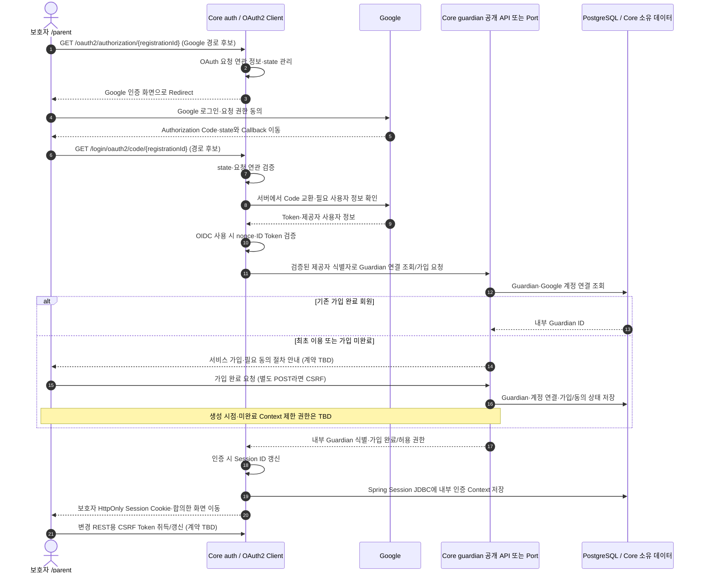
```mermaid
sequenceDiagram
    autonumber
    actor P as 보호자 /parent
    participant C as Core auth / OAuth2 Client
    participant O as Google
    participant M as Core guardian 공개 API 또는 Port
    participant DB as PostgreSQL / Core 소유 데이터
    P->>C: GET /oauth2/authorization/{registrationId} (Google 경로 후보)
    C->>C: OAuth 요청 연관 정보·state 관리
    C-->>P: Google 인증 화면으로 Redirect
    P->>O: Google 로그인·요청 권한 동의
    O-->>P: Authorization Code·state와 Callback 이동
    P->>C: GET /login/oauth2/code/{registrationId} (경로 후보)
    C->>C: state·요청 연관 검증
    C->>O: 서버에서 Code 교환·필요 사용자 정보 확인
    O-->>C: Token·제공자 사용자 정보
    C->>C: OIDC 사용 시 nonce·ID Token 검증
    C->>M: 검증된 제공자 식별자로 Guardian 연결 조회/가입 요청
    M->>DB: Guardian·Google 계정 연결 조회
    alt 기존 가입 완료 회원
        DB-->>M: 내부 Guardian ID
    else 최초 이용 또는 가입 미완료
        M-->>P: 서비스 가입·필요 동의 절차 안내 (계약 TBD)
        P->>M: 가입 완료 요청 (별도 POST라면 CSRF)
        M->>DB: Guardian·계정 연결·가입/동의 상태 저장
        Note over P,M: 생성 시점·미완료 Context 제한 권한은 TBD
    end
    M-->>C: 내부 Guardian 식별·가입 완료/허용 권한
    C->>C: 인증 시 Session ID 갱신
    C->>DB: Spring Session JDBC에 내부 인증 Context 저장
    C-->>P: 보호자 HttpOnly Session Cookie·합의한 화면 이동
    P->>C: 변경 REST용 CSRF Token 취득/갱신 (계약 TBD)
```

`auth`의 제공자 검증·Principal·Session 책임과 `guardian`의 내부 보호자/계정 연결 책임을 분리한다. 실제 공개 API/Port 이름은 TBD이며 `auth`가 `guardian` Repository에 직접 접근하지 않는다. [ADR-007](../ADR-007-module-boundaries.md)의 모듈 경계를 따른다.

Callback 거부·실패 또는 `state`/Token 검증 실패를 로그인 성공이나 새 보호자 가입으로 처리하지 않는다. 가입 미완료 Context로 아동·활동 API에 접근하지 못하게 한다. 성공/실패 Redirect·최초 가입 생성 시점·재시도/중복·필수 프로필·계정 연결 상세는 TBD다. 이메일만으로 기존 계정을 자동 합치지 않는다.

Google 화면의 동의와 우리 서비스 약관·개인정보·아동 활동 동의를 구분한다. 로그인 이후에도 `GuardianChild` 관계와 현재 필수 동의를 검사한다. Google Token을 활동 API용 자체 JWT로 그대로 쓰지 않는다. OAuth Callback에는 일반 REST CSRF Header 대신 OAuth 요청 연관 검증을 적용하고, 변경 REST·Logout의 CSRF 방어는 유지한다. 내부 Logout은 Spring Session 무효화이며 제공자 Logout·연결 해제·탈퇴는 별도 TBD다. `/device`는 보호자 소셜 로그인으로 인증하지 않는다. [auth.md](auth.md)·[ADR-008](../ADR-008-auth-access-control.md)에 Google·코드 등록/기기 자격 경계를 반영했다. 실제 등록값·인증 상세·실연동의 TBD는 유지한다.

## 1. 보호자 시작과 대기 기기의 음성 준비

### 코드 등록 선행 흐름

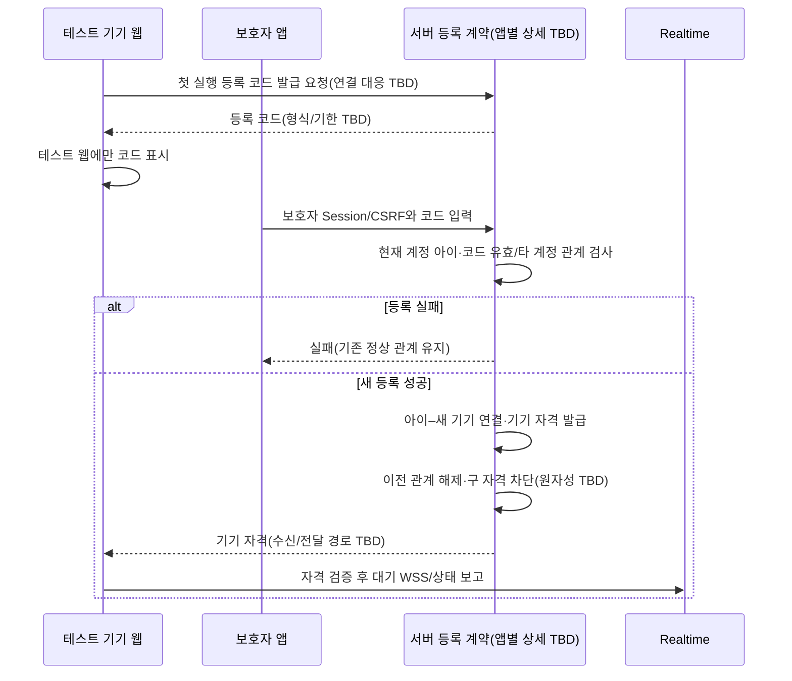
```mermaid
sequenceDiagram
    participant D as 테스트 기기 웹
    participant P as 보호자 앱
    participant S as 서버 등록 계약(앱별 상세 TBD)
    participant R as Realtime
    D->>S: 첫 실행 등록 코드 발급 요청(연결 대응 TBD)
    S-->>D: 등록 코드(형식/기한 TBD)
    D->>D: 테스트 웹에만 코드 표시
    P->>S: 보호자 Session/CSRF와 코드 입력
    S->>S: 현재 계정 아이·코드 유효/타 계정 관계 검사
    alt 등록 실패
        S-->>P: 실패(기존 정상 관계 유지)
    else 새 등록 성공
        S->>S: 아이–새 기기 연결·기기 자격 발급
        S->>S: 이전 관계 해제·구 자격 차단(원자성 TBD)
        S-->>D: 기기 자격(수신/전달 경로 TBD)
        D->>R: 자격 검증 후 대기 WSS/상태 보고
    end
```

MVP는 **보호자 계정 1 : 아이 1 : 기기 1**을 유지하며 기기 연결은 **서버 코드 발급 → 테스트용 기기 웹에 코드 표시 → 보호자 앱 입력 → 계정의 아이와 연결 → 기기 자격(토큰) 발급 → 자격을 사용한 대기 WSS**로 한다. 등록 코드·등록 후 유지되는 Device 식별자(deviceId)·기기 자격은 서로 다르다. 코드를 화면에 표시하는 것은 테스트용 기기 웹 한정이며 화면 없는 실제 기기의 스티커·음성 안내 등은 후속이다. 보호자 Cookie·Google 토큰·GPT-Live 공급자 자격을 기기 자격으로 쓰지 않는다. 데모 연결 ≠ 운영 페어링·물리 소유권 인증이다.

보호자의 **새 등록이 성공한 뒤** 이전 관계를 해제한다. 잘못된 코드·이미 다른 계정에 연결된 코드로 기존 정상 기기를 먼저 해제하지 않는다. 서버가 브라우저 데이터 삭제를 감지해 이전 기기를 해제한다고 가정하지 않는다. 기존 기기 자격의 사용을 차단해야 하며 열린 WSS·늦은 보고·활동 중 교체 요청의 처리/원자성·실패 복구는 TBD다. 코드와 대기 중 등록 연결의 대응, 자격을 실제로 수신하는 주체/전달 경로, 코드 형식·유효 시간·시도 제한·자격 수명/갱신·검증/폐기 구현도 TBD다. 등록 이후에도 허용·현재 연결·점유·계정당 진행 세션 1개·원자 할당 검사는 유지한다.

열린 구 WSS·늦은 보고·활동 중 교체·등록 재시도의 구체 처리/복구는 TBD다. 자격 브라우저 저장은 ADR-008의 데모 예외다.

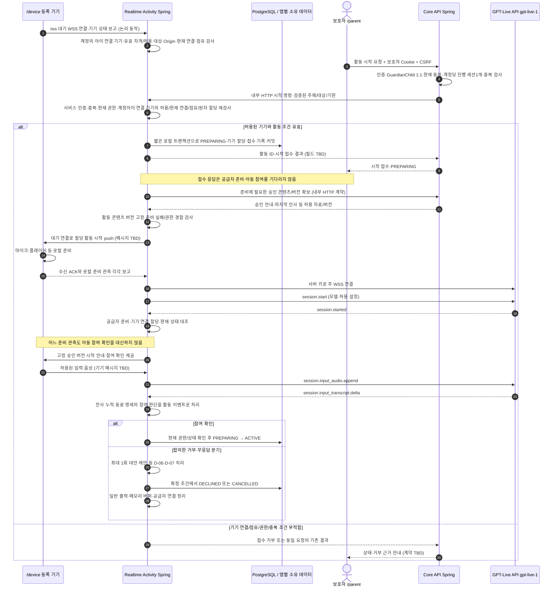
```mermaid
sequenceDiagram
    autonumber
    participant D as /device 등록 기기
    participant R as Realtime Activity Spring
    participant DB as PostgreSQL / 앱별 소유 데이터
    actor P as 보호자 /parent
    participant C as Core API Spring
    participant G as GPT-Live API gpt-live-1
    D->>R: /ws 대기 WSS 연결·기기 상태 보고 (논리 동작)
    R->>R: 계정의 아이 연결 기기·유효 자격/허용 대상·Origin·현재 연결·점유 검사
    P->>C: 활동 시작 요청 + 보호자 Cookie + CSRF
    C->>C: 인증·GuardianChild 1:1·현재 동의·계정당 진행 세션1개·중복 검사
    C->>R: 내부 HTTP 시작 명령·검증된 주체/대상/기한
    R->>R: 서비스 인증·중복·현재 권한·계정아이 연결 기기의 허용/현재 연결/점유/원자 할당 재검사
    alt 허용된 기기와 활동 조건 유효
        R->>DB: 짧은 로컬 트랜잭션으로 PREPARING·기기 할당·접수 기록 커밋
        R-->>C: 활동 ID·시작 접수 결과 (필드 TBD)
        C-->>P: 시작 접수·PREPARING
        Note over P,R: 접수 응답은 공급자 준비·아동 참여를 기다리지 않음
        R->>C: 준비에 필요한 승인 콘텐츠/버전 확보 (내부 HTTP 계약)
        C-->>R: 승인 안내·마지막 인사 등 허용 자료/버전
        R->>R: 활동 콘텐츠 버전 고정·준비 실패/권한 경합 검사
        R->>D: 대기 연결로 할당 활동 시작 push (메시지 TBD)
        D->>D: 마이크·플레이어 등 로컬 준비
        D-->>R: 수신 ACK와 로컬 준비 관측 각각 보고
        R->>G: 서버 키로 주 WSS 연결
        R->>G: session.start (모델·허용 설정)
        G-->>R: session.started
        R->>R: 공급자 준비·기기 연결·할당·현재 상태 대조
        Note over D,R: 어느 준비 관측도 아동 참여 확인을 대신하지 않음
        R->>D: 고정 승인 버전 시작 안내·참여 확인 제공
        D->>R: 허용된 입력 음성 (기기 메시지 TBD)
        R->>G: session.input_audio.append
        G-->>R: session.input_transcript.delta
        R->>R: 전사 누적·동료 명세의 참여 판단을 활동 이벤트로 처리
        alt 참여 확인
            R->>DB: 현재 권한/상태 확인 후 PREPARING → ACTIVE
        else 합의한 거부·무응답 분기
            R->>R: 최대 1회 대안 제안 등 D-06·D-07 처리
            R->>DB: 확정 조건에서 DECLINED 또는 CANCELLED
            R->>R: 일반 출력·메모리 버퍼·공급자 연결 정리
        end
    else 기기 연결/점유/권한/중복 조건 부적합
        R-->>C: 접수 거부 또는 동일 요청의 기존 결과
        C-->>P: 상태·거부 근거 안내 (계약 TBD)
    end
```

보호자 상태 카드는 계정의 아이에 연결된 코드 등록 기기를 보여주고 아이/기기 선택 단계는 없다. 미연결이면 "연결된 기기 없음"으로 시작할 수 없으며 계정당 진행 세션은 1개다. 전역 Available 개수로 다중 사용자 정책을 만들지 않고 **그 기기의 허용·현재 연결·점유·활동 할당**을 검사한다. 그 밖의 카드 표시값이나 서버 DB Enum은 이 그림으로 추가하지 않는다. 기록·리포트·목표는 아이 기준이며 activity_session은 child와 device를 함께 기록하는 기존 대상 참조를 유지한다.

Core가 검증한 주체 정보를 Realtime에 전달하더라도 수신 서비스 인증과 대상·권한·현재 상태 대조는 필요하다. 브라우저 입력을 신뢰 내부 주체로 승격하지 않는다. 시작 응답 유실 시 동일 논리 요청의 접수 기록을 재조회하며 새 활동·공급자 세션을 무조건 생성하지 않는다. 요청 상관 ID·내용 해시·처리 기한·중복 응답의 실제 필드는 [protocol.md](protocol.md)의 논리 계약으로 남긴다.

승인 콘텐츠 확보 실패·기기 준비 실패·`session.started` 미확인·늦은 준비 보고는 각각 준비 실패/취소 계약으로 처리한다. 공급자 세션을 만들었다는 사실만으로 서비스 활동이 활성화되지 않는다. 시작 접수 뒤 취소·철회·기기 연결 변경이 겹치면 새 공급자 요청·출력 전달 전에도 상태/권한을 재검사한다. 이미 닫힌 활동은 늦은 준비 보고로 되살리지 않는다. 마지막 인사 버전은 활동 준비에 확보하여 종료 시 Core 즉석 조회를 기다리지 않는다.

### 1.1 시작 전 취소와 서버 준비 취소

| 시점 | 흐름·남은 계약 |
| --- | --- |
| 시작 요청 전 준비 화면 | 보호자가 취소하면 로컬 준비를 끝낸다. 서버 활동 생성·기기 시작 요청 없음(FR-B05). |
| 시작 접수 뒤 PREPARING | Core의 인증·소유권·CSRF 검사 → 내부 HTTP 준비 취소 → Realtime의 현재 상태·상관/중복 검사와 우선 종료 처리 → 일반 출력 승인·버퍼·기기 대기열 무효화 → 현행 `CANCELLED` 경로. 응답·완료 확인·사유 필드는 TBD다. |
| 취소와 참여 확인 경합 | Realtime의 현재 상태와 순차 이벤트 처리 결과로 판단한다. `ACTIVE`인데 준비 취소 성공으로 표시하지 않는다. STOP 전환 또는 충돌 응답 세부는 TBD다. |
| 시작 응답 유실·중복 제출 | 같은 논리 요청의 접수 결과를 확인한다. 새 활동/공급자 세션을 임의 생성하지 않는다. |

미참여 종료에는 응답 원문을 저장하지 않으며 종료 사실·시각 등 합의한 최소 기록만 남긴다. 참여 후 중도 종료 기록은 D-08의 별도 보존 정책을 따른다.

### 1.2 공급자 출력 구간·전사 대응·검사·전달

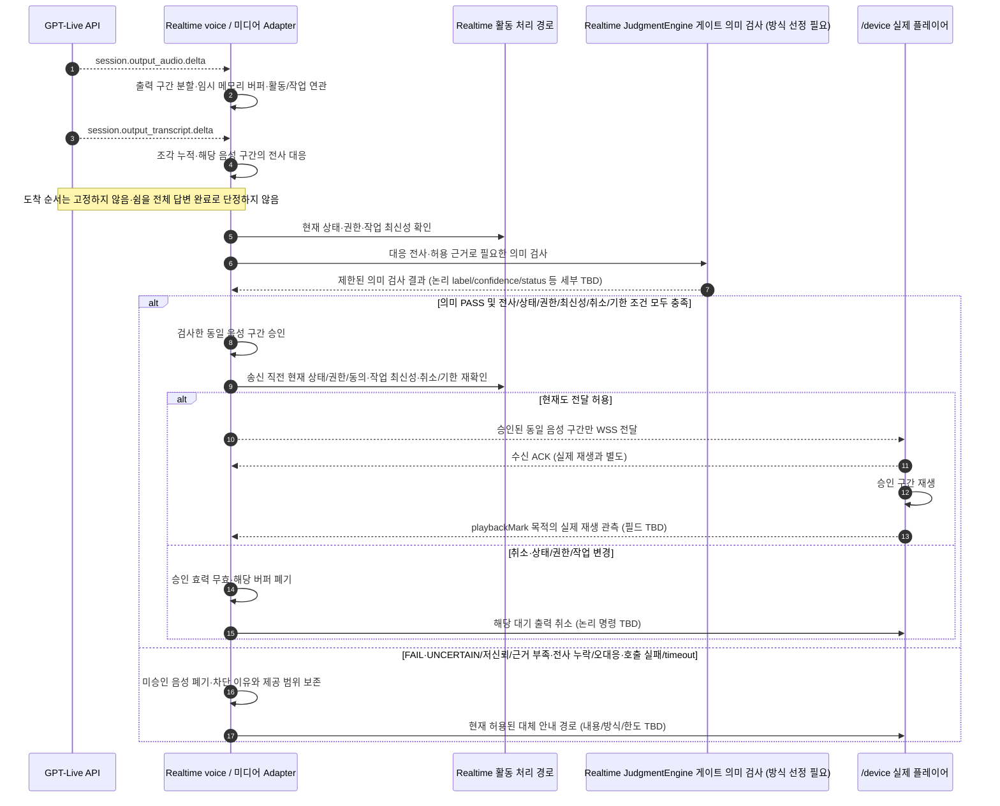
```mermaid
sequenceDiagram
    autonumber
    participant G as GPT-Live API
    participant R as Realtime voice / 미디어 Adapter
    participant Q as Realtime 활동 처리 경로
    participant K as Realtime JudgmentEngine 게이트 의미 검사 (방식 선정 필요)
    participant D as /device 실제 플레이어
    G-->>R: session.output_audio.delta
    R->>R: 출력 구간 분할·임시 메모리 버퍼·활동/작업 연관
    G-->>R: session.output_transcript.delta
    R->>R: 조각 누적·해당 음성 구간의 전사 대응
    Note over G,R: 도착 순서는 고정하지 않음·쉼을 전체 답변 완료로 단정하지 않음
    R->>Q: 현재 상태·권한·작업 최신성 확인
    R->>K: 대응 전사·허용 근거로 필요한 의미 검사
    K-->>R: 제한된 의미 검사 결과 (논리 label/confidence/status 등 세부 TBD)
    alt 의미 PASS 및 전사/상태/권한/최신성/취소/기한 조건 모두 충족
        R->>R: 검사한 동일 음성 구간 승인
        R->>Q: 송신 직전 현재 상태/권한/동의·작업 최신성·취소/기한 재확인
        alt 현재도 전달 허용
            R-->>D: 승인된 동일 음성 구간만 WSS 전달
            D-->>R: 수신 ACK (실제 재생과 별도)
            D->>D: 승인 구간 재생
            D-->>R: playbackMark 목적의 실제 재생 관측 (필드 TBD)
        else 취소·상태/권한/작업 변경
            R->>R: 승인 효력 무효·해당 버퍼 폐기
            R->>D: 해당 대기 출력 취소 (논리 명령 TBD)
        end
    else FAIL·UNCERTAIN/저신뢰/근거 부족·전사 누락/오대응·호출 실패/timeout
        R->>R: 미승인 음성 폐기·차단 이유와 제공 범위 보존
        R->>D: 현재 허용된 대체 안내 경로 (내용/방식/한도 TBD)
    end
```

출력 구간 분할과 전사 대응은 Realtime 또는 미디어 Adapter의 앱 책임이다. VAD/noise gate의 라이브러리·알고리즘·경계·구간 길이·버퍼 최대 시간/크기·포화 처리는 TBD다. 공급자 출력은 기기로 직행하지 않는다. 검사 수행과 현재 승인 유효성은 **전달 조건**이며, 전사 정확성이나 검사가 모든 위험을 발견한다는 보장은 아니다. 같은 말을 재생성했더라도 이전 음성의 승인을 재사용하지 않는다.

게이트는 상태·권한·최신성과 필요한 경량 의미 검사를 포함한다. 무거운 교육적 판정·KG/GraphRAG 조회를 동기 게이트에서 분리하는 것은 **우리 설계 권고**다. 필요한 안전 근거가 없으면 전달을 보류하며 지연 때문에 필수 검사를 생략하지 않는다. 특정 검사 모델·프롬프트·KG 경로 또는 delegation 채택은 이번에 확정하지 않는다. 의미 검사는 앱 소유 JudgmentEngine/Adapter 경계이며 **검사 방식 선정 필요**다. Jev·경량 LLM 등 후보 비교와 음성 버퍼/전사/승인/취소/재생 출력 경로 검증을 구분하고 Jev는 **게이트 적용 후보, Proposed / POC pending**으로만 둔다. 반응 판정 합격으로 게이트를 승인하지 않는다. 검증된 검사 경로 없이 미승인 AI 음성을 전달하지 않으며 새 AI 대체 음성은 재검사한다. 요청마다 두 후보를 연달아 호출하거나 비활성 2차 검토의 PASS만으로 출력하지 않는다.

허용된 활동에서 기기로 들어온 **아이 입력 음성 원본만 지정 원음 저장소에 보관**한다. AI 출력 음성은 저장 대상이 아니며 게이트 출력 버퍼는 메모리 전용으로 사용·폐기한다. 원음 보관은 필수 동의 항목이고 계정 삭제까지 보관하며, 기존 계정 삭제 요청 경로가 기록·전사와 함께 원음 저장소 및 DB 메타데이터도 삭제하도록 연결한다. DB에는 저장 위치·구간·세션 참조 등 메타데이터만 두고 원음 바이트·Outbox/Inbox·일반 로그·임시 디스크로 우회 저장하지 않는다. 기존 승인 안내 음성 파일은 별도 콘텐츠다.

대기 WSS의 주변 음성을 상시 저장하지 않는다. 참여 확인 전 입력은 기존 미참여 원문 미저장·수집 허용 정책과 대조해야 하며 포함 여부는 **TBD**다. Realtime 수신에서 저장 경로를 연결하되 저장 담당 앱·메타데이터 쓰기 소유자·저장 완료 기준·부분 저장/실패·삭제 중 늦은 저장 차단의 원자성은 **TBD**다. 저장소 종류·형식·구간 단위·암호화·접근 권한·백업 삭제 상세도 TBD이며 다른 앱 Repository를 직접 수정하지 않는다. 저장 실패를 임시 디스크 우회나 무제한 메모리 적재로 보완하지 않는다.

GPT-Live 단일 전사·별도 STT 보류와 모델 요청 전 허용 정보 제한은 유지한다.

### 1.3 차단 후 회복 — 교정 수락과 재생 승인 분리

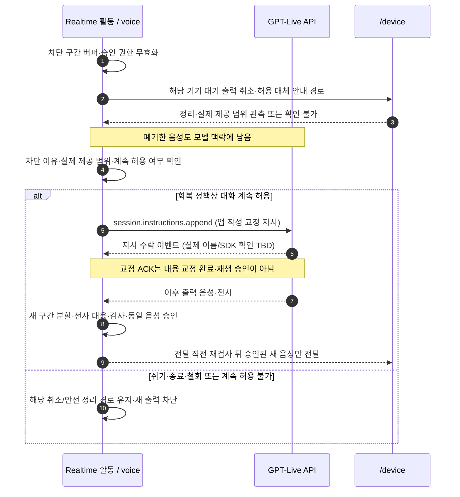
```mermaid
sequenceDiagram
    autonumber
    participant R as Realtime 활동 / voice
    participant G as GPT-Live API
    participant D as /device
    R->>R: 차단 구간 버퍼·승인 권한 무효화
    R->>D: 해당 기기 대기 출력 취소·허용 대체 안내 경로
    D-->>R: 정리·실제 제공 범위 관측 또는 확인 불가
    Note over R,G: 폐기한 음성도 모델 맥락에 남음
    R->>R: 차단 이유·실제 제공 범위·계속 허용 여부 확인
    alt 회복 정책상 대화 계속 허용
        R->>G: session.instructions.append (앱 작성 교정 지시)
        G-->>R: 지시 수락 이벤트 (실제 이름/SDK 확인 TBD)
        Note over R,G: 교정 ACK는 내용 교정 완료·재생 승인이 아님
        G-->>R: 이후 출력 음성·전사
        R->>R: 새 구간 분할·전사 대응·검사·동일 음성 승인
        R-->>D: 전달 직전 재검사 뒤 승인된 새 음성만 전달
    else 쉬기·종료·철회 또는 계속 허용 불가
        R->>R: 해당 취소/안전 정리 경로 유지·새 출력 차단
    end
```

교정 지시는 맥락 삭제 API가 아니다. 미승인 사용자/모델 원문을 시스템 지시로 복사하지 않는다. 일반 끼어들기, 가드레일 위반, 쉬기, 활동 종료의 후속 처리를 구분한다. 교정 수락·실제 교정 결과·새 출력 검사·기기 재생은 각각 관측한다. 대체 안내·재생성의 내용/조건/한도는 TBD이며 무제한 재생성을 추가하지 않는다.

## 2. 실제 재생 완료와 무응답

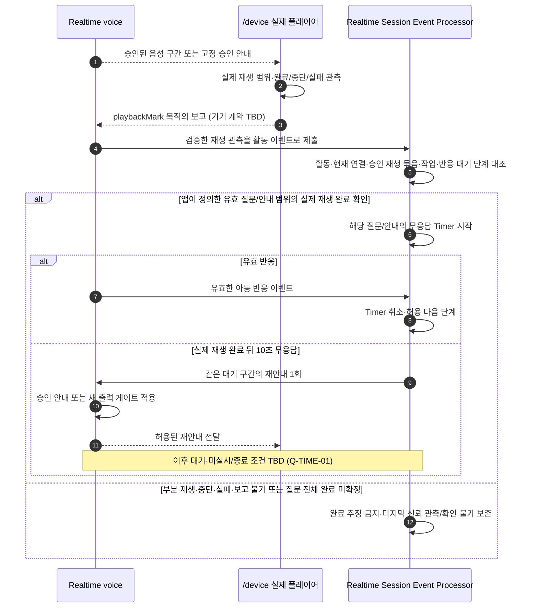
```mermaid
sequenceDiagram
    autonumber
    participant R as Realtime voice
    participant D as /device 실제 플레이어
    participant Q as Realtime Session Event Processor
    R-->>D: 승인된 음성 구간 또는 고정 승인 안내
    D->>D: 실제 재생 범위·완료/중단/실패 관측
    D-->>R: playbackMark 목적의 보고 (기기 계약 TBD)
    R->>Q: 검증한 재생 관측을 활동 이벤트로 제출
    Q->>Q: 활동·현재 연결·승인 재생 묶음·작업·반응 대기 단계 대조
    alt 앱이 정의한 유효 질문/안내 범위의 실제 재생 완료 확인
        Q->>Q: 해당 질문/안내의 무응답 Timer 시작
        alt 유효 반응
            R->>Q: 유효한 아동 반응 이벤트
            Q->>Q: Timer 취소·허용 다음 단계
        else 실제 재생 완료 뒤 10초 무응답
            Q->>R: 같은 대기 구간의 재안내 1회
            R->>R: 승인 안내 또는 새 출력 게이트 적용
            R-->>D: 허용된 재안내 전달
            Note over R,Q: 이후 대기·미실시/종료 조건 TBD (Q-TIME-01)
        end
    else 부분 재생·중단·실패·보고 불가 또는 질문 전체 완료 미확정
        Q->>Q: 완료 추정 금지·마지막 신뢰 관측/확인 불가 보존
    end
```

생성·게이트 승인·송신·수신 ACK·실제 재생을 구분한다. `playbackMark`는 실제 플레이어가 관측하고 Realtime이 수신·검증하는 **앱 계약의 목적**이다. 보고 대상은 어느 활동·현재 연결·승인 음성/재생 묶음인지 식별해야 한다. 위치 단위·주기 진행 보고·중단 직후 최종 보고·정상 완료 보고·신뢰 범위·실제 필드명은 [protocol.md](protocol.md)의 TBD다. 전사 타임라인을 기기 재생 위치로 곧바로 사용하지 않으며 아동 청취·이해의 증거로 해석하지 않는다.

중복·순서 역전·구 연결·현재 작업 변경 뒤의 늦은 보고는 원래 승인 출력과 대조하고 허용된 과거 관측만 보완한다. Timer·재안내 횟수·승인 효력을 초기화하거나 종료 활동을 부활시키지 않는다. 보고가 없으면 송신/생성 범위를 재생 완료로 채우지 않는다. Cue 실제 제공 범위·도움 후 반응 해석·무응답·기록/리포트는 확인된 관측에 맞춘다.

**무응답 10초·재안내 1회는 유지하는 초기값이며 미측정**이다. 구간 분할·전사 대응·게이트·송신·재생 대기는 무응답으로 세지 않는다. 잠깐 빈 큐나 공급자 출력의 쉼은 질문 전체 완료가 아니다. 반응 수신·쉬기·종료·단절/불완전 재생에서는 해당 Timer의 진행 권한을 확인한다. 첫 반응 전 재안내에 목표 Cue·정답·시범을 추가하지 않는다. 재안내 이후 조건과 시작 참여 확인에 같은 시간을 적용할지는 TBD다.

### 2.1 끼어들기와 재생 중단 지점

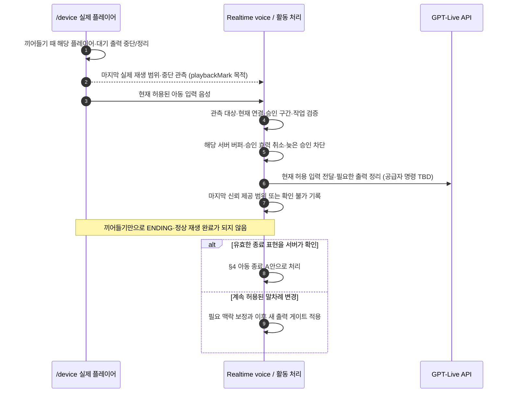
```mermaid
sequenceDiagram
    autonumber
    participant D as /device 실제 플레이어
    participant R as Realtime voice / 활동 처리
    participant G as GPT-Live API
    D->>D: 끼어들기 때 해당 플레이어·대기 출력 중단/정리
    D-->>R: 마지막 실제 재생 범위·중단 관측 (playbackMark 목적)
    D->>R: 현재 허용된 아동 입력 음성
    R->>R: 관측 대상·현재 연결·승인 구간·작업 검증
    R->>R: 해당 서버 버퍼·승인 효력 취소·늦은 승인 차단
    R->>G: 현재 허용 입력 전달·필요한 출력 정리 (공급자 명령 TBD)
    R->>R: 마지막 신뢰 제공 범위 또는 확인 불가 기록
    Note over D,R: 끼어들기만으로 ENDING·정상 재생 완료가 되지 않음
    alt 유효한 종료 표현을 서버가 확인
        R->>R: §4 아동 종료 A안으로 처리
    else 계속 허용된 말차례 변경
        R->>R: 필요 맥락 보정과 이후 새 출력 게이트 적용
    end
```

기기 중단·공급자 정리의 정확한 트리거·순서·명령·확인 계약은 TBD다. `playbackMark` 자체가 종료 명령이나 공급자 맥락 삭제를 뜻하지 않는다. 로컬 미재생 음성도 모델 맥락에 남는 점을 고려한다. 일반 끼어들기를 가드레일 위반으로 임의 분류하지 않는다.

| 취소 원인 | 상태·진행과 출력 처리 |
| --- | --- |
| 끼어들기 | 해당 재생·버퍼·대기 출력 취소와 제공 범위 기록. 말차례 변경만으로 자동 `ENDING` 금지. |
| 쉬기 | 현행 `PAUSED` 경로와 Timer/작업/출력 무효화. 재개 뒤 이전 Cue·승인 음성 자동 재생 금지. |
| 종료 | 우선 종료 경로에서 일반 출력/작업 차단. 아동 종료 A안의 고정 승인 마지막 인사 1회만 별도 예외. |
| 필수 동의 철회 | 새 수집·이용·전송 차단과 입력/출력·버퍼·기기 대기열 안전 정리. 신규·지연 자료 미저장 원칙, 효력 시각·저장 경합은 D-08/TBD. |

모든 취소에서 늦은 검사 통과·승인은 이전 음성의 재생 권한을 되살리지 못한다.

## 3. 보호자 종료 — 즉시 명령과 실제 중단 관측

종료 미확인의 논리 계약은 **`ENDED` + 사유 `UNCONFIRMED`**다. `ENDED_UNCONFIRMED`를 새 상태값/DB Enum으로 만들지 않는다. 서버 논리 종료는 기기 재생 중단의 증거가 아니며 최초 종료를 유발한 사유와 기기 중단을 확인하지 못한 사실을 구분해 보존한다. 기존 `status`·`end_reason`·`end_detail`과 중단 관측 표현에 어떻게 매핑할지는 TBD이며 새 Enum·컬럼을 확정하지 않는다. `ENDING`의 정리 과정, 논리 `ENDED`, 기존 `PARTIAL`/결과 준비·정리 상태는 하나의 완료가 아니다.

`UNCONFIRMED` 뒤에도 이전 활동의 출력·늦은 승인·지연 명령은 무효다. 늦은 중단 보고는 검증된 과거 관측일 뿐 활동/출력 승인 부활의 근거가 아니다. 다음 시작 전 연결·기기 준비·점유·현재 권한/원자 할당을 다시 확인하고 미확인을 재생 중단 성공으로 채우지 않는다. 확인 기한·최종화/늦은 보고의 저장 매핑·기기 재사용 조건 상세는 TBD다.

보호자 종료 확인 뒤 Core가 인증·CSRF·소유권을 검사하고 즉시 내부 HTTP로 Realtime에 전달한다. STOP을 사후 Result Worker 대기열에 넣지 않는다. 아래 병행 정리는 한 경로 ACK가 다른 중단 시도를 지연하지 않도록 하는 **구현 제안**이며 네트워크와 무관한 원격 즉시 중단 보장이 아니다.

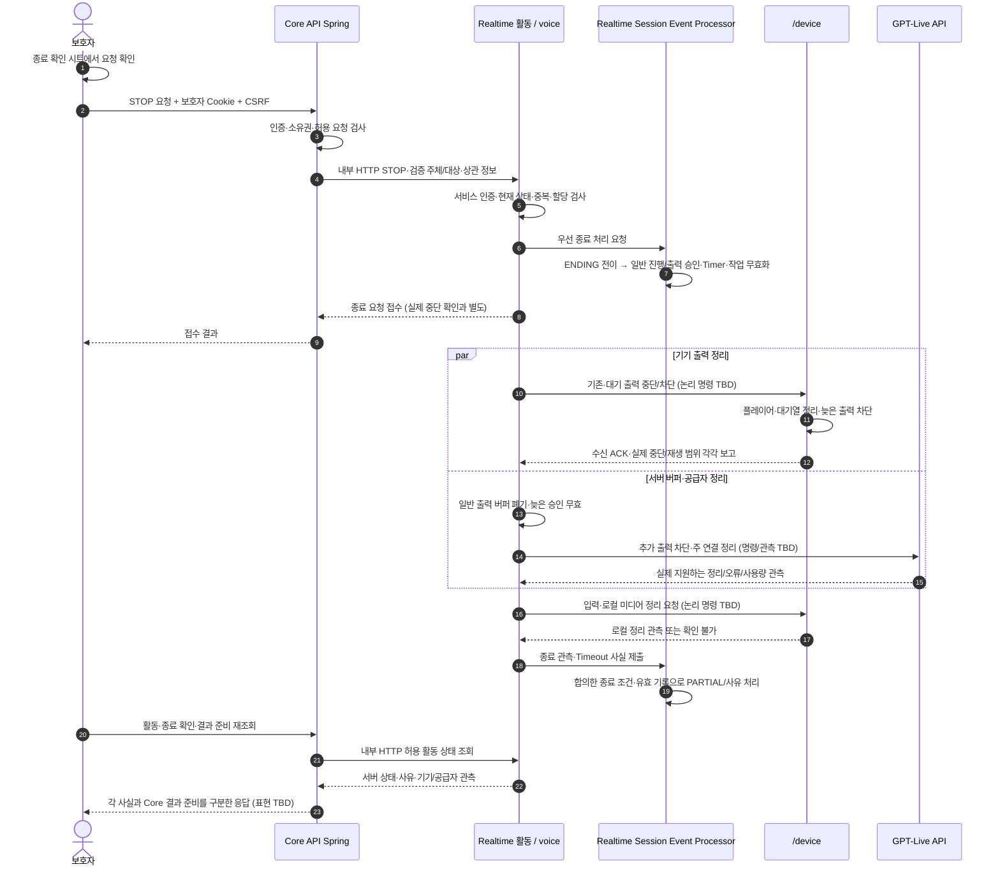
```mermaid
sequenceDiagram
    autonumber
    actor P as 보호자
    participant C as Core API Spring
    participant R as Realtime 활동 / voice
    participant Q as Realtime Session Event Processor
    participant D as /device
    participant G as GPT-Live API
    P->>P: 종료 확인 시트에서 요청 확인
    P->>C: STOP 요청 + 보호자 Cookie + CSRF
    C->>C: 인증·소유권·허용 요청 검사
    C->>R: 내부 HTTP STOP·검증 주체/대상·상관 정보
    R->>R: 서비스 인증·현재 상태·중복·할당 검사
    R->>Q: 우선 종료 처리 요청
    Q->>Q: ENDING 전이 → 일반 진행/출력 승인·Timer·작업 무효화
    R-->>C: 종료 요청 접수 (실제 중단 확인과 별도)
    C-->>P: 접수 결과
    par 기기 출력 정리
        R->>D: 기존·대기 출력 중단/차단 (논리 명령 TBD)
        D->>D: 플레이어·대기열 정리·늦은 출력 차단
        D-->>R: 수신 ACK·실제 중단/재생 범위 각각 보고
    and 서버 버퍼·공급자 정리
        R->>R: 일반 출력 버퍼 폐기·늦은 승인 무효
        R->>G: 추가 출력 차단·주 연결 정리 (명령/관측 TBD)
        G-->>R: 실제 지원하는 정리/오류/사용량 관측
    end
    R->>D: 입력·로컬 미디어 정리 요청 (논리 명령 TBD)
    D-->>R: 로컬 정리 관측 또는 확인 불가
    R->>Q: 종료 관측·Timeout 사실 제출
    Q->>Q: 합의한 종료 조건·유효 기록으로 PARTIAL/사유 처리
    P->>C: 활동·종료 확인·결과 준비 재조회
    C->>R: 내부 HTTP 허용 활동 상태 조회
    R-->>C: 서버 상태·사유·기기/공급자 관측
    C-->>P: 각 사실과 Core 결과 준비를 구분한 응답 (표현 TBD)
```

HTTP 접수는 명령 접수, 기기 ACK는 수신, 공급자 관측은 주 연결 정리 근거이며 실제 기기 중단은 별도다. 한 사실로 다른 사실을 성공 처리하지 않는다. 서버 영속 상태 저장 실패와 출력 차단 시도도 구분한다. 공급자 취소/종료의 실제 효과와 무한 대기를 막을 Timeout/강제 정리 순서는 실연동 TBD다.

보호자 STOP에는 아동 종료 A안의 마지막 인사 예외를 자동 적용하지 않는다. `PARTIAL`은 유효 기록이 있는 활동의 중도 종료이며 결과 준비 완료를 뜻하지 않는다. 최종 서버 상태여도 기기 중단 미확인을 별도로 남기고, 보호자 재조회/직접 중단의 정책 D-03 및 표시 계약은 TBD다. 종료·미확인 표시를 이유로 새 DB Enum을 만들지 않는다. 중복 종료·늦은 보고로 활동이 `ACTIVE`로 되돌아가지 않는다.

## 4. 아동 키워드 종료 A안 — 확인 즉시 ENDING

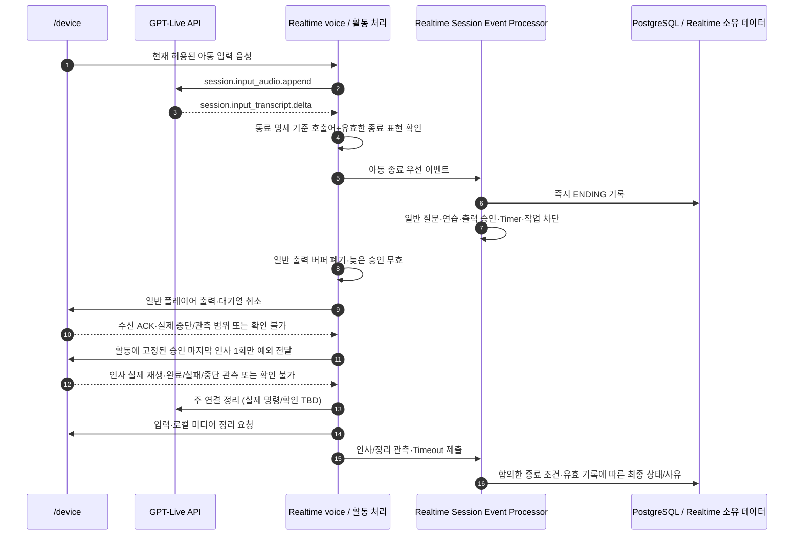
```mermaid
sequenceDiagram
    autonumber
    participant D as /device
    participant G as GPT-Live API
    participant R as Realtime voice / 활동 처리
    participant Q as Realtime Session Event Processor
    participant DB as PostgreSQL / Realtime 소유 데이터
    D->>R: 현재 허용된 아동 입력 음성
    R->>G: session.input_audio.append
    G-->>R: session.input_transcript.delta
    R->>R: 동료 명세 기준 호출어+유효한 종료 표현 확인
    R->>Q: 아동 종료 우선 이벤트
    Q->>DB: 즉시 ENDING 기록
    Q->>Q: 일반 질문·연습·출력 승인·Timer·작업 차단
    R->>R: 일반 출력 버퍼 폐기·늦은 승인 무효
    R->>D: 일반 플레이어 출력·대기열 취소
    D-->>R: 수신 ACK·실제 중단/관측 범위 또는 확인 불가
    R->>D: 활동에 고정된 승인 마지막 인사 1회만 예외 전달
    D-->>R: 인사 실제 재생·완료/실패/중단 관측 또는 확인 불가
    R->>G: 주 연결 정리 (실제 명령/확인 TBD)
    R->>D: 입력·로컬 미디어 정리 요청
    R->>Q: 인사/정리 관측·Timeout 제출
    Q->>DB: 합의한 종료 조건·유효 기록에 따른 최종 상태/사유
```

`ENDING` 진입은 마지막 인사 재생 완료를 기다리지 않는다. 즉시 일반 출력·버퍼·기기 대기열을 무효화하고 고정된 승인 마지막 인사 **1회만 예외**로 둔다. 이 예외가 기존 Cue·일반 생성 출력을 허용하지 않는다. 마지막 인사를 즉석 Core 조회나 자유 생성에 의존하지 않는다. 제공 실패·철회/권한 경합·중복 종료에서의 인사 처리와 정리 확인 Timeout은 TBD다.

아동 종료 뒤 활동 지속을 설득하지 않는다. **키워드 없는 유사 발화와 기기 재생 음성은 종료 제어 명령으로 처리하지 않는다**(FR-E05). 실제 호출어·문구·인식/완료 기준·승인 Audio 방식은 동료 GPT-Live/AI 명세가 소유한다. 단순 끼어들기·전사 조각·기기 ACK로 유효 종료 판정을 대신하지 않는다. 최종 상태·사유·미실시 및 실제 재생/중단 관측은 [ADR-005](../ADR-005-session-events-timeouts.md)·[session-state.md](session-state.md)를 따른다.

## 5. 기기 WSS 장애와 두 앱 복구

기기↔Realtime WSS는 음성·제어·재생 보고 경로다. 공급자 주 WSS 장애는 이 기기 연결 장애와 별도로 관측한다.

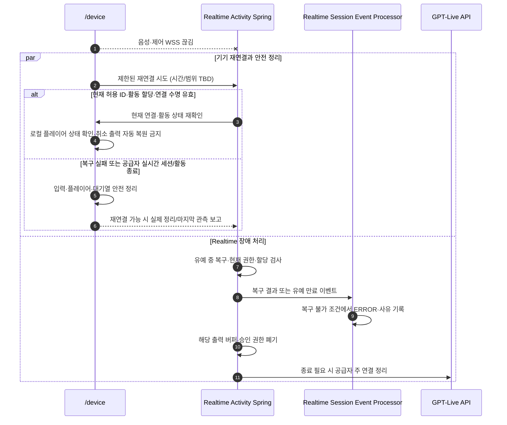
```mermaid
sequenceDiagram
    autonumber
    participant D as /device
    participant R as Realtime Activity Spring
    participant Q as Realtime Session Event Processor
    participant G as GPT-Live API
    D--xR: 음성·제어 WSS 끊김
    par 기기 재연결과 안전 정리
        D->>R: 제한된 재연결 시도 (시간/범위 TBD)
        alt 현재 허용 ID·활동 할당·연결 수명 유효
            R->>D: 현재 연결·활동 상태 재확인
            D->>D: 로컬 플레이어 상태 확인·취소 출력 자동 복원 금지
        else 복구 실패 또는 공급자 실시간 세션/활동 종료
            D->>D: 입력·플레이어·대기열 안전 정리
            D-->>R: 재연결 가능 시 실제 정리/마지막 관측 보고
        end
    and Realtime 장애 처리
        R->>R: 유예 중 복구·현재 권한·할당 검사
        R->>Q: 복구 결과 또는 유예 만료 이벤트
        Q->>Q: 복구 불가 조건에서 ERROR·사유 기록
        R->>R: 해당 출력 버퍼·승인 권한 폐기
        R->>G: 종료 필요 시 공급자 주 연결 정리
    end
```

원본 기기 안전 종료 약 5초·서버 Grace 약 6~7초는 직접 연결 시절 **후보값**이며 B안 적용과 실제 시간은 TBD다. `ERROR` 저장과 실제 플레이어 중단 확인을 구분하며 미확인 범위는 완료로 채우지 않는다. 기기 재연결이 성공했어도 종료한 GPT-Live 실시간 세션을 새 세션으로 이어 붙이거나 활동을 자동 재개하지 않는다.

### 5.1 인증·현재 동의와 장애 의존

| 원인 | 필요한 연결 | 아직 결정할 부분 |
| --- | --- | --- |
| 유휴 기기 허용 폐기/연결 유효성 상실 | 등록/현재 자격·허용 대상·현재 연결 재검사 → 새 할당 제외 → 연결 정리 | 운영 인증·감지·WS 종료/갱신 세부 |
| 활동 중 기기 허용/인증 유효성 상실 | 새 작업 차단 → Realtime 활동 이벤트로 안전 종료 → 입력·출력·버퍼·기기 대기열·공급자 정리 각각 관측 | 관측을 받을 연결 정리 순서·Timeout·최종 상태/사유(D-03) |
| 진행 중 필수 동의 철회 | Core가 동의 변경과 Outbox 이벤트를 함께 저장하고 Realtime에 우선 전달. Realtime/Worker는 새 이용·외부 전송·저장·결과 반영 전 현재 허용 검사, 확인 불가 시 새 이용 차단. 출력·버퍼·대기열 안전 정리 | 효력 시각·신규/지연 자료 미저장 경합의 원자성·진행 작업·상태/사유(D-08). `guardian_stop`으로 임의 매핑하지 않음 |
| 보호자 Logout/인증 만료·앱 닫힘 | 로그인 Session과 활동 수명 구분. 재로그인 후 소유 활동 상태 확인·허용 종료 | 자동 활동 종료 여부 D-03. 보호자 인증으로 기기를 대체하지 않음 |
| Core 장애 | Core 경유 보호자 새 제어 요청의 전달 제한을 드러냄. 승인 콘텐츠 미확보·현재 권한 확인 불가 시 해당 새 진행 보류/차단 | 보호자 직접 Realtime 종료는 v0.2 G-02 미해결 대안. 이번에 채택하지 않음 |

비동기 철회 이벤트만으로 즉시 차단·저장 경합이 해결됐다고 표시하지 않는다. 안전 정리/STOP을 현재 동의 재확인 실패 때문에 막지 않는다. UI 전체 철회·삭제 구현은 후속 범위이며 첫 볼트는 합의한 시험 데이터 변경·경합·안전 종료를 검증한다. 인증·동의 상세의 소유자는 [auth.md](auth.md)·ADR-005이며 코드 등록/Google/내부 신뢰의 문서 경계는 반영했다. 철회 효력·저장/송신 경합·실제 인증/안전 정리 검증의 TBD는 유지한다.

### 5.2 Core와 Realtime의 각자 재시작

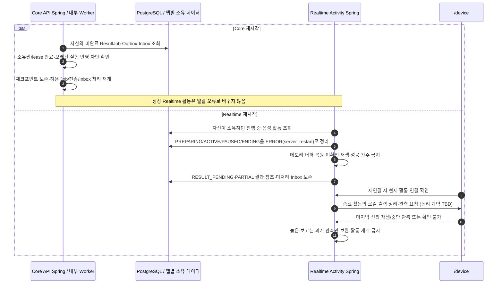
```mermaid
sequenceDiagram
    autonumber
    participant C as Core API Spring / 내부 Worker
    participant DB as PostgreSQL / 앱별 소유 데이터
    participant R as Realtime Activity Spring
    participant D as /device
    par Core 재시작
        C->>DB: 자신의 미완료 ResultJob·Outbox·Inbox 조회
        C->>C: 소유권/lease 만료·오래된 실행 반영 차단 확인
        C->>C: 체크포인트 보존·허용 Job/전송/Inbox 처리 재개
        Note over C,R: 정상 Realtime 활동은 일괄 오류로 바꾸지 않음
    and Realtime 재시작
        R->>DB: 자신이 소유하던 진행 중 음성 활동 조회
        R->>DB: PREPARING/ACTIVE/PAUSED/ENDING을 ERROR(server_restart)로 정리
        R->>R: 메모리 버퍼 복원·미확인 재생 성공 간주 금지
        R->>DB: RESULT_PENDING·PARTIAL 결과 참조·미처리 Inbox 보존
        D->>R: 재연결 시 현재 활동·연결 확인
        R->>D: 종료 활동의 로컬 출력 정리·관측 요청 (논리 계약 TBD)
        D-->>R: 마지막 신뢰 재생/중단 관측 또는 확인 불가
        R->>R: 늦은 보고는 과거 관측만 보완·활동 재개 금지
    end
```

그림의 병렬 영역은 두 앱의 **서로 다른 복구 책임**을 비교하며 반드시 동시에 재시작한다는 요구가 아니다. Realtime은 다른 정상 소유자의 활동을 건드리지 않는다. 릴레이 메모리 버퍼와 기기 대기열이 재시작 뒤 복원됐다고 취급하지 않는다. 생성·승인·송신 사실로 미확인 재생을 성공으로 채우지 않는다.

Core는 모든 `RUNNING` Job을 무조건 `PENDING`으로 되돌리지 않는다. 소유권·lease와 이전 Worker 반영 차단, 체크포인트·정책 유효성을 확인한다. Outbox/Inbox 재전송은 LLM 생성 재시도가 아니다. 공유 DB/호스트 장애와 Core 경유 제어 의존은 남으며 두 앱이라는 이유로 독립 가용성을 보장하지 않는다. 세부 lease·fencing·복구 필드는 [result-pipeline.md](result-pipeline.md)·[data-model.md](data-model.md)의 후속 계약이다.

## 6. 결과 생성·영속 전달·재시도 — 후속 범위

결과 생성이 필요한 정상 종료와 유효 기록의 중도 종료를 분리한다. Realtime은 활동 상태·기대 결과 실행·결과 참조를, Core 내부 Worker는 ResultJob·산출물·준비/실패 상태를 소유한다. 물리 PostgreSQL은 1개이고 앱별 소유 스키마/쓰기 경계를 따른다. 아래 식별자·이벤트명은 기존 **논리 계약**이며 실제 필드/Endpoint는 TBD다.

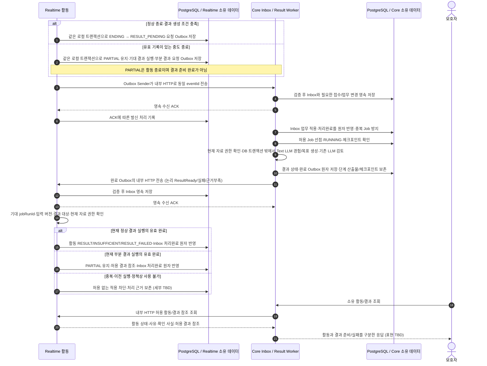
```mermaid
sequenceDiagram
    autonumber
    participant R as Realtime 활동
    participant RDB as PostgreSQL / Realtime 소유 데이터
    participant C as Core Inbox / Result Worker
    participant CDB as PostgreSQL / Core 소유 데이터
    actor P as 보호자
    alt 정상 종료·결과 생성 조건 충족
        R->>RDB: 같은 로컬 트랜잭션으로 ENDING → RESULT_PENDING·요청 Outbox 저장
    else 유효 기록이 있는 중도 종료
        R->>RDB: 같은 로컬 트랜잭션으로 PARTIAL 유지·기대 결과 실행·부분 결과 요청 Outbox 저장
        Note over R,C: PARTIAL은 활동 종료이며 결과 준비 완료가 아님
    end
    R->>C: Outbox Sender가 내부 HTTP로 동일 eventId 전송
    C->>CDB: 검증 후 Inbox와 필요한 접수/업무 변경 영속 저장
    C-->>R: 영속 수신 ACK
    R->>RDB: ACK에 따른 발신 처리 기록
    C->>CDB: Inbox 업무 적용·처리완료를 원자 반영·중복 Job 방지
    C->>CDB: 허용 Job 선점·RUNNING·체크포인트 확인
    C->>C: 현재 자료 권한 확인·DB 트랜잭션 밖에서 Text LLM 경험/목표 생성·기존 LLM 검토
    C->>CDB: 결과 상태·완료 Outbox 원자 저장·단계 산출물/체크포인트 보존
    C->>R: 완료 Outbox의 내부 HTTP 전송 (논리 ResultReady/실패/근거부족)
    R->>RDB: 검증 후 Inbox 영속 저장
    R-->>C: 영속 수신 ACK
    R->>R: 기대 jobRunId·입력 버전·결과 대상·현재 자료 권한 확인
    alt 현재 정상 결과 실행의 유효 완료
        R->>RDB: 활동 RESULT/INSUFFICIENT/RESULT_FAILED·Inbox 처리완료 원자 반영
    else 현재 부분 결과 실행의 유효 완료
        R->>RDB: PARTIAL 유지·허용 결과 참조·Inbox 처리완료 원자 반영
    else 중복·이전 실행·정책상 사용 불가
        R->>RDB: 허용 없는 적용 차단·처리 근거 보존 (세부 TBD)
    end
    P->>C: 소유 활동/결과 조회
    C->>R: 내부 HTTP 허용 활동/결과 참조 조회
    R-->>C: 활동 상태·사유·확인 사실·허용 결과 참조
    C-->>P: 활동과 결과 준비/실패를 구분한 응답 (표현 TBD)
```

Inbox를 메모리 큐에만 넣고 ACK하지 않는다. ACK 유실·중복·순서 역전을 허용하되 같은 업무 효과를 중복 만들지 않으며 미처리 Inbox는 수신 앱 재시작 뒤 재처리한다. Realtime의 활동 최신 작업 ID가 종료 때 무효화됐다는 이유만으로 정상 사후 결과를 전부 버리지 않는다. 반대로 이전 `jobRunId`의 늦은 완료가 새 보호자 재시도를 덮거나 활동을 `ACTIVE`로 되돌릴 수 없다.

정상 결과 재시도는 보호자 인증·소유권·CSRF·현재 자료 권한 확인 → Core/Realtime의 내부 HTTP 계약 → 허용 새 결과 실행/접수 → 영속 요청/완료 경로로 연결한다. 정상 결과의 `RESULT_FAILED → RESULT_PENDING`은 기존 상태 계약을 따른다. 부분 결과 재시도와 준비/실패 표현은 TBD이며 `PARTIAL`을 결과 준비 때문에 정상 활동 완료 `RESULT`로 바꾸지 않는다. 기술 재시도·내용 수정·전송 재시도·보호자 새 재시도를 같은 횟수/실행으로 합치지 않는다. 성공 산출물·내용 수정 이력·체크포인트를 보존한다.

목표 후보 생성/검토는 Core `result`의 Text LLM 생성·기존 LLM 의미 검토와 Spring 4요소/근거/참조 검사 경로를 유지한다. 판정 미확보 후보는 보류하여 공개/등록하지 않으며 LLM 유지가 기능/품질 검증 면제는 아니다. Jev 목표 검토는 이번 비교 제외/MVP 미적용·후속이다. Core Worker는 Realtime `practice`의 내부 HTTP 등록 계약을 사용한다. 상대 Repository/테이블을 직접 수정하지 않으며 동일 후보·입력 버전·요청의 응답 유실 시 등록 결과를 재확인한다. 이미 성공한 AI 단계를 무조건 다시 실행하거나 활동 중 선택 목표 버전을 덮지 않는다. 원격 등록은 [result-pipeline.md](result-pipeline.md)·[data-model.md](data-model.md)가 관리하고 실제 Endpoint/DTO·등록 원자성·물리 참조와 실연동은 TBD다.

유효 기록이면 부분 결과를 제공하는 기능을 유지하되 첫 볼트의 ResultJob·결과 준비 전체 구현은 후속 범위다. 자료 부족·미참여·철회는 별도 자료 규칙을 따른다. 존재하지 않는 전사·원문·능력 점수·추천을 만들어 채우지 않으며 보존 자료라는 이유만으로 철회 뒤 새 분석·전송·저장을 허용하지 않는다.

활동별 결과 정리와 기간 PDF 생성은 별개다. Core 내부 Result Worker는 기존 경험 구조화·목표 후보 생성/검토·부분 결과를 유지한다. 기간 PDF는 **아이 정보 + 기간 내 날짜별 대화 원문**으로 구성하며 **AI 요약·평가를 포함하지 않는다**. Core 내부 Java Template/Report Renderer가 저장 전사 원문·근거 발화 ID를 연결한다. 전달된 AI 발화와 실제 재생 관측을 구분하고 `playbackMark`의 부분/미확인 사실을 보존한다. LLM 재작성 문장을 원문으로 쓰거나 미판정·미실시를 정상 판정으로 채우지 않는다. 템플릿 엔진·PDF 라이브러리·기간/원문 조회·표시 항목 상세·산출물 보존/내보내기 구현은 TBD이며 새 API/필드를 확정하지 않는다. 기존 LLM 서술 옵션은 MVP 비활성이고 이 기간 PDF에 추가하지 않는다.

## 7. 실시간 Cue — 기존 기능 정책과 버퍼 게이트

### 판정 턴 게이트 보류

판정 턴은 **판정이 끝날 때까지 게이트에서 출력을 보류**한다. GPT-Live 자동 응답 자체를 중지하는 API가 있다고 가정하지 않는다. 판정 완료 후에도 버퍼 음성이 현재 단계·판정 결과·작업에 유효한지 재확인하며, 맞지 않으면 폐기하고 필요한 교정 지시 후 새 출력을 생성한다(재생성 조건·한도/상세 TBD). 교정에는 기존 `session.instructions.append` 회복 계약을 연결하되 교정 ACK는 전달 승인이 아니다. 새 출력도 구간 분할·전사 대응·검사와 나머지 전달 조건을 모두 거친다.

판정 timeout/실패/미판정 때 보류 버퍼를 방출하지 않으며 미판정 기록·승인 대체 안내/회복 정책에 연결한다. 판정 실패만으로 세션을 종료하지 않는 원칙은 유지한다. 판정·구간/전사·게이트 대기를 아동 무응답으로 세지 않고 유효 질문/안내 전체 실제 재생 완료 뒤 10초 타이머를 적용한다. ADR-005 §10.1 반응 판정 호출의 초기 5초+Retry 1회와 ADR-005 §10.2 Cue 최초 요청→실제 재생 전체 5초는 별개이며 Cue 시각을 보류/재생성 때 초기화하지 않는다. 동작 가능 여부는 반응 판정 POC 확인 항목이며 구현/실측 완료가 아니다.

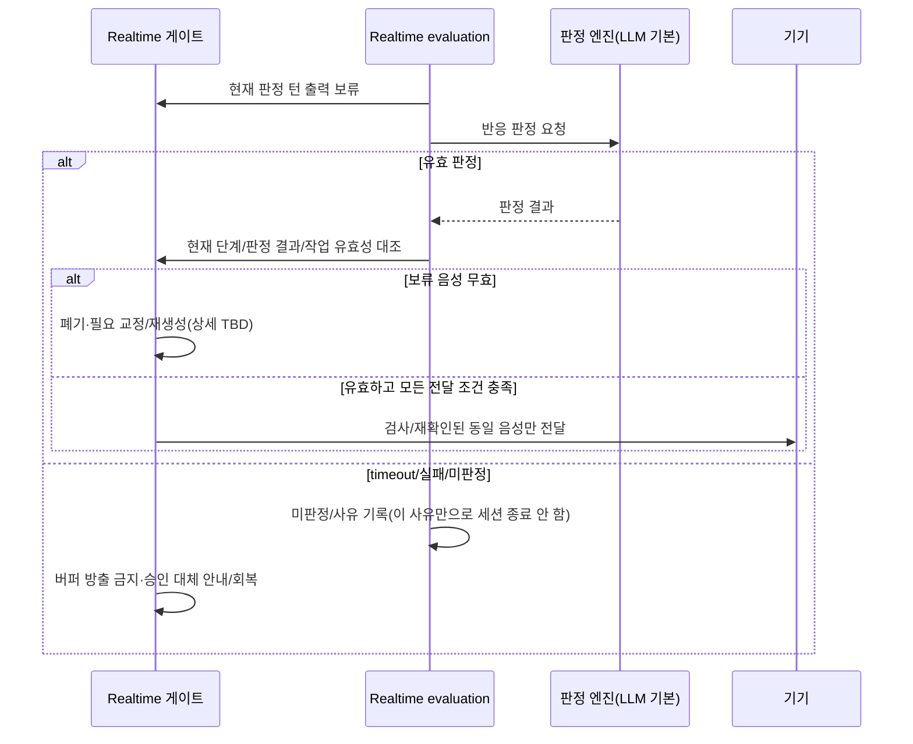
```mermaid
sequenceDiagram
    participant G as Realtime 게이트
    participant E as Realtime evaluation
    participant L as 판정 엔진(LLM 기본)
    participant D as 기기
    E->>G: 현재 판정 턴 출력 보류
    E->>L: 반응 판정 요청
    alt 유효 판정
        L-->>E: 판정 결과
        E->>G: 현재 단계/판정 결과/작업 유효성 대조
        alt 보류 음성 무효
            G->>G: 폐기·필요 교정/재생성(상세 TBD)
        else 유효하고 모든 전달 조건 충족
            G->>D: 검사/재확인된 동일 음성만 전달
        end
    else timeout/실패/미판정
        E->>E: 미판정/사유 기록(이 사유만으로 세션 종료 안 함)
        G->>G: 버퍼 방출 금지·승인 대체 안내/회복
    end
```

GPT-Live 실시간 도움 생성은 기존 FR-E08·FR-F02 정책이다. 아래는 Realtime이 제공 조건을 검사하고 실제 재생을 관찰하는 **Proposed 시퀀스**다. 메시지·필드는 [Cue 계약](protocol.md#cue-contract), 상태·실패 분기는 [Cue 생명주기](session-state.md#cue-lifecycle)를 따른다. 구체 지시문·도움 문장·검수 기준은 동료 명세의 소유다.

연습 상황 생성/검토는 Realtime `practice`의 기존 Text LLM/LLM 경로이고 Core로 옮기지 않는다. 반응 판정은 Realtime `evaluation`의 기존 LLM/JudgmentEngine 경로가 MVP 개발 기본·기능/품질 시험 필요이며 Jev는 해당 용도의 비교 후보(Proposed / POC pending)다. 정상 NOT_OBSERVED와 미판정/실패 사유를 구분하고 판정 실패만으로 활동을 종료하지 않는다. 기존 종료/철회/연결 정책은 유지한다. 반응 판정 §10.1의5초 Timeout+Retry1회는 반응 구현체의 미측정 초기 제안값이며 이 Cue 총5초·게이트에 전파하지 않는다. 판정 턴은 아래의 앱 게이트 보류 계약을 적용하며 공급자 자동 응답 자체를 중지하는 API로 서술하지 않는다.

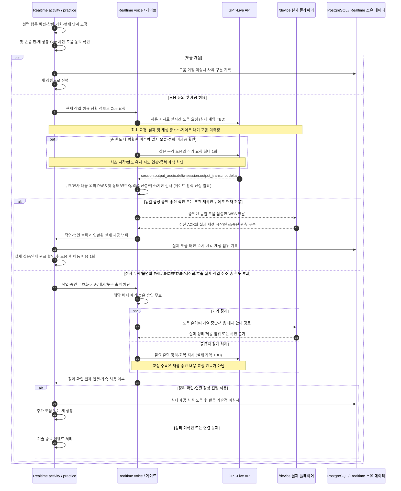
```mermaid
sequenceDiagram
    autonumber
    participant A as Realtime activity / practice
    participant V as Realtime voice / 게이트
    participant G as GPT-Live API
    participant D as /device 실제 플레이어
    participant DB as PostgreSQL / Realtime 소유 데이터
    A->>A: 선택 행동 버전·상황·기회·현재 단계 고정
    A->>A: 첫 반응 전/새 상황 Cue 차단·도움 동의 확인
    alt 도움 거절
        A->>DB: 도움 거절·미실시 사유 구분 기록
        A->>A: 새 상황으로 진행
    else 도움 동의 및 제공 허용
        A->>V: 현재 작업·허용 상황 정보로 Cue 요청
        V->>G: 허용 지시로 실시간 도움 요청 (실제 계약 TBD)
        Note over A,D: 최초 요청~실제 첫 재생 총 5초·게이트 대기 포함·미측정
        opt 총 한도 내 명확한 미수락·일시 오류·전혀 미제공 확인
            V->>G: 같은 논리 도움의 추가 요청 최대 1회
            Note over A,G: 최초 시각/한도 유지·시도 연관·중복 재생 차단
        end
        G-->>V: session.output_audio.delta·session.output_transcript.delta
        V->>V: 구간/전사 대응·의미 PASS 및 상태/권한/동의/최신성/취소/기한 검사 (게이트 방식 선정 필요)
        alt 동일 음성 승인·송신 직전 모든 조건 재확인 뒤에도 현재 허용
            V-->>D: 승인된 동일 도움 음성만 WSS 전달
            D-->>V: 수신 ACK와 실제 재생 시작/완료/중단 관측 구분
            V->>A: 작업·승인 출력과 연관된 실제 제공 범위
            A->>DB: 실제 도움·버전·순서·시각·재생 범위 기록
            A->>A: 실제 질문/안내 완료 확인 후 도움 후 아동 반응 1회
        else 전사 누락/불명확·FAIL/UNCERTAIN/저신뢰/호출 실패·작업 취소·총 한도 초과
            A->>V: 작업·승인 무효화·기존/대기/늦은 출력 차단
            V->>V: 해당 버퍼 폐기·늦은 승인 무효
            par 기기 정리
                V->>D: 도움 출력/대기열 중단·허용 대체 안내 경로
                D-->>V: 실제 정리/제공 범위 또는 확인 불가
            and 공급자 경계 처리
                V->>G: 필요 출력 정리·회복 지시 (실제 계약 TBD)
                Note over V,G: 교정 수락은 재생 승인·내용 교정 완료가 아님
            end
            V->>A: 정리 확인·현재 연결·계속 허용 여부
            alt 정리 확인·연결 정상·진행 허용
                A->>DB: 실제 제공 사실·도움 후 반응 기술적 미실시
                A->>A: 추가 도움 없는 새 상황
            else 정리 미확인 또는 연결 문제
                A->>A: 기술 종료 이벤트 처리
            end
        end
    end
```

**5초는 최초 요청부터 실제 도움 음성 재생 시작까지의 초기 예산**이며 구간 분할·전사 대응·검사·송신·기기 시작 대기를 포함한다. 재요청/재생성 때 최초 시각을 초기화하지 않는다. 달성 여부는 POC이며 재생 완료·아동 반응 대기와 별개다. 수락 불명확·부분 제공·총 한도 초과는 재발행하지 않는다. 재생 시작 보고 부재를 전혀 미제공으로 추정하지 않는다. 한도 뒤 늦게 확인한 실제 재생은 이력에 남기되 정상 완료나 새 요청 허가로 바꾸지 않는다.

모든 구간에서 STOP·쉬기·철회·현재 작업 변경을 먼저 처리한다. 유효한 아동 종료 표현 확인 즉시 `ENDING`과 함께 Cue를 무효화한다. 쉬기에는 재요청·새 상황을 진행하지 않고 재개 후 이전 Cue를 자동 재생하지 않는다. 차단된 도움은 §1.3의 회복 경계를 따르며 새 출력도 다시 게이트를 통과한다.

게이트 통과 뒤 재생 중 부적절한 발화를 감지한 경우도 플레이어·대기열·공급자 경계를 정리한다. 해당 도움과 영향받은 이후 반응을 정상 판정 근거에 쓰지 않고 실제 재생 범위·검출 시점·확인 불가를 보존한다. 서버 ACK·교정 수락·전사 수신만으로 실제 재생/정리 성공을 선언하지 않는다.

상황·Cue·판정은 선택 행동 버전을 공통으로 고정한다. 친구/대화 역할에 평가 전용 판정 기준·보호자 입력 원문·이전 판정값을 보내지 않는다. 버전 생성/검증은 [목표 생성 계약](result-pipeline.md#goal-generation-contract), 이력은 [Cue 모델](data-model.md#cue-delivery-model)에 연결한다. 가드레일 때문에 별도 Cue TTS나 세 번째 Spring을 자동 추가하지 않는다.

## 8. 앱 간 수신·상관·중복의 공통 순서

### 보호자 알림과 실시간 전사

**Core→보호자 알림 / Core→Realtime→기기 WSS 명령 / 서버→보호자 실시간 전사**는 세 통로다. MVP 알림은 Core가 발송하며 Realtime 활동 상태 변화는 기존 Outbox/Inbox 영속 전달로 Core에 도달한다. 이 알림은 기기 START나 실시간 전사를 대신하지 않는다. 활동 알림 페이로드는 **sessionId·상태만**이며 대화 내용·전사·아이 정보는 담지 않는다. sessionId를 아는 것만으로 기록 조회 권한을 주지 않는다.

푸시는 최신 상태 재조회 힌트이며 상태 원본이 아니다. 앱 진입·복귀·재연결·알림 클릭 때 권한 확인 후 서버 최신 상태를 다시 조회한다. 알림 지연/유실에도 같은 조회 계약을 사용하고 조회 실패 시 마지막 확인 시각과 미확인을 표시한다(구체 필드/표현 TBD). MVP 지원은 **PC Chrome·Edge**이며 모바일·Safari는 후속이다. 제공 방식(Web Push 등)·구독 저장·발송 실패 처리/재시도는 TBD다. 계정·기록 삭제 완료도 알림 용도에 포함되지만 세션 없는 알림의 식별/페이로드와 로그아웃·삭제 뒤 구독 처리는 다음 연결 지점이며 임의 sessionId나 새 필드를 만들지 않는다.

보호자 실시간 전사는 **아이 입력 전사와 게이트를 통과하여 실제 기기에 전달된 AI 출력 전사만** 다룬다. 미검사·차단·승인 후 미송신 AI 전사는 노출하지 않는다. 생성됨 / 승인됨 / 기기에 전달됨 / 기기가 재생 보고함을 구분하며 전달만으로 실제 재생 완료를 표시하지 않는다. 실제 제공 범위는 기존 `playbackMark` 관측·부분 재생/확인 불가와 연결한다. GPT-Live 이벤트는 서버 Adapter가 해석하고 보호자 메시지와 구분하며 다른 Realtime API 이벤트명으로 중계하지 않는다. Realtime→Core→보호자 또는 별도 경로·전송 방식·진행 중 입력 전사 표시·재연결 중복/순서/누락·구독 인가·물리 필드/메시지명은 **TBD**다.

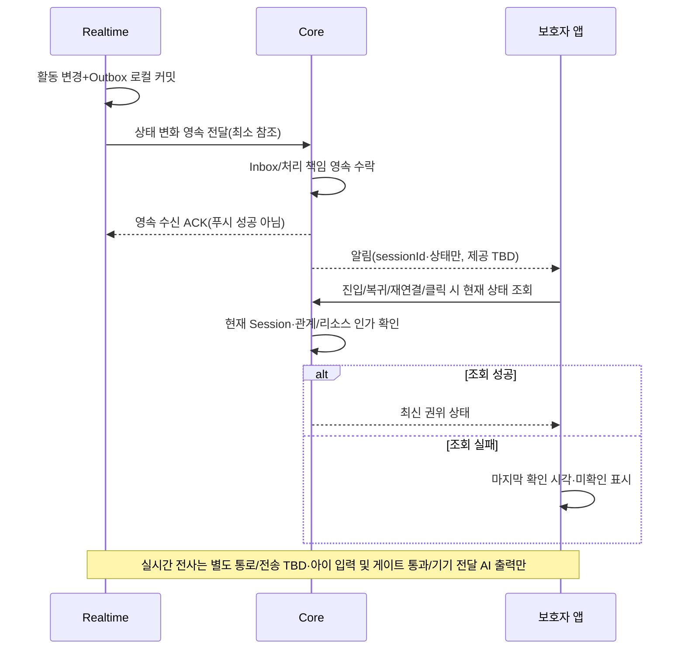
```mermaid
sequenceDiagram
    participant R as Realtime
    participant C as Core
    participant P as 보호자 앱
    R->>R: 활동 변경+Outbox 로컬 커밋
    R->>C: 상태 변화 영속 전달(최소 참조)
    C->>C: Inbox/처리 책임 영속 수락
    C-->>R: 영속 수신 ACK(푸시 성공 아님)
    C-->>P: 알림(sessionId·상태만, 제공 TBD)
    P->>C: 진입/복귀/재연결/클릭 시 현재 상태 조회
    C->>C: 현재 Session·관계/리소스 인가 확인
    alt 조회 성공
        C-->>P: 최신 권위 상태
    else 조회 실패
        P->>P: 마지막 확인 시각·미확인 표시
    end
    Note over R,P: 실시간 전사는 별도 통로/전송 TBD·아이 입력 및 게이트 통과/기기 전달 AI 출력만
```

| 경로 | 적용 순서·보장 경계 |
| --- | --- |
| 즉시 명령·조회 | Core↔Realtime 내부 HTTP. 수신 서비스 인증 → 검증 주체/허용 행위/대상/기한 → 현재 상태·권한·상관·중복 검사 → 짧은 로컬 반영 → 접수/결과 응답. 시작·STOP·준비 취소·조회·목표 등록을 일반 사후 작업 큐 뒤로 보내지 않음. |
| 영속 요청·완료·정책 변경 | 업무 변경+Outbox 같은 발신 로컬 트랜잭션 → 제한된 Sender 선점 → 트랜잭션 밖 내부 HTTP → 수신 검증·영속 Inbox 또는 업무 변경 커밋 → 수신 ACK → 업무 적용+Inbox 완료 원자 반영. 재시작 후 미처리 재처리. Broker 없음. |
| 논리 식별 | `requestId`는 동일 상태 변경 요청, `eventId`는 동일 영속 이벤트, `activityOpId`/기존 `opId`는 실시간 작업 최신성, `jobRunId`는 결과 실행 묶음. 상태/stream 버전·내용 해시·정책 버전은 각각의 경합/권한 목적이며 실제 필드명은 TBD. |
| 중복·역전·기한 경과 | 같은 이벤트/요청의 업무 효과를 중복 만들지 않음. 현재 활동·실시간 작업·기대 결과 실행·입력/정책 버전을 각각 검사. ACK 유실로 외부 AI를 정확히 한 번 실행한다고 보장하지 않음. |
| 자료 최소화 | 이벤트에 원문/원음을 무조건 복제하지 않고 최소 ID·버전·허용 참조만 전달. 스냅샷·Outbox·Inbox·로그도 동의/삭제·보존 계약 대상. 삭제 후 재전송으로 자료 복원 금지. |

일반 Spring 이벤트가 다른 JVM으로 자동 전달된다고 가정하지 않는다. 업무 소유 앱만 상태를 수정하며 Core Worker가 ActivitySession Repository에 직접 접근하지 않는다. 데이터/배포 문서에 내부 HTTP/Outbox의 책임·논리 계약을 반영했다. 상세 응답·영속 수신과 업무 처리의 상태 표현·실행 한도·보존 기간은 구현 설계의 TBD로 유지한다.

## 9. 대체된 이전 선택과 미채택 대안

**대체된 이전 선택 — A1.4 §12:** 원음 미저장·고정 ID 사전 시드와 화면 충돌 미채택을 A1.5로 대체했다. `ENDED_UNCONFIRMED` 새 상태/공급자 자동 응답 보류/다른 Realtime API 이벤트 중계 제안은 미채택이며 논리 종료·게이트 보류·GPT-Live Adapter 계약을 사용한다.

아래는 원본 흐름의 선택 이력이며 현행 구현 순서가 아니다.

- **대체된 이전 선택 — 로그인:** 원본은 카카오·구글·네이버의 3개 소셜 제공자를 활성 범위로 두었다. 최신 범위는 Google 하나이며 내부 Guardian·Session·서비스 동의는 유지한다.
- **대체된 이전 선택 — 연결:** 원본은 브라우저 SDP Offer → Spring 중계 → SDP Answer → 기기와 GPT-Live 직접 WebRTC → 서버 Sideband attach·브라우저 Data Channel 준비 이벤트로 구성했다. Answer 전 attach·브라우저 `session.started` 보고·Allow List 검증도 그 선택의 시험 항목이었다. 현행은 기기 대기 `/ws`와 Realtime 소유 GPT-Live 주 WebSocket 릴레이 B안이다.
- **대체된 이전 선택 — 가용성:** 원본의 전역 Available 0/1/2+ 분기로 정확히 1개일 때만 시작하던 규칙은 사전 시드 고정 ID 기기의 허용·현재 연결·점유·할당 검사로 대체했다. 단기 기기 Credential 별도 발급을 시퀀스의 선행 UI로 요구하던 내용도 고정 ID 데모에서 대체됐다. 운영 기기 인증은 TBD다.
- **대체된 이전 선택 — 출력:** 원본은 공급자 음성이 기기로 직접 도착하고 전사는 별도 관측했으며 실시간 Cue도 선행 검수 없이 직접 출력될 수 있는 전제를 사용했다. 현행은 출력 구간·전사 대응·필요 검사·동일 음성 승인·전달 직전 재검사를 거친다.
- **대체된 이전 선택 — 아동 종료:** 원본은 일반 출력 차단 → 승인 마무리 인사 완료 → `ENDING`이었고 즉시 `ENDING`을 검토안으로 남겼다. 최신 A안은 유효 종료 표현 확인 즉시 `ENDING` → 일반 출력/버퍼 취소 → 승인 마지막 인사 1회 예외다.
- **대체된 이전 선택 — 장애/결과:** 원본은 단일 Spring의 재시작과 기기의 공급자 Transport 정리, 같은 프로세스 `ResultCommandPort`/이벤트 전달을 전제했다. 부분 결과 Worker 사용도 미정으로 남겼다. 현행은 앱별 복구·내부 HTTP와 Outbox/Inbox, 유효 기록의 부분 결과와 활동 `PARTIAL`/결과 준비 분리다.
- **미채택 대안 — 보호자 직접 Realtime 제어:** Core 장애 시의 별도 보호자 인증/종료 경로는 G-02 확인 항목이며 이번 개정으로 채택하지 않는다.
- **확인 항목 — delegation:** KG/GraphRAG 연계 가능성·mode·도구/입력/권한·중복·결과 반환을 확인한다. 현재 시퀀스의 실행 경계·정보 제한·출력 게이트를 대체하지 않으며 채택하지 않는다.

- **대체된 A1.1 확대 계획:** Jev 우선/POC 실패 후 LLM 대안과 반응/게이트/사후 화용 분류/목표/상황 다섯 용도 후보는 A1.4의 LLM MVP 개발 기본·Jev 두 용도 비교로 대체됐다. 경험 구조화 Text LLM 생성은 유지하고 신규 사후 분류는 추가하지 않는다. 이전 LLM 설명 후 템플릿 대체·판정/엔진·원문 발췌 중심 보고서 방향은 Core 저장 사실/전사 원문·발화 ID 기반 기본 템플릿으로 정리한다.
- **대체된 선택 고정 ID 표현:** 이전 시작 그림은 보호자 선택 대상처럼 "선택 고정 ID"를 표시했다. 현행 대상은 계정의 아이와 데모 연결된 기기이고 아이/기기 선택은 없다. 당시 고정 ID 사전 시드는 A1.5 코드 등록으로 대체됐고 대기 WSS/현재 연결/점유/원자 할당은 유지하며 운영 페어링 증명을 뜻하지 않는다.

## 남은 검증

- [ ] **첫 볼트:** Google 로그인·OAuth state/사용 시 OIDC, 기존 회원/최초 가입·서비스 동의·Logout/CSRF 갱신.
- [ ] **첫 볼트:** MVP 1:1:1·계정 아이의 코드 등록/기기 자격 연결 기기·선택 UI 없음·미연결 시작 차단·계정당 진행 세션1개, 대기 WSS·상태/현재 연결/점유/원자 할당·상태 카드/시작 push·실제 두 기기 시험. 제약 구현 TBD와 운영 인증을 구분.
- [ ] **첫 볼트:** 접수 응답과 공급자/기기 준비·아동 참여 분리, 승인 버전 준비, 미참여 최소 기록, 취소/참여 경합·유실/중복 요청.
- [ ] **첫 볼트:** 서버 주 WSS의 `session.start`/`session.started`, 입력/출력 음성·전사 이벤트 실연동. 발화 전체 완료를 제공하지 않는 이벤트로 만들어 계산하지 않음.
- [ ] **첫 볼트/게이트 출력 연동:** 분할/전사 대응·누락/오대응, 의미 FAIL/UNCERTAIN/저신뢰/실패/timeout 미출력/폐기·허용 대체 안내, 정상 PASS 외 전체 조건/동일 음성/송신 직전 재검사·검사 중 취소/늦은PASS·실제 재생 관측. 게이트 의미 검사 방식 선정/검증 필요, Mock·텍스트 모델 비교만으로 실AI음성 게이트 동작 완료를 주장하지 않음.
- [ ] **첫 볼트:** 차단 후 모델 맥락·교정 수락과 실제 교정/새 출력 검사 분리, 대체 안내/재생성 조건·한도, 취소/늦은 승인 무효.
- [ ] **첫 볼트:** `playbackMark`의 대상·위치 단위·송신/중복/역전/구 연결/늦은 보고·보고 불가, 끼어들기와 자동 종료 구분, 생성/승인/송신/실제 재생 분리.
- [ ] **첫 볼트:** 질문/안내 전체 완료 기준, 게이트 대기는 무응답 제외, 완료 뒤 10초·재안내 1회, 이후 조건 TBD 보존.
- [ ] **첫 볼트:** 보호자 STOP의 즉시 내부 HTTP·독립 정리, 아동 유효 종료 즉시 `ENDING`·일반 출력 취소·승인 마지막 인사 1회, 접수/ACK/실제 중단·미확인 분리.
- [ ] **첫 볼트:** 기기/공급자 WSS 장애·안전 정리, Core/Realtime 각자 복구, 메모리 버퍼 비복원·미확인 재생 보존, Core 장애 제어 제한·D-08 철회 경합.
- [ ] **후속:** Outbox/Inbox 영속 수신 ACK·업무 적용 원자성·중복/순서 역전/재시작, Job 소유/lease·체크포인트·이전 실행 차단, 현재 결과 run과 부분 결과 참조 반영.
- [ ] **연습 Cue:** 동의·행동 버전·허용 단계, 구간/전사/검사/송신을 포함한 최초 요청~실제 재생 시작 5초 POC, 조건부 추가 1회·부분/미확인 제공·STOP/쉬기·늦은 승인·부적절 발화의 판정 사용 제한.

- [ ] **A1.4 판정/모델 비교:** 기존 LLM 반응/목표/상황 검토 기능·품질 시험, Jev 반응 약30~50개/게이트 모델 약20~30개 탐색 비교 POC를 별도로 기록. 두 용도만 Proposed / POC pending·아직 미실시이며 10/17 전 초기 결과는 목표/미측정이다. 출력 경로 연동은 별도 시험이고 실제 합격 수치/승인·기간은 TBD. 실제 라벨/질문/확신도·논리 status/engine/근거·기존 EvaluationLabel 매핑은 TBD.
- [ ] **후속 리포트:** Core 템플릿/PDF·저장 사실/전사 원문/발화 ID·화면 최종안 정합·자료 권한·미판정/미실시 보존, 개별 요청2차 LLM 검토·리포트 서술 옵션/MVP 비활성 구분. A1.5 원음 저장·등록/자격·알림/전사·보류·종료 미확인의 문서 계약과 실제 구현/미검증을 구분한다.

미결정 세부는 `Blocked/TBD`, 시험 결과는 기대값·관측값·환경/버전·실제 출력 관측 근거와 함께 [first-bolt.md](first-bolt.md)의 증거 형식으로 기록한다. 현재는 문서 개정이며 API·POC·타이머·지연 시험을 수행한 것으로 표시하지 않는다.
