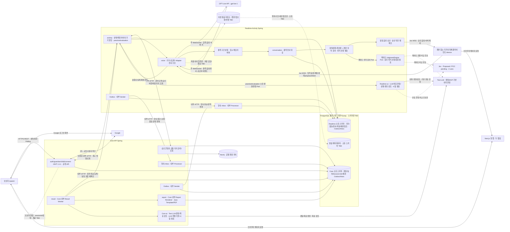
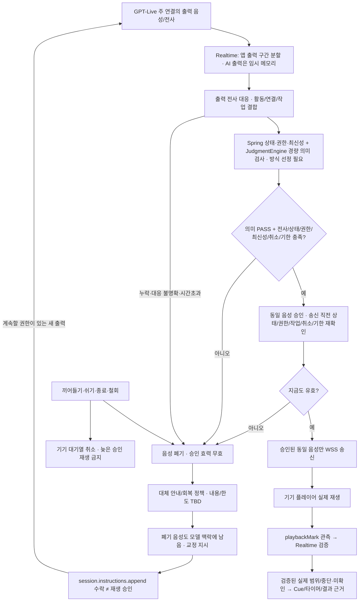
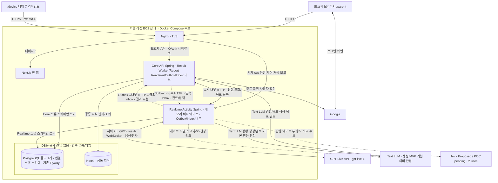

① 개정: A1.5 등록/자격·아이 입력 지정 저장/메타데이터와 보호자 알림/전사·게이트 보류/종료 미확인 경계를 텍스트/그림에 최소 정합했다.
② 대체: 고정 ID 사전 시드·원음 미저장/화면 충돌 미채택은 이전 선택이다. 두 앱/쓰기 소유권·AI 세 역할·Neo4j·기존 배포는 유지한다.
③ 남은 TBD: 저장소/담당/메타데이터 소유/삭제·등록/자격/교체·알림/전사 전송·게이트/종료 매핑·기존 물리/품질/실측.

# 시스템 아키텍처

- 상태: **Proposed**. Core API Spring + Realtime Activity Spring, GPT-Live 연결 B안, Google만의 로그인, PostgreSQL 물리 1개·앱별 스키마는 audit의 최신 방향을 적용한다. 실제 구현·부하·독립 가용성 검증 완료를 뜻하지 않는다.
- 부분 확정 보존: **Neo4j 화용 지식 그래프 채택 Accepted (2026-10-01)**, **GPT-Live 단일 전사·별도 STT 보류 Accepted (2026-10-01)**, 기존 **Spring Security OAuth2 Client + Spring Session JDBC** 선택은 유지한다. 상세 구현값은 별도로 확인한다.
- 개정 기준: [audit v1.1](../../ref/mujung-architecture-update-audit-v1.1.md) §2·§3·§5~9와 [AI 역할·MVP 범위·관계 A1.4](../../ref/audit-addendum-ai-roles.md). A1.4가 해당 조항을 대체·구체화하고 나머지는 최신 사용자 확정 → v0.2 수정 → 비충돌 원문 보존 순서를 적용한다. [2-Spring v0.2](../../ref/2-spring-architecture-v0.2.md)와 [교차검토 v0.2](../../ref/2-spring-cross-validation-v0.2.md)는 보조 근거다.
- 원본의 요구사항 v0.4.2·ADR-002 v10/v11 및 2026-10-02 목표/Cue 보완 참조는 이관 이력으로 보존한다. GPT-Live 실시간 Cue는 사용자 채택 기본안이며 검증 전, 목표 상세 계약은 Proposed다. 이번 개정이 원본의 모든 요구사항을 새로 확인/확정했다는 뜻은 아니다.
- 범위: 역할·신뢰·실행·쓰기 소유권과 전체 연결의 설명. 공급자 지시문·대본·키워드·평가 기준 원문은 동료 AI 상세 명세 **파일·버전 TBD**가 소유한다.

## Source of Truth

| 주제 | 책임 문서 | 이 문서의 역할 |
| --- | --- | --- |
| 이번 개정의 우선순위·반영 범위 | [audit v1.1](../../ref/mujung-architecture-update-audit-v1.1.md)·[A1.4](../../ref/audit-addendum-ai-roles.md) | 사용자 확정과 보존/TBD 경계, AI 역할·MVP 엔진·1:1:1 관계 적용 |
| 기존 사용자 행동·제약·D-ID | 원문에 기록된 요구사항 v0.4.2, 기존 목표/Cue 보완 참조 | 비충돌 정책과 구조 접점을 추적. 별도 개정 기준으로 추가하지 않음 |
| 작은 첫 구현과 완료 증거 | [first-bolt.md](first-bolt.md) | 첫 흐름·후속 구현·기술 POC를 구분한 시험 계획 반영 완료. 실제 구현·실연동/측정은 미완료 |
| 기술 스택·저장소·운영 언어 | [ADR-002](../ADR-002-technology-defaults.md) | 후보 버전·부분 확정 상태를 유지하며 구성요소 연결 |
| 저장소·빌드·Git | [ADR-001](../ADR-001-repository-git.md) | Monorepo 안의 두 실행/빌드 단위 표시 |
| `/device`의 성격 | [ADR-003](../ADR-003-child-device-ui.md) | 화면 없는 기기의 대체 클라이언트와 운영자 준비/아동 사용 구분 |
| 기기 WSS·GPT-Live 주 연결·게이트·단일 전사 | [ADR-004](../ADR-004-communication-voice.md), [protocol.md](protocol.md) | 채널·승인·취소·재생 관측의 위치 표시 |
| 상태·종료·복구 | [ADR-005](../ADR-005-session-events-timeouts.md), [session-state.md](session-state.md) | 소유권과 서비스/공급자/재생 상태의 차이 표시 |
| EC2·Compose·Nginx·TLS·마이그레이션 | [ADR-006](../ADR-006-demo-deployment.md) | 시연 배치와 남은 자원/운영 검증 표시 |
| 모듈·Port·목표/Cue·AI 역할 책임 | [ADR-007](../ADR-007-module-boundaries.md#goal-and-cue-ownership)·[ADR-011](../ADR-011-judgment-engine.md) | 앱 소유 생성/판정 Port, LLM MVP 기본·Jev 두 용도 후보 연결. 목표는 [result-pipeline](result-pipeline.md#goal-generation-contract), Cue는 [protocol](protocol.md#cue-contract) |
| Google·세션·기기/내부 인증·현재 인가 | [ADR-008](../ADR-008-auth-access-control.md#guardian-social-login), [auth.md](auth.md) | 신뢰 경계·서버 비밀·현재 동의 표시 |
| 두 실행 앱의 선택 | [ADR-009](../ADR-009-execution-boundary.md) | 실행 특성·상태 소유권과 남는 의존 설명 |
| Broker 없는 영속 전달 | [ADR-010](../ADR-010-durable-delivery.md) | 내부 HTTP 즉시 명령과 Outbox/Inbox 이벤트 분리 |
| 앱별 스키마·참조·결과 처리 | [data-model.md](data-model.md), [result-pipeline.md](result-pipeline.md) | 쓰기 소유권·Core Worker·현재 결과 run·실제 제공 근거 연결 |

요구사항 원문 위치 이력: `N:\개인\대학교\20_LG_CNS\03_메인프로젝트\03_끼리꼬\01_서비스\요구사항 명세서 v0.4.2.md`. 요구사항은 제품 행동, ADR은 기술 방향, first-bolt는 구현/시험 선택 범위를 담당한다. 문서 간 남은 차이는 담당 문서의 후속 연결 지점으로 기록하며 이번 대상 밖 문서를 직접 수정하지 않는다.

## 첫 볼트와 후속 구성

| 구분 | 먼저 연결할 작은 흐름·기술 POC | 후속으로 유지할 설계 |
| --- | --- | --- |
| 보호자·기기 | Google·시험용 아동/현재 동의, 코드 등록/기기 자격·대기 WSS·상태 보고/카드, 보호자 시작 push·참여·상태·종료 확인 | 가입/동의 변경 전체 UI(코드 등록의 작은 흐름은 포함), 키워드 설정 UI, 운영 기기 인증/페어링, 전체 홈/과거 기록 |
| Core | `auth`·`guardian`·`child`·`consent`의 최소 검사, Realtime 시작/종료·상태의 내부 HTTP 계약, 승인 버전 확보 | Core 내부 Result Worker·추천/결과/리포트, 전체 콘텐츠/지식 관리 |
| Realtime | `activity`·`voice`·`conversation`의 활동/연결, 릴레이·출력 분할/전사 대응·게이트·취소·재생 관측 | `practice`·`evaluation`의 전체 연습/판정·Cue, 전체 결과 요청/완료 연결 |
| 저장·전달 | 각 앱 소유 스키마·기존 Flyway/validate, 최소 허용 기록·서비스 Session, 영속 수신/중복·개별 앱 재시작의 시험 | 전체 Outbox/Inbox·결과 run/lease·목표/추천/평가/리포트 모델, 원본의 전체 전사 수정·검수 기능 후속 항목. 작은 첫 흐름 구현을 전체 결과 완료로 표시하지 않음 |
| 공급자/성능 | GPT-Live 주 WebSocket·입출력/전사·구간/검사·차단 후 회복·실제 재생, 합산 부하/지연 POC | Neo4j 상세 모델/구현, 전체 사후 AI 품질 시험·계약 생성/CI 확대 |

첫 볼트의 대표 종료는 `ACTIVE → ENDING → PARTIAL`인 보호자 중도 종료다. 접수·기기/공급자 준비만으로 `ACTIVE`가 되지 않고 아동 참여 확인을 거친다. 좁은 첫 구현에서 ResultJob/전체 AI 결과를 아직 만들지 않는 개발 범위는 유지한다. **유효 기록의 부분 결과 제품 요구는 유지**하며 미구현을 가짜 결과·가짜 준비 상태로 채우지 않는다. 기술 POC의 실통신 목표와 제품 시연의 실제/모의 범위(Q-DEVICE-01)는 구분한다.

## 논리 구조

아래 그림은 실행 위치/전달 경계다. 스키마명·클래스·필드·Endpoint 확정 도면이 아니다. 아이 입력은 지정 저장소에만 저장하고 메타데이터 소유 스키마는 TBD다. AI 출력은 Realtime 메모리 게이트에서만 처리하며 DB/영속 이벤트/로그/임시 디스크에 우회 저장하지 않는다.



그림의 외부 AI는 GPT-Live 대화·Text LLM 생성/MVP 기본 의미 판정·Jev 두 용도 후보로 구분한다. Jev 점선은 반응/게이트의 별도 비교 POC·해당 용도 승인 후 전환 후보를 뜻하며 요청마다 두 엔진을 순차 호출하는 경로가 아니다. 게이트의 Jev/경량 LLM 모델 비교 선도 선정 전 후보다. 기존 LLM 경로 유지가 기능/품질 검증 완료를 뜻하지 않으며 Core에 Jev 업무를 추가하지 않는다.

`/parent`와 `/device`는 **한 Next.js 앱의 두 접점**이며 첫 볼트에서는 서로 다른 물리 기기에서 실행한다. 아동 역할은 화면을 보거나 조작하지 않고 음성을 사용한다. 두 브라우저는 서로 직접 통신하지 않는다. Core 보호자 API가 Realtime의 공식 계약을 호출하며 활동 상태의 수정 권위는 Realtime에 있다.

상시 Spring Boot 앱은 두 개다. **실행 특성·상태 소유권에 따른 분리이며 부모/아동 또는 AI/비AI 구분이 아니다.** Core에 사후 AI와 Worker가 있고 Realtime에도 대화·검사·판정 Adapter가 있다. Result Worker·Sender·Inbox Processor는 소유 앱 내부다. 각 Boot의 component/entity/repository scan과 scheduler 활성 범위는 분리한다. 일반 Spring 이벤트가 다른 JVM에 자동 전달된다고 가정하지 않는다.

공급자는 GPT-Live API(`gpt-live-1`)이며 `Realtime`이라는 우리 앱 이름을 공급자의 Realtime API와 혼동하지 않는다. Realtime이 서버 키로 `wss://api.openai.com/v1/live/sessions`에 접속하고 `session.start → session.started`를 확인한다. 운영 모델/Java SDK·음성 이벤트/취소/종료·공급자 저장 설정은 실제 지원 범위를 검증한다. 공급자 세션과 기기 대기 WSS의 수명은 별개이며 대기만으로 유료 모델 연결을 시작했다고 보지 않는다.

## 구성요소 책임

A1.5 등록/자격/교체의 경계는 ADR-008·protocol, 원음 담당/메타데이터 소유/삭제·부분 실패는 data-model TBD를 따른다. 판정 중 게이트 출력 보류·판정 후 현재 유효성 재검사/무효 폐기·교정/재생성과 논리 ENDED+UNCONFIRMED/중단 관측·결과 정리 분리는 ADR-005와 연결하며 공급자 자동 응답 중지/새 DB Enum은 가정하지 않는다.

**Core→보호자 알림 / Core→Realtime→기기 WSS 명령 / 서버→보호자 실시간 전사**는 세 통로다. MVP 알림은 Core가 발송하며 Realtime 활동 상태 변화는 기존 Outbox/Inbox 영속 전달로 Core에 도달한다. 이 알림은 기기 START나 실시간 전사를 대신하지 않는다. 활동 알림 페이로드는 **sessionId·상태만**이며 대화 내용·전사·아이 정보는 담지 않는다. sessionId를 아는 것만으로 기록 조회 권한을 주지 않는다.

푸시는 최신 상태 재조회 힌트이며 상태 원본이 아니다. 앱 진입·복귀·재연결·알림 클릭 때 권한 확인 후 서버 최신 상태를 다시 조회한다. 알림 지연/유실에도 같은 조회 계약을 사용하고 조회 실패 시 마지막 확인 시각과 미확인을 표시한다(구체 필드/표현 TBD). MVP 지원은 **PC Chrome·Edge**이며 모바일·Safari는 후속이다. 제공 방식(Web Push 등)·구독 저장·발송 실패 처리/재시도는 TBD다. 계정·기록 삭제 완료도 알림 용도에 포함되지만 세션 없는 알림의 식별/페이로드와 로그아웃·삭제 뒤 구독 처리는 다음 연결 지점이며 임의 sessionId나 새 필드를 만들지 않는다.

보호자 실시간 전사는 **아이 입력 전사와 게이트를 통과하여 실제 기기에 전달된 AI 출력 전사만** 다룬다. 미검사·차단·승인 후 미송신 AI 전사는 노출하지 않는다. 생성됨 / 승인됨 / 기기에 전달됨 / 기기가 재생 보고함을 구분하며 전달만으로 실제 재생 완료를 표시하지 않는다. 실제 제공 범위는 기존 `playbackMark` 관측·부분 재생/확인 불가와 연결한다. GPT-Live 이벤트는 서버 Adapter가 해석하고 보호자 메시지와 구분하며 다른 Realtime API 이벤트명으로 중계하지 않는다. Realtime→Core→보호자 또는 별도 경로·전송 방식·진행 중 입력 전사 표시·재연결 중복/순서/누락·구독 인가·물리 필드/메시지명은 **TBD**다.

| 구성요소·실행 위치 | 책임 | 경계 |
| --- | --- | --- |
| `/parent` | 계정의 아이·동의·활동 준비, 연결 기기 상태 카드·시작/종료·기록/결과/리포트 조회 | 아이/기기 선택 단계 없음. TanStack Query REST/Polling 권고·활동/결과 준비 구분. 원본 1~2초는 초기 제안값, 그 밖의 표시 상태/주기·문구 TBD. |
| `/device` | 마이크·WSS 음성/제어, heartbeat/상태, 서버 명령 수행, 실제 플레이어 재생/중단 보고와 자체 안전 정리 | 화면 없는 기기의 대체 클라이언트. 의미·참여·평가·ActivitySession을 최종 판정하지 않음. 고정 ID는 운영 인증의 증거가 아님. |
| Core `auth`·`guardian`·`child`·`consent` | Google 검증·Principal/서비스 Session·Guardian 관계·현재 동의 | MVP 보호자 계정1:아이1:기기1, 기존 GuardianChild 1:1. 아이 추가/삭제/선택·공동 보호자 없음; 변경은 계정 삭제 후 새 가입. 제약 구현 TBD. 자체 ID/PW 제외·인증/인가·소유 공개 계약 유지. |
| Realtime `activity` | 상태/사유·할당·이벤트 순차 처리·종료 우선·현재 실시간 작업/기대 결과 run | ActivitySession의 공식 수정 진입점. Core·voice·auth 등이 직접 Repository를 수정하지 않음. |
| Realtime `voice`·미디어 Adapter | 대기 기기 WSS·GPT-Live 주 연결·입력 중계·출력 구간 분할/메모리 버퍼·게이트 송신·취소·재생 관측 | 키는 서버만 보관. 공급자 SDK 타입은 Adapter 안에 격리하고 지원 범위 TBD. 출력 음성 수신 즉시 기기로 전달하지 않음. |
| Realtime `conversation` | GPT-Live 입력/출력 전사 조립·발화/Turn·누락/불확실·출력 구간 대응 | 단일 전사·별도 STT 보류 유지. 출력 전사와 실제 재생 위치를 같다고 가정하지 않음. |
| Realtime `practice` | 목표 정의/버전의 원격 검증·등록·선택, Text LLM 상황 생성/기존 LLM 검토·연습·도움 동의·제한된 CueBrief·실제 제공 기록 | 상황 검토의 Jev는 이번 비교 제외/MVP 미적용·후속이며 LLM 기능/품질 시험 필요. 전체 정의/판정 기준·보호자 원문은 대화 역할에 미전달. 사용한 정의 버전 고정. |
| Realtime `evaluation`·AI Adapter | 저장된 정의·현재 상황·첫/도움 후/새 상황 근거의 반응 판정. 기존 LLM은 MVP 개발 기본/시험 필요, Jev는 반응 용도 Proposed / POC pending | 상황 생성/검토는 practice 소유. 판정 결과의 사용/저장·상태 전이는 호출 업무가 담당하고 엔진은 상태 직접 변경 금지. 교육 판정과 동기 게이트 분리는 우리 설계 권고, 필수 근거 생략 아님. |
| Core `result`·`report`·AI Adapter | 내부 Worker·ResultJob·체크포인트·Text LLM 경험/추천 4요소 생성·기존 LLM 목표 검토, 내부 Java Template/PDF Report Renderer | 목표 검토의 Jev 비교 제외/MVP 미적용·후속, LLM 검증 필요. Realtime 등록은 내부 HTTP 공개 계약. 성공 후 응답 유실은 같은 후보 재확인, 성공 AI 단계 재생성 금지. 보고서는 저장 사실/전사 원문·발화 ID 기반. |
| Core `content`·`knowledge` | 승인 원본/버전과 공통 지식 관리·조회 | Realtime 활동 전에 승인 버전 확보/고정. STOP·마무리가 Core 즉석 조회를 기다리지 않음. 생성 Cue를 고정 승인 콘텐츠와 합치지 않음. |
| 각 앱 Outbox Sender·Inbox Processor | 영속 전달·수신 커밋 ACK·업무 멱등/원자 후처리·미처리 복구 | 앱 내부 제한된 실행 경로. ACK는 업무 완료·AI 성공·실제 재생과 다름. 원음 전송/보관 경로로 사용하지 않음. |
| PostgreSQL | 물리 1개·앱별 소유 스키마/쓰기 역할·운영 데이터·인증 Session | 기존 UUID·UTC/KST 기본값 보존. Flyway 기존 채택/validate·단일 마이그레이션 실행을 보완하며 실제 이름/권한/순서 TBD. |
| Neo4j | Core 관리의 공통 화용 지식 그래프 | 채택 유지. 개인 아동 기록 저장소가 아니며 생성한 개인 목표를 공용 그래프에 자동 등록하지 않음. 상세 모델/초기 데이터/Adapter는 후속 검증. |

모듈 후보 `auth`, `guardian`, `child`, `consent`, `activity`, `voice`, `conversation`, `practice`, `evaluation`, `result`, `report`, `ai`, `content`, `knowledge`, `common`은 책임 분류로 유지한다. 실제 Gradle 프로젝트/패키지·최종 Port/클래스명은 ADR-001/007의 TBD다. 공통 코드는 최소 계약·시간·오류·타입으로 제한하며 Entity·Repository·도메인 Service·Boot 전체 설정을 공유하지 않는다.

원본의 `VoiceCommandPort`·`ResultCommandPort`·`ContentQueryPort`는 호출하는 도메인의 필요를 표현하는 후보 경계, `SessionEventIngress`는 Realtime 활동 이벤트의 후보 진입점이다. 같은 앱은 소유 모듈의 공개 API/Port/Event로 연결하고, 앱 간 경계는 HTTP Adapter·영속 완료 수신으로 구현한다. 이름을 유지한다는 이유로 상대 JVM의 Service·Repository를 직접 참조하지 않는다. 첫 볼트의 좁은 결과 미구현 범위에 전체 ResultCommandPort 연결을 강제하지 않는다.

### 작은 흐름의 책임 연결

1. 운영자는 마이크/오디오 허용과 브라우저를 사전 준비한다. 코드 등록 기기는 계정의 아이와 1:1로 데모 연결되고 기기 자격 검증 후 Realtime `/ws`에 대기하며 상태/실제 재생을 보고한다. 보호자 상태 카드는 그 기기를 표시하고 아이/기기 선택은 없다. 미연결이면 "연결된 기기 없음"으로 시작하지 못한다.
2. Core가 Google 서비스 Session·CSRF·계정의 아이 관계·현재 동의·계정당 진행 세션1개를 검사한다. 시작 대상은 계정의 아이→그 아이의 기기다. Realtime은 내부 서비스 인증과 주체/행위/대상/기한, 허용 기기·현재 연결·점유·원자 할당을 대조한다. 전역 기기 수로 시작을 판단하지 않는다.
3. Realtime이 중복 확인·할당·`PREPARING`·접수 기록을 짧은 트랜잭션으로 커밋해 접수를 반환한다. 준비/참여를 기다리지 않는다. 기기에 시작을 push하며 공급자 연결/승인 안내 준비와 아동 참여를 별도 확인한다. 접수 응답 유실은 같은 요청으로 재확인하고 새 활동·중복 시작을 만들지 않는다.
4. voice의 공급자 이벤트·conversation의 인식 근거·검증된 기기 관측은 활동 이벤트 진입점에서 현재 활동/연결/작업과 대조해 순차 처리한다. 요청 접수·명령 수신 ACK·실제 재생은 다른 사실이다.
5. activity는 상태·종료 우선·출력 취소를, voice/미디어 Adapter는 서버 버퍼와 기기 대기열 정리/관측을 맡는다. auth/consent 변경은 공식 명령/영속 정책 전달을 거치고 상대 ActivitySession을 직접 갱신하지 않는다.

브라우저/OS별 마이크 거부·재생 불가·새로고침·연결 상실 및 운영자 직접 중단 조건은 D-03·D-13와 first-bolt에 연결한다. 등록 코드/Device 식별/기기 자격·Origin·교체/폐기·열린 WSS/늦은 보고·운영 인증은 TBD다. 1:1:1 데모 연결을 운영 페어링/물리 소유권 인증으로 확대하지 않는다. 코드 등록/자격·알림/전사·보류/종료 미확인은 A1.5 계약을 따른다. QR claim·그 밖의 미확정 화면 상태/API를 채택하지 않는다.

## 출력 버퍼 게이트·재생 관측·회복



구간 분할·VAD/noise gate 알고리즘/라이브러리와 검사 구간·질문/안내 전체 완료 기준은 **앱 책임, 방식 TBD**다. 짧은 쉼·큐가 잠깐 빈 상태·전사 조각의 도착을 전체 발화 완료로 단정하지 않는다. 공급자 출력 오디오에 기기 재생 시각이나 발화별 완료 신호가 있다고 가정하지 않는다. 주 연결의 이벤트 대조는 ADR-004/protocol을 따른다.

게이트는 상태·권한·작업 최신성과 필요한 경량 의미 검사를 수행한다. **검사 수행·승인이 전달 조건**이며 전사/검사기가 모든 위험을 발견한다는 보장은 아니다. 무거운 교육적 판정·KG/GraphRAG를 동기 게이트 경로에서 분리하는 것은 **우리 설계 권고**다. 안전 판단에 필수 근거가 없으면 준비된 근거를 사용하거나 전달을 보류하며 검사를 사후로 미루지 않는다. 검사 모델/프롬프트·버퍼 최대 크기/시간/포화·대체 안내/재생성 조건과 한도는 TBD다. 게이트 의미 검사는 Realtime 소유 JudgmentEngine Port로 요청하며 Jev·경량 LLM 등 후보의 검사 방식 선정과 별도 모델/출력 경로 검증이 필요하다. Jev는 **게이트 적용 후보, Proposed / POC pending**이고 반응 판정 POC 합격으로 게이트를 승인하지 않는다. FAIL·UNCERTAIN/저신뢰·근거 부족·호출 실패·timeout이면 미출력/폐기·기존 대체 안내로 연결한다. 의미 PASS만으로 전달하지 않으며 취소된 음성을 늦은 PASS로 다시 열지 않는다.

취소된 구간의 버퍼와 기기 대기열을 정리하고 늦은 전사·검사 통과로 재생을 재개하지 않는다. 차단 후 대화를 계속할 때는 모델 맥락에 남은 폐기 음성과 실제 제공 범위의 차이를 고려해 앱이 작성한 `session.instructions.append` 교정 지시를 사용한다. 지시 수락은 교정 성공·맥락 삭제·재생 승인이 아니다. 새로 생성된 음성은 다시 검사하며 미승인 사용자/모델 원문을 시스템 지시로 그대로 복사하지 않는다. 종료/철회 뒤 이 회복 화살표가 대화 재개를 허용하는 것은 아니다.

`playbackMark`는 기기 플레이어가 관측한 실제 재생 진행·중단·완료 범위를 Realtime이 수신/검증하는 앱 계약이다. 활동·현재 연결·승인 음성/재생 묶음과 결합하며 **생성/승인/송신/ACK/관측 재생을 구분**한다. 청취·이해의 보증이나 종료 명령이 아니다. 위치 단위·필드명·송신 시점·중복/순서 역전·구 연결/늦은 보고·보고 불가·공급자 맥락 반영은 [protocol](protocol.md)의 상세 TBD다. 미보고면 마지막 신뢰 관측과 확인 불가를 유지하고 전체 재생으로 채우지 않는다.

## 발화 처리와 상태 판단 경계

GPT-Live 단일 전사·별도 STT 보류의 공급원 선택을 유지한다([ADR-004 §2.14](../ADR-004-communication-voice.md#mvp-transcription)). 공급자 delta를 조립하는 `TranscriptAssembler`·발화를 묶는 `TurnGrouper`는 원본 구현 후보이며 실제 이벤트/누락·불확실 계약은 TBD다. 추가 STT·병렬 비교를 현재 필수 경로로 넣지 않는다.

음성 활동 제어는 기존 FR-E05의 **호출어+명령어 키워드 방식**을 따른다. 서버는 인식 근거를 현재 활동·허용 명령·설정 버전과 대조한다. 키워드 없는 발화·기기 재생 음성을 제어 명령으로 취급하지 않는다. 원본 일반 의도 추론은 현재 제어 계약이 아니며 `KeywordCommand` 등 이름/기준·담당 상세 명세 파일/버전은 TBD다. 시작 참여 판정은 키워드 제어와 별개이고 `/device`가 의미/참여를 독자적으로 확정하지 않는다.

아동 유효 종료 표현을 서버가 확인하면 **즉시 `ENDING` 기록 → 일반 질문/연습/출력 승인 차단·서버 버퍼/기기 대기열 취소 → 고정 승인 마지막 인사 1회 예외 → 실제 정리 확인**의 A안을 따른다. 보호자 STOP·철회는 각각의 종료/정리 계약을 따르며 아동 인사 예외를 자동 적용하지 않는다. 끼어들기는 말차례 변경일 수 있어 자동 `ENDING`이 아니다. 쉬기는 상태/승인/타이머를 무효화하고 재개 때 이전 음성을 자동 재생하지 않는다.

원본 D-07의 참여 거부 최대 1회 대안 제안·재거부 종료 경계/승인 문구는 상세 참여 계약에 연결한다. 호출어·명령 인식·참여 판단·승인 대본·판정 기준은 복제하지 않고 담당 명세를 참조한다. 사용자 연습 건너뛰기는 현행 기능에 넣지 않는다. 도움 거절/생략과 기술적 미실시는 별도다.

무응답 타이머의 초기값 **실제 질문/안내 전체 재생 완료 후 10초·재안내 1회**를 유지한다. 구간 분할/전사/검사/재생 대기를 아동 무응답으로 세지 않는다. Cue의 **최초 요청부터 실제 재생 시작까지 5초** 초기 예산은 이 대기를 포함하며 추가 요청으로 최초 시각을 초기화하지 않는다. 달성 여부와 전체 완료 범위는 POC/TBD다. 상태·사유·미실시·기기 연결·실제 재생·화면 표시를 별도로 두고 화면 상태를 이유로 DB Enum을 늘리지 않는다.

제한된 반응 판정은 Realtime `evaluation`의 JudgmentEngine/ai Adapter를 통한 기존 LLM 경로가 MVP 개발 기본이며 기능/품질 시험이 필요하다. Jev는 반응 용도의 Proposed / POC pending 비교 후보다. 정상 NOT_OBSERVED와 저신뢰/근거 부족/실패/timeout의 미판정을 구분하고 판정 작업 실패만으로 종료하지 않는다. 판정 결과의 사용/저장·현재 단계/도움/전사 신뢰 대조·공식 상태 전이는 호출 업무와 Spring 규칙의 책임이다. ADR-005 §10.1 반응 판정5초 Timeout+Retry1회는 그 용도의 미측정 초기 제안값이며 게이트/Cue·목표/상황 검토에 전파하지 않는다.

<a id="goal-and-cue-flows"></a>

## 목표 생성과 실시간 Cue의 연결

원본 2026-10-02 보완의 SYS-RECO-001·PRAC-T12-002·PRAC-CUE-001 및 FR-C02·F06·E08·F02 참조와 비충돌 기능 정책을 보존한다. 이 절은 전체 서비스 후속 경로이며 첫 볼트 범위를 자동 확대하지 않는다.

### 목표 생성·등록과 결과 전달

```text
Realtime 종료/유효 기록·기대 결과 run + 요청 Outbox 로컬 커밋
→ 내부 HTTP 영속 요청 → Core Inbox 커밋 후 수신 ACK
→ Core 내부 Result Worker → 허용 근거 조회·Text LLM 경험/목표 생성 + Spring 형식/근거 검사·기존 LLM 목표 검토(기능/품질 시험 필요)
→ 행동 정의·기회 조건·상황 생성 조건·판정 기준 + 추천 이유/근거
→ 내부 HTTP로 Realtime practice 원격 검증·등록/동일 후보 재확인
→ Core 성공 체크포인트·결과/Job 종료 + 완료 Outbox 로컬 커밋
→ 내부 HTTP 영속 완료 → Realtime Inbox 커밋 ACK·현재 run/권한 검사·원자 반영
```

Outbox/Inbox에는 필요한 ID·버전·최소 참조를 담는다. 수신 ACK는 영속 수락이며 업무 완료가 아니다. Inbox 후처리는 업무 반영과 처리완료를 같은 로컬 트랜잭션 또는 동등 원자성 계약으로 마치고 미처리를 복구한다. ACK 유실·중복·역전 때 같은 업무 효과를 반복하지 않는다. Broker는 없다. 구체 원자성 구현·Endpoint/DTO·선점/lease/순서·재전송/보존은 TBD다([ADR-010](../ADR-010-durable-delivery.md)).

Core Worker가 Realtime Repository를 직접 변경하지 않는다. 원격 등록 성공 뒤 응답 유실이면 같은 후보/입력 버전/요청으로 동일 목표·버전을 재확인하며 완료한 AI 단계를 재생성하지 않는다. 근거/4요소 누락·불확실 후보는 선택 가능 목록에 넣지 않고 동일 행동의 정의 일관성·근거 출처·사용한 불변 버전을 유지한다. 생성 목표를 공통 승인 목록에만 제한하거나 개인 목표를 Neo4j에 자동 승격하지 않는다. 정확한 DTO·추천 근거의 물리 분해는 [data-model](data-model.md#goal-definition-model)·[목표 생성 계약](result-pipeline.md#goal-generation-contract)의 TBD다.

종료로 실시간 작업 ID가 바뀌었다는 이유만으로 정상 사후 결과를 전부 버리지 않는다. Realtime은 기대한 **결과 run·입력 버전·대상·현재 자료 허용**을 확인한다. 이전 run 완료가 새 수동 재시도를 덮거나 종료 활동을 부활시키지 않는다. 유효 중도 종료의 활동 `PARTIAL`과 Core 부분 결과의 준비/실패는 별도이며 결과 참조가 생겨도 `ACTIVE`/정상 완료로 바꾸지 않는다. 전달·LLM 기술·내용 수정·보호자 수동 재시도는 별도 이력/한도를 사용한다.

목표 후보 생성/검토는 Core `result`, 상황 생성/검토는 Realtime `practice`의 기존 Text LLM/LLM 경로를 유지한다. 두 용도의 Jev 비교는 이번 POC에서 제외/MVP 미적용·후속이며 기능/품질 검증 면제가 아니다. 사후 경험 구조화는 Text LLM 생성이고 별도 사후 화용 분류를 추가하지 않는다.

리포트는 **Core 내부 Java Template + PDF/Report Renderer**가 저장 사실을 조립하는 기본 경로다. 저장된 전사 원문과 근거 발화 ID에 연결하고 LLM 요약/재작성 문장을 원문으로 쓰지 않는다. 미판정/미실시를 정상 판정으로 채우거나 판정/엔진을 필수 노출·판정 발화만의 발췌 조건으로 만들지 않는다. A1.4 §6의 현재 화면 참조는 아이 정보·기간 내 날짜별 대화 원문이며 AI 요약/평가 없음이다. 엔진/PDF 라이브러리·구체 항목/화면 최종안 정합·원문 연결 구현은 TBD다. Text LLM 일부 리포트 서술과 개별 요청2차 검토는 각각 옵션/MVP 비활성으로 기본 LLM 판정과 구분한다.

### 도움 동의 후 실시간 Cue

```text
Realtime evaluation 서버 내부 판정 → practice 도움 조건·아동 동의 확인
→ 제한된 CueBrief → activity 상태·작업 최신성·STOP 우선 확인
→ voice → GPT-Live 실시간 Cue 생성
→ 앱 구간 분할/전사 대응 → 필요한 검사·동일 음성 승인·송신 직전 재확인
→ 기기 실제 재생/playbackMark 검증 → practice 실제 제공 내용/범위·순서·시각
→ 첫 반응·도움 후 반응·새 상황 반응을 별도로 연결
```

CueBrief는 현재 상황·상대 발화·허용 도움 목적 등으로 제한한다. 전체 목표 정의·판정 기준·정답 문장·기존 평가 결과·보호자 입력 원문을 GPT-Live 대화 역할에 보내지 않는다. 실시간 Cue는 고정 승인 콘텐츠가 아니며 별도 Cue 텍스트 생성/TTS를 필수로 추가하지 않는다. 실제 제공 인용은 전사와 검증된 재생 범위가 대응하는 부분에만 한정한다. 미확인/부분 제공을 정상 도움 완료·정상 판정 근거로 채우지 않는다. 품질·정답 노출 방지·재생 추적은 미검증이다([Cue 계약](protocol.md#cue-contract), [Cue 상태](session-state.md#cue-lifecycle), [Cue 기록](data-model.md#cue-delivery-model)).

## 시연 배치와 라우팅



기존 EC2 한 대·Nginx·Next.js·DB/Neo4j 영속 볼륨·백업·DB 비공개 원칙을 유지한다. Next.js/Neo4j 배치를 포함한 **6개 상시 컨테이너는 v0.2의 후보 수**이며 실제 Compose/이미지/자원/확장은 검증 전이다. 일회성 마이그레이션 단계는 세 번째 상시 Spring이 아니다. 승인 음성 파일·아이 입력 지정 저장소와 AI 출력 버퍼를 구분하며 출력 버퍼를 볼륨/백업에 저장하지 않는다. 원음 저장소/백업/삭제는 TBD로 기존 DB 볼륨을 자동 채택하지 않는다.

| 공개/내부 목적 | 목적지·검사 |
| --- | --- |
| `/` 및 `/parent`·`/device` 페이지 | Next.js 한 앱 |
| 보호자 `/api/**` 기본 경로 | Core. 인증·CSRF·관계/현재 동의·대상 권한 검사 |
| `/oauth2/authorization/*`·`/login/oauth2/code/*` 기본 구현 후보 | Core. Google 등록 Redirect URI와 공개 host/scheme·실제 HTTPS 주소 일치 확인 |
| 기기 `/ws` 및 승인된 하위 경로 | Realtime. Upgrade·Origin·허용 기기·현재 연결/할당·권한·재생 보고 검증 |
| 기기에 별도 HTTP가 필요한 경우 | Realtime의 승인된 계약만 명시 분기. Endpoint/용도 TBD이며 이전 공급자 권한 경로를 그대로 배포하지 않음 |
| `/internal/**`·`/api/internal/**` 등 내부 경로 후보 | 공개 진입 명시 차단 + 수신 앱 서비스 인증. 포괄 API 프록시 우회 노출도 차단 |

내부 Docker DNS/네트워크는 주소 지정 수단이며 인증의 증거가 아니다. 보호자 Cookie·브라우저 주체 Header를 내부 서비스 권한으로 승격하지 않는다. 내부 서비스 인증·사용자 인가는 별도로 검증하고 실제 Endpoint·서비스 비밀/회전·기한/요청 크기는 TBD다.

Flyway는 기존 채택을 앱별 스키마·쓰기 계정/권한에 맞게 보완한다. 배포의 단일 마이그레이션 단계/실행 주체를 정하고 각 앱은 호환 스키마를 validate한다. 실제 스키마명·Migration 위치/이력·적용 순서·소유 책임/실행 절차는 ADR-006/data-model의 TBD이며 앱 시작 시 경쟁 적용하지 않는다.

로컬 개발은 Nginx가 필수가 아니며 `compose.dev.yml`/`compose.demo.yml` 구분을 유지한다. 원격 마이크 시연은 HTTPS 보안 컨텍스트와 두 기기의 사전 준비를 확인한다. 도메인·인증서 방식·EC2 크기·빌드 위치는 미정이다. 별도 프론트 두 앱·Vite·CloudFront/S3 호스팅 조합을 새로 채택하지 않는다.

## 데이터와 신뢰 경계

- Google 가입·로그인과 Core의 Guardian/계정 연결·서비스 Session을 유지한다. 자체 ID/PW 제외·Logout·CSRF·관계/리소스 권한·현재 Consent 검사도 유지한다. Google Access/Refresh/ID Token은 서비스 Session이 아니며 등록 Device 식별/기기 자격/현재 연결과도 다르다.
- 공급자 키·OAuth Client Secret·내부 서비스 비밀은 서버의 소유 앱에 필요한 범위로만 주입한다. 브라우저 Bundle/응답·일반 로그·공통 라이브러리에 두지 않는다. Realtime이 GPT-Live 연결과 필요한 Text LLM/판정 호출을, Core는 자기 Text LLM/Google 호출을 관리한다. Jev 비교 두 용도는 Realtime 소유이며 Core Jev 새 업무/필수 키 주입을 뜻하지 않는다. 실제 접근/SDK·키/회전은 TBD다.
- Google는 로그인/허용 프로필 확인용이다. 아동 프로필·활동·전사·결과를 인증 요청에 보내지 않는다. 내부 서비스 요청에도 필요한 ID/버전/최소 참조만 보내며 타 아동 자료와 원문을 무조건 복제하지 않는다.
- 기존 FR-F03·F15의 역할 제한을 유지한다. 대화 역할에 보호자 입력 원문·이전 판정 결과·채점 기준을 전달하지 않는다. ActivityContext 저장 가능성과 대화 모델 입력 가능성을 구분한다. 출력 게이트가 입력 제한을 대체하지 않는다.
- **아이 입력만 지정 원음 저장소/계정 삭제까지**, DB 메타데이터만; AI 출력 게이트 버퍼는 메모리 전용이다. 원음 DB 바이트·Outbox/Inbox·로그·임시 디스크 우회 금지/대기 주변 음성 비수집을 유지한다. 저장 담당/소유·완료/부분 실패/삭제 중 늦은 저장·참여 전 포함·공급자 실제 보존 설정은 TBD다.
- 미참여 종료는 응답 원문 없이 최소 종료 사실/시각만 남긴다. 참여 이후·중도 종료·철회/삭제의 전사·Cue·근거·파생 산출물 보존은 data-model/auth의 D-08 계약을 따른다. Outbox/Inbox·스냅샷·체크포인트도 같은 정책 대상이다.
- Core의 동의 변경+철회 Outbox를 원자 기록해 우선 전달한다. 알림만으로 즉시 차단을 보장하지 않는다. 새 처리·외부 요청·출력 승인/송신·저장·결과 반영 전 현재 권한을 확인하고 확인 불가이면 새 이용을 보류/차단한다. STOP/안전 정리는 권한 재확인 실패 때문에 막지 않는다. 효력 시각·확인과 송신/저장 사이 원자성(G-03)은 TBD다.
- Neo4j는 Core 공통 지식 경계다. Realtime은 활동 준비에 승인 콘텐츠/허용 지식 버전을 확보·고정한다. 추가 KG 조회는 제한된 비동기 준비 경로이며 STOP·heartbeat·재생 관측이 매번 Core/Neo4j 조회를 기다리지 않는다.
- Core 장애 때 보호자의 새 제어는 Core 경유 의존이 남는다. 콘텐츠 미확보·현재 이용 허용 확인 불가 시 해당 새 진행을 멈춘다. 기존 WSS가 살아 있다는 사실만으로 독립 지속을 주장하지 않는다. 보호자의 직접 Realtime 종료 경로(G-02)는 미해결 대안이다.

## 실행 자원·관측·복구·확장

Core의 REST/Worker/Sender/Inbox/시간 관리와 Realtime의 WSS 수신/송신·짧은 상태 처리·타이머·분할/버퍼·검사/외부 AI 대기는 실행 한도를 구분한다. 긴 HTTP/AI 대기를 이벤트 처리기나 DB 트랜잭션 안에서 수행하지 않는다. 실행기 포화가 CallerRuns 등으로 상태/WS 처리 스레드에 긴 작업을 떠넘기지 않게 한다. 실제 구현 방식·풀/큐/timeout/선점/lease는 TBD다.

두 앱의 DB 풀·스레드·메모리·입력/출력 중계량·대기 버퍼·검사·Sender/Worker·모델 호출 예산을 합산한다. 같은 DB/호스트의 장애·경합은 남는다. 중계 첫 재생 지연, 구간/전사/검사/송신/기기 재생 단계, 포화/폐기·차단 후 회복, 전달 적체/수신 ACK·업무 완료를 따로 관측한다. 수치·지원 동시 활동 수·SLA는 실측 전 TBD다.

| 장애/확장 | 소유 책임·제약 |
| --- | --- |
| Core 재시작 | 자신의 미완료 Job/Outbox/Inbox만 복구. 정상 Realtime 활동을 일괄 변경하지 않음. 소유/lease·현재 run·체크포인트·남은 한도·권한 검사 |
| Realtime 재시작 | 자신의 진행 중 음성 활동은 ADR-005 오류 정리. 종료된 음성 자동 재개·버퍼 복원·미확인 재생 성공 처리 금지. 결과 대기/PARTIAL 참조·영속 Outbox/Inbox 보존 |
| 내부 응답/ACK 유실·중복/역전 | 같은 요청/이벤트 재확인·멱등/현재 run/버전/권한 검사. Inbox 커밋 ACK와 원자 업무 후처리·미처리 복구 |
| Worker 재선점/복제 | 모든 RUNNING 초기화 금지. 소유/lease 만료와 generation/fencing으로 오래된 Worker 반영 차단. 외부 AI 중복 호출 가능성과 비용은 체크포인트/관측으로 관리 |
| DB·공급자·기기 장애 | 영속 실패·안전 차단 시도·실제 정리/미확인 구분. 늦은 출력/승인을 막고 관측하지 않은 완료를 만들지 않음 |
| Realtime 복제 | 연결/기기 배정 소유자·owner epoch·명령 전달/라우팅의 상세가 먼저 필요. 두 브라우저의 일반 Sticky Cookie만으로 같은 활동 소유자를 찾지 못함. Broker만으로 소유권 해결 안 됨 |

확장은 일반 API·실시간 중계·사후 Worker·DB/호스트의 **측정된 병목**에 따라 별도 결정한다. 두 앱 선택을 성능 개선·독립 가용성의 증거로 쓰거나 사전 고정 확장 순서를 새로 확정하지 않는다.

## 개발·운영 경계

Monorepo·Git/PR·민감자료 규칙은 ADR-001을 유지한다. GitHub Actions 기본 build/test/lint/ArchUnit은 두 실행/빌드·공통 계약과 앱별 스캔/소유권을 확인한다. CI에서 기존 `LlmClient`와 GPT-Live는 Fake/Mock Adapter로 대체하고 기본 검사에 실제 유료 호출을 넣지 않는다. REST 계약이 안정되면 springdoc OpenAPI→TypeScript 타입/클라이언트 생성과 불일치 검사를 단계 도입하도록 권고한다. WSS/공급자 이벤트는 별도 계약이며 후보 도구/버전·생성 범위는 TBD다.

운영 AI 호출은 소유 Spring 앱에서 수행한다. `ai/` Python은 POC·평가·가공용이며 별도 운영 AI 서버를 자동 추가하지 않는다. Redis AI Cache는 MVP에서 보류 권고를 유지하며 반복 요청/적중률 실측 후 재검토한다. `deploy.sh` 기반 수동 배포를 기본으로 유지하고 자동 CD·빌드 위치/배포 상세는 ADR-006의 후속 결정/검증이다.

일반 로그는 기존 sessionId 중심의 논리 상관 관계를 유지하고 필요하면 요청/이벤트·실시간 op/결과 run·단계/관측 참조를 연결한다. 실제 필드/보존은 TBD이며 원음·발화 원문·Cookie/키를 로그에 복제하지 않는다. 합성·성인 역할극 정상/경계 자료로 외부 요청의 역할·허용 필드·폐기 사실을 확인한다. 문서/그림의 정적 확인을 실행 시험 증거로 사용하지 않는다.

## 대체된 이전 선택 / 미채택 대안

**대체된 이전 선택 — A1.5:** 원음 미저장·고정 ID 사전 시드·§12 미채택은 지정 저장·코드 등록/자격·MVP 알림/전사·게이트 보류·논리 종료 미확인으로 대체됐다.

아래는 원본 구조·보완의 이력이며 현재 구현/시험 지시가 아니다. 옛 그림의 연결 관계를 문장으로 남기고 현행 그림은 위의 두 앱·릴레이 구조로 교체했다.

- **단일 Spring·직접 음성 연결:** 원본 논리/배포 그림은 한 Spring Boot와 브라우저↔GPT-Live WebRTC 직접 연결, SDP Relay·Data Channel·Sideband 및 Java Sideband 검증을 사용했다. 음성이 서버/Nginx를 우회한다는 설명·부하 근거를 두 앱/서버 주 WebSocket·음성 릴레이·메모리 게이트로 대체했다. 모듈 소유권·Port 원칙은 유지한다.
- **3개 로그인·JWT 제안:** 원본의 카카오·구글·네이버와 공급자 3개 시험은 Google만으로 대체했다. ADR-002 v10의 JWT 제안은 Spring Security OAuth2 Client + Spring Session JDBC로 이미 대체된 미채택 이력이다. Guardian·서비스 Session·CSRF/Logout은 보존한다.
- **전역 Available 개수:** 원본 첫 책임 흐름의 Available 0/1/2+ 기준을 고정 ID 대상 기기의 허용·현재 연결·점유·할당 검사로 대체했다. 통제된 시연 전제를 운영 전역 사용자 수 제한으로 확대하지 않는다.
- **종료 순서 미정:** 원본 아동 마무리 뒤 ENDING 여부/DL-005-11의 미정 서술은 유효 표현 확인 즉시 ENDING인 A안으로 대체했다. 일반 출력/버퍼 취소와 승인 마지막 인사 1회 예외·실제 정리는 구분한다.
- **연습 건너뛰기 후속 후보:** 원본은 키워드 쉬기/재개와 함께 사용자 연습 건너뛰기의 전체 구현을 후속으로 적었다. v0.2의 삭제 정책에 따라 현행 기능에서 제외했다. 도움 거절/생략·기술적 미실시는 유지한다.
- **이전 공급자 저장 설정:** 원본 `store=false`는 이전 연결의 미확정 참고다. 현행 GPT-Live 주 연결에 해당 필드가 존재/적용된다고 확정하지 않는다. 당시 서비스 원음 비저장 요구는 A1.5 아이 입력 지정 저장으로 대체됐고 공급자 미확정 필드를 실제 설정으로 채택하지 않는다.
- **미채택 대안:** 세 번째 Worker/공통 AI Spring, 초기 Broker, 상대 Repository·스키마 직접 수정, 공통 Entity/Service 공유는 현재 경계에서 채택하지 않는다. delegation은 가능성과 역할/정보 제한을 확인할 항목이며 현재 실행/게이트를 대체하는 기술이 아니다.

- **대체된 A1.1 역할 확대:** 10단계 A1.1의 Jev 우선/LLM 대안·반응/게이트/사후 화용 분류/목표/상황 다섯 용도 후보 계획은 A1.4의 LLM MVP 개발 기본·Jev 반응/게이트 두 용도 비교로 대체됐다. 사후 경험 구조화 Text LLM 생성은 유지하고 별도 사후 분류는 현행에 추가하지 않는다. 이전 LLM 설명 후 템플릿 대체와 판정/엔진·원문 발췌 중심 보고서 방향은 Core 내부 저장 사실/전사 원문·발화 ID 기반 기본 템플릿으로 정리하며 필수 보고서 표시 항목으로 쓰지 않는다.
- **대체된 관계 미확정 표현:** 이전 고정 ID 데모를 영구 보호자/아동/기기 관계와 분리해 설명한 것은 운영 인증 범위를 제한하려는 표현이었다. 현행은 계정1:아이1:기기1 데모 연결을 하며 운영 페어링·물리 소유권 인증은 아니다. 당시 고정 ID 사전 시드는 A1.5 코드 등록으로 대체했고 대기 WSS/현재 연결·원자 할당은 보존한다.

## Pending

- [ ] 실제 Gradle 프로젝트/패키지·공통 계약·Port/Adapter·component/entity/repository scan·scheduler·ArchUnit·앱별 빌드/CI 구현
- [ ] Java/Boot/Gradle·Security/Session/springdoc/Flyway/JPA·GPT-Live Java SDK 지원/운영 버전과 이벤트/취소/교정/종료·저장 설정
- [ ] Google 등록/콜백·Guardian 가입·서비스 Session·Cookie/CSRF/Logout·재시작 직렬화·토큰 실제 보관 검증
- [ ] 코드 등록/기기 자격·Origin·현재 연결/중복/교체·할당·운영 기기 인증, WSS 오디오/메시지·playbackMark 대상/단위/보고/늦은/불가 관측
- [ ] 구간/VAD·전사 대응/누락·질문/안내 전체 완료·경량 검사 기준/모델·메모리 버퍼 한도·대체 안내/재생성·차단 후 회복/취소
- [ ] PostgreSQL 앱별 스키마/쓰기 권한·교차 조회 예외·Flyway 단일 실행/파일/이력/호환 순서·Spring Session 스키마와 복구/백업
- [ ] 내부 서비스 인증·Endpoint/DTO·주체/대상/기한·Outbox/Inbox·수신 ACK/원자 후처리·중복/순서·재전송/보존·선점/lease/fencing
- [ ] Core Worker 원격 목표 등록/응답 유실 재확인·성공 체크포인트·현재 결과 run·유효 부분 결과/재시도 API·실제 제공 근거
- [ ] 원본의 전체 전사 수정·검수 기능 후속 항목: 역할/수정 권한·원문과 수정 이력·보존/활용 계약은 상세 설계에서 확인하며 첫 볼트 필수 기능으로 확정하지 않음
- [ ] 현재 동의·철회/삭제·효력 시각과 송신/저장 경합(G-03), Core 장애 보호자 제어 제한/직접 Realtime 대안(G-02)
- [ ] 두 기기의 사전 준비/거부·복구/안전 정리, D-03·D-07·D-08·D-13의 남은 상세·동료 명세 파일/버전
- [ ] EC2/DB/Neo4j·중계/버퍼/검사·두 앱 합산 자원, 처리 용량/지연·무응답 10초/Cue 5초의 실측, Realtime 확장 소유자/라우팅
- [ ] Neo4j 그래프/초기 자료·knowledge Adapter, 근거/목표 4요소·고정 버전·첫/도움 후/새 상황·Cue 정보 제한/품질/실재생 시험
- [ ] 한 Next.js의 TanStack Query/Polling 조건·전체 표시 상태/문구·OpenAPI 생성/CI, HTTPS 도메인/인증서·이미지 빌드 위치/배포 절차
- [ ] Q-DEVICE-01 실제/모의 제품 시연 범위와 기술 실통신 POC 구분. delegation 확인은 채택으로 취급하지 않음

- [ ] LLM MVP 기본 반응/목표/상황 검토의 모델·질문·출력 계약·대표/경계/불확실/실패 기능·품질 시험. JudgmentEngine 실제 Port/SDK/논리 label/status·EvaluationLabel 매핑/질문·근거 버전은 TBD
- [ ] Jev 반응 판정 약30~50개·게이트 모델 약20~30개 탐색 비교와 별도 버퍼/전사/검사/승인/취소/재생 출력 경로 POC. 두 용도만 Proposed / POC pending, 10/17 전 초기 결과는 목표·미실시/미측정이고 합격 수치/기간은 TBD. Mock은 초기 계약/실패 시험이며 실AI음성 게이트 동작 시연은 실제 검사 방식/차단 경로 선정·검증 필요
- [ ] Core 내부 템플릿/PDF·저장 사실/전사 원문·발화 ID·화면 최종안 항목 정합, 1:1:1 제약 구현/계정아이기기 연결. A1.5 저장/등록/알림·전사·게이트 보류·종료 미확인 실제 구현/시험은 TBD이며 문서 반영을 완료로 표시하지 않음

## 다음 단계 연결 지점

- **first-bolt:** 두 앱/Google·코드 등록/자격 대기 WSS/상태 카드/시작 push·릴레이/구간/전사/게이트/차단 후 회복·실제 재생/타이머·응답 유실/중복·영속 ACK/앱별 복구·철회/부하의 시험 계획을 반영했다. 구형 시험은 현행 계획으로 대체했으며 실제 구현·실연동/측정과 증거 수집은 미완료다.
- **현재 책임 문서:** decision-log·README는 ADR-009/010의 소유권과 ADR-011·A1.4의 LLM 기본/Jev 두 후보·Core 보고서/1:1:1·미검증 POC와 A1.5 저장/등록/알림·전사/보류/종료 정합을 요약한다. ADR-007/011·result-pipeline/data-model·protocol/상태·시퀀스/first-bolt는 해당 역할/계약/시험을 관리하며 문서 연결을 실제 구현/승인으로 표시하지 않는다.
- **구현/정책 후속:** protocol/auth/data-model/result-pipeline의 논리 참조를 실제 Endpoint/DTO·물리 스키마·lease/fencing·playbackMark·G-02/G-03 상세와 함께 확정한다. 이번 문서가 없는 API/필드·운영 성능을 추가한 것으로 해석하지 않는다.
